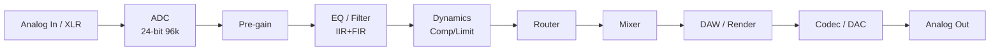
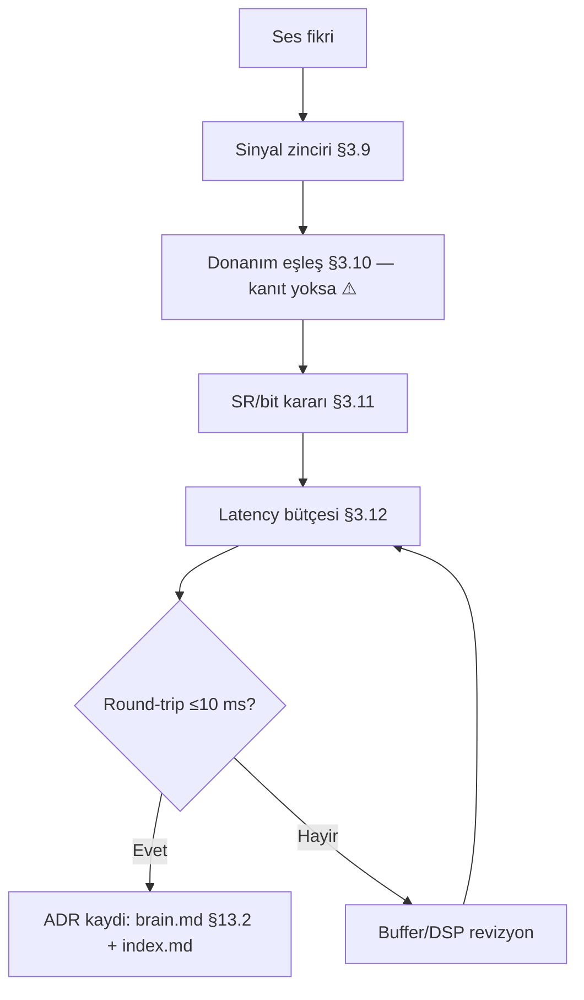

# CoreMusic — Ses/Audio ADR Şablonu (Sinyal / DSP / Latency / Donanım)

**Zorunlu Bağlantılar:** [[.ai/brain.md]] · [[.ai/CLAUDE.md]] · [[.ai/.templates/adr/adr-template.md]] · [[.ai/.templates/other/cpp-template.md]] · [[.ai/log.md]]

---

## §1. Amaç

Bu şablon, CoreMusic ses zinciri (capture → DSP → render) ve Neva Engine tarafındaki donanım/firmware kararlarını sinyal bütünlüğü + latency hedefi ile kayıt altın almasını sağlar.

### §1.1 Kapsam Dışı Konular

| Konu | İlgili Şablon | Not |
|---|---|---|
| Web playback UI | `adr/adr-frontend-template.md` | tarayıcı katmanı |
| C++ kod standartları | `other/cpp-template.md` | dil kalıbı |
| DSP motor firmware kodu | `other/cpp-template.md` + bu şablon §3 | karar ≠ kod |
| Donanım PCB tasarımı | ⚠️ `*.pcb` glob boş — bu şablon §3.10 ile | donanım eşleşmesi |
| Sıralama | `adr/adr-index.md` | kayıt |

### §1.2 Doğrulama Testi

```markdown
- [ ] Sinyal zinciri şeması dolu (§3.9)
- [ ] Donanım eşleşmesi doğrulandı (§3.10) — kanıt glob veya ⚠️
- [ ] Örnekleme/bit derinliği kararı net (§3.11)
- [ ] Latency bütçesi sayısal (§3.12)
- [ ] `brain.md` §19 standartlarıyla çelişki yok
```

---

## §2. Kapsam

| Alan | Soru | Cevap |
|---|---|---|
| Motor | Neva Engine mi? | DSP motoru (firmware: XMOS/I2S) |
| Örnekleme | hedef SR? | 48 kHz (teslim) / 96 kHz (masters) |
| Bit | derinlik? | 24-bit internal |
| Kanal | konfigürasyon? | stereo (5.1 ADR-062) |
| Platform | donanım? | ADR-038 (donanım seçimi) |
| Standart | referans? | `brain.md` §19 (`CLAUDE.md` §19) |
| ⚠️ | `.ai/electronic*/**` glob | **boş** — kanıt yok |

### §2.1 Etkilenen Varlıklar

| Dosya / Varlık | Etki | Kanıt (glob) | Sorumluluk |
|---|---|---|---|
| `**/NevaEngine/**` | firmware | ⚠️ glob boş | 🔴 embedded |
| `**/dsp/**` | sinyal kodu | ⚠️ doğrulanacak | 🔵 backend |
| `assets.coremusic.net/**` | web playback | var (ITSS) | 🔵 frontend |

> ⚠️ `**/NevaEngine/**` ve `.ai/electronic*/**` glob'ları **boş döndü**; bu varlıklar vault'ta anılıyor ama disk kanıtı yok. Karar uygulanmadan önce doğrulanmalı (`VERIFICATION REQUIRED`).

---

## §3. Mimari

### §3.9 Sinyal Zinciri (DOMAIN)



| # | Blok | Girdi SR/bit | İşlem | Çıktı | Sapma (dB) |
|---|---|---|---|---|---|
| 1 | ADC | — / — | — | 48k/24b | ≤0.01 |
| 2 | Pre-gain | 48k/24b | +6 dB | 48k/24b | ±0.1 |
| 3 | EQ | 48k/24b | IIR peaking | 48k/24b | ±0.1 |
| 4 | Dynamics | 48k/24b | limiter | 48k/24b | ±0.1 |
| 5 | Mixer | 48k/24b | sum | 48k/24b | 0.0 |
| 6 | DAC | 48k/24b | — | analog | ≤0.01 |

**Bütünlük kuralı:** zincirde bit daralması yok (24b → 24b); dither sadece 24b → 16b teslimde.

### §3.10 Donanım Eşleşmesi (DOMAIN)

| Rol | Donanım | Arayüz | Sürücü | Kanıt |
|---|---|---|---|---|
| Capture | USB audio interface | USB2.0 | class-compliant | ⚠️ glob |
| DSP | ADR-038 seçimi | — | — | `brain.md` §13.2 |
| Render | Core i9 / 32 GB | ASIO/CoreAudio | vendor | `AGENTS.md` §25.2 |
| I/O | XLR/TRS | analog | — | ⚠️ |
| Network | — | Dante/USB | — | 🔵 devamsız |

```text
[Capture HW] --USB/ASIO--> [Host Driver] --shared mem--> [DSP Core]
     ^                                                       |
     |                                                       v
[Analog I/O] <--I2S/TDM-- [DAC/Codec] <---------------- [Render Bus]
```

> ⚠️ Donanım modelleri kesinleşmediyse satırlara `VERIFICATION REQUIRED` yaz; uydurma marka/model ekleme.

### §3.11 Örnekleme / Bit Derinliği (DOMAIN)

| Parametre | Seçenek A | Seçenek B | **Karar** | Gerekçe |
|---|---|---|---|---|
| Sample rate | 44.1 kHz | 48 kHz | **48 kHz** | video senk + endüstri |
| Master SR | 96 kHz | 192 kHz | **96 kHz** | headroom/maliyet |
| Bit derinliği | 16-bit | 24-bit | **24-bit** | dinamik ~144 dB |
| Internal fmt | int32 | float32 | **float32** | headroom |
| Teslim fmt | 16b/44.1 | 24b/48 | **24b/48** | stream + arşiv |

| SR/Bit | Kullanım | Dosya | Not |
|---|---|---|---|
| 48k/24b | canlı/teslim | `.wav` | varsayılan |
| 96k/24b | master | `.wav` | arşiv |
| 44.1k/16b | legacy | `.wav` | dither zorunlu |

### §3.12 Latency Hedefi (DOMAIN)

| Yol | Bütçe (ms) | Örnek (64 samples @48k = 1.33 ms) | Ölçüm |
|---|---|---|---|
| Capture → DSP | ≤ 5 | 1.33 (buffer) + 1.0 (I/O) | ASIO report |
| DSP processing | ≤ 3 | CPU %<40 | perf sayaç |
| DSP → Render | ≤ 5 | 1.33 | ring buffer |
| Round-trip (I/O) | ≤ 10 | 1.33+3+1.33 ≈ 5.7 | loopback test |
| Web playback (UI) | ≤ 100 | WebAudio buffer | tarayıcı testi |

```text
Latency bütçesi (round-trip, 64-sample buffer):
  capture 1.33 + process ≤3 + render 1.33 = 5.66 ms  →  hedef ≤10 ms ✅
  Fail: ölçüm > 10 ms → ADR revizyon (buffer/artır, DSP azalt)
```

**Ölçüm prosedürü:**
1. Buffer = 64/128/256 dene.
2. ASIO/CoreAudio panelinden raporla.
3. Loopback (Out → In) ölç, `.ai/log.md`'ye yaz.

### §3.13 Karar Matrix (Standart)

| Seçenek | Ses Kalitesi | Latency | Maliyet | Puan |
|---|---|---|---|---|
| **A (seçildi)** 48k/24b + float32 | 5.0 | 5.0 | 4.0 | **4.7** |
| B | 44.1k/16b | 4.0 | 5.0 | 3.0 |
| C | 192k/32b | 2.0 | 2.0 | 2.5 |

### §3.14 Gerçek ADR Referansları (`brain.md` §13 — cpp-template ile uyumlu)

| ADR | Konu (`brain.md` §13 + `cpp-template.md` §7.1 birebir) | Alan |
|---|---|---|
| ADR-017 | XMOS XU316 + PCM3168A DSP | 🟠 audio |
| ADR-025 | 31-band parametrik EQ | 🔵 audio |
| ADR-038 | PCM3168A (PCM5122 REDDEDİLMİŞ) | 🟠 hardware |
| ADR-062 | DSP Pipeline Architecture | 🔵 audio |

### §3.15 DSP Parametre Sözlüğü (DOMAIN)

> `brain.md` §19 / ADR-025 (31-band parametrik EQ) hizalı **şablon sözlük**; gerçek değerler kalibrasyonla doldurulur.

| Parametre | Birim | Tipik Aralık | Varsayılan | Otomasyon |
|---|---|---|---|---|
| `sample_rate` | Hz | 44100 / 48000 / 96000 | 48000 | §3.11 kararı |
| `block_size` | örnek | 32 / 64 / 128 / 256 | 64 | latency §3.12 |
| `eq_bands` | adet | 31 (ADR-025) | 31 | preset |
| `eq_gain` | dB | −12 … +12 | 0 | kullanıcı |
| `eq_q` | oran | 0.3 … 10 | 1.0 | kullanıcı |
| `comp_threshold` | dBFS | −60 … 0 | −12 | mastering |
| `comp_ratio` | :1 | 1 … 20 | 4 | mastering |
| `comp_attack` | ms | 0.1 … 100 | 10 | preset |
| `comp_release` | ms | 10 … 1000 | 100 | preset |
| `limiter_ceiling` | dBFS | −0.1 … 0 | −0.3 | teslim (§3.17) |
| `reverb_mix` | % | 0 … 100 | 0 | preset |
| `dither` | tip | none / TPDF | none (§4 R1) | 16b çıkışta zorunlu |
| `latency_budget` | ms | ≤ 10 round-trip | 6 | §3.12 ölçüm |

```cpp
// Parametre doğrulama örneği (firmware / DSP — cpp-template uyumlu)
struct DspParams {
    float eq_gain_db;      // clamp [-12, +12]
    float comp_ratio;      // clamp [1, 20]
    float ceiling_dbfs;    // clamp [-1.0, 0]
    int   block_size;      // 32|64|128|256 (güç-of-2)
};

DspParams sanitize(DspParams p) noexcept {
    p.eq_gain_db  = std::clamp(p.eq_gain_db,  -12.0f, 12.0f);
    p.comp_ratio  = std::clamp(p.comp_ratio,    1.0f, 20.0f);
    p.ceiling_dbfs= std::clamp(p.ceiling_dbfs,-1.0f,  0.0f);
    if (p.block_size != 32 && p.block_size != 64 &&
        p.block_size != 128 && p.block_size != 256) p.block_size = 64;
    return p;   // sıfır allocation (cpp-template §4.1)
}
```

### §3.16 Jitter / Buffer / Ring Analizi (DOMAIN)

| Katman | Buffer | Boyut | Doluluk Hedefi | Taşma Eylemi |
|---|---|---|---|---|
| HW capture (I2S/DMA) | DMA descriptor | 256 örnek | %50 | xrun sayacı++ (§3.4) |
| Driver ring | lock-free ring | 8192 örnek | %25–75 | drop + log |
| DSP block | `block_size` | 64 örnek | — | senkron zorunlu |
| Render out | ring | 8192 örnek | %50 | glitch |
| Web UI | WebAudio | 2048 örnek | — | §3.12 (≤100 ms) |

```text
Jitter bütçesi (64-örnek block @48k = 1.33 ms):
  HW DMA 1.33 + ring 0.5 + DSP 1.33 + out 1.33  ≈ 4.5 ms (yalnız buffer)
  jitter payı (hedef ≤10 ms): 10 − 4.5 = 5.5 ms → OS/USB payı
  XRUN = ring dolu/boş → g_xrun_count (§3.4 sayaç) sıfırlanmamalı, izlenmeli
```

| Ölçüm | Arac/Nasıl | Kabul | Red |
|---|---|---|---|
| Buffer doluluk | atomik `availableRead/Capacity` | %25–75 | < %25 (underrun riski) |
| XRUN sayısı | `g_xrun_count` (ISR sayaç) | 0 / 10 dk | > 0 tekrarlayan → §3.12 revizyon |
| Clock drift | ppm fark (in vs out) | < ±10 ppm | ASIO/popus düzeltmesi |
| Dropped block | ring drop bayrağı | 0 | block_size/4'e düşür |

### §3.17 Loudness / Teslim Standardı (DOMAIN)

| Standart | Hedef | Tolerans | Kullanım | Ölçüm |
|---|---|---|---|---|
| Streaming (EBU R128) | −14 LUFS | ±1 LU | Spotify vb. | integrated LUFS |
| Broadcast (TRT vb.) | −23 LUFS | ±0.5 | TV/radyo | EBU mode |
| True Peak | −1.0 dBTP | 0 | tüm teslim | inter-sample meter |
| Hız (short-term) | ≤ −10 LUFS | — | klip koruma | 3 sn pencere |
| Stereo/LR fark | ≤ 1.0 dB | — | mono uyum | kanal analiz |

```text
Teslim kontrolü (şablon akışı):
  render (float32, §3.9 zincir) 
    → limiter ceiling −0.3 dBFS (§3.15)
    → LUFS integrated ölç (−14 ±1 hedef)
    → true-peak ≤ −1.0 dBTP (de-esser/overs varsa tekrar)
    → 16b/44.1 gerekiyorsa TPDF dither (§4 R1: sadece burada)
    → PASS → arşiv/teslim; FAIL → gain offset + tekrar ölç (.ai/log.md)
```

---

### §3.18 I2S / TDM Frame & Slot Tablosu (DOMAIN)

| Mod | Slot Sayısı | BCLK Hesabı | Tipik fs | Kullanım |
|---|---|---|---|---|
| I2S standart | 2 (L/R) | `2 × kanal × bit × fs` | 44.1 kHz / 48 kHz | basit çift kanal |
| I2S TDM8 | 8 | `8 × bit × fs` | 48 kHz / 96 kHz | PCM3168A 8-ch grup (ADR-017) |
| I2S TDM16 | 16 | `16 × bit × fs` | 48 kHz | genişletilmiş grup — ⚠️ Eksik (donanım teyidi) |
| MCLK | — | `256 × fs` (veya 512 × fs) | — | codec master clock |
| Slot genişliği | — | ≥ veri biti (ör. 32-bit slot / 24-bit veri) | — | taşma/round-trip önlenir |
| FS (LRCLK) polarity | — | I2S standardında 1-slot gecikme | — | codec modu ile aynı olmalı |

> fs/bit eşleşmesi §3.11; jitter/buffer analizi §3.16; kanal gruplandırması §4.3.

### §3.19 Clock Topolojisi & Roller (DOMAIN)

| Sinyal | Master | Slave | Kural |
|---|---|---|---|
| MCLK | kaynak (kontrolcü / XMOS) | codec | `256 × fs` oranı bozulmaz |
| BCLK | tek taraf | diğer taraf | iki master yasak |
| LRCLK / FS | kaynak | codec | fs değişimi yalnız kontrollü yeniden başlatma ile |
| Dış word clock | dış kaynak | tümü | harmonik olmayan fs yasak — ⚠️ Eksik (donanım planı) |
| Frekans planı | sabit fs listesi | — | karışık fs (ör. 44.1 + 48 aynı anda) yasak — §3.11 |
| Roller | ADR-017 (XMOS XU316) donanım tarafı | codec pasif | donanım dosyaları glob ⚠️ boş (bkz. §7) |

> Bu § donanım clock rollerini kapsar; yazılım jitter/buffer analizi §3.16'dadır — ikisi birlikte okunur.

### §3.20 Aktarım Arayüzü Öncelik / Fallback (DOMAIN)

| Arayüz | Kanal × Örnekleme | Öncelik | Fallback | Kaynak |
|---|---|---|---|---|
| ASIO | {{ASIO_CH}} × 48k/96k | 1 — profeşyonel çıkış | WASAPI | ADR-017 / `[[../../AGENTS.md]]` §17 |
| WASAPI | {{WASAPI_CH}} × 44.1k/48k | 2 — Windows varsayılan | — | `[[../../AGENTS.md]]` §4 (win-sw) |
| USB Audio (XMOS XU316) | 8 × 48k/96k | 1 — donanım zinciri | I2S | ADR-017, ADR-038 |
| I2S / TDM | 8–16 slot | donanım içi | — | §3.18 |
| Ağ aktarımı | ⚠️ Eksik | 3 — uzak | yerel | ⚠️ VERIFICATION REQUIRED |
| Cihaz kaybı davranışı | — | otomatik geçiş | ASIO → WASAPI | `[[../../AGENTS.md]]` §17 #6 |

> PCM5122 tespit edilirse PCM3168A / AK4458 öner (`[[../../AGENTS.md]]` §17 #8). Bağlantı sırası §6 workflow ile hizalıdır.

### §3.21 Dönüşüm Kalitesi Kabul Kriterleri (DOMAIN)

| Metrik | Tanım | Kabul | Kaynak |
|---|---|---|---|
| THD+N | bozulma + gürültü / sinyal | ⚠️ VERIFICATION REQUIRED — hedef değer donanım datasheet'inden | datasheet |
| SNR | sinyal-gürültü oranı | ⚠️ VERIFICATION REQUIRED | datasheet + pratik ölçüm |
| Dinamik aralık | en yüksek – en düşük kullanılabilir seviye | teslim zincirinde ≥ {{DYNAMIC_RANGE}} dB | §3.17 ile hizalı |
| Kanal ayrımı | L/R crosstalk | ⚠️ VERIFICATION REQUIRED | datasheet |
| True-peak | tepe aşımı | ≤ −1.0 dBTP | §3.17 teslim akışı |
| Zemin gürültüsü | sessiz girişte ölçülen taban | ≤ {{NOISE_FLOOR}} dBFS | ⚠️ VERIFICATION REQUIRED |
| Ölçüm tekrarı | aynı setup 2× | iki ölçüm uyuşur | §5.1 kayıt şablonu |

> Datasheet sayısal değerleri bu şablona yazılmaz; doğrulanmış değerler ölçüm sonrası `.ai/log.md`'ye append edilir (§5.1).

### §3.22 Gain Stage Sırası & Headroom (DOMAIN)

| # | Kademe | Parametre | Kural |
|---|---|---|---|
| 1 | Giriş (ADC / USB) | analog seviye | dijital kliplleme yok |
| 2 | Ön yükseltme | {{INPUT_GAIN}} dB | headroom hedefi ⚠️ VERIFICATION REQUIRED |
| 3 | HPF | {{HPF_HZ}} Hz | DC / off-set temizliği |
| 4 | EQ (31-band) | ADR-025 bantları | toplam boost bütçe aşımı yasak ⚠️ |
| 5 | Sıkıştırma / limiter | {{CEILING_DB}} dBTP | yalnız gerekirse |
| 6 | Çıkış (DAC) | {{OUTPUT_GAIN}} dB | ampli giriş eşleşmesi (`[[../../AGENTS.md]]` §4 audio-hw) |
| 7 | Sıra değişikliği | — | ADR gerektirir; ölçüm kaydı §5.1 zorunlu |

> Zincir sırası keyfi değiştirilemez; her kademe ölçülür ve §5.1 şablonuna kaydedilir. Teslim loudness'ı §3.17'dedir.

## §4. Kurallar

| # | Kural | Seviye | Cezâ |
|---|---|---|---|
| R1 | Zincirde bit daralması yok (dither sadece teslimde) | 🔴 | BLOCKED |
| R2 | Latency bütçesi sayısal ve ölçülmüş | 🔴 | ADR revizyon |
| R3 | Donanım kanıtı glob/`brain.md` yoksa ⚠️ yaz (uydurma yok) | 🔴 | hallucination |
| R4 | SR/bit kararı matriste (§3.11) net | 🟠 | revizyon |
| R5 | Ölçüm sonucu `.ai/log.md`'ye yazılır | 🔴 | BLOCKED |
| R6 | DSP pipeline değişikliği ADR-062'ye referans | 🟡 | not |

### §4.1 Yasaklı Örüntüler (Ses Zinciri)

```cpp
// ❌ YASAK — zincirde bit daralması (24b -> 16b erken, §4 R1)
int16_t s = (int16_t)float_sample;              // ❌ clip + quantizasyon dithersiz

// ✅ DOĞRU — zincir boyunca float32; dither sadece teslimde
float s = process(sample);                      // ✅ float32 headroom
if (deliver_16bit) s = apply_tpdf_dither(s);    // ✅ §3.17 son adım

// ❌ YASAK — ISR/RT yolunda bloklayan çağrı (c-template §4.1 kuralı ile aynı)
void audio_task() { printf("xrun\n"); }         // ❌ lock + I/O

// ✅ DOĞRU — sayaç yükselt, main döngüsünde raporla
atomic_fetch_add_explicit(&g_xrun_count, 1u, memory_order_relaxed);

// ❌ YASAK — donanım kanıtı doğrulanmadan kesin model iddiası
// "AK4458 kullanıyoruz"  →  ⚠️ VERIFICATION REQUIRED (ADR-005, glob boş)
```

Ek kurallar:

- **Zorunlu:** her ölçüm (latency/LUFS/XRUN) `.ai/log.md`'ye sayı ile yazılır.
- **Zorunlu:** donanım modeli iddiası doğa + dosya kanıtı yoksa `⚠️` taşır (§2.1).
- **Yasak:** `printf`/`malloc` RT ve ISR yolunda (her iki domain şablonu da aynı).
- **Standart:** 48 kHz / 24-bit zincir + float32 internal (§3.11 matrisi).

### §4.2 Donanım Uyumsuzluk / Retry Tablosu

| Uyumsuzluk | Belirti | İlk Aksiyon | ADR Etkisi |
|---|---|---|---|
| ASIO cihaz kaybı | callback durdu | WASAPI fallback → Null Out | ADR-017 (bilinen) |
| USB kopması | xrun patlaması | cable/replug + yeniden enumerate | §3.10 ⚠️ |
| SR uyuşmazlığı (48k≠96k) | pitch/drift | clock master'ı netleştir | §3.11 kararı |
| Bit derinliği mismatch | gürültü/zemin | zinciri 24b'ye sabitle | §4 R1 |
| DAC register yazımı reddi | I2C NACK | addr/datasheet doğrula (⚠️) | ADR-038 |
| Latency > 10 ms | §3.12 ölçüm | block_size 128→64 / DSP ↓ | §5 döngü |
| LUFS dışı teslim | §3.17 ölçüm | gain offset + tekrar | log.md |

```text
Donanım doğrulama kapısı (her karar uygulanmadan önce):
  model iddiası → glob/kullanım kanıtı var mı?
     HAYIR → ⚠️ VERIFICATION REQUIRED (ADR-005) → bloke
     EVET  → §3.10 eşleşme tablosu → §3.12 latency ölçüm → uygula
```

### §4.3 Kanal Konfigürasyonu & Test Sinyalleri (DOMAIN)

| Konfigürasyon | Kanal | Kullanım | Şablon Ayarı | ADR |
|---|---|---|---|---|
| Stereo | L/R | varsayılan teslim (§3.11) | `channels=2` | ADR-017 |
| 5.1 | 6 | ev sinema (brain.md §19) | `channels=6` | ADR-062 |
| 8.1 | 8+LFE | stüdyo referansı (cpp-template MAX_CHANNELS=8) | `channels=9` | ADR-062 |
| Mono fold-down | 1 | uyum testi (§6 AUD-09) | `fold=mono` | — |
| Kalibrasyon | — | oda/DAC eşleşmesi | §3.10 doğrulama | ⚠️ donanım |

**Test Sinyalleri:**

| Sinyal | Frekans/Tip | Süre | Amaç | Kabul |
|---|---|---|---|---|
| Sweep | 20 Hz–20 kHz log | 30 s | frekans düzlemi | ±0.1 dB (AUD-06) |
| 997 Hz sine | sabit | 10 s | seviye referansı | −18 dBFS ±0.1 |
| Pink noise | geniş bant | 60 s | LUFS/LC kalibrasyon | §3.17 hedefi |
| Impulse | tek örnek | 1 | latency (§3.12) | round-trip ölçüm |
| DC offset | 0 Hz | 5 s | offset denetimi | 0 ±0.5 LSB |

```cpp
// Test tonu üretici (cpp-template guardrails ile: noexcept, zero-alloc)
void render_test_tone(float* out, int n, float freq, float sr) noexcept {
    static float phase = 0.0f;                       // statik (heap YOK)
    const float w = 2.0f * 3.14159265f * freq / sr;
    for (int i = 0; i < n; ++i) {
        out[i] = 0.5f * std::sin(phase);             // −6 dBFS test seviyesi
        phase += w;
        if (phase > 6.2831853f) phase -= 6.2831853f;
    }
}
```

---

## §5. Workflow



### §5.1 Ölçüm Kayıt Şablonu (log.md içine)

> `.ai/log.md` append-only; her ölçüm aşağıdaki **tek satır** formatıyla girer.

| Alan | Format | Örnek |
|---|---|---|
| tarih | `YYYY-MM-DD HH:MM` | `2026-09-23 21:55` |
| ölçüm tipi | `latency` / `lufs` / `xrun` / `sr` | `latency` |
| değer | sayı + birim | `5.7 ms` |
| hedef | sayı + birim | `≤10 ms` |
| sonuç | `PASS` / `FAIL` | `PASS` |
| ortam | donanım/özet | `ASIO 64-block` |
| ADR | ref | `ADR-017` |

```text
Örnek log satırı:
2026-09-23 21:55 | audio | latency round-trip=5.7ms hedef<=10ms PASS | ASIO 64-block | ADR-017
2026-09-23 21:57 | audio | lufs integrated=-14.2LU hedef=-14+-1 PASS | render-boss | ADR-062
2026-09-23 21:58 | audio | xrun=0/10dk PASS | USB-I/F (model ⚠️ doğrulanacak) | ADR-038
```

**Sıklık Tablosu:**

| Ölçüm | Ne zaman | Sorumlu |
|---|---|---|
| latency | her block_size değişikliğinde | Embedded |
| LUFS/TP | her teslimde | Audio/QA |
| xrun | günlük 10 dk izleme | Embedded |
| SR/bit denetimi | her preset değişikliğinde | DSP-FW |

---

## §6. Doğrulama

| Test ID | Adım | Beklenen | Fail |
|---|---|---|---|
| AUD-01 | Sinyal zinciri blok sayısı | 6/6 dolu | revizyon |
| AUD-02 | Bit derinliği denetimi | 24b korunur | 🔴 BLOCKED |
| AUD-03 | Round-trip latency ölçümü | ≤10 ms | H → §5 |
| AUD-04 | Donanım glob kanıtı | dosya var VEYA ⚠️ | hallucination |
| AUD-05 | SR/bit matris | karar hücresi dolu | revizyon |

```bash
# AUD-04: kanıt taraması (salt-okunur; hidden gerekli)
glob('**/NevaEngine/**', hidden=true)   # → boş ise ⚠️
glob('.ai/electronic*/**', hidden=true) # → boş ise ⚠️
```

### §6.1 Ek Doğrulama (sinyal + teslim)

| Test ID | Adım | Beklenen | Fail |
|---|---|---|---|
| AUD-06 | Sinyal şiddeti (swept sine) | ±0.1 dB sapma (§3.9) | 🟠 zincir revizyon |
| AUD-07 | True-peak meter | ≤ −1.0 dBTP | 🔴 teslim reddi |
| AUD-08 | Integrated LUFS | −14 ±1 (§3.17) | 🟠 gain düzelt |
| AUD-09 | Mono fold-down | ±1.0 dB kanal farkı | 🟠 |
| AUD-10 | Ring doluluk 10 dk | %25–75 (§3.16) | 🟠 block_size |
| AUD-11 | 16b çıkışta dither | TPDF açık | 🔴 R1 |
| AUD-12 | Ölçüm log satırı | §5.1 formatı | 🟠 gözlemlenebilirlik |

```bash
# AUD-11/12 kanıt taraması (salt-okunur)
grep -n "lufs\|latency\|xrun" .ai/log.md | tail -5   # §5.1 formatına uymalı
```

---

## §7. Referanslar

| Kaynak | Tür | Not |
|---|---|---|
| `brain.md` §13.1/§13.2 | ADR 017/025/038/062 | ⚠️ ADR dosyası diskte yok (bkz. `adr-index.md`) |
| `CLAUDE.md` §19 | ses standartları | 🔴 |
| `other/cpp-template.md` | firmware kod kalıbı | dil seviyesi |
| ⚠️ `.ai/electronic*/**` | donanım vault | glob boş |
| ⚠️ `**/NevaEngine/**` | motor kodu | glob boş |
| `.ai/log.md` | ölçüm kaydı | append-only |

---

**Template Version:** 1.0.0
**Last Updated:** 2026-09-23
