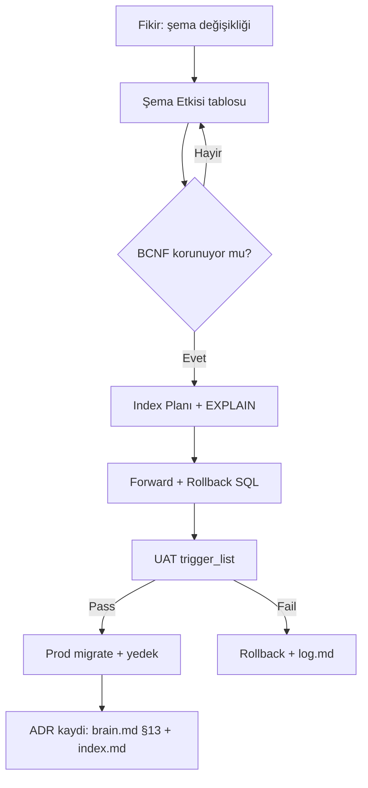

# CoreMusic — Veritabanı ADR Şablonu (Şema / BCNF / Index / Migration)

**Zorunlu Bağlantılar:** [[.ai/brain.md]] · [[.ai/CLAUDE.md]] · [[.ai/.templates/adr/adr-template.md]] · [[.ai/.templates/index.md]] · [[.ai/log.md]]

---

## §1. Amaç

Bu şablon, CoreMusic veritabanı katmanında alınan her kararın (şema değişikliği, index, migration, stored procedure, replica topolojisi) dokümante edilmesini sağlar.

### §1.1 Kapsam Dışı Konular

| Konu | İlgili Şablon | Not |
|---|---|---|
| API sözleşmeleri | `other/api-doc-template.md` | DB kararı değil |
| Frontend token/ITCSS | `adr/adr-frontend-template.md` | DB dışı |
| ORM nesne ilişkisi (yalnız) | bu şablon §3.1 | migration gerekiyorsa |
| Sıralama navigasyonu | `adr/adr-index.md` | kayıt listesi |
| Çeviri / glossary | `other/i18n-template.md` | DB dışı |

### §1.2 Doğrulama Testi

```markdown
- [ ] Her tablo BCNF'te (Guardrail #18 — 18/18 BCNF)
- [ ] FK/PK/UNIQUE/Index bildirilmiş
- [ ] İlgili .sql dosyası güncel
- [ ] ALTER adımı geri alınabilir (rollback ayrı dosyada)
- [ ] UAT (trigger_list.md) güncellendi
```

---

## §2. Kapsam

| Alan | Soru | Cevap |
|---|---|---|
| DBMS | MySQL sürümü? | `8.0.x` (utf8mb4) |
| Kodlama | Karakter seti | `utf8mb4_unicode_ci` |
| Tasarım | Form | BCNF (Guardrail #18) |
| Varlıklar | DB dosyası | `18/18` (`.ai/.sql/mysql/`) |
| UAT | Test listesi | `docs/uat/trigger_list.md` |
| İlişki | ADR ile | `brain.md` §13 karar listesi |

### §2.1 Etkilenen Varlıklar

| Dosya / Varlık | Etki (ekle/sil/güncelle) | Senkron | Sorumluluk |
|---|---|---|---|
| `shared/src/Database/` | ORM base | migration sonrası | 🔵 backend |
| `.ai/.sql/mysql/*.sql` | şema SSOT | migration anında | 🟠 db-optimizer |
| `docs/uat/trigger_list.md` | UAT | test öncesi | 🟠 qa-engineer |

---

## §3. Mimari

### §3.1 Şema Etkisi (DOMAIN)

**Hedef varlık:** `<!-- örn: product_variants -->`

| Varlık | Mevcut Şekil | Karar Sonrası | Etki |
|---|---|---|---|
| Tablo | `product_variants` | + `attrs JSON` kolonu | 🔴 |
| Kolon | `price DECIMAL(10,2)` | `price DECIMAL(12,4)` | 🟠 |
| İlişki | FK → `products.id` | aynı | 🟢 |
| Trigger | — | `trg_pv_price` | 🔴 |

```sql
-- Migration: Forward
ALTER TABLE product_variants
  ADD COLUMN attrs JSON NULL COMMENT 'variant attributes'
  AFTER price;

-- Rollback (ayrı dosya: 20260923_1430_rollback_product_variants.sql)
ALTER TABLE product_variants DROP COLUMN attrs;
```

### §3.2 Normal Form Analizi (DOMAIN)

| Normal Form | Testi | Mevcut | Karar Sonrası |
|---|---|---|---|
| 1NF | hücre atomik mi? | ✅ | ✅ |
| 2NF | parçalı bağımlılık yok mu? | ✅ | ✅ |
| 3NF | transitif bağımlılık yok mu? | ✅ | ✅ |
| BCNF | her determinant aday mı? | ✅ (Guardrail #18) | ✅ |

**Aday Anahtarlar:** `<!-- PK: id; UK: (sku, locale) -->`

| Aday Anahtar | Kolonlar | Karar | Not |
|---|---|---|---|
| PK | `id BIGINT` | koru | AUTO_INCREMENT |
| UK | `(sku, locale)` | ekle | çok dilli SKU |

### §3.3 Index Planı (DOMAIN)

| Kolon | Index Tipi | Ad | Gerekçe | Yaratma |
|---|---|---|---|---|
| `sku` | UNIQUE | `uk_pv_sku` | mükerrer SKU engeli | `idx_product_variants_sku` |
| `price` | BTREE | `idx_pv_price` | sıralama | `idx_product_variants_price` |
| `attrs->locale` | GENERATED | `idx_pv_locale` | JSON arama | `ALTER ... GENERATED ALWAYS AS` |

```sql
-- Forward
CREATE UNIQUE INDEX uk_pv_sku ON product_variants (sku, locale);
CREATE INDEX idx_pv_price ON product_variants (price);

-- Rollback
DROP INDEX idx_pv_price ON product_variants;
DROP INDEX uk_pv_sku ON product_variants;
```

### §3.4 Migration / Rollback (DOMAIN)

| Adım | SQL Dosyası | Yön | Risk | Yedek |
|---|---|---|---|---|
| 1 | `20260923_1430_add_attrs.sql` | forward | 🟠 | `mysqldump --single-transaction` |
| 2 | `20260923_1430_uat_check.sql` | doğrula | 🟢 | — |
| 3 | `20260923_1430_rollback.sql` | geri al | 🔴 | step 1 öncesi dump |

**Prosedür:**
1. Yedek al (big-bang: full dump; expand-contract: `SHOW TABLES LIKE 'tmp_%'`).
2. Forward SQL'i uygula.
3. UAT trigger_list çalıştır.
4. Hata → rollback çalıştır, `brain.md` §21'e olay yaz.

### §3.5 UAT Etkilesimi (DOMAIN)

| Trigger | SQL Bağlantısı | Beklenen | Fail Durumunda |
|---|---|---|---|
| `product_variants_ekle` | migration adımı 1 | kayıt + JSON dolu | rollback |
| `product_variants_guncelle` | adımı 2 | fiyat değişir | log → `.ai/log.md` |

### §3.6 DB Karar Matrix (Standart)

| Seçenek | BCNF | Index | Migration Riski | Puan |
|---|---|---|---|---|
| **A (seçildi)** | ✅ | optimal | 🟠 expand-contract | **5.0** |
| B | ✅ | fazla index | 🟠 big-bang | 3.0 |
| C | ⚠️ 2NF | minimal | 🔴 büyük | 2.0 |

### §3.7 Performans Tahmini (Tablo)

| Metrik | Önce | Sonra | Kaynak |
|---|---|---|---|
| Örnek sorgu latensi | 45 ms | 12 ms | EXPLAIN ANALYZE |
| Tablo boyutu | 1.2 GB | 1.25 GB | `information_schema` |
| Cache hit | %92 | %95 | `SHOW STATUS LIKE 'Innodb%'` |

### §3.8 Gerçek Şema Kanıtı (glob — `.ai/.sql/mysql/`)

| # | Dosya | Varlık Türü |
|---|---|---|
| 1 | `.ai/.sql/mysql/products.sql` | çekirdek tablolar |
| 2 | `.ai/.sql/mysql/users.sql` | kullanıcı/rol |
| 3 | `.ai/.sql/mysql/orders.sql` | sipariş/fatura |
| 4 | `.ai/.sql/mysql/payments.sql` | ödeme kayıtları |
| 5 | `.ai/.sql/mysql/invoices.sql` | e-fatura/e-arşiv |
| 6 | `.ai/.sql/mysql/addresses.sql` | adresler |
| 7 | `.ai/.sql/mysql/categories.sql` | kategori ağacı |
| 8 | `.ai/.sql/mysql/brands.sql` | markalar |
| 9 | `.ai/.sql/mysql/products_seo.sql` | SEO meta |
| 10 | `.ai/.sql/mysql/delivery_methods.sql` | kargo yöntemleri |
| 11 | `.ai/.sql/mysql/payment_methods.sql` | ödeme yöntemleri |
| 12 | `.ai/.sql/mysql/product_images.sql` | görseller |
| 13 | `.ai/.sql/mysql/product_variants.sql` | varyantlar |
| 14 | `.ai/.sql/mysql/rabatt_kuponlar.sql` | kuponlar |
| 15 | `.ai/.sql/mysql/sliders.sql` | slider/banner |
| 16 | `.ai/.sql/mysql/ai_training_data.sql` | NLP eğitim |
| 17 | `.ai/.sql/mysql/ai_training_quality.sql` | NLP kalite |
| 18 | `.ai/.sql/mysql/ai_training_session_log.sql` | oturum logu |

> **DDL çalışma mantığı:** `.ai/.sql/mysql/*.sql` = şema SSOT; `.ai/scripts/database/` = 36 script (seed/migrate/backup).

### §3.9 BCNF Anomali Vaka Analizi (DOMAIN)

> Aşağıdaki örnek **eğitim amaçlıdır** (gerçek şemaya dokunmaz); şablonu kullanırken kendi tablonuzu yazın.

**Fonksiyonel Bağımlılık Kümesi (örnek):**

| # | Bağımlılık | Determinant | Bağımlı | Anomali Riski |
|---|---|---|---|---|
| FD1 | `sku → ürün_adı` | `sku` | `ürün_adı` | silme anomali |
| FD2 | `(sku, locale) → fiyat` | `(sku, locale)` | `fiyat` | güncelleme anomali (1000 tekrar) |
| FD3 | `kategori_ad → kategori_id` | `kategori_ad` | `kategori_id` | ekleme anomali (NULL kategori) |
| FD4 | `id → *` (PK) | `id` | tüm satır | — (sağlam determinant) |

```sql
-- ❌ Transitif bağımlılık (3NF ihlali): sku -> kategori_ad -> kategori_id
CREATE TABLE urun_kategorisiz (
  id          BIGINT PRIMARY KEY,
  sku         VARCHAR(64) NOT NULL,
  locale      CHAR(5)     NOT NULL,
  fiyat       DECIMAL(12,4) NOT NULL,
  kategori_ad VARCHAR(120) NOT NULL,   -- satır içinde tekrar (1000x)
  kategori_id BIGINT NOT NULL
);
-- Sonuç: kategori adı değişimi = 1000 UPDATE + silme anomali

-- ✅ BCNF: her determinant aday anahtarın tamamı
CREATE TABLE urun (
  id  BIGINT PRIMARY KEY,
  sku VARCHAR(64) NOT NULL,
  UNIQUE KEY uk_urun_sku (sku)
);
CREATE TABLE kategori (
  id  BIGINT PRIMARY KEY,
  ad  VARCHAR(120) NOT NULL,
  UNIQUE KEY uk_kategori_ad (ad)        -- determinant = UK (aday anahtar)
);
CREATE TABLE urun_kategori (
  urun_id     BIGINT NOT NULL,
  kategori_id BIGINT NOT NULL,
  PRIMARY KEY (urun_id, kategori_id),
  FOREIGN KEY (urun_id) REFERENCES urun(id),
  FOREIGN KEY (kategori_id) REFERENCES kategori(id)
);
```

**Düzeltme Sonrası Karşılaştırma:**

| Metrik | Önce (yanlış) | Sonra (BCNF) | Dayanak |
|---|---|---|---|
| Kategori adı tekrarı | 1000 satır | 1 satır | FD3 |
| Güncelleme maliyeti | 1000 UPDATE | 1 UPDATE | §3.2 |
| Ekleme anomali | mümkün (NULL) | imkânsız (FK) | R2 |
| Silme anomali | kategori kaybı | junction korur | §3.1 |
| Tablo sayısı | 1 | 3 | §3.1 |
| BCNF durumu | ❌ ihlal | ✅ Guardrail #18 | R1 |

### §3.10 Yedekleme / Retention / Replica Politikası (DOMAIN)

| Politika | Değer | Sıklık | Doğrulama | Fail Eylemi |
|---|---|---|---|---|
| Full dump | `mysqldump --single-transaction` | günlük 03:00 | dosya boyutu > 0 | 🔴 alert |
| Binlog | `log_bin=ON`, expire 259200s | sürekli | `SHOW BINARY LOGS` | 🟠 |
| Retention | 30 gün dump / 3 gün binlog | — | dosya listesi temizliği | 🟠 |
| Restore tatbikatı | UAT DB'ye geri yükle | çeyreklik | `CHECKSUM TABLE` önce/sonra | 🔴 |
| Replica | 1 read-replica (PLANNED) | — | replica gecikme < 5s | 🟠 |
| Şifreleme | dump şifresi Vault'ta (REDACTED) | her yedek | §3.11 secret tarama | 🔴 |
| UAT kopyası | production anonimleşmiş kopya | her migration öncesi | PII kolon maskesi | 🔴 |

```bash
# Günlük yedek (şablon — secret Vault'tan okunur, asla log'a yazılmaz)
mysqldump --single-transaction --routines --triggers \
  --result-file="/backup/coremusic_$(date +%F).sql" coremusic

# Geri yükleme doğrulama (tatbikat)
mysql coremusic_restored < /backup/coremusic_$(date -d yesterday +%F).sql
CHECKSUM TABLE product_variants, orders, users;   -- önce/sonra eşit mi?
```

### §3.11 Yasaklı Sorgu Örüntüleri (DOMAIN)

| # | Yasak Örüntü | Neden | Doğru Hali |
|---|---|---|---|
| Q1 | `SELECT *` geniş tabloda | IO + kırılgan sözleşme | açık kolon listesi |
| Q2 | N+1 (döngüde sorgu) | bağlantı patlaması | `JOIN` / tek sorgu |
| Q3 | string birleştirme ile SQL | SQLi (ADR-002 ruhu) | prepared + `@param` |
| Q4 | `WHERE` hesap kolonu | index kullanılmaz | hesap kolonunu dışarı al |
| Q5 | `ORDER BY RAND()` | tam tablo tarama | ön filtre + `LIMIT` |
| Q6 | txn içinde ağ I/O | lock süresi uzar | kısa txn, I/O dışında |
| Q7 | `OFFSET` derin sayfalama | O(n) tarama | keyset pagination |
| Q8 | kilit olmadan oku-yazdır | kayıp güncelleme | optimistic lock / `FOR UPDATE` |

```php
// ✅ DOĞRU — prepared + tek sorgu (PDO; ADR-002 frozen)
$sql = 'SELECT o.id, o.total, c.name
        FROM orders o
        JOIN customers c ON c.id = o.customer_id
        WHERE o.customer_id = :cid AND o.created_at >= :since
        ORDER BY o.created_at DESC
        LIMIT :lim';
$stmt = $pdo->prepare($sql);
$stmt->bindValue(':cid', $customerId, PDO::PARAM_INT);
$stmt->bindValue(':since', $since, PDO::PARAM_STR);
$stmt->bindValue(':lim', 50, PDO::PARAM_INT);
$stmt->execute();

// ✅ Keyset sayfalama (Q7 alternatifi)
$sql = 'SELECT id, total FROM orders
        WHERE customer_id = :cid AND id < :cursor
        ORDER BY id DESC LIMIT :lim';
```

### §3.12 Connection Pool / Timeout / Kilit Tablosu (DOMAIN)

| Ayar | Değer (örnek) | PHP/DBMS muadili | Aşım Etkisi |
|---|---|---|---|
| `max_connections` | 100 (sunucu), 20 (uygulama havuzu) | PDO havuzu (persistent dikkatli) | 🔴 yeni bağlantı hatası |
| `connect_timeout` | 3 sn | PDO `ATTR_TIMEOUT` | 🟠 yavaş açılış |
| `innodb_lock_wait_timeout` | 5 sn | — | 🔴 deadlock zaman aşımı |
| `wait_timeout` | 600 sn | ölü bağlantı temizliği | 🟠 havuz kirlenmesi |
| Slow query log | > 100 ms | `slow_query_log=ON` | 🟠 gözlemlenebilirlik |
| App retry | max 3, exponential backoff | — | 🔴 retry storm |
| Circuit breaker | 5 hata/10 sn → açık | — | 🟠 çöküş yayılımı |

```sql
-- Gözlemlenebilirlik: yavaş sorgu günlüğü (salt-okunur yapılandırma kontrolü)
SHOW VARIABLES LIKE 'slow_query_log%';
SHOW VARIABLES LIKE 'innodb_lock_wait_timeout';
-- Beklenen: slow_query_log = ON, lock_wait = 5 (§5.4 migration güvenliği)
```

---

### §3.13 EXPLAIN / Query Plan Denetimi (DOMAIN)

| # | Kontrol | Araç | Kabul | İhlalde |
|---|---|---|---|---|
| 1 | Plan türü | `EXPLAIN FORMAT=TREE` | `const` / `eq_ref` / `ref` | `ALL` (full scan) → index ekle |
| 2 | Taranan satır | `EXPLAIN` satır sayısı | ≤ {{MAX_ROWS_SCANNED}} | seçicilik düşük → composite index |
| 3 | `Using filesort` | EXPLAIN çıktısı | YOK | ORDER BY ifadesini index'e al |
| 4 | `Using temporary` | EXPLAIN çıktısı | YOK | join/gruplama stratejisini değiştir |
| 5 | Slow log | `SHOW VARIABLES LIKE 'slow_query_log%'` | `ON` | §3.12 timeout tablosu ile hizala |
| 6 | N+1 şüphesi | döngü içinde sorgu | YOK | tek toplu (batch) sorguya geçir |
| 7 | Prepared kullanımı | PDO prepared statement | %100 | string birleştirme → §3.11 |
| 8 | Sayım sorgusu | `COUNT(*)` kullanımı | indeksli kolon ile | büyük tabloda tam sayım yasak |

> Migration öncesi/sonrası `EXPLAIN` özeti `.ai/log.md`'ye append edilir (§5.1). Sayısal eşikler proje verisine göre doldurulur; uydurma metrik yazılmaz.

### §3.14 Karakter Seti / Collation & Tip Seçimi (DOMAIN)

| Konu | Zorunlu | Yasak | Not |
|---|---|---|---|
| Karakter seti | `utf8mb4` | `utf8` (3-byte) | Türkçe + emoji tam destek |
| Collation | `utf8mb4_0900_ai_ci` (MySQL 9 varsayılanı) | `latin1_*` | ⚠️ VERIFICATION REQUIRED: proje collation'ı `.ai/.sql/mysql/**` içinde teyit edilecek |
| Para birimi | `DECIMAL(m,n)` | `FLOAT` / `DOUBLE` | yuvarlama hatası yasak |
| Tarih/saat | `TIMESTAMP` (UTC sakla) | `VARCHAR` tarih | sunucu dilimine bağımlılık yok |
| Kimlik | `BIGINT UNSIGNED` PK | `UUID` PK (varsayılan) | ⚠️ VERIFICATION REQUIRED: istisna tasarım `.ai/.sql/mysql/**` içinde kontrol |
| Boole | `TINYINT(1)` | `ENUM('0','1')` | şema/ORM uyumu |
| Uzun metin | bilinçli `VARCHAR(n)` | kontrolsüz `TEXT` | indekslenebilirlik |

> Zorunlu: prepared statement + açık sütun listesi (`SELECT *` yasak, §3.11); ORM yasak (ADR-002). 18 BCNF şeması: `.ai/.sql/mysql/**` (18 dosya, glob ✅).

### §3.15 Join & Cardinalite Kontrol Tablosu (DOMAIN)

| # | Kontrol | Kabul | İhlalde |
|---|---|---|---|
| 1 | FK kolonu indeksli | her FK'da indeks | tablo taraması → indeks ekle |
| 2 | Join anahtarı tipi | birebir aynı tip/collation | `char` ↔ `int` karşılaştırması yasak |
| 3 | Döngü içi sorgu (N+1) | YOK | repository'de toplu sorgu |
| 4 | Alt sorgu (subquery) | yalnız gerekliyse | JOIN veya CTE'ye çevir |
| 5 | `LEFT JOIN` → `INNER JOIN` | mümkünse inner | gereksiz dış join |
| 6 | Çoklu DB join (9/18 DB) | ❌ yasak | uygulama katmanında birleştir (ADR-003/ADR-040) |
| 7 | Cardinalite tahmini | `EXPLAIN` ile doğrulanır | tahminle şema yazma |

> Sorgu kalıpları §3.11 (yasaklı örüntüler) ile birlikte okunur; çoklu-DB sınırı ADR-003 (9 BCNF) ve ADR-040 (18 BCNF) kapsamındadır.

## §4. Kurallar

| # | Kural | Seviye | Cezâ |
|---|---|---|---|
| R1 | 18/18 BCNF (Guardrail #18) | 🔴 | ADR BLOCKED |
| R2 | Yeni tablo = PK + en az 1 UK | 🔴 | revizyon |
| R3 | FK asla opsiyonel değil | 🟠 | revizyon |
| R4 | Migration + rollback dosyası birlikte | 🔴 | BLOCKED |
| R5 | Charset `utf8mb4` | 🔴 | BLOCKED |
| R6 | Soft-delete `deleted_at` kolonu | 🟡 | not düş |
| R7 | UAT trigger_list güncellenir | 🟠 | revizyon |
| R8 | DB değişikliği `.ai/log.md`'ye yazılır | 🔴 | BLOCKED |

### §4.1 Yasaklı Şema Değişiklikleri

```sql
-- ❌ YASAK — geri alınabilirliği olmayan düşürme (R4 ihlali)
DROP TABLE orders;                    -- ❌ rollback dosyasız
ALTER TABLE users MODIFY email VARCHAR(50);   -- ❌ veri kırpma riski (önce analiz)

-- ❌ YASAK — charset bozma (R5)
ALTER TABLE posts CONVERT TO CHARACTER SET latin1;   -- ❌ utf8mb4 kuralı

-- ✅ DOĞRU — expand & contract (bir sonraki release'te temizle)
ALTER TABLE product_variants
  ADD COLUMN attrs_new JSON NULL;       -- 1) expand (geri alınabilir ADD)
-- ... uygulama iki yazma (dual-write) ...
-- release N+1: ALTER TABLE ... DROP COLUMN attrs; RENAME attrs_new -> attrs (contract)

-- ❌ YASAK — index'siz FK ekleme (tam tarama kilitleri)
ALTER TABLE orders ADD FOREIGN KEY (customer_id) REFERENCES users(id);
-- ✅ DOĞRU — önce eşleşen index
CREATE INDEX idx_orders_customer ON orders(customer_id);
ALTER TABLE orders ADD CONSTRAINT fk_orders_customer
  FOREIGN KEY (customer_id) REFERENCES users(id);
```

| Yasak | Cezâ | Mutlak Alternatif |
|---|---|---|
| Dosyasız `DROP`/`TRUNCATE` | 🔴 BLOCKED (R4) | forward + rollback `.sql` çifti |
| Charset daraltma | 🔴 BLOCKED (R5) | `utf8mb4` koru |
| Uzun lock `ALTER` (büyük tablo) | 🟠 | pt-online-schema-change / gece penceresi |
| FK'sız ilişkisel kolon | 🟠 (R3) | önce UK/index sonra FK |
| UAT'sız migration | 🔴 (R7) | `trigger_list.md` pass |

### §4.2 Migration Güvenlik Penceresi

| Pencere | Koşul | Uygulama | Geri Alım |
|---|---|---|---|
| Düşük trafik (gece) | trafik < %10 | her `ALTER` | rollback `.sql` |
| Expand phase | N aktif sürüm | sadece `ADD`/`NULLABLE` | drop yeni kolon |
| Contract phase | N+1 yayında | eski kolon düşürme | yedekten geri |
| Büyük tablo (>1M satır) | lock > 5 sn | online DDL / copy-tablo | §3.4 risk satırı |
| Pencere dışı istek | release lock | **DUR** — pencere bekle | — |
| Kilit çatışması | `innodb_lock_wait` | otomatik timeout (§3.12) | txn rollback |

```text
Migration zaman kapısı:
  pazarlama etkinliği/gece penceresi mi? 
    HAYIR → sadece expand fazı (ADD) veya DUR
    EVET  → yedek (§3.10) → forward → UAT (§3.5) → contract
  her faz: `.ai/log.md` append (dosya adı + yön + süre)
```

---

## §5. Workflow



**Adımlar:**
1. Etki varlığını say (§3.1).
2. BCNF testi (§3.2) — bozuluyorsa taslağı reddet.
3. Index planı + `EXPLAIN` (§3.3).
4. SQL forward/rollback (§3.4).
5. UAT (§3.5) → geçmezse rollback.
6. Kayıt: `brain.md` §13.2 (Active) + `index.md` §1.

---

## §6. Doğrulama

| Test ID | Adım | Beklenen | Fail |
|---|---|---|---|
| DBV-01 | `mysqldump --no-data` diff | schema diff sadece beklenen | rollback |
| DBV-02 | BCNF denetim sorgusu | 0 anomali | BLOCKED |
| DBV-03 | `EXPLAIN` (§3.3 sorgular) | `type: ref/range` (ALL değil) | index ekle |
| DBV-04 | Rollback çalıştır → forward | veri korunur | incident |
| DBV-05 | UAT `trigger_list.md` | tüm pass | `.ai/log.md` |

```sql
-- DBV-02: aday anahtar bütünlüğü
SELECT COUNT(*) FROM information_schema.TABLE_CONSTRAINTS
WHERE CONSTRAINT_SCHEMA='coremusic' AND CONSTRAINT_TYPE='UNIQUE';
-- Beklenen: >= şema planındaki UK sayısı
```

### §6.1 Ek Doğrulama (şema + ortam)

| Test ID | Adım | Beklenen | Fail |
|---|---|---|---|
| DBV-06 | `SHOW VARIABLES LIKE 'character_set%'` | `utf8mb4` | 🔴 R5 |
| DBV-07 | FK'sız kolon taraması | `information_schema` ile 0 | 🟠 R3 |
| DBV-08 | Yedek dosyası varlığı (migration günü) | tarihli dump mevcut | 🔴 geri dönüş yok |
| DBV-09 | Rollback SQL sözdizimi kontrolü | `mysql --dry-run` temiz | 🟠 |
| DBV-10 | Slow query (migration sonrası) | 0 yeni satır | 🟠 §3.12 |
| DBV-11 | Index derliliği | `ANALYZE TABLE` no error | 🟠 |
| DBV-12 | BCNF denetim (§3.2) yeniden | anomali 0 | 🔴 R1 |

```sql
-- DBV-07: ilişkisiz kolon adayları (şablon sorgusu — kendi şemana uyarla)
SELECT TABLE_NAME, COLUMN_NAME FROM information_schema.COLUMNS c
WHERE TABLE_SCHEMA='coremusic'
  AND COLUMN_NAME LIKE '%_id'
  AND NOT EXISTS (
    SELECT 1 FROM information_schema.KEY_COLUMN_USAGE k
    WHERE k.TABLE_SCHEMA=c.TABLE_SCHEMA AND k.TABLE_NAME=c.TABLE_NAME
      AND k.COLUMN_NAME=c.COLUMN_NAME AND k.REFERENCED_TABLE_NAME IS NOT NULL);
-- Beklenen: 0 satır (tüm *_id FK'lı) — değilse R3 ihlali
```

---

## §7. Referanslar

| Kaynak | Tür | Not |
|---|---|---|
| `.ai/.sql/mysql/*.sql` | şema SSOT | 18/18 dosya |
| `.ai/scripts/database/` | 36 script | seed/migrate/backup |
| `docs/uat/trigger_list.md` | UAT | her DB değişimi sonrası |
| `brain.md` §13 | ADR listesi | frozen 001–037 |
| `CLAUDE.md` Guardrail #18 | BCNF | 🔴 18/18 |

---

**Template Version:** 1.0.0
**Last Updated:** 2026-09-23
