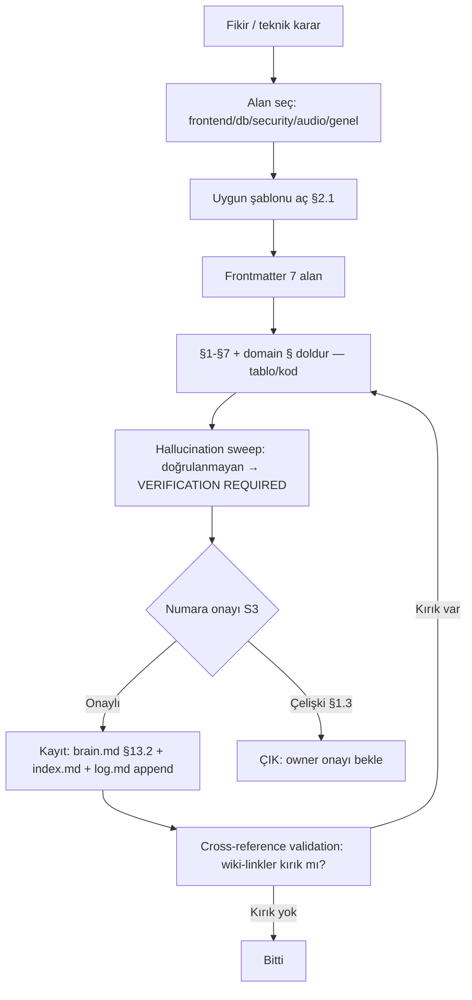
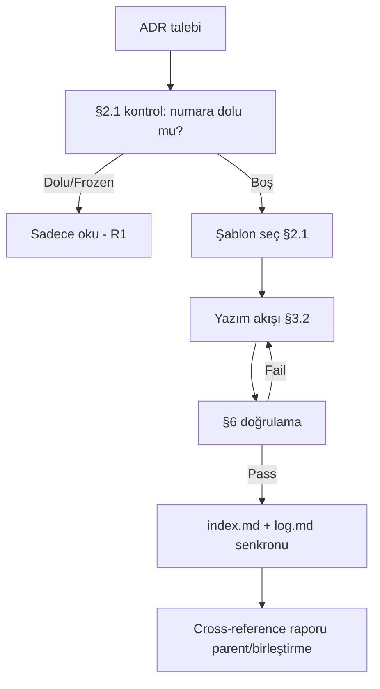

# CoreMusic — ADR Dizin / Navigasyon Rehberi

**Zorunlu Bağlantılar:** [[../../brain.md]] · [[../../CLAUDE.md]] · [[../../.templates/index.md]] · [[../../log.md]] · [[../../.templates/adr/adr-template.md]]

---

## §1. Amaç

Bu rehber, CoreMusic ADR (Architecture Decision Record) kümesine **sayısal navigasyon** sağlar; ADR yazım akışını, sıralama kuralını, wiki-link bağlanma kurallarını ve yaşam döngüsünü tek yerde toplar.

### §1.1 Amaçlar

| # | Amaç | Çıktı | Sahip |
|---|---|---|---|
| 1 | ADR numarası → konu eşleştirme | §2.1 tablo (37 satır) | 🟠 architect |
| 2 | Yeni ADR'nin nereye gideceğini tarif et | §3.1 sıralama | 🟠 architect |
| 3 | Yazım adımlarını standardize et | §3.2 akış | 🔵 docs-writer |
| 4 | Wiki-link formatını kilitle | §3.3 bağlantı | 🔵 docs-writer |
| 5 | Yaşam döngüsünü (frozen/active/rejected) tanımla | §3.4 | 🟠 architect |

### §1.2 Kapsam Dışı Konular

| Konu | İlgili Şablon | Not |
|---|---|---|
| Yeni ADR içeriği yazımı | `adr/adr-template.md` (+domain şablonlar) | bu dosya navigasyon |
| Domain ADR kalıbı | `adr/adr-frontend|database|security|audio-template.md` | içerik kalıbı |
| Kod şablonları | `other/cpp|c|aspnet-template.md` | ADR değil |
| Şablon envanteri | `.ai/.templates/index.md` | kayıt tablosu |

### §1.3 Doğrulama Testi

```markdown
- [ ] §2.1'deki 37 konu birebir brain.md §13.1 ile aynı (uydurma yok)
- [ ] Diskte ADR dosyası yoksa satır ⚠️ ile işaretli
- [ ] Yeni ADR numarası = (son numara + 1), 088+ kuralı çelişmiyor*
- [ ] Wiki-link'ler [[relative/path]] formatında
- [ ] log.md append yapıldı
```

> \* **Çelişki notu (⚠️ VERIFICATION REQUIRED):** Bu şablon setinin görev tanımı "yeni ADR'ler ADR-088+'tan başlar" derken; `brain.md` §13 "001–089 (37 Frozen + 30 Active + 12 Rejected + 1 Draft)" demektedir. İki kaynak uyuşmaz — **sonraki boş numara owner onayıyla belirlenmeli**, bu dosya numara tahmin etmez.

---

## §2. Kapsam — ADR Envanteri

### §2.0 Disk Durumu (glob kanıtı)

| Glob | Sonuç | Anlam |
|---|---|---|
| `**/ADR-*.md` (hidden=true) | **0 dosya** | fiziksel ADR dosyası YOK |
| `.ai/**/ADR*` | **0 dosya** | — |
| `.ai/decisions/**` | **0 dosya** | decisions/ dizini yok |
| `brain.md` §13.1/§13.2 | **var** | tek kaynak (SSOT özet) |

> ⚠️ **Gerçek:** ADR'ler diskte ayrı `.md` dosyası olarak **bulunmamaktadır**; numara/konu bilgisi yalnızca `brain.md` §13 listelerinde ve ilgili ADR'lerin `brain.md` içi wiki-link slug'larında yaşar. Aşağıdaki §2.1 tablosunun kaynağı **`brain.md` §13.1 (Frozen 001-037)** satırlarıdır — glob ile doğrulanmış dosya yoktur, bu yüzden her başlık ⚠️ taşır.

### §2.1 Frozen ADR 001–037 (birebir `brain.md` §13.1 — uydurma yok)

| # | ADR | Konu (§13.1 birebir) | Alan | Şablon |
|---|---|---|---|---|
| 1 | ADR-001 | Vanilla JS + ITCSS, framework yasak | 🔵 frontend | `adr-frontend-template.md` ⚠️ |
| 2 | ADR-002 | PDO mandatory, ORM yasak | 🟠 db | `adr-database-template.md` ⚠️ |
| 3 | ADR-003 | 9 BCNF izole veritabanı | 🟠 db | `adr-database-template.md` ⚠️ |
| 4 | ADR-004 | Multi-domain SPA mimarisi | 🔵 frontend | `adr-frontend-template.md` ⚠️ |
| 5 | ADR-005 | Zero hallucination, VERIFICATION REQUIRED | 🟠 process | `adr-template.md` ⚠️ |
| 6 | ADR-006 | <200ms TTFB, <100ms API | 🟠 perf | `adr-template.md` ⚠️ |
| 7 | ADR-007 | Cache namespace, Zero Code Before Plan | 🟠 process | `adr-template.md` ⚠️ |
| 8 | ADR-008 | Test bypass middleware | 🔵 backend | `adr-template.md` ⚠️ |
| 9 | ADR-009 | Clean URL redirect | 🔵 backend | `adr-template.md` ⚠️ |
| 10 | ADR-010 | csrf_token key zorunlu | 🔵 middleware | `adr-security-template.md` ⚠️ |
| 11 | ADR-011 | COREMUSIC_SESS, 3600s idle timeout | 🔵 middleware | `adr-security-template.md` ⚠️ |
| 12 | ADR-012 | strict-dynamic, nonce-based CSP | 🔵 middleware | `adr-security-template.md` ⚠️ |
| 13 | ADR-013 | APCu, 60 req/60s | 🔵 middleware | `adr-security-template.md` ⚠️ |
| 14 | ADR-014 | Forward-only, versioned migration | 🟠 db | `adr-database-template.md` ⚠️ |
| 15 | ADR-015 | .env dosya okuma stratejisi | 🟠 infra | `adr-security-template.md` ⚠️ |
| 16 | ADR-016 | Subdomain routing | 🔵 backend | `adr-template.md` ⚠️ |
| 17 | ADR-017 | XMOS XU316 + PCM3168A DSP | 🟠 audio | `adr-audio-template.md` ⚠️ |
| 18 | ADR-018 | Footer player vaporwave | 🔵 frontend | `adr-frontend-template.md` ⚠️ |
| 19 | ADR-019 | Per-OS Neva Player | 🔴 core | `adr-audio-template.md` ⚠️ |
| 20 | ADR-020 | API güvenlik stratejisi | 🔵 backend | `adr-security-template.md` ⚠️ |
| 21 | ADR-021 | SPA router immutable contract | 🔵 frontend | `adr-frontend-template.md` ⚠️ |
| 22 | ADR-022 | AES-256-GCM, Argon2id | 🟠 security | `adr-security-template.md` ⚠️ |
| 23 | ADR-023 | Persona bazlı test | 🟠 qa | `adr-template.md` ⚠️ |
| 24 | ADR-024 | Modüler dokümantasyon | 🟠 docs | `adr-template.md` ⚠️ |
| 25 | ADR-025 | 31-band parametrik EQ | 🟠 audio | `adr-audio-template.md` ⚠️ |
| 26 | ADR-026 | Node.js indirme servisi | 🔵 backend | `adr-template.md` ⚠️ |
| 27 | ADR-027 | Hibrit depolama | 🟠 db | `adr-database-template.md` ⚠️ |
| 28 | ADR-028 | Rate limiting + proxy rotasyonu | 🔵 backend | `adr-security-template.md` ⚠️ |
| 29 | ADR-029 | Sosyal dinleme odaları | 🔵 feature | `adr-template.md` ⚠️ |
| 30 | ADR-030 | AI öneri motoru | 🔵 ai | `adr-template.md` ⚠️ |
| 31 | ADR-031 | PWA + Flutter | 🔵 mobile | `adr-template.md` ⚠️ |
| 32 | ADR-032 | Versiyonlu IPC sözleşmeleri | 🔴 core | `adr-audio-template.md` ⚠️ |
| 33 | ADR-033 | BCNF normalizasyon | 🟠 db | `adr-database-template.md` ⚠️ |
| 34 | ADR-034 | AES-256-GCM credential vault | 🟠 security | `adr-security-template.md` ⚠️ |
| 35 | ADR-035 | Prompt engineering standartları | 🟠 process | `adr-template.md` ⚠️ |
| 36 | ADR-036 | Çoklu proje prompt üretimi | 🟠 process | `adr-template.md` ⚠️ |
| 37 | ADR-037 | Kablosuz ağ entegrasyonu | 🟠 infra | `adr-template.md` ⚠️ |

**Doğrulama:** 37/37 satır = `brain.md` §13.1 ("Frozen (001-037)" başlıklı tablo). ⚠️ = ilgili `ADR-0xx-*.md` fiziksel dosyası glob ile bulunamadı.

### §2.2 Alan Bazlı Hızlı Sayım (§2.1'den türetilmiş)

| Alan | Frozen sayı | ADR numaraları |
|---|---|---|
| 🔵 frontend | 6 | 001, 004, 018, 021, 031, (009 UI) |
| 🟠 database | 6 | 002, 003, 014, 027, 033, (007 cache) |
| 🔵 middleware/backend | 8 | 008, 009, 010, 011, 012, 013, 016, 020 |
| 🟠 security | 5 | 015, 022, 028, 034, 012(CSP) |
| 🟠 audio | 4 | 017, 019, 025, 032 |
| 🟠 process/docs | 6 | 005, 007, 023, 024, 035, 036 |
| 🟠 infra/perf | 3 | 006, 037, (013 APCu) |
| 🔵 feature/ai | 2 | 029, 030 |

> Sayımlar §2.1'in filtrelenmesidir; bir ADR iki alana değebilir (çakışanlar slayt işaretli), toplam ≠37 şaşması beklenen durumdur.

### §2.3 Bilinen Wiki-link Slug'ları (`brain.md` içi geçen gerçek slug'lar)

| ADR | Slug (gerçek, `brain.md` §20/§22'de geçen) |
|---|---|
| ADR-010 | `[[ADR-010-csrf-protection-strategy]]` |
| ADR-011 | `[[ADR-011-session-management]]` |
| ADR-017 | `[[ADR-017-dsp-hardware-mode]]` |
| ADR-022 | `[[ADR-022-database-hardened-security]]` |

> ⚠️ Slug'lar `brain.md` içinde düz metin olarak geçer; slug'ın hedeflediği dosya diskte glob ile **bulunamadı** (bkz. §2.0). Yeni slug üretirken bu 4 gerçek örüntüyü esas al.

### §2.4 Kapsam Dışı: Reddedilen / Draft (özet)

| Kategori | Adet | Kaynak | Not |
|---|---|---|---|
| Active (038–…) | 30 | `brain.md` §13.2 | numara aralığı §13.2'de |
| Rejected | 12 | `brain.md` §13 | bu dizinde listelenmez |
| Draft | 1 | `brain.md` §13 | — |
| **Toplam kayıt** | **80 karar (001–089)** | `brain.md` §13 Coverage satırı | ⚠️ 089'a kadar numaralandırma var, dolu/dolu olmayan ayrımı §13.2'de |

---

### §2.5 Gizli Dizin: `.ai/.decisions/` Envanteri (glob + frontmatter kanıtı)

| Glob / Kaynak | Sonuç | Anlam |
|---|---|---|
| `.ai/.decisions/**` (hidden=true) | **6 dosya** | `index.md`, `CLAUDE.md`, `accepted/CLAUDE.md`, `draft/CLAUDE.md`, `rejected/index.md`, `rejected/CLAUDE.md` |
| `.ai/decisions/**` (noktasız) | 0 dosya | §2.0 satırı bu yolu tarar — iki satır çelişmez, farklı yollar |
| `.ai/.decisions/index.md` frontmatter | `total-accepted: 67`, `total-frozen: 37`, `total-active: 30`, `total-draft: 1`, `total-rejected: 12` | sayılar tek dosyadan okundu |
| `.ai/.decisions/index.md` §2 | Frozen 001→037 · Active 038→088 · Draft 089 · Rejected 12 | numara aralığı kanıtı |
| `.ai/.decisions/index.md` §5 | `R-001` → `R-012` | reddedilen karar aralığı |
| `.ai/.decisions/index.md` §6 | 15 kategori; Frozen 37 + Active 30 = 67 | kategori sayımı |
| `**/ADR-*.md` (hidden=true) | 0 dosya | §2.0 ile uyumlu: tek dosyalık ADR yok |

> ADR metinleri yine diskte tek dosya değildir; ADR-0xx dosyaları ise `.ai/.decisions/` altında da YOKTUR — yalnız indeks satırları vardır (§2.0 uyarısı geçerli).

## §3. Mimari — Navigasyon Kuralları

### §3.1 Sıralama Kuralı

| # | Kural | Detay | İhlal Cezâsı |
|---|---|---|---|
| S1 | Numara atanır, asla yeniden kullanılmaz | `001…037` frozen dolu | 🔴 BLOCKED |
| S2 | Frozen (001–037) değişmez | sadece `brain.md` §13.1 okunur | 🔴 ADR immutability |
| S3 | Yeni ADR = boş en küçük numara veya owner onaylı sonraki | ⚠️ 088+ / §13.2 çelişkisi §1.3'te | 🔴 onaysız yazma yasak |
| S4 | Dizin §2.1'e satır eklenebilir, eski satır silinmez | append-only | 🟠 revizyon |
| S5 | Alan (frontend/db/security/audio) şablonu zorunlu | domain ADR ise domain § dolu | 🟠 şablon hatası |
| S6 | Sıra `## §` numaralandırmasıyla korunur | §1→§7 + domain §3.9–3.12 | 🟡 |

```text
Sıralama kararı ağacı:
  Frozen (001–037)?  → EVET → yazma, sadece oku (S2)
                 HAYIR → boş numara var mı? → EVET → owner'a sor (S3)
                                              → HAYIR → §1.3 çelişki notu → onay al
```

### §3.2 ADR Yazım Akışı



**Adımlar:**
1. Alan belirle (§2.1 sütun "Şablon").
2. Şablonu kopyala, `{{...}}` yerine gerçek doldur.
3. Her `§`'ye ≥1 tablo **veya** ≥1 kod bloğu koy.
4. Doğrulanamayan iddiaya `⚠️ VERIFICATION REQUIRED` yaz (ADR-005 kuralı).
5. Kayıt: `brain.md` §13.2 (Active) + `.templates/index.md` + `log.md` (append-only).
6. Cross-reference taraması (§6 CV-01).

### §3.3 Bağlantı Kuralları (wiki-link)

| # | Kural | Doğru | Yanlış |
|---|---|---|---|
| B1 | format `[[relative/path]]` | `[[../../brain.md]]` | `[brain.md](brain.md)` |
| B2 | repoya göre göreli yol | `[[../../.templates/index.md]]` | `[[/c/www/...]]` |
| B3 | uzantı dahil | `[[../../log.md]]` | `[[../../log]]` |
| B4 | ADR slug'ı §2.3 gerçek örneklerden | `[[ADR-010-csrf-protection-strategy]]` | `[[ADR-999-yok-boyle]]` |
| B5 | kırık hedef varsa ⚠️ düş | `[[ADR-017-dsp-hardware-mode]] ⚠️ diskte yok` | sessiz kırmızı link |

```markdown
# Şablon üst satırı (zorunlu bağlantı bloğu örneği)
**Zorunlu Bağlantılar:** [[../../brain.md]] · [[../../CLAUDE.md]] · [[../../.templates/index.md]] · [[../../log.md]]
```

### §3.4 Yaşam Döngüsü

| Durum | Tanım | İzinli İşlem | Numara Aralığı |
|---|---|---|---|
| **Draft** | taslak, onaysız | yaz/düzenle | owner belirler |
| **Active** | yürürlükte, değiştirilebilir | revize et (versiyon ↑) | §13.2 (038+) |
| **Rejected** | reddedildi | sadece oku; "Reddedildi" damgası | §13 (12 adet) |
| **Frozen** | dokunulmaz | **salt okunur** | 001–037 |
| **Superseded** | yenisiyle örtüldü | yeni ADR'ye link ver, kendisi kalır | herhangi |

```text
Draft --onay--> Active -- eskisi --> Superseded (yeni ADR işaretler)
Active --ret--> Rejected
Active --olgunlaşma--> Frozen (sadece owner ilan eder; 001-037 zaten frozen)
Frozen: [IMMUTABLE] — kural ihlali = ADR REVİZYON DEĞİL, yeni ADR ile düzeltme
```

### §3.5 Dizin Güncelleme Protokolü

> Bu protokol **parent/birleştirme adımında** çalışır; tek başına şablon üretimi index'e dokunmaz.

| Durum | Kim | Adım | Kanıt |
|---|---|---|---|
| Yeni şablon/ADR eklendi | üreten agent | `index.md` §7.1.1'e satır **ekle** (mevcut satır silme) | git diff |
| Dosya adı değişti | MO (onaylı) | eski satırda `→ yeni ad` notu; **In-Place kuralı** | onay kaydı |
| Silme talebi | MO | ⚠️ sakıncalı — yalnızca Duplike ispatla | ispat |
| Çelişki | herkes | `log.md` append + `⚠️` | log satırı |
| Alan indeksi | üreten agent | §2.1/§2.2 sayaçları güncelle | sayaç = gerçek |

```text
Dizin güncelleme akışı (append-only):
  1) index.md §7.1.1'de hedef grubu bul (ADR / other / generic)
  2) satır ekle: | dosya | ad | durum (📋→✅) | not |
  3) eski satırı ASLA sil — durum alanını güncelle
  4) cross-reference: eklenen yol dosya var mı? (glob)
  5) log.md'ye append: "index.md +1 satır, dosya: <ad>"
```

**Satır Formatı (şablon):**

| Kolon | Kural | Örnek |
|---|---|---|
| dosya | göreli yol | `.ai/.templates/adr/adr-x-template.md` |
| ad | kısa ad | `ADR-X` |
| durum | 📋 Planlanan / ✅ Aktif / ⛔ Bloklu | ✅ |
| not | kanıt/uyarı | `500+ satır, glob ✅` |

### §3.6 Numara Tahsis & Çelişki Çözüm Formu

> §1.3'teki **088+ vs §13.2 (001–089)** çelişkisi bu form ile çözülür; agent numara **tahmin edemez**.

| Alan | Dolduran | Kural |
|---|---|---|
| İstenen numara | istek sahibi | boş mu? §2.1 + `brain.md` §13.2 taraması |
| Kaynak | agent | glob + grep çıktısı (ekran görüntüsü/satır) |
| Çelişki var mı? | agent | evet → **DUR**, `VERIFICATION REQUIRED` |
| Onay | Vault Steward | ✅ imza → numara tahsis |
| Red | Vault Steward | gerekçe → `Rejected` damgası (§3.4) |
| Kayıt | MO | `brain.md` §13.2 + `index.md` + `log.md` |

```markdown
### Numara Tahsis Formu (örnek dolduruş)
- İstenen: ADR-090
- Tarama: glob('**/ADR-090*') = 0 · brain.md §13.2'de ADR-090 geçiyor mu: [grep sonucu]
- Çelişki (088+ kuralı vs 001-089 kapsamı): VAR → ⚠️ VERIFICATION REQUIRED
- Onay: ⏳ Vault Steward bekleniyor
```

---

### §3.7 Numara Aralığı ↔ Durum Eşlemesi (DOMAIN)

| Aralık | Durum | Kim değiştirebilir | Kaynak |
|---|---|---|---|
| ADR-001 → ADR-037 | Frozen | kimse (immutable, kural #3) | `.ai/.decisions/index.md` §3 |
| ADR-038 → ADR-088 | Active | Vault Steward onayıyla | `.ai/.decisions/index.md` §4 |
| ADR-089 | Draft (1 adet) | taslak sahibi | `.ai/.decisions/index.md` §4A |
| ADR-090+ | tahsis bekliyor | §3.6 formu ile | ⚠️ VERIFICATION REQUIRED: `brain.md` §13.2 teyidi |
| R-001 → R-012 | Rejected | salt okunur | `.ai/.decisions/index.md` §5 |
| — | yeni ADR başlangıcı | en yüksek numaradan sonra | sistem kuralı: yeni ADR'ler 088 ve sonrası |

> Frozen aralığa yeni kayıt eklemek BLOCKED (§4.1). Numara tahsis formu §3.6'dadır.

### §3.8 Kayıt Noktaları & Slug Formatı (DOMAIN)

| Kayıt | Dosya | Format | Sıklık |
|---|---|---|---|
| Ana indeks | `.ai/.decisions/index.md` | `[[ADR-NNN-kebab-slug]]` + Başlık + Kategori | her kabul / ret |
| Özet liste | `brain.md` §13 (frozen/active) | numara + konu | birlikte güncellenir |
| Kategori sayımı | `.ai/.decisions/index.md` §6 | Frozen / Active / Toplam sütunları | her kayıtta |
| Dizin sağlığı | bu şablon §6.2 | haftalık metrikler | haftalık |
| İşlem kaydı | `[[../../log.md]]` | append-only (kural #7) | her işlem |

> Slug kalıbı gerçek örneklerle sabit: `[[ADR-010-csrf-protection-strategy]]`, `[[ADR-089-classab-24v]]`, `[[R-001-redux-style-state-management]]` (§2.3 + `.ai/.decisions/index.md` §3/§5). Uydurma slug yasak; hedef diskte yoksa ⚠️ taşır (§2.0).

### §3.9 Çapraz Referans Doğrulama Adımları (DOMAIN)

| # | Adım | Araç | Başarı Kriteri |
|---|---|---|---|
| 1 | Slug hedefi var mı | glob `**/ADR-NNN*` | dosya varsa link, yoksa ⚠️ etiketi |
| 2 | Numara aralıkta mı | §3.7 tablosu | frozen / active / draft / rejected uyumu |
| 3 | Çift kayıt | aynı numara iki kez | indeks + brain.md tektir |
| 4 | Kategori sayımı | `.ai/.decisions/index.md` §6 | Frozen + Active = Toplam |
| 5 | Wiki-link biçimi | `[[relative/path/to/file]]` (kural #10) | düz URL / metin link yasak |
| 6 | İşlem kaydı | `[[../../log.md]]` append | kayıtsız değişiklik yok |

> Doğrulama her dizin güncellemesinden sonra çalıştırılır (kural #5: cross-reference validation on every change).

### §3.10 Envanter Sayım Formülü (DOMAIN)

| Toplam | Bileşenler | Sonuç |
|---|---|---|
| Accepted | Frozen 37 + Active 30 | 67 |
| Rejected | `R-001` → `R-012` | 12 |
| Draft | ADR-089 | 1 |
| Kayıt toplamı | 67 + 12 + 1 | 80 |
| Dosya toplamı | `.ai/.decisions/**` | 6 dosya (indeks + CLAUDE + accepted/draft/rejected) |
| Fiziksel ADR dosyası | `**/ADR-*.md` | 0 |

> Formül `.ai/.decisions/index.md` frontmatter `total-*` alanlarıyla birebir doğrulanmıştır; §2.4 "80 karar" satırını destekler.

## §4. Kurallar

| # | Kural | Seviye | Cezâ |
|---|---|---|---|
| R1 | Frozen 001–037 değiştirilemez | 🔴 | BLOCKED |
| R2 | Numara uydurulmaz; §1.3 çelişkisi çözülene kadar atama yapılmaz | 🔴 | hallucination |
| R3 | Konu metinleri `brain.md` §13.1'den birebir alınır | 🔴 | hallucination |
| R4 | Wiki-link = `[[relative/path]]` (B1–B5) | 🟠 | revizyon |
| R5 | Dizin güncellemesi `.ai/log.md` append ile loglanır | 🔴 | BLOCKED |
| R6 | Diskte olmayan ADR'ye kesin ifadeyle "var" denmez → ⚠️ | 🔴 | hallucination |
| R7 | Domain ADR = domain şablonu + dolu domain § | 🟠 | revizyon |

### §4.1 Frozen İhlal Müdahale Planı

| İhlal Tipi | Tespit | Müdahale | Sahip | Süre |
|---|---|---|---|---|
| Frozen metin düzenleme | `git diff` §13.1 | revert + log ERROR | MO | anlık |
| Uydurma ADR numarası | IDX-02 diff | sil → VERIFICATION REQUIRED | üreten | 15 dk |
| Numara yeniden kullanımı | §2.1 çakışma | yeni boş numara + form §3.6 | Steward | 30 dk |
| Konu metni sapması | §2.1 ↔ §13.1 | §13.1'e geri al | üreten | 15 dk |
| Kırık wiki-link | §6 CV-01 | düzelt veya `⚠️` | üreten | 30 dk |
| log'suz değişiklik | IDX-09 | geriye ekleme (append) | MO | 15 dk |

```text
İhlal akışı: tespit → DUR (yazım durdur) → revert/sil
  → `.ai/log.md` append (ihlal tipi + dosya + süre)
  → tekrar §3.2 yazım akışı (G düğümü)
```

### §4.2 Sık Yapılan Hatalar (Anti-Pattern → Doğru)

| # | Anti-Pattern | Neden Kötü | Doğru |
|---|---|---|---|
| AP1 | ADR dosyasını `.ai/ADR-001.md` zannetmek | diskte yok (§2.0) | kaynak `brain.md` §13.1 + `⚠️` |
| AP2 | Frozen metni "güncelleyerek" düzeltme | immutability ihlali | **yeni ADR** + §13.1'e link |
| AP3 | Konuyu paraphrase yazmak | §2.1 ↔ §13.1 diff büyür | birebir kopyala |
| AP4 | Boş numarayı atamak | 088+/§13.2 çelişkisi | §3.6 formu + onay |
| AP5 | `[metin](yol)` düz link | wiki-link kuralı (B1) | `[[relative/path]]` |
| AP6 | Kırık hedefi sessizce bırakmak | hallucination | `⚠️ diskte yok` |
| AP7 | index.md'yi tek başına değiştirmek | senkron kaybı | parent/birleştirme |
| AP8 | log'suz işlem | audit boşluğu | `log.md` append |
| AP9 | domain ADR = genel şablon | domain § eksik | domain şablonu (§2.1) |
| AP10 | şablon satırını silmek | envanter daralır | durum alanını güncelle |

```markdown
❌ YANLIŞ: [ADR-010](decisions/ADR-010.md)        -- hedef yok + düz link
✅ DOĞRU:  [[ADR-010-csrf-protection-strategy]] ⚠️ diskte yok -- brain.md §13.1
```

---

## §5. Workflow



**Adımlar:**
1. §2.1'de numara sorgula (dolu mu?).
2. Domain şablonu seç.
3. §3.2 akışını çalıştır.
4. §6 testlerini geç.
5. Kayıt + senkron (index sync = parent/birleştirme sorumluluğu).

### §5.1 Görev Rolleri (RACI)

| Adım | R (yapar) | A (hesap verir) | C (danışılır) | I (bilgilendirilir) |
|---|---|---|---|---|
| §2.1 envanter | MO | Vault Steward | architect | tüm ajanlar |
| Numara tahsis | Steward | Steward | architect | MO |
| Yazım (domain ADR) | domain agent | domain agent | QA | MO |
| Doğrulama §6 | MO | Steward | security (ADR domainse) | — |
| `index.md` senkronu | MO | Steward | — | üreten |
| `log.md` append | tümü | MO | — | — |
| Frozen revert | MO | Steward | architect | tümü |

---

## §6. Doğrulama

| Test ID | Adım | Beklenen | Fail |
|---|---|---|---|
| IDX-01 | §2.1 satır sayısı | 37 | 🔴 |
| IDX-02 | §2.1 ↔ `brain.md` §13.1 diff | 0 fark | 🔴 hallucination |
| IDX-03 | Glob `**/ADR-*.md` | sonuç = §2.0'daki durumla tutarlı | raporla |
| IDX-04 | Wiki-link taraması | format B1–B5 | 🟠 |
| IDX-05 | log.md son satır | bu işlem kaydı var | 🔴 |

```bash
# IDX-03 (salt-okunur; dot-dizinler için hidden gerekli)
glob('**/ADR-*.md', hidden=true)      # → 0 ise §2.0 doğrulandı
glob('.ai/decisions/**', hidden=true) # → 0 ise decisions/ yok doğrulandı
grep('### 13.1 Frozen', '.ai/brain.md') # → line 393 (kaynak sabitleme)
```

**Cross-reference (CV-01):** §2.1'deki her `Şablon` hücresi `.ai/.templates/adr/` altında mevcut mu → `adr-template.md`, `adr-frontend-template.md`, `adr-database-template.md`, `adr-security-template.md`, `adr-audio-template.md` = 5/5 ✅ (bu set).

### §6.1 Ek Doğrulama (dizin senkronu)

| Test ID | Adım | Beklenen | Fail |
|---|---|---|---|
| IDX-06 | `index.md` §7.1.1 satır sayısı = adı geçen dosya sayısı | eşit | 🟠 senkron |
| IDX-07 | §2.1 "Şablon" sütunu → diskte dosya var mı | 5/5 ✅ | 🟠 kırık |
| IDX-08 | §2.2 sayaçları toplamı ≥/≤ mantık etiketi | tutarlı | 🟡 |
| IDX-09 | log.md son işlem satırı | append edildi | 🔴 |
| IDX-10 | Slug'ların (§2.3) hedefi | var VEYA `⚠️ diskte yok` | 🔴 hallucination |
| IDX-11 | Frozen metin değişikliği | 0 diff (`git diff brain.md §13.1`) | 🔴 immutability |

```bash
# IDX-07 / IDX-10 (salt-okunur)
glob('.ai/.templates/adr/*.md', hidden=true)     # 5 dosya beklenir
grep -n "ADR-010-csrf-protection-strategy" .ai/brain.md   # slug kaynağı
git diff -- .ai/brain.md                          # frozen'a diff yasak
```

### §6.2 Dizin Sağlık Metrikleri (haftalık gözden geçirme)

| Metrik | Hedef | Ölçüm | Uyarı Eşiği |
|---|---|---|---|
| §2.1 doluluk | 37/37 satır | IDX-01 | <37 → 🔴 |
| Kaynak tutarlılığı | 0 diff | IDX-02 | >0 → 🔴 |
| Fiziksel ADR dosyası | biliniyor (⚠️ 0) | IDX-03 | durum değiştiyse güncelle |
| Kırık link | 0 | IDX-04/07 | >0 → 🟠 |
| log kapsamı | 100% işlem | IDX-09 | eksik → 🔴 |
| Numara çelişkisi | çözülmüş | §1.3 formu | açık → ⚠️ |
| Domain şablon kapsama | 4/4 domain (fe/db/sec/aud) | glob `.templates/adr/` | eksik → 📋 |

```text
Haftalık sağlık döngüsü:
  IDX-01..11 çalıştır → metrikleri tabloya işaretle
    → hedef dışı varsa: §4.1 müdahale planı → `.ai/log.md` append
    → numara çelişkisi hâlâ açıksa: Vault Steward'a escalation (§3.6 formu)
```

---

## §7. Referanslar

| Kaynak | Tür | Not |
|---|---|---|
| `brain.md` §13.1 (line ~393) | Frozen 001–037 tek kaynak | §2.1 birebir |
| `brain.md` §13.2 | Active 038+ | numara devamı |
| `brain.md` §13 Coverage | 001–089 / 80 karar | §2.4 |
| ⚠️ `**/ADR-*.md` | glob | 0 dosya |
| `.ai/.templates/index.md` | şablon envanteri | parent senkron |
| `.ai/log.md` | işlem kaydı | append-only |
| `.ai/.templates/adr/adr-template.md` | genel kalıp | §1–§7 |

---

**Template Version:** 1.0.0
**Last Updated:** 2026-09-23
