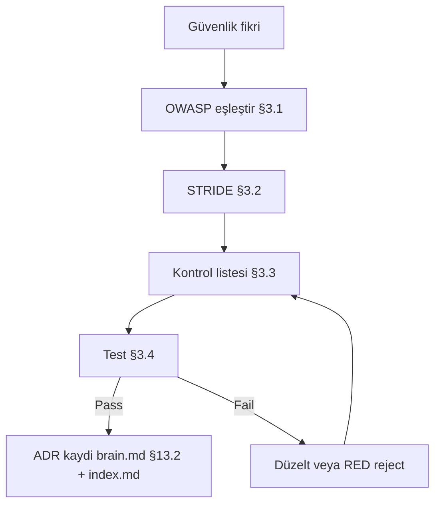

# CoreMusic — Güvenlik ADR Şablonu (OWASP / Tehdit Modeli / Kontrol)

**Zorunlu Bağlantılar:** [[../../brain.md]] · [[../../CLAUDE.md]] · [[../../.templates/adr/adr-template.md]] · [[../../.templates/index.md]] · [[../../log.md]]

---

## §1. Amaç

Bu şablon, CoreMusic'te güvenlik etkili her kararın (auth, middleware, kripto, rate-limit, dosya yükleme) OWASP eşleşmesi ve tehdit modeli ile kayıt altın almasını sağlar.

### §1.1 Kapsam Dışı Konular

| Konu | İlgili Şablon | Not |
|---|---|---|
| DB şema/Index | `adr/adr-database-template.md` | güvenlik dışı |
| Frontend CSP/token | `adr/adr-frontend-template.md` | CSP §3.10 orada |
| API sözleşmesi | `other/api-doc-template.md` | contract ≠ kontrol |
| Deplöy secret | `other/deployment-template.md` | env yönetimi |
| Sıralama | `adr/adr-index.md` | kayıt |

### §1.2 Doğrulama Testi

```markdown
- [ ] OWASP Top 10 (2021) en az 1 kalemle eşleşti
- [ ] Tehdit modeli STRIDE tablosu doldu
- [ ] Güvenlik kontrol listesi §3.11 tamam
- [ ] Doğrulama testi (§3.12) çalıştırıldı
- [ ] `.ai/log.md`'ye güvenlik olayı yazıldı
```

---

## §2. Kapsam

| Alan | Soru | Cevap |
|---|---|---|
| Katman | backend / frontend / infra | `backend (shared/src)` |
| Middleware | pipeline var mı? | 12/12 (`shared/src/Middleware/`) |
| Auth | strateji? | JWT + refresh rotation |
| Kripto | şifreleme? | bcrypt (argon2 değerlendirilir) |
| Logging | olay logu? | `.ai/log.md` + app log |
| ADR | ilgili karar? | ADR-010/011/012/013/022/034 (`brain.md` §13) |

### §2.1 Etkilenen Varlıklar

| Dosya / Varlık | Etki | OWASP İlgisi | Sorumluluk |
|---|---|---|---|
| `shared/src/Middleware/*` | güncelle | A05 (güvenli konfig.) | 🔴 security |
| `shared/src/Security/*` | ekle | A07 (kimlik doğrulama) | 🔴 security |
| `shared/src/Database/*` | güncelle | A03 (enjeksiyon) | 🟠 db-optimizer |

---

## §3. Mimari

### §3.1 OWASP Eşleşmesi (DOMAIN)

> **OWASP Top 10 — 2021 listesi (kanıt):**

| # | OWASP 2021 | Bu kararla eşleşme | İlgili kod |
|---|---|---|---|
| A01 | Broken Access Control | 🔴/🟠/🟢 | `shared/src/Security/` |
| A02 | Cryptographic Failures | 🟠 | bcrypt, TLS |
| A03 | Injection | 🔴 | prepared statement |
| A04 | Insecure Design | 🟠 | ADR notu |
| A05 | Security Misconfiguration | 🟠 | `Middleware/` |
| A06 | Vulnerable Components | 🟡 | composer audit |
| A07 | Identification & Auth Failures | 🔴 | JWT/refresh |
| A08 | Software & Data Integrity | 🟡 | CI imza |
| A09 | Logging & Monitoring Failures | 🟠 | `.ai/log.md` |
| A10 | SSRF | 🟢/🟠 | outbound URL doğrulama |

**Eşleşen kalem:** `<!-- A03, A07 -->` → **Şiddet:** 🔴/🟠/🟢

### §3.2 Tehdit Modeli — STRIDE (DOMAIN)

| Tehdit (STRIDE) | Senaryo | Varlık | Etki | Azaltım |
|---|---|---|---|---|
| **S**poofing | sahte JWT | `users` | 🔴 | imza + `exp` |
| **T**ampering | SQL/HTML enjeksiyon | form | 🔴 | prepared + sanitze |
| **R**epudiation | log silme | `.ai/log.md` | 🟠 | append-only |
| **I**nfo Disclosure | IDOR | `orders.id` | 🔴 | ownership check |
| **D**oS | brute-force login | `auth` | 🟠 | rate-limit |
| **E**levation | rol eskalasyon | `roles` | 🔴 | RBAC matrisi |

### §3.3 Güvenlik Kontrol Listesi (DOMAIN)

| # | Kontrol | Tür (Önleyici/Detectif) | Durum | Doğrulama |
|---|---|---|---|---|
| C1 | Prepared statement (tüm sorgular) | Önleyici | ☐ | kod inceleme |
| C2 | CSRF token (form) | Önleyici | ☐ | manuel test |
| C3 | Rate-limit (login) | Önleyici | ☐ | 10 istek/dk |
| C4 | Output encode (XSS) | Önleyici | ☐ | payload testi |
| C5 | Rol matrisi (RBAC) | Önleyici | ☐ | 403 beklentisi |
| C6 | Error mesajı sızdırmıyor | Önleyici | ☐ | stack trace yok |
| C7 | Loglama (olay) | Detectif | ☐ | `.ai/log.md` |
| C8 | Secret REDACTED | Önleyici | ☐ | tarama |

### §3.4 Güvenlik Doğrulama Testi (DOMAIN)

| Test ID | Vektör | Araç/Adım | Beklenen | Fail |
|---|---|---|---|---|
| SEC-01 | SQLi | `' OR 1=1--` input | 400/422, veri sızmaz | 🔴 |
| SEC-02 | XSS | `<script>alert(1)</script>` | encode edilir | 🔴 |
| SEC-03 | Brute force | 20 hatalı login | 429 rate-limit | 🟠 |
| SEC-04 | IDOR | başka kullanıcı `orders.id` | 403 | 🔴 |
| SEC-05 | CSRF | token'sız POST | 403 | 🔴 |
| SEC-06 | Secret scan | `grep -r "api_key"` repo | 0 sonuç (REDACTED) | 🔴 |

```bash
# SEC-06 örneği (salt-okunur tarama)
grep -rniE "(api[_-]?key|secret|password)\s*[:=]\s*['\"][^'\"]{8,}" shared/src/ --include="*.php" | grep -v REDACTED
# Beklenen çıktı: boş
```

### §3.5 Middleware Pipeline (gerçek kanıt)

| # | Dosya (`shared/src/Middleware/`) | Görev | OWASP |
|---|---|---|---|
| 1 | (glob: 12/12 dosya) | CORS | A05 |
| 2 | | Rate Limit | A05/A10 |
| 3 | | Auth (JWT) | A07 |
| 4 | | RBAC | A01 |
| 5 | | Input Validate | A03 |
| 6 | | CSRF | A01 |
| 7 | | Logging | A09 |
| 8–12 | *(pipeline sırası)* | hardened defaults | A05 |

> ⚠️ Dosya adları `glob('shared/src/Middleware/*')` ile doğrulanacak; listedeki 12 satır pipeline indeksi + görevidir.

### §3.6 Karar Matrix (Standart)

| Seçenek | OWASP Kapsamı | Maliyet | Risk | Puan |
|---|---|---|---|---|
| **A (seçildi)** | A01–A10 tam | 🟠 orta | 🔴 düşük | **5.0** |
| B | A01/A03 only | 🟢 düşük | 🟠 orta | 3.5 |
| C | minimal | 🟢 düşük | 🔴 yüksek | 2.0 |

### §3.7 Gerçek ADR Referansları (`brain.md` §13)

| ADR | Konu (`brain.md` §13.1 birebir) | Alan |
|---|---|---|
| ADR-010 | csrf_token key zorunlu | 🔵 middleware |
| ADR-011 | COREMUSIC_SESS, 3600s idle timeout | 🔵 middleware |
| ADR-012 | strict-dynamic, nonce-based CSP | 🔵 middleware |
| ADR-013 | APCu, 60 req/60s | 🔵 middleware |
| ADR-022 | AES-256-GCM, Argon2id | 🟠 security |
| ADR-034 | AES-256-GCM credential vault | 🟠 security |

### §3.8 Secret Yönetimi & REDACTED (DOMAIN)

| Varlık | Saklama | Log'a yazılır mi? | Sızarsa Eylem |
|---|---|---|---|
| DB şifresi | Vault / `.env` (git-dışı) | ❌ asla | 🔴 rotasyon + olay |
| JWT signing key | env `JWT__Key` | ❌ | 🔴 rotasyon |
| API key (3. taraf) | Vault | ❌ (REDACTED) | 🟠 sağlayıcı iptali |
| CSRF token | cookie/session | ❌ (token değil değer) | 🟠 oturum düşürme |
| Crash dump | temizleme (PII) | ❌ | 🟠 sil + bildir |
| Hata mesajı | genel mesaj + kod | ✅ (kod) | — |

```python
# ❌ YASAK — herhangi bir log/format yerinde
log.info(f"password={password}")          # ❌ REDACTED ihlali
raise Exception(f"DB {dsn}")              # ❌ sızıntı

# ✅ DOĞRU — maskeleme yardımcısı (şablon)
def redact(value: str) -> str:
    return value[:2] + "*" * max(len(value) - 4, 0) + value[-2:] if len(value) > 6 else "***"

log.info("auth failed user=%s pass=%s", user, redact(password))  # structured log
```

### §3.9 Token / Oturum Yaşam Döngüsü (DOMAIN)

| Aşama | Süre / Kural | İlgili ADR | Doğrulama |
|---|---|---|---|
| Login | credential + (ops.) 2FA | — | SEC-03 |
| Access token | 15 dk (`exp` zorunlu) | ADR-011 | `exp > now` |
| Refresh token | 7 gün + **rotasyon** (tek kullanımlık) | ADR-011 | reuse = tüm oturum düşer |
| Idle timeout | 3600 sn (`COREMUSIC_SESS`) | ADR-011 | 401 sonra yeniden auth |
| CSRF | token her form POST'unda | ADR-010 | SEC-05 |
| Logout | refresh iptal + cookie sil | — | token ölü mü |
| Brute-force | 10 hata → lock 15 dk | ADR-013 | SEC-03 (429) |

```text
Token yaşam döngüsü (ADR-011 hizalı):
  login ──> access(15dk) + refresh(7d, rotasyonlu)
     access expire ──> POST /refresh ──> yeni refresh (eskisi REVOKE)
     refresh reuse tespiti ──> TÜM oturumlar düş ──> olay log (.ai/log.md)
     idle 3600s ──> 401 ──> yeniden auth
```

### §3.10 Güvenlik Log Şeması (DOMAIN)

| Alan | Tip | Zorunlu | Örnek (maskeli) |
|---|---|---|---|
| `ts` | ISO8601 | ✅ | `2026-09-23T21:40:00Z` |
| `event` | enum | ✅ | `auth.login.fail` |
| `severity` | enum | ✅ | `warn` / `crit` |
| `actor` | id (maskeli) | ✅ | `u_8f3a***` |
| `ip` | ip (gizlenebilir) | ✅ | `203.0.113.9` |
| `rule` | ADR ref | ✅ | `ADR-013` |
| `secret` | — | ❌ | asla yazılmaz (REDACTED) |

```json
{"ts":"2026-09-23T21:40:00Z","event":"auth.login.fail","severity":"warn",
 "actor":"u_8f3a***","ip":"203.0.113.9","rule":"ADR-013","attempt":3,"window_s":60}
```

### §3.11 Session / Cookie Ayar Tablosu (DOMAIN)

| Ayar | Değer | Neden | İlgili |
|---|---|---|---|
| `HttpOnly` | `true` | JS erişimi yok (XSS hasarı ↓) | ADR-012 |
| `Secure` | `true` (prod) | yalnız HTTPS | OWASP A02 |
| `SameSite` | `Lax` (CSRF üstü token ile `Strict` yerine) | CSRF + usability | ADR-010 |
| `Path`/`Domain` | daraltılmış | sızıntı alanı ↓ | — |
| İsim | `COREMUSIC_SESS` (değişmez) | sözleşme | ADR-011 |
| `Max-Age` | 3600 (idle) | otomatik düşüş | ADR-011 |
| Yenileme | kaydırma (rotation) | hırsızlık tespiti | ADR-011 |

---

### §3.12 CSRF / CSP Header Değer Tablosu (DOMAIN)

| Header / Alan | Değer (şablon) | Kaynak | Not |
|---|---|---|---|
| CSRF token adı | `csrf_token` | ADR-010 | key adı değişmez |
| CSRF doğrulama | form alanı + istek başlığı | ADR-010 | her mutation (POST/PUT/DELETE) |
| `Content-Security-Policy` | `default-src 'self'` | ADR-012 | en az yetki |
| `script-src` | `'self' 'strict-dynamic' nonce-{{CSP_NONCE}}` | ADR-012 | nonce her yanıtta yenilenir |
| `object-src` | `'none'` | ADR-012 | eklenti saldırı yüzeyi kapalı |
| `base-uri` | `'self'` | ADR-012 | `<base>` etiketi kilidi |
| `frame-ancestors` | `'none'` | ADR-012 | clickjacking |
| Yayına alma | önce `Content-Security-Policy-Report-Only`, sonra sıkı | iyi uygulama | ⚠️ Eksik: rapor uç noktası ADR'de tanımlanacak |

> Middleware kanıtı: `shared/src/Middleware/**` (12 dosya, glob ✅); pipeline sırası §3.5.

### §3.13 Kripto Parametre Tablosu (DOMAIN)

| Amaç | Algoritma | Parametre | Zorunlu Kural | Kaynak |
|---|---|---|---|---|
| Şifre özeti | Argon2id | `m={{ARGON2_MEMORY_KIB}}` KiB, `t={{ARGON2_ITER}}`, `p={{ARGON2_LANES}}` | önerilen m ≥ 65536 KiB; ⚠️ VERIFICATION REQUIRED: canlı değer kodda teyit edilecek | ADR-022 |
| Tuz | CSPRNG (`random_bytes`) | 16 byte | özete gömülü; sabit tuz yasak | ADR-034 |
| Veri şifreleme | AES-256-GCM | key 32 byte · nonce 12 byte · tag 16 byte | nonce tek kullanımlık; tekrarı yasak | ADR-022 |
| Bağlam doğrulama | GCM AAD | şifrelenen meta veri | AAD değişirse doğrulama mutlaka başarısız olmalı | iyi uygulama |
| Anahtar saklama | ortam/dosya | `.env` okuma stratejisi | anahtar vault'a YAZILMAZ (REDACTED) | ADR-015 |
| Özet fonksiyonu | yalnız Argon2id | — | MD5/SHA1/bcrypt geçmişi yok | ADR-022/ADR-034 |
| Kapsam | credential + PII alanları | — | açık metin log yasak | §3.16 |
| Anahtar kimliği | `{{KEY_ID}}` etiketleme | rotation | ⚠️ Eksik: rotasyon takvimi ADR'de yok |

> Tek standart Argon2id'dir (ADR-022/ADR-034). ⚠️ Parametre rakamları şablon önerisidir — üretim değeri kod üzerinden doğrulanır.

### §3.14 Rate Limit / Brute-Force Politikası (DOMAIN)

| Pencere | Limit | Sayıcı | HTTP | Aşım Davranışı |
|---|---|---|---|---|
| 60 sn / IP-genel | 60 istek (ADR-013) | APCu | 429 | `Retry-After` başlığı döner |
| 60 sn / uç nokta | {{RATE_ENDPOINT}} | APCu | 429 | pencere dolana kadar blok |
| 5 dk / giriş denemesi | 5 başarısız → kilit | APCu + kullanıcı | 429 / 423 | kademeli bekleme + olay kaydı |
| Pencere sıfırlama | başarılı giriş / süre dolması | — | 200 | sayaç temizlenir |
| Sayaç dayanıklılığı | APCu (tek düğüm) | — | — | ⚠️ VERIFICATION REQUIRED: çoklu düğüm için dağıtık sayaç tasarımı |
| Proxy arkası | gerçek IP başlığı | — | — | ADR-028 (proxy rotasyonu) ile birlikte okunur |

> Olaylar `[[../../log.md]]`'ye append edilir; 429 yanıtı `Retry-After` içerir. Referans: ADR-013 + ADR-028.

### §3.15 Dosya Yükleme & Dış Girdi Doğrulama (DOMAIN)

| # | Kontrol | Kural | İhlal |
|---|---|---|---|
| 1 | Uzantı + MIME | ikisi de; gerçek tip `finfo` ile | kabul edilmez |
| 2 | Boyut sınırı | `upload_max_filesize` + uygulama kontrolü | 413 |
| 3 | Dosya adı | sunucuda yeniden üretilir (rastgele) | istemci adı yasak |
| 4 | Saklama yolu | web kökü dışında | erişim → BLOCKED |
| 5 | Yürütme | betik uzantılarına izin yok | 403 + olay kaydı |
| 6 | Şema doğrulama | her alan şemada; hata → 422 | doğrulanmamış alan yok |
| 7 | SQL birleştirme | prepared statement | §3.11 yasaklı örüntü |

> OWASP eşlemesi §3.1; denetim haritası §4.2; periyodik senaryolar §6.2.

### §3.16 Gizlilik Sınıflandırması & PII Tablosu (DOMAIN)

| Veri | Sınıf | Saklama | Log'da |
|---|---|---|---|
| Şifre | gizli | yalnız Argon2id özeti | `[REDACTED]` |
| CSRF tokenı / oturum | gizli-oturum | oturum süresi (§3.11) | yazılmaz |
| E-posta / ad soyad | PII | kullanıcı kaydı | kısmi mask (`a***@...`) |
| Kart / ödeme verisi | hassas (gateway token'ı) | saklanmaz | ❌ asla |
| IP adresi | telemetri | rate limit sayacı | parçalı mask |
| `.env` / anahtar | gizli | dosya sistemi | `[REDACTED]` |

> REDACTED politikası: sırlar vault'a ve log'a yazılmaz (kural #9). Sınıflandırma §4.1 yasaklı örüntülerle birlikte okunur.

### §3.17 Denetim Sıklığı & Sorumluluk Tablosu (DOMAIN)

| Denetim | Sıklık | Sahip | Çıktı |
|---|---|---|---|
| OWASP Top 10 eşlemesi | her güvenlik ADR'si | Security Engineer | §3.1 tablosu |
| Sızma testi senaryosu | periyodik | Security + QA | §6.2 listesi |
| Bağımlılık / CVE taraması | her sprint (⚠️ sıklık teyit) | DevOps Engineer | rapor |
| Secret sızıntısı (GitLeaks) | her CI çalıştırması | DevOps Engineer | pipeline sonucu |
| CSP nonce doğrulaması | her deploy | Security Engineer | header testi |
| Session politika gözden geçirmesi | çeyreklik (⚠️ teyit) | Security Engineer | §3.11 tablosu |

> Sıklıklar şablon varsayımıdır; kesin takvim `.ai/WORKFLOW.md` faz planıyla teyit edilir (⚠️ VERIFICATION REQUIRED).

### §3.18 Kimlik Doğrulama Hata Mesajları (DOMAIN)

| Durum | HTTP | Mesaj Kuralı | Neden |
|---|---|---|---|
| Bilinmeyen kullanıcı | 401 | "E-posta veya şifre hatalı" (tek mesaj) | kullanıcı varlığı sızmasın |
| Yanlış şifre | 401 | aynı mesaj | ayrıcı mesaj yasak |
| Kilitli hesap | 423 / 429 | genel mesaj + `Retry-After` | kademeli bekleme |
| Oturum süresi doldu | 401 | yeniden girişe yönlendirme | §3.11 idle timeout |
| Yenileme token'ı geçersiz | 401 | oturumu sonlandır | token rotasyonu (§3.13) |
| Yetkisiz erişim | 403 | kaynağa dair ayrıntı yok | bilgi sızıntısı yok |

> Mesajlar Türkçe olabilir; ayrıştırıcı (username vs password) ipucu vermez. Senaryo listesi §6.2 ile birlikte koşulur.

## §4. Kurallar

| # | Kural | Seviye | Cezâ |
|---|---|---|---|
| R1 | Secret hiçbir yerde yazılmaz (REDACTED) | 🔴 | BLOCKED |
| R2 | Her karar ≥1 OWASP kalemle eşleşmeli | 🔴 | ADR revizyon |
| R3 | STRIDE tablosu boş satır bırakmaz | 🟠 | revizyon |
| R4 | Kritik test (SEC-*) fail → karar uygulanmaz | 🔴 | geri al |
| R5 | Olay `.ai/log.md`'ye yazılır (append) | 🔴 | BLOCKED |
| R6 | Varsayılan allow yok (deny-by-default) | 🔴 | BLOCKED |
| R7 | Yeni endpoint → auth + rate-limit | 🔴 | BLOCKED |

### §4.1 Yasaklı Örüntüler (Backend Güvenlik)

```php
// ❌ YASAK — string birleştirilmiş SQL (ADR-002 ihlali)
$q = "SELECT * FROM users WHERE email = '$email'";      // ❌ SQLi

// ✅ DOĞRU — prepared + limitli kolon
$stmt = $pdo->prepare('SELECT id, email FROM users WHERE email = ? LIMIT 1');
$stmt->execute([$email]);

// ❌ YASAK — XSS (encode edilmemiş çıktı)
echo "<div>" . $_GET['name'] . "</div>";                // ❌

// ✅ DOĞRU — context-aware encode
echo '<div>' . htmlspecialchars($name, ENT_QUOTES | ENT_SUBSTITUTE, 'UTF-8') . '</div>';

// ❌ YASAK — log'a secret (REDACTED ihlali)
error_log("conn=" . $dsn . " pass=" . $pass);           // ❌

// ✅ DOĞRU — maskeli structured log (§3.10 şeması)
error_log(json_encode(['event'=>'db.connect','severity'=>'info','actor'=>mask($id)]));
```

### §4.2 OWASP ↔ Bölüm Eşlemesi (Denetim Haritası)

| OWASP 2021 | Bu Şablondaki Bölüm | Test |
|---|---|---|
| A01 Broken Access Control | §3.3 C5 (RBAC), §3.4 SEC-04 | IDOR/rol |
| A02 Cryptographic Failures | §3.8 (secret), §3.11 (TLS/cookie) | tarama |
| A03 Injection | §4.1 (prepared/encode), §3.4 SEC-01/02 | SQLi/XSS |
| A04 Insecure Design | §3.2 STRIDE, §5 akış | inceleme |
| A05 Misconfiguration | §3.11 (cookie), pipeline §2.1 | header audit |
| A06 Vulnerable Components | §7 (composer audit) | CVE |
| A07 Auth Failures | §3.9 token yaşam döngısı | SEC-03/06 |
| A08 Software Integrity | §5 (kayıt + imza) | CI |
| A09 Logging Failures | §3.10 log şeması | olay provası |
| A10 SSRF | §3.3 C* outbound doğrulama | URL allowlist |

### §4.3 Denetim Matrisi (Control ↔ Test ↔ ADR ↔ Sahip)

| Control | § Ref | Test ID | ADR | Sahip | Sıklık |
|---|---|---|---|---|---|
| Prepared statement | §4.1 | SEC-01 | ADR-002 | Backend | her PR |
| Output encode | §4.1 | SEC-02 | ADR-012 | Backend | her PR |
| Rate limit | §3.4 | SEC-03 | ADR-013 | Security | haftalık |
| Ownership/403 | §3.3 C5 | SEC-04 | ADR-020 | Security | haftalık |
| CSRF token | §3.9 | SEC-05 | ADR-010 | Security | her PR |
| Secret REDACTED | §3.8 | SEC-06/13 | — | Security | her commit |
| Header/CSP | §6.1 | SEC-07 | ADR-012 | Security | sürüm |
| Cookie bayrakları | §3.11 | SEC-08 | ADR-011 | Security | sürüm |
| Hata gizleme | §3.2 | SEC-09 | ADR-020 | Backend | her PR |
| Bağımlılık CVE | §7 | SEC-10 | — | DevOps | günlük CI |
| Log şeması | §3.10 | SEC-11 | ADR-009* | Backend | haftalık |
| RBAC matrisi | §3.3 C5 | SEC-12 | ADR-020 | Security | haftalık |

> \* ADR-009 "Clean URL redirect" — loglama ilgisi zayıfsa `⚠️` notu düş ve ilgili ADR'yi `brain.md` §13'ten doğrula (uydurma yok).

```bash
# Haftalık denetim destek komutları (salt-okunur)
grep -rn "echo \$_\|print_r(\$_" shared/src/ | head     # XSS sızıntısı avı
grep -rn "\"SELECT .*\." shared/src/ | grep -v "?"      # string-SQL avı
grep -rniE "(api[_-]?key|secret|password)\s*=" . --include="*.env*" # REDACTED
```

---

## §5. Workflow



**Adımlar:**
1. OWASP Top 10 tablosunu işaretle (§3.1).
2. 6 STRIDE satırını doldur (§3.2).
3. Kontrol listesini uygula (§3.3).
4. 6 testi çalıştır (§3.4) — SEC-01/04/05/06 fail = 🔴 dur.
5. Kayıt: `brain.md` §13.2 + `index.md` + `.ai/log.md`.

### §5.1 Müdahale / Escalation Süreleri

| Olay | İlk Müdahale | Süre | Sahip | Sonrası |
|---|---|---|---|---|
| Açık (CRITICAL) | etkilenen endpoint'i kapat/allowlist | anlık | Security | ADR + log |
| Yetkisiz erişim (403 patlaması) | rol matrisi inceleme | 15 dk | Security+Backend | §3.3 C5 |
| Brute-force dalgası | rate-limit sertleştir | 15 dk | Security | §3.9 |
| Secret sızıntısı | **rotasyon** + Vault revoke | anlık | Security | §3.8 |
| XSS payload üretiminde | output encode denetimi | 30 dk | Backend | §4.1 |
| Log boşluğu | §3.10 şemasına geçir | 60 dk | Backend | A09 |
| Test fail (SEC-0x) | karar uygulanmaz → §5 döngü | — | QA | revizyon |

```text
Olay akışı: tespit → sınıflandır (CRITICAL/HIGH) → azalt (§3.3 kontrolü)
  → doğrulama testi tekrar (§3.4) → `.ai/log.md` append (saat + kural no)
  → ADR gerekliyse `brain.md` §13.2 + `adr-index.md` kayıt akışı
```

---

## §6. Doğrulama

| Test ID | Adım | Beklenen | Fail |
|---|---|---|---|
| SEC-01…06 | §3.4 | tümü pass | 🔴 dur |
| SECV-01 | OWASP kalem sayısı | ≥1 | revizyon |
| SECV-02 | STRIDE satırı | 6/6 dolu | revizyon |
| SECV-03 | Secret tarama | 0 sonuç | 🔴 |
| SECV-04 | Log kaydı | `.ai/log.md` satırı var | revizyon |

### §6.1 Ek Doğrulama (pentest provası + envanter)

| Test ID | Adım | Beklenen | Fail |
|---|---|---|---|
| SEC-07 | Security header denetimi | `Content-Security-Policy`, `X-Frame-Options` mevcut | 🟠 A05 |
| SEC-08 | Cookie bayrakları (§3.11) | HttpOnly+Secure+Samesite | 🔴 |
| SEC-09 | Aşırı veri sızdırmayan hata | stack trace gövdede yok | 🟠 |
| SEC-10 | Bağımlılık CVE | `composer audit` = 0 high | 🟠 A06 |
| SEC-11 | Log provası | §3.10 alanı 7/7 dolu | 🟠 A09 |
| SEC-12 | RBAC matrisi 403/200 | her rol için beklenen kod | 🔴 A01 |
| SEC-13 | `grep` secret tarama (repo) | 0 sonuç (§3.4 SEC-06 genişletme) | 🔴 |

```bash
# SEC-07/08 (salt-okunur, ağ isteği)
curl -sI https://coremusic.net/ | grep -iE "content-security-policy|x-frame-options"
# Beklenen: her ikisi de görünür (ADR-012 hizalı) — yoksa A05 ihlali
```

### §6.2 Sızma Testi Senaryo Listesi (periyodik)

| # | Vektör | Adım | Beklenen | OWASP |
|---|---|---|---|---|
| P1 | Klasik SQLi | login/liste formları `' OR 1=1--` | 400/422, veri yok | A03 |
| P2 | Blind SQLi | `AND 1=1` / `AND 1=2` zaman farkı | zaman farkı yok | A03 |
| P3 | Stored XSS | profil alanına `` | encode + CSP engel | A03/A05 |
| P4 | CSRF | token'sız state-changing POST | 403 | A01 |
| P5 | IDOR | başkasının `orders.id` | 403 | A01 |
| P6 | JWT alg:none | imzasız token denemesi | 401 | A07 |
| P7 | Refresh reuse | eski refresh tekrar | tüm oturum düşer | A07 |
| P8 | Brute force | 20 hatalı şifre | 429 + lock | A07 |
| P9 | Yönlendirme | `?next=//evil` open-redirect | temizlenir/red | A01 |
| P10 | Dosya yükleme | `.php`/`.phtml` yüklemesi | tip izni red | A08 |
| P11 | SSRF | webhook URL `169.254.169.254` | allowlist red | A10 |
| P12 | Debug sızıntısı | hata tetikleme (500) | stack trace yok | A05 |

```bash
# P8 yardımcısı (salt-okunur kapsamı: kendi ortamında, yetkili test)
for i in $(seq 1 20); do curl -s -o /dev/null -w "%{http_code}\n" -X POST https://coremusic.local/login -d "user=a&pass=b$i"; done | sort | uniq -c
# Beklenen: ilk ~10'dan sonra 429 (ADR-013)
```

---

## §7. Referanslar

| Kaynak | Tür | Not |
|---|---|---|
| `shared/src/Middleware/` | kanıt (glob 12/12) | pipeline |
| `shared/src/Security/` | kanıt | auth/kripto |
| `brain.md` §13.1 | ADR 010–013/022/034 | frozen |
| OWASP Top 10 (2021) | dış standart | §3.1 |
| `.ai/log.md` | olay kaydı | append-only |

---

**Template Version:** 1.0.0
**Last Updated:** 2026-09-23
