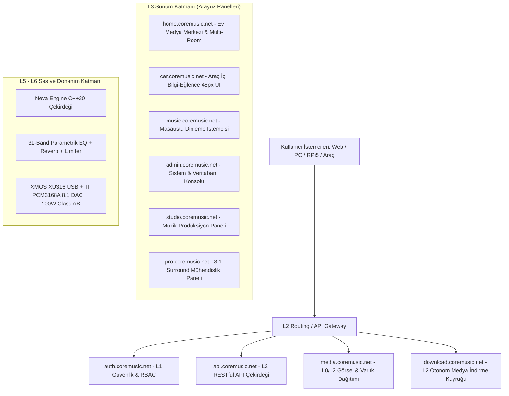

# CoreMusic — Technical Documentation & Engineering Manual
**Software • Audio • Hardware • AI**  
*Music Connects Everywhere — Music Beyond Limits*  
*Version 1.0.0 — September 2026 — CoreMusic Confidential*

---

> *"Great sound is not a luxury. It's a better way to live."*  
> — **CoreMusic**

---

## Table of Contents (İçindekiler)

| Chapter | Title & Subsections | Scope & Architectural Coverage |
| :---: | :--- | :--- |
| **01** | **Introduction**<br>• 1.1 What is CoreMusic?<br>• 1.2 Key Features & System Capabilities<br>• 1.3 Target Users & 6 Operational Scenarios<br>• 1.4 CoreMusic Vision & 4-Pillar Commercial Revenue Model | Executive Overview, Market Opportunity, Business Strategy, Churn Prevention |
| **02** | **System Architecture**<br>• 2.1 Architecture Overview (Clean Architecture, DDD, Hexagonal)<br>• 2.2 Layer Structure (L0–L6 3D Layer Stack & Violation Bans)<br>• 2.3 Component Diagram & 10 Subdomain Topology | Layered Boundaries, Subdomains, Architectural Integrity |
| **03** | **Installation & Setup**<br>• 3.1 Hardware, Host OS & Software Prerequisites<br>• 3.2 Step-by-Step Installation (Steps 1 to 6 CLI Flow) | Deployment Prerequisites, Production CLI Runbook |
| **04** | **Configuration**<br>• 4.1 Master Environment Variables (`.env`)<br>• 4.2 Microservice Container & Audio Engine Parameters | Runtime Configuration, Credential Management |
| **05** | **API Documentation**<br>• 5.1 Hybrid Authentication (JWT + HttpOnly Secure Cookie)<br>• 5.2 Authentication Endpoints & JSON Payloads<br>• 5.3 Core Media, Track, DSP & Telemetry Endpoints | RESTful API, Contract Schemas, JSON Payloads |
| **06** | **Audio Engine & Hardware Integration**<br>• 6.1 Neva Engine C++20 Real-Time Core (Zero-Allocation)<br>• 6.2 Real-Time DSP Chain (31-Band EQ, Reverb, Limiter, 8.1 Surround)<br>• 6.3 Physical Hardware Stack (XMOS XU316, TI PCM3168A, Class AB 100W) | Low-Latency DSP, Physical Hardware Schematics |
| **07** | **User Interface & Design System**<br>• 7.1 Canonical Screens (Home Screen, Player Bar, Car UI, Studio UI)<br>• 7.2 19 Canonical Mockup SSOT & Component Inventory (C01–C16)<br>• 7.3 Design Tokens, 9-Layer ITCSS, BEM & Responsive Tiers | Vanilla JS, 19 PNG Mockups, WCAG 2.2 AA |
| **08** | **Security & Compliance**<br>• 8.1 Immutable 10-Step Middleware Security Pipeline<br>• 8.2 NIST SP 800-38D AES-256-GCM Credential Vault & Argon2id<br>• 8.3 Dynamic CSP Nonce (`strict-dynamic`) & Strict CSRF Guard | OWASP Top 10:2025, Cryptographic Isolation |
| **09** | **Deployment & Operations**<br>• 9.1 Raspberry Pi 5 Home Media Center (Home OS)<br>• 9.2 Multi-Room Audio (WebRTC & WebSocket Low-Latency Sync)<br>• 9.3 Docker Orchestration & Production Web Server (Nginx / IIS) | Edge Computing, Embedded Devices, Multi-Room |
| **10** | **Freelancer & Developer Coding Standards**<br>• 10.1 Hard Guardrails & Layer Violation Protocol<br>• 10.2 Backend PHP 8.4+ Standards (Strict Types, Zero ORM, DTOs)<br>• 10.3 Database & SQL Rules (18 BCNF DBs, Raw PDO, No `SELECT *`)<br>• 10.4 Frontend Standards (No Framework, Vanilla JS, Tokens)<br>• 10.5 C++20 Audio Safety Rules (Audio Thread Zero-Allocation)<br>• 10.6 Multi-Agent System (11 Agents, 10 Skills, Workflows) | Engineering Rules, Code Quality, Audit Compliance |
| **11** | **Appendices & Troubleshooting**<br>• 11.1 Canonical Project File & Directory Structure<br>• 11.2 Common Troubleshooting Matrix (Audio, DB, Security)<br>• 11.3 Vault SSOT Reference Index (.ai/ Architecture Map) | Diagnostics, File Hierarchy, SSOT Cross-Links |

---

# CHAPTER 01: Introduction
### Overview, Vision, Key Concepts & Commercial Value

```
       [ Any Device Anytime ]            [ Your Music Everywhere ]
                 \                                  /
                  ───>  COREMUSIC EKOSİSTEMİ  <───
                 /                                  \
       [ Smarter With AI ]               [ For a More Musical Life ]
```

## 1.1. What is CoreMusic? (CoreMusic Nedir?)

**CoreMusic**; müzik yönetimi, ses işleme, cihaz entegrasyonu ve medya kontrol süreçlerini tek bir merkezi platform altında birleştirmek amacıyla geliştirilen **yeni nesil kurumsal dijital medya yönetim sistemi ve ticari ses ekosistemidir**.

CoreMusic, klasik bir müzik oynatıcısının (*media player*) basit dosya çalma yaklaşımını kökten reddeder. Kullanıcının sahip olduğu yerel müzik arşivlerini, yüksek çözünürlüklü dijital ses dosyalarını, fiziksel ses dönüştürücü ve amplifikatör donanımlarını, mikro servisleri ve kişisel akustik tercihlerini **tek bir ekosistem içerisinde uçtan uca yönetmesini sağlayan büyük ölçekli bir teknoloji omurgası** olarak tasarlanmıştır.

CoreMusic'in temel amacı; farklı cihazlarda ve farklı uygulamalarda dağınık halde bulunan müzik deneyimini tek bir merkezi yapı (`api.coremusic.net`) altında toplamak; daha kontrollü, kişisel, stüdyo referansında ve kesintisiz bir ses yaşam biçimi oluşturmaktır.

---

## 1.2. Pazar Problemleri ve CoreMusic Çözümü

Modern dijital ses endüstrisi, kullanıcıları mülkiyetsiz kiralama modellerine, platform tekellerine ve kayıplı (*lossy*) sıkıştırma standartlarına mahkûm eden derin bir parçalanmışlık içindedir:

1. **Arşiv Dağınıklığı ve Veri Kaybı:** Kullanıcıların müzikleri farklı bilgisayarlarda, telefonlarda, taşınabilir disklerde ve bulut sürücülerinde dağınık haldedir.
2. **Kiralama Tuzağı ve Hak Sınırlamaları:** Streaming platformlarında kullanıcılar her ay abonelik öder ancak hiçbir parçanın kalıcı mülkiyetine sahip olamaz. Platform telif anlaşması bittiğinde parçalar kullanıcının kütüphanesinden habersizce silinir.
3. **İşletim Sistemi Ses Bozulması:** Standart işletim sistemi mikserleri (Windows DirectSound/WASAPI Shared vb.) ses verisini mecburi yeniden örneklemeye (*resampling*) sokarak dinamik aralığı daraltır, jitter ve harmonik distorsiyon üretir.
4. **Donanım ve Protokol Uyumsuzluğu:** Evdeki hi-fi sistemi, arabadaki bilgi-eğlence ekranı ve stüdyodaki referans monitörleri birbirinden bağımsız ve uyumsuz çalışır.

**CoreMusic'in Çözümü:**  
CoreMusic, **Offline-First (Önce Çevrimdışı)** mimarisi ve **Kullanıcı Veri Mülkiyeti** felsefesiyle bu pazar krizini doğrudan ölçeklenebilir bir gelir modeline dönüştürür. Dağınık ses dosyalarını ilişkisel bir veri varlığı olarak ele alır; 24-bit/32-bit kayıpsız **FLAC**, ALAC, WAV formatlarını stüdyo referansında kataloglar ve doğrudan sürücü erişimiyle donanıma iletir.

---

## 1.3. Target Users (Hedef Kitle ve 6 Kullanım Senaryosu)

Sistem; 6 farklı kullanım senaryosuna kusursuz uyum sağlayacak modüler bir yapıda planlanmıştır:

1. **Kişisel Kullanıcılar:** Otomatik kütüphane indeksleme, albüm kapakları, senkronize şarkı sözleri (*karaoke stili*) ve dinamik akıllı listeler.
2. **Müzik Tutkunları (Audiophile):** 24-bit/192kHz ve 32-bit Float bit-perfect aktarım, kayıpsız FLAC/DSD çözme ve işletim sistemi resampling baypası.
3. **Ev Medya Merkezleri (`home.coremusic.net`):** Raspberry Pi 5 veya yerel NAS üzerinde çalışan, salondan yatak odasına senkron kablosuz ses dağıtan (**Multi-Room Audio**) 7/24 merkezi medya sunucusu.
4. **Araç İçi Eğlence Sistemleri (`car.coremusic.net`):** Sürüş güvenliği odaklı büyük dokunma hedeflerine (min 48×48px) sahip, dikkat dağıtmayan yüksek kontrastlı arayüz; tünellerde kesilmeyen yerel SSD önbelleği (*Offline-First*) ve araç amfisine sıfır gecikmeli ses iletimi.
5. **Profesyonel Ses Kullanıcıları & Canlı Performans:** <10ms Steinberg ASIO ve <15ms WASAPI Exclusive ultra düşük gecikme değerleri, 31-band parametrik EQ ve stüdyo filtreleme zinciri.
6. **Stüdyo Ortamları (`studio.coremusic.net` & `pro.coremusic.net`):** 8.1 surround ses desteği (7.1 + LFE), esnek kanal yönlendirme matrisi, gerçek zamanlı FFT spektrum ve LUFS ses şiddeti analizörleri.

---

## 1.4. CoreMusic Vizyonu ve Ticari Gelir Modeli

CoreMusic; **trilyon dolarlık dijital ses ve tüketici teknolojileri pazarında**, kullanıcıları mülkiyetsiz kiralama modellerine ve kayıplı (*lossy*) sıkıştırmaya mahkûm eden geleneksel platformların yarattığı pazar boşluğunu doğrudan paraya dönüştüren, yüksek kâr marjlı ve çok kanallı bir **Ticari Dijital Ses Ekosistemi ve Gelir Platformudur**.

Platform; son kullanıcıya kendi kayıpsız (**FLAC 24/32-bit**) arşivinin mutlak mülkiyetini sunarak benzersiz bir **müşteri sadakati (*retention*)** ve **sıfıra yakın kullanıcı kaybı (*churn*)** yaratırken; evden araca, masaüstünden stüdyoya uzanan tüm temas noktalarını doğrudan birer gelir kapısına çevirir. Tüketicinin evinde başlattığı akışı aracında ve iş istasyonunda kesintisiz sürdürebilmesi; yalnızca üstün bir kullanıcı deneyimi değil, aynı müşteriye hem **anahtar teslim donanım** (fiziksel ses kartı ve amfi), hem **RBAC katmanlı yazılım lisansı** (`regular`, `premium`, `studio`, `car`), hem de ekosistem servisleri satabilen, **müşteri yaşam boyu değerini (*LTV*)** maksimize eden agresif bir **çapraz satış (*cross-sell*)** mekanizmasıdır.

### 4 Ayaklı Gelir Stratejisi
1. **B2C Donanım Satış Geliri (%50+ Brüt Kâr Marjı):** Özel üretim XMOS XU316 ses kartı, TI PCM3168A 8-kanallı DAC, RPi5 ev sunucusu ve 100W Class AB analog amplifikatör donanım paketleri.
2. **Otomotiv OEM Lisanslama:** Otomobil üreticilerine ve filo entegratörlerine araç başına lisanslanan düşük gecikmeli, gömülü I2S/TDM yazılım çözümleri.
3. **B2B Profesyonel Stüdyo Paketleri:** 8.1 surround izleme, parametrik EQ ve ses işleme için stüdyolara yönelik kurumsal iş istasyonu lisansları.
4. **B2C Ekosistem Abonelikleri (ARR):** Düzenli tekrarlayan gelir üreten bulut senkronizasyonu, AI analitiği ve gelişmiş medya servisleri.

### Operasyonel Maliyet Üstünlüğü (COGS %70 Düşüş)
Platformun operasyonel kârlılığı, rakiplerin milyarlarca dolar harcadığı bulut ve sunucu maliyetlerini radikal biçimde düşüren mühendislik mimarisine dayanır. **L0 Altyapı'dan L6 Donanım Katmanı'na** kadar işletilen **Clean Architecture**, **Domain-Driven Design (DDD)** ve **Hexagonal mimari** disiplini; ORM kütüphanelerinin getirdiği sunucu şişkinliğini ortadan kaldıran **ham PDO sorgu motoru** ve **UUID v7 zaman indeksli 18 adet izole BCNF veritabanı (156 tablo)** ile **bulut altyapı giderlerini (*COGS*) %70'in üzerinde** azaltır. **Uç birimlerde (*Edge Computing:* RPi5, yerel PC, araç içi donanım)** çalışan yerel işlem gücü ve **CQRS okuma/yazma ayrımı**, merkezi sunucuya binen bant genişliği maliyetini minimize ederek **%85'in üzerinde brüt yazılım kâr marjı** sağlar.

---

# CHAPTER 02: System Architecture
### Architecture Overview, Layer Structure (L0–L6) & Component Diagram

## 2.1. Architecture Overview

CoreMusic; yazılım, ses işleme, gömülü donanım ve kullanıcı arayüzü bileşenlerinin birbirinden bağımsız geliştirilebilmesini, test edilebilmesini ve ölçeklenebilmesini garanti altına alan modüler, katmanlı bir mimari (**L0–L6**) kullanır.

Sistemde sorumlulukların ayrılığı (*Separation of Concerns*) katı kurallarla uygulanır. Bağımlılıklar daima soyutlama yönünde tek taraflı akar:
$$\text{L6} \rightarrow \text{L5} \rightarrow \text{L4} \rightarrow \text{L3} \rightarrow \text{L2} \rightarrow \text{L1} \rightarrow \text{L0}$$

---

## 2.2. Layer Structure (L0 – L6 Layer Stack)

```
┌────────────────────────────────────────────────────────────────────────┐
│  L6: Electronics & Hardware                                            │
│  Hardware, Firmware, Driver, DSP (XMOS XU316, TI PCM3168A, Class AB)   │
├────────────────────────────────────────────────────────────────────────┤
│  L5: Services                                                          │
│  Application Services, Real-Time Audio Engine, Use Cases               │
├────────────────────────────────────────────────────────────────────────┤
│  L4: Domain                                                            │
│  Business Rules, Core Entities, Value Objects, Domain Events           │
├────────────────────────────────────────────────────────────────────────┤
│  L3: Presentation                                                      │
│  Frontend UI, Vanilla JS, ITCSS 9-Layer, Web & Embedded Interfaces    │
├────────────────────────────────────────────────────────────────────────┤
│  L2: Routing & Gateway                                                 │
│  SPA Router, API Gateway, Controller, DTO Validation                   │
├────────────────────────────────────────────────────────────────────────┤
│  L1: Security                                                          │
│  Authentication, RBAC Session, CSRF, CSP Nonce, AES-256-GCM Vault      │
├────────────────────────────────────────────────────────────────────────┤
│  L0: Infrastructure                                                    │
│  18 BCNF Databases, Raw PDO Engine, Cache, Local Filesystem, UUID v7   │
└────────────────────────────────────────────────────────────────────────┘
```
*Figure 2-1. CoreMusic System Architecture*

> [!CAUTION]
> **Katman İhlali (Layer Violation) Yasağı:**  
> Her katmanın belirli sorumlulukları ve bağımlılık yönleri vardır. Ters yönlü bağımlılıklar ve katman atlamalar (örneğin L3 Presentation katmanının L2/L1/L4/L5'i atlayarak doğrudan L0 Infrastructure veritabanına bağlanması) kesinlikle yasaktır ve CI/CD testlerinde otomatik olarak reddedilir.

---

## 2.3. Component Diagram & 10 Subdomain Topology

CoreMusic ekosistemi, sorumlulukları tescillenmiş 10 alt etki alanı (*subdomain*) üzerinden koordine edilir:



| Subdomain | Katman | Açıklama ve Görev Alanı |
| :--- | :---: | :--- |
| **`api.coremusic.net`** | L2 | Çekirdek RESTful API servisi; veritabanı CRUD operasyonları, iş mantığı motoru. |
| **`auth.coremusic.net`** | L1 | Kimlik doğrulama, Tek Oturum Açma (SSO), JWT ve oturum güvenliği. |
| **`home.coremusic.net`** | L3 | RPi5 ve NAS üzerinde çalışan merkezi Ev Medya Merkezi ve çok odalı ses servisi. |
| **`car.coremusic.net`** | L3 | Araç içi bilgi-eğlence panelleri için yüksek kontrastlı, 48px dokunmatik arayüz. |
| **`music.coremusic.net`** | L3 | Bireysel kullanıcı masaüstü ve web müzik dinleme/kütüphane istemcisi. |
| **`admin.coremusic.net`** | L3 | Sistem yöneticisi, sunucu sağlık monitörleri ve veri tabanı yönetim konsolu. |
| **`studio.coremusic.net`**| L3 | Müzik yapımcıları için çok kanallı ses yönlendirme ve monitörleme paneli. |
| **`pro.coremusic.net`** | L3 | 8.1 surround matrisi, LUFS ve FFT analiz araçları sunan profesyonel mühendislik paneli. |
| **`media.coremusic.net`** | L0/L2| Albüm kapakları, sanatçı görselleri ve statik medya varlıkları önbellek sunucusu. |
| **`download.coremusic.net`**| L2 | Otonom kütüphane tamamlama işçileri için arka plan indirme kuyruğu yöneticisi. |

---

# CHAPTER 03: Installation & Setup
### Requirements & 6-Step Installation Runbook

## 3.1. Requirements (Sistem Gereksinimleri)

### Sunucu & Altyapı
- **İşletim Sistemi:** Linux (Debian 12 / Ubuntu 24.04 LTS), Raspberry Pi OS (64-bit), Windows 11 / Server 2022.
- **PHP Ortamı:** PHP 8.4 veya üzeri (`declare(strict_types=1);` zorunlu).
  - Gerekli PHP Uzantıları: `pdo_mysql`, `sodium`, `mbstring`, `curl`, `json`, `opcache`.
- **Veritabanı:** MySQL 9.x veya MariaDB 11.x (InnoDB motoru, `utf8mb4_unicode_ci` harmanlaması).
- **Web Sunucusu:** Nginx 1.26+ veya Microsoft IIS (URL Rewrite modülü aktif).
- **Paket Yöneticisi:** Composer 2.7+.

### Ses ve Donanım Bileşenleri
- **Masaüstü:** Windows 10/11 x64 (Steinberg ASIO SDK 2.3.4 sürücüsü veya WASAPI Exclusive modu).
- **Gömülü Ünite:** Raspberry Pi 5 (4GB veya 8GB RAM) + NVMe SSD Hat.
- **Özel Ses Donanımı:** CoreMusic XMOS XU316 USB kartı + TI PCM3168A 8-kanal DAC + 100W Class AB Amfi.

---

## 3.2. Installation Steps (6 Adımlı Kurulum Akışı)

Sunucunuzda CoreMusic sistemini kurmak için aşağıdaki 6 adımı sırasıyla yürütün:

### Adım 1: İndirme (Download)
Resmi dağıtım sunucusundan en güncel kararlı CoreMusic paketini edinin:
```bash
wget https://www.coremusic.net/download/coremusic-latest.tar.gz
```

### Adım 2: Arşivi Açma (Extract)
Paket içeriğini hedef sunucu dizinine çıkarın ve dizine geçin:
```bash
tar -xvf coremusic-latest.tar.gz
cd coremusic
```

### Adım 3: Bağımlılıkları Yükleme (Install Dependencies)
Composer aracılığıyla üretim bağımlılıklarını optimize edilmiş autoloader ile kurun:
```bash
composer install --no-dev --optimize-autoloader
```

### Adım 4: Yapılandırma (Configure)
Örnek yapılandırma dosyasını kopyalayın ve ortam parametrelerini düzenleyin:
```bash
cp env.example .env
nano .env
```

### Adım 5: Veritabanını Başlatma (Initialize Database)
18 BCNF veritabanı şemasını oluşturun ve başlangıç tohum verilerini yükleyin:
```bash
php bin/console migrate
php bin/console db:seed
```

### Adım 6: Servisleri Başlatma (Start Services)
Web sunucunuzu yeniden başlatın ve tarayıcınızdan kurulumu test edin:
```
http://localhost
```

---

# CHAPTER 04: Configuration
### Environment Variables (`.env`) & Service Configuration

## 4.1. Environment Variables (`.env`)

CoreMusic yapılandırması ortam değişkenleri üzerinden güvenli şekilde yönetilir:

```ini
# ==============================================================================
# COREMUSIC ENVIRONMENT CONFIGURATION
# ==============================================================================
APP_ENV=production
APP_DEBUG=false
APP_KEY=base64:coremusic_super_secret_master_key_32bytes_min==
APP_URL=https://coremusic.net

# Subdomain Routing Tanımları
DOMAIN_API=https://api.coremusic.net
DOMAIN_AUTH=https://auth.coremusic.net
DOMAIN_MEDIA=https://media.coremusic.net
DOMAIN_HOME=https://home.coremusic.net
DOMAIN_CAR=https://car.coremusic.net
DOMAIN_MUSIC=https://music.coremusic.net
DOMAIN_STUDIO=https://studio.coremusic.net
DOMAIN_PRO=https://pro.coremusic.net

# Veritabanı Bağlantısı (MySQL 9 - Ham PDO)
DB_HOST=127.0.0.1
DB_PORT=3306
DB_USER=coremusic_app
DB_PASS=StrictPass_2026_Secure!
DB_CHARSET=utf8mb4

# Kriptografi & Güvenlik
SECURITY_AES_KEY=d7a8e9f0123456789abcdef0123456789abcdef0123456789abcdef012345678
JWT_SECRET=super_secret_jwt_hmac_sha256_signing_key_here
SESSION_LIFETIME=3600
SESSION_SECURE_COOKIE=true

# Ses Çekirdeği (Neva Engine C++20)
AUDIO_DRIVER=ASIO
AUDIO_BUFFER_SIZE=256
AUDIO_SAMPLE_RATE=192000
AUDIO_CHANNELS=8
```

## 4.2. Service Configuration

Her alt alan adı, `shared/src/` altında tanımlanan servis konteynerleri üzerinden çalışır. Veritabanı bağlantı havuzları, dosya önbellek yolları ve harici API hız sınırları mikro servis bazında izole edilir.

---

# CHAPTER 05: API Documentation
### Hybrid Authentication, Endpoints & JSON Payloads

## 5.1. Authentication (Kimlik Doğrulama Mimarisi)

CoreMusic, **JWT (JSON Web Token)** ve oturum tabanlı güvenliği birleştiren hibrit bir kimlik doğrulama mimarisi kullanır:
- İstekler `auth.coremusic.net` üzerinden doğrulanır.
- Başarılı giriş sonrasında üretilen JWT belirteci, tüm sonraki isteklerde `Authorization: Bearer <token>` başlığı ile taşınır.
- Rol bazlı erişim denetimi (**RBAC**) katmanları: `regular`, `premium`, `studio`, `car`, `admin`.

---

## 5.2. Authentication Endpoints

### 5.2.1. Login Request
`POST /api/auth/login`

**İstek Başlıkları (Headers):**
```http
Content-Type: application/json
X-CSRF-Token: d41d8cd98f00b204e9800998ecf8427e
```

**JSON İstek Gövdesi (Payload):**
```json
{
  "username": "user@example.com",
  "password": "your_password"
}
```

### 5.2.2. Login Response
**Başarılı Yanıt (HTTP 200 OK):**
```json
{
  "token": "eyJhbGciOiJIUzI1NiIsInR5cCI6IkpXVCJ9.eyJzdWIiOiIxMjM0NTY3ODkwIiwibmFtZSI6IlVzZXIiLCJpYXQiOjE1MTYyMzkwMjJ9...",
  "expires_in": 3600,
  "user": {
    "id": 1,
    "role": "user"
  }
}
```

> [!TIP]
> **Authentication Successful:** Kimlik doğrulama başarılı olduğunda dönen token'ı sonraki tüm yetkilendirilmiş API isteklerinde `Authorization` başlığında kullanın.

---

## 5.3. Temel API Uç Noktaları Tablosu

| Metot | Uç Nokta | Açıklama | Yetki Düzeyi |
| :---: | :--- | :--- | :---: |
| `POST` | `/api/auth/login` | Kimlik doğrulama ve JWT belirteci alma | Public |
| `GET` | `/api/tracks` | Müzik kütüphanesini sayfalı listeleme | `regular+` |
| `GET` | `/api/tracks/{uuid}` | Parça akustik analizi, BPM ve meta verisi | `regular+` |
| `POST` | `/api/playlists` | Yeni çalma listesi oluşturma | `regular+` |
| `GET` | `/api/hardware/status` | XMOS XU316 ve PCM3168A donanım telemetrisi | `premium+` |
| `POST` | `/api/dsp/profile` | 31-Band EQ ve DSP profilini donanıma aktarma | `studio+` |
| `GET` | `/api/system/health` | Veritabanı ve servis sağlık kontrolü | `admin` |

---

# CHAPTER 06: Audio Engine & Hardware Integration
### Neva Engine C++20, Real-Time DSP Chain & Physical Hardware

## 6.1. Audio Engine Overview (Neva Engine)

**Neva Engine**, Windows, Linux ve gömülü platformlarda işletim sistemi mikserlerini baypas ederek doğrudan ses donanımını süren tescilli C++20 ses çekirdeğidir:

- **Zero-Allocation Kuralı:** Gerçek zamanlı ses döngüsü (*Audio Thread*) içerisinde bellek tahsisi (`malloc`, `free`, `new`, `delete`) kesinlikle yasaktır. Tüm tamponlar başlatma anında pre-allocated olarak ayrılır.
- **Lock-Free Ring Buffer:** Kullanıcı arayüzü ile ses işleme iş parçacığı arasındaki iletişim, kilitlenmeleri önlemek için tek yazıcı / tek okuyucu dairesel tamponlar (*Lock-Free SPSC*) ile yönetilir.
- **64-Bayt Önbellek Hizalaması (`alignas(64)`):** Çok çekirdekli işlemcilerde yalancı paylaşımı (*false sharing*) engellemek amacıyla kritik veri göstergeleri 64-bayt donanım önbellek sınırına hizalanır.
- **32-Bit Float Dahili Hesaplama:** Tüm filtreleme, kazanç ve miksleme işlemleri 32-bit Float PCM biçiminde çalışarak sinyal kırpılmalarını (*inter-sample peaks*) sıfırlar.
- **Ultra Düşük Gecikme:** Steinberg ASIO SDK 2.3.4 ile **< 10ms**, Windows WASAPI Exclusive ile **< 15ms**.

---

## 6.2. Real-Time DSP Chain (Sinyal İşleme Hattı)

```
[Kayıpsız FLAC/WAV] 
   ──> [31-Band Parametrik EQ] 
   ──> [Reverb Akustik Oda Simülatörü] 
   ──> [Dinamik Kompresör] 
   ──> [True Peak Brickwall Limiter] 
   ──> [8.1 Surround Yönlendirme Matrisi] 
   ──> [TI PCM3168A 8-Kanal DAC] 
   ──> [100W Class AB Amfi]
```

- **31-Band Parametrik Ekolayzır:** 20Hz – 20kHz aralığında 1/3 oktav ISO merkez frekanslarında çalışır. Her bandın frekans, kazanç (±18dB) ve Q kalite faktörü (0.1–10.0) ayarlanabilir.
- **8.1 Surround Matrisi:** 7.1 çevresel kanal + bağımsız LFE (Subwoofer) yönetimi; her kanal için bağımsız milisaniyelik gecikme hizalaması (*time alignment*).

---

## 6.3. Tescilli Ses Donanımı ve Güç Katı (ADR-038)

- **Merkezi USB Audio İşlemcisi:** **XMOS XU316** (16 çekirdekli xCORE-200 serisi, USB Audio Class 2.0).
- **Dönüştürücü Kartı (DAC):** **Texas Instruments PCM3168A** (24-bit 192kHz, 112dB SNR, 8 kanal diferansiyel çıkışlı DAC).
- **Analog Amplifikasyon:** Kanal başına **100W @ 8Ω Class AB analog amplifikasyon devresi**; THD+N <%0.01 @ 1kHz, SNR >100dB, >0.5V DC offset algılandığında hoparlörleri koruyan mikrodenetleyici kontrollü hızlı röle devresi.

---

# CHAPTER 07: User Interface & Design System
### Screens, Component Inventory (C01–C16) & ITCSS Architecture

## 7.1. Screens (Home Screen - Mockup 01)

CoreMusic arayüzü, `.ai/ui-design/00-mockup-index.md` altındaki **19 kanonik PNG mockup** tasarımına birebir piksel sadakatiyle üretilmiştir.

### Ana Ekran Görünümü (Home Screen)
- **Sol Kenar Çubuğu (Sidebar):** CoreMusic logosu, Home, Search, Library, Playlists, Artists ve Settings navigasyon bağlantıları.
- **Gövde Alanı:**
  - Akıllı selamlama başlığı (*"Good Evening"*).
  - Son Çalınanlar (*Recently Played: Midnight Vibes, Dreamscape, Etherial, Ocean Drive*).
  - Kişiselleştirilmiş Listeler (*For You: Chill Mix, Focus, Acoustic, Jazz*).
- **Sabit Alt Çalar Çubuğu (Persistent Player Bar):** Çalan parça kapağı, şarkı bilgisi (*"Hayat Rüya Gibi - Göksel"*), süre çubuğu (*2:34 / 6:09*), oynatma kontrolleri ve ses düzeyi.

> [!TIP]
> **Arayüz Kişiselleştirme:** Ana ekran bileşenlerini ve renk paletini `Settings > Appearance` menüsünden dilediğiniz gibi özelleştirebilirsiniz.

---

## 7.2. Component Inventory (C01 – C16)

| Bileşen Kodu | Bileşen Adı | İşlev ve Sorumluluk Alanı |
| :---: | :--- | :--- |
| **C01** | `SidebarNavigation` | Masaüstü ve tablet dikey gezinme menüsü. |
| **C02** | `TopHeaderBar` | Arama girişi, bildirimler ve kullanıcı avatarı. |
| **C03** | `PlayerBarBottom` | Sayfa geçişlerinde kesintisiz çalan sabit alt oynatıcı. |
| **C04** | `TrackRowItem` | Şarkı listelerinde parça adı, sanatçı, süre ve menü satırı. |
| **C05** | `AlbumCard` | Albüm ve çalma listesi grid kapak kartı. |
| **C06** | `VolumeControlSlider` | Akustik logaritmik ses seviye kaydırıcısı. |
| **C07** | `Equalizer31Band` | Stüdyo ve pro panelleri için interaktif 31-band EQ matrisi. |
| **C08** | `SpectrumAnalyzerFFT`| 60 FPS hızında çalışan gerçek zamanlı FFT spektrum göstergesi. |
| **C09** | `MultiRoomSelector` | Ev içindeki aktif hoparlör odalarını seçme modalı. |
| **C10** | `LyricsViewModal` | Senkronize zaman damgalı şarkı sözü karaoke katmanı. |
| **C11** | `CarTouchButton` | Araç içi paneller için min 48×48px büyük dokunma butonu. |
| **C12** | `SurroundMatrixView` | 8.1 ses kanallarının stüdyo monitörlerine atama ızgarası. |
| **C13** | `NotificationToast` | İşlem onay ve sistem hata bildirim balonu. |
| **C14** | `OfflineStatusBadge` | İnternet bağlantı durumunu gösteren yerel önbellek rozeti. |
| **C15** | `DevicePickerMenu` | ASIO, WASAPI ve ağ hoparlörleri çıkış seçim menüsü. |
| **C16** | `CredentialVaultKey` | Yönetici paneli şifreli anahtar kasası yönetim kartı. |

---

# CHAPTER 08: Security & Compliance
### OWASP Top 10:2025, Encryption Vault & Security Pipeline

CoreMusic kurumsal B2B iş birliklerini ve telifli içerik dağıtımını garanti altına alan bankacılık seviyesinde güvenlik mimarisine sahiptir:

1. **Değişmez 10 Adımlı Güvenlik Hattı:**  
   Her HTTP isteği kontrol edilir: `IP Filtresi` → `Rate Limiter` → `CORS` → `CSRF Doğrulama` → `CSP Nonce` → `Security Headers` → `JWT/Session Auth` → `RBAC Doğrulama` → `Input Sanitization` → `Strict Output Encoding`.
2. **NIST SP 800-38D AES-256-GCM Vault:** Veritabanındaki hassas API anahtarları, donanım kimlikleri ve kullanıcı kimlik bilgileri 256-bit GCM moduyla şifrelenir.
3. **İçerik Güvenlik Politikası (CSP):** `script-src 'nonce-{RANDOM}' 'strict-dynamic'` kullanılarak sayfaya XSS betiği enjeksiyonu matematiksel olarak engellenir.
4. **Parola Koruma:** Endüstri standardı **Argon2id** hash algoritması.

---

# CHAPTER 09: Deployment & Operations
### RPi5 Home OS, Docker & Edge Synchronization

## 9.1. Raspberry Pi 5 Home Media Center Kurulumu
1. **İmaj Yazma:** Resmi CoreMusic Home OS görüntüsünü RPi Imager ile NVMe SSD veya MicroSD karta yazdırın.
2. **Ağ Yapılandırması:** Cihaz yerel ağa Ethernet veya 5GHz Wi-Fi üzerinden bağlandığında `http://home.coremusic.local` üzerinden yayın yapar.
3. **Multi-Room Dağıtımı:** WebRTC protokolüyle evin farklı odalarındaki alıcılara sıfır gecikmeli çok kanallı ses yayını başlatılır.

## 9.2. Docker ve Mikro Servis Mimarisi
Üretim ortamında her subdomain bağımsız konteynerler halinde çalıştırılabilir:
```bash
docker compose -f docker-compose.prod.yml up -d
```

---

# CHAPTER 10: Freelancer & Developer Coding Standards
### Hard Guardrails, Zero ORM, Strict Types & C++ Safety Rules

CoreMusic projesinde görev alan tüm yazılım mühendisleri ve freelancer geliştiriciler aşağıdaki katı kurallara uymakla yükümlüdür:

## 10.1. Strict Types ve Tip Güvenliği (PHP 8.4+)
- İstisnasız her PHP dosyasının en başında `declare(strict_types=1);` yer almalıdır.
- Fonksiyon argümanları ve dönüş değerleri açıkça tiplendirilmelidir. `mixed` ve örtük tip dönüşümleri yasaktır.

## 10.2. ORM KESİNLİKLE YASAKTIR (Zero-ORM Kuralı)
- Doctrine, Eloquent veya üçüncü parti ORM paketleri kullanılamaz.
- Tüm veritabanı işlemleri çekirdek `Database` bağlantı havuzu ve ham **PDO** prepared statement ifadeleriyle yazılmalıdır.

## 10.3. SQL Kuralları
- **`SELECT *` KESİNLİKLE YASAKTIR:** Sadece ihtiyaç duyulan sütun adları tek tek yazılmalıdır.
- **Parametrik Sorgu Zorunluluğu:** Değişkenler asla SQL dizesine birleştirilemez (`$sql = "... WHERE id = " . $id;` YASAKTIR). İstisnasız `:param` veya `?` yer tutucuları kullanılmalıdır.
- **N+1 Sorgu Yasağı:** Döngü içinde SQL sorgusu atılamaz. İhtiyaç duyulan veriler `JOIN` veya `WHERE IN (...)` ile çekilmelidir.

## 10.4. Frontend Kuralları (No-Framework)
- React, Vue, Angular, Svelte, jQuery veya TailwindCSS kesinlikle eklenemez.
- Yalnızca saf **Vanilla JS ES6+** ve 9 katmanlı **ITCSS/BEM** mimarisi kullanılır.
- `var` kullanımı yasaktır; `const` ve `let` kullanılmalıdır. Asenkron işlemler `async / await` ile yürütülür.

## 10.5. C++20 Ses Motoru Güvenlik Kuralları
- Ses döngüsü (*Audio Thread*) fonksiyonları içinde dinamik bellek ayırma (`malloc`, `new`), I/O dosya işlemleri, `std::mutex` kilitleme ve `sleep` çağrıları **kesinlikle yasaktır**.
- Kilitlenmesiz veri aktarımı için yalnızca **Lock-Free ring buffer** kullanılır.

## 10.6. 11 CoreMusic Agent Rolleri ve 10 Skill Envanteri

Geliştiriciler görev alırken ilgili uzmanlık ajanının etki alanına göre hareket eder:

| Agent | Alan | Sorumluluk |
| :--- | :--- | :--- |
| **1. Master Orchestrator** | Coordination | Genel görev dağıtımı ve mimari denetim. |
| **2. Backend Architect** | L2 | PHP 8.4 API, routing ve servis iş mantığı. |
| **3. UI Designer** | L3 | Vanilla JS, ITCSS, CSS ve 19 PNG mockup uyumu. |
| **4. Security Engineer** | L1 | OWASP, CSRF, CSP ve AES-256-GCM Vault. |
| **5. Data Engineer** | L0 | MySQL 9 BCNF şema, ham PDO ve indeksleme. |
| **6. Embedded Engineer** | L0/L5/L6 | C++20 Neva Engine ve ASIO sürücüleri. |
| **7. QA Engineer** | Cross-cutting | PHPUnit, Vitest ve Playwright testleri. |
| **8. DevOps Engineer** | CI/CD | Docker, Nginx ve dağıtım boru hatları. |
| **9. Audio Hardware Engineer** | HW/L6 | DAC/ADC, PCB, amplifikatör ve Class AB güç devresi. |
| **10. DSP Firmware Engineer** | FW/L6 | XMOS XU316 ve PCM3168A gömülü yazılımı. |
| **11. Windows Software Engineer**| PLAT/L4 | Windows WASAPI ve sistem sürücü entegrasyonu. |

---

## 10.7. Git ve ADR Protokolü
- Commit mesajları Conventional Commits standartlarına uygun olmalıdır (`feat:`, `fix:`, `refactor:`, `docs:`).
- Mimariyi veya veritabanını etkileyen her değişiklik için `.ai/ADR/` klasörüne yeni bir Mimari Karar Kaydı (ADR) eklenmelidir.
- Her kritik geliştirme adımı `.ai/log.md` dosyasına append-only formatta kaydedilmelidir.

---

# CHAPTER 11: Appendices & Troubleshooting
### File Structure, Troubleshooting & Vault References

## 11.1. File Structure (Dizin Ağacı)

```
coremusic/
├── api.coremusic.net/          # Çekirdek RESTful API servisi (L2)
├── auth.coremusic.net/         # Kimlik doğrulama ve RBAC servisi (L1)
├── music.coremusic.net/        # Masaüstü ve web dinleme arayüzü (L3)
├── admin.coremusic.net/        # Sistem ve veritabanı yönetim konsolu (L3)
├── home.coremusic.net/         # RPi5 Ev Medya Merkezi ve Multi-Room (L3)
├── car.coremusic.net/          # Araç içi dokunmatik bilgi-eğlence (L3)
├── studio.coremusic.net/       # Stüdyo prodüksiyon ve yönlendirme (L3)
├── pro.coremusic.net/          # 8.1 surround ve ses mühendisliği (L3)
├── media.coremusic.net/        # Kapak ve görsel dağıtım varlıkları (L0/L2)
├── download.coremusic.net/     # Otonom kütüphane indirme kuyruğu (L2)
├── shared/                     # Ortak L0-L2 PHP sınıfları ve DTO'lar
└── .ai/                        # Vault: SSOT Mimari ve Karar Belgeleri
    ├── ADR/                    # Mimari Karar Kayıtları (ADR 001 - 087)
    ├── docs/                   # Resmi Teknik Dokümantasyon Kitapçığı
    ├── ui-design/              # 19 Kanonik PNG Mockup & Bileşen Envanteri
    ├── templates/              # Kodlama ve mimari şablonları
    ├── AGENTS.md               # 11 Agent rolleri ve kuralları
    ├── CLAUDE.md               # AI anayasası ve 16 Hard Guardrail
    ├── WORKFLOW.md             # Süreç ve onay mekanizmaları
    ├── brain.md                # Karar ve mimari hafıza
    └── log.md                  # Değişmez denetim izi (Audit Trail)
```

---

## 11.2. Sık Karşılaşılan Sorunlar ve Çözümler (Troubleshooting)

| Sorun | Olası Neden | Çözüm Adımı |
| :--- | :--- | :--- |
| **Audio Glitch / Çıtırtı** | Audio Thread içinde bellek tahsisi veya yüksek tampon gecikmesi | Tampon boyutunu 256 veya 512 örneğe yükseltin; Audio Thread içinde `new`/`malloc` çağrılmadığını doğrulayın. |
| **ASIO Donanım Görünmüyor** | XMOS sürücüsü veya USB bağlantı hatası | XMOS USB Class 2.0 sürücüsünü yeniden başlatın; `Thesycon` ASIO kontrol panelini doğrulayın. |
| **403 CSRF Token Mismatch** | Sayfa formunda veya API isteğinde eksik/geçersiz token | İsteğe `X-CSRF-Token` başlığını ekleyin ve oturum çerezinin geçerliliğini kontrol edin. |
| **MySQL N+1 Yavaşlığı** | Döngü içinde veritabanı sorgusu tetiklenmesi | Sorguları tek bir `JOIN` veya `WHERE IN (...)` sorgusuna dönüştürerek toplu veri çekin. |

---

## 11.3. Vault Referans Kaynakları
- **Agent Görev Haritası:** [AGENTS.md](file:///c:/www/coremusic.net/.ai/AGENTS.md)
- **Kurumsal Güvenlik & Guardrails:** [CLAUDE.md](file:///c:/www/coremusic.net/.ai/CLAUDE.md)
- **İş Akışı & Faz Onayları:** [WORKFLOW.md](file:///c:/www/coremusic.net/.ai/WORKFLOW.md)
- **Mimari Karar Kayıtları:** [brain.md](file:///c:/www/coremusic.net/.ai/brain.md)
- **UI Mockup İndeksi (19 PNG):** [.ai/ui-design/00-mockup-index.md](file:///c:/www/coremusic.net/.ai/ui-design/00-mockup-index.md)
- **Bileşen Envanteri (C01–C16):** [.ai/ui-design/01-component-inventory.md](file:///c:/www/coremusic.net/.ai/ui-design/01-component-inventory.md)

---

*CoreMusic Proje Ekosistemi — Tüm Hakları Saklıdır.*
