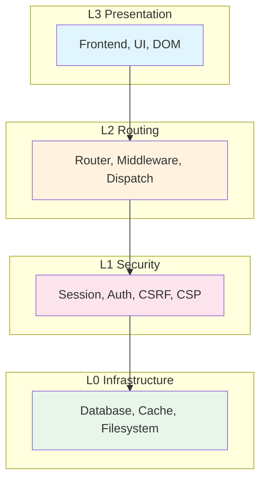

# Development Standards for CoreMusic ELECTRONICS

**Zorunlu Bağlantılar:** [[brain.md]] · [[architecture/03-contracts/project-structure]] · [[architecture/03-contracts/shared-library]] · [[architecture/03-contracts/enterprise-architecture-rules]] · [[decisions/accepted/ADR-001-vanilla-js-itcss]] · [[decisions/accepted/ADR-002-pdo-mandatory-no-orm]]

---

## 1. Amaç

CoreMusic ELECTRONICS geliştirme süreçlerinde kullanılacak mühendislik standartlarını ve en iyi uygulamaları tanımlayan SSOT dokümanıdır.

---

## 2. Mimari Desenler

### 2.1 SOLID İlkeleri

| İlke | Tanım | Uygulama |
|------|-------|----------|
| Single Responsibility | Tek sorumluluk prensibi | Her sınıfın tek bir sorumluluğu olmalı |
| Open/Closed | Açık/kapalı prensibi | Yeni özellikler mevcut kodu değiştirmeden eklenmeli |
| Liskov Substitution | Yerine koyma prensibi | Alt sınıflar üst sınıfların yerine kullanılabilmeli |
| Interface Segregation | Arayüz ayrımı prensibi | Büyük arayüzler küçük parçalara ayrılmalı |
| Dependency Inversion | Bağımlılık tersi prensibi | Üst seviyeler alt seviyelere bağımlı olmamalı |

### 2.2 Clean Architecture



**Bağımlılık Kuralları:**
- ✅ L3→L2, L2→L1, L1→L0: İzinli
- ❌ L0→L2/L3, L1→L3, L3→L0: Yasak (Layer Violation)

### 2.3 Hexagonal Architecture

| Kavram | Tanım |
|--------|-------|
| Port | Dış dünya ile iletişim noktası |
| Adapter | Port'u uygulayan somut sınıf |
| Domain | İş mantığı (merkez) |
| Application | Domain'i kullanan servisler |

### 2.4 Onion Architecture

| Katman | İçerik |
|--------|--------|
| Merkez | Domain Entity'leri |
| 1. Katman | Domain Interface'leri |
| 2. Katman | Application Service'leri |
| 3. Katman | Infrastructure |
| 4. Katman | UI/Adapter |

### 2.5 Domain-Driven Design (DDD)

| Kavram | Tanım | Örnek |
|--------|-------|-------|
| Entity | Kimlik ile tanımlanan nesne | User, Track |
| Value Object | Değer ile tanımlanan nesne | Email, Money |
| Aggregate | Tutarlılık sınırı | UserAggregate |
| Domain Event | İş olayı | UserCreated |
| Repository | Veri erişim soyutlaması | UserRepository |
| Domain Service | İş mantığı servisi | TransferService |

### 2.6 CQRS

| Kavram | Tanım |
|--------|-------|
| Command | Durum değiştiren işlem | 
| Query | Durum sorgulayan işlem |
| Command Model | Write model |
| Query Model | Read model |

### 2.7 Event Driven Architecture

| Kavram | Tanım |
|--------|-------|
| Publish-Subscribe | Olay yayma-abone modeli |
| Event Sourcing | Olay kaynaklama |
| Message Queue | Mesaj kuyruğu |
| Event Store | Olay deposu |

---

## 3. İsimlendirme Standartları

### 3.1 PHP (PSR-12)

| Unsur | Kural | Örnek |
|-------|-------|-------|
| Sınıf | PascalCase | `UserController` |
| Yöntem | camelCase | `getUserById()` |
| Değişken | camelCase | `$userName` |
| Sabit | UPPER_SNAKE_CASE | `MAX_RETRY` |
| Dosya | PascalCase | `UserController.php` |
| Namespace | PSR-4 | `CoreMusic\Auth\Controller` |

### 3.2 JavaScript

| Unsur | Kural | Örnek |
|-------|-------|-------|
| Sınıf | PascalCase | `ThemeManager` |
| Yöntem | camelCase | `getTheme()` |
| Değişken | camelCase | `themeName` |
| Sabit | UPPER_SNAKE_CASE | `MAX_RETRIES` |
| Dosya | kebab-case | `theme-manager.js` |

### 3.3 C++

| Unsur | Kural | Örnek |
|-------|-------|-------|
| Sınıf | PascalCase | `AudioEngine` |
| Yöntem | camelCase | `processAudio()` |
| Değişken | camelCase | `sampleRate` |
| Sabit | UPPER_SNAKE_CASE | `MAX_CHANNELS` |
| Dosya | snake_case | `audio_engine.cpp` |

### 3.4 CSS

| Unsur | Kural | Örnek |
|-------|-------|-------|
| Sınıf | BEM | `player__button--active` |
| Değişken | --kebab-case | `--color-primary` |
| Dosya | snake_case | `01_Settings/variables.css` |

---

## 4. Klasör Yapısı

```
src/
├── Domain/              # İş mantığı
│   ├── Entity/
│   ├── ValueObject/
│   ├── Event/
│   └── Service/
├── Application/         # Uygulama mantığı
│   ├── Command/
│   ├── Query/
│   └── Service/
├── Infrastructure/      # Altyapı
│   ├── Database/
│   ├── Cache/
│   └── Filesystem/
├── Presentation/        # Sunum katmanı
│   ├── Controller/
│   └── View/
└── Shared/              # Paylaşılan
    ├── Auth/
    ├── Security/
    └── Http/
```

---

## 5. Dil Bazlı Kodlama Standartları

### 5.1 PHP

| Kural | Değer | ADR |
|-------|-------|-----|
| strict_types=1 | Her dosyada zorunlu | — |
| PSR-12 | Kodlama standartı | — |
| Constructor Injection | Bağımlılık enjeksiyonu | — |
| PHP 8.4+ | Minimum versiyon | [[ADR-042-vault-restructuring-2026-08-03]] |
| ORM Yasak | Sadece PDO prepared | [[ADR-002-pdo-mandatory-no-orm]] |
| SELECT * Yasak | Açık sütun listesi | [[ADR-002-pdo-mandatory-no-orm]] |

### 5.2 JavaScript

| Kural | Değer | ADR |
|-------|-------|-----|
| Vanilla ES6+ | Framework yasak | [[ADR-001-vanilla-js-itcss]] |
| const/let | var yasak | — |
| async/await | Promise tabanlı | — |
| DOMParser+TrustedTypes | innerHTML yasak | — |
| AbortController | İstek iptali | — |
| `#` private | Özel alanlar | — |

### 5.3 C++

| Kural | Değer |
|-------|-------|
| C++20 | Minimum standart |
| noexcept | ASIO callback için zorunlu |
| constexpr | Buffer boyutları için |
| alignas(64) | Cache-line hizalaması |
| [[nodiscard]] | Dönüş değeri kontrolü |
| Zero-allocation | Audio thread'de heap yasak |
| Lock-free | Audio thread'de mutex yasak |

### 5.4 CSS

| Kural | Değer | ADR |
|-------|-------|-----|
| ITCSS 7-layer | Katmanlı yapı | [[ADR-001-vanilla-js-itcss]] |
| BEM+BEMIT | İsimlendirme | — |
| Custom Properties | CSS değişkenleri | — |
| main.css | Sadece 01-07 katmanları | — |

### 5.5 TypeScript

| Kural | Değer |
|-------|-------|
| strict mode | Strict type checking |
| interfaces | Arayüz tanımları |
| generics | Genel tipler |
| no any | any kullanımı yasak |

---

## 6. Kod İnceleme Kuralları

| Kural | Değer |
|-------|-------|
| Zorunlu inceleme | Merge öncesi kod incelemesi |
| Güvenlik incelemesi | Hassas kod için zorunlu |
| Performans incelemesi | Hot path için zorunlu |
| Coverage kontrolü | ≥%80 coverage zorunlu |
| ADR uyumluluğu | ADR kontrolleri |

---

## 7. Refaktörleme Kuralları

| Teknik | Tanım | Koşul |
|--------|-------|-------|
| Extract Method | Metot ayırma | Test ile |
| Extract Class | Sınıf ayırma | Test ile |
| Rename | Yeniden adlandırma | Test ile |
| Move | Taşıma | Test ile |
| Inline | Satır içine alma | Test ile |

**Kural:** Tüm refaktörleme işlemleri test eşliğinde yapılmalıdır.

---

## 8. Çapraz Referanslar

| Bölüm | Hedef | İlişki |
|-------|-------|--------|
| § 2.2 Clean Architecture | [[architecture/l0-infrastructure]] | L0-L3 katmanları |
| § 5.1 PHP | [[ADR-002-pdo-mandatory-no-orm]] | PDO kuralları |
| § 5.2 JavaScript | [[ADR-001-vanilla-js-itcss]] | Framework yasağı |
| § 5.4 CSS | [[ADR-001-vanilla-js-itcss]] | ITCSS standartı |
| § 1.2 Mimari | [[brain.md]] §5 | Mimari kararlar |

---

## 9. Quality Report

| Metrik | Değer |
|--------|-------|
| Version | 1.0.0 |
| Status | Red Team · Human Mode · Truth Mode verified |
| Sections | 9 |
| Architectural Patterns | 7 |
| Language Standards | 5 |
| Review Rules | 5 |
| Refactoring Rules | 5 |
| ADR References | 4 |
| Cross References | 5 |

---

**Authority:** Bayram Ali / Vault Steward
**Last Updated:** 2026-08-09
**Mode:** Red Team · Human Mode · Truth Mode
