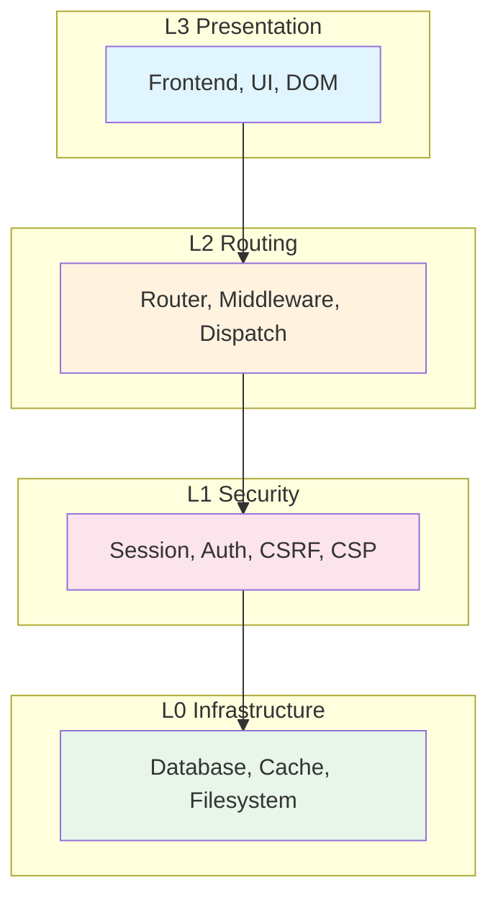

# Development Standards for CoreMusic ELECTRONICS

**Zorunlu Bağlantılar:** [[brain.md]] · [[architecture/03-contracts/project-structure]] · [[architecture/03-contracts/shared-library]] · [[architecture/03-contracts/enterprise-architecture-rules]] · [[decisions/accepted/ADR-001-vanilla-js-itcss]] · [[decisions/accepted/ADR-002-pdo-mandatory-no-orm]]

---

## 1. Amaç

CoreMusic ELECTRONICS geliştirme süreçlerinde kullanılacak mühendislik standartlarını ve en iyi uygulamaları tanımlayan SSOT dokümanıdır.

---

## 2. Mimari Desenler

### 2.1 SOLID İlkeleri

| İlke | Tanım | Uygulama |
|------|-------|----------|
| Single Responsibility | Tek sorumluluk prensibi | Her sınıfın tek bir sorumluluğu olmalı |
| Open/Closed | Açık/kapalı prensibi | Yeni özellikler mevcut kodu değiştirmeden eklenmeli |
| Liskov Substitution | Yerine koyma prensibi | Alt sınıflar üst sınıfların yerine kullanılabilmeli |
| Interface Segregation | Arayüz ayrımı prensibi | Büyük arayüzler küçük parçalara ayrılmalı |
| Dependency Inversion | Bağımlılık tersi prensibi | Üst seviyeler alt seviyelere bağımlı olmamalı |

### 2.2 Clean Architecture



**Bağımlılık Kuralları:**
- ✅ L3→L2, L2→L1, L1→L0: İzinli
- ❌ L0→L2/L3, L1→L3, L3→L0: Yasak (Layer Violation)

### 2.3 Hexagonal Architecture

| Kavram | Tanım |
|--------|-------|
| Port | Dış dünya ile iletişim noktası |
| Adapter | Port'u uygulayan somut sınıf |
| Domain | İş mantığı (merkez) |
| Application | Domain'i kullanan servisler |

### 2.4 Onion Architecture

| Katman | İçerik |
|--------|--------|
| Merkez | Domain Entity'leri |
| 1. Katman | Domain Interface'leri |
| 2. Katman | Application Service'leri |
| 3. Katman | Infrastructure |
| 4. Katman | UI/Adapter |

### 2.5 Domain-Driven Design (DDD)

| Kavram | Tanım | Örnek |
|--------|-------|-------|
| Entity | Kimlik ile tanımlanan nesne | User, Track |
| Value Object | Değer ile tanımlanan nesne | Email, Money |
| Aggregate | Tutarlılık sınırı | UserAggregate |
| Domain Event | İş olayı | UserCreated |
| Repository | Veri erişim soyutlaması | UserRepository |
| Domain Service | İş mantığı servisi | TransferService |

### 2.6 CQRS

| Kavram | Tanım |
|--------|-------|
| Command | Durum değiştiren işlem | 
| Query | Durum sorgulayan işlem |
| Command Model | Write model |
| Query Model | Read model |

### 2.7 Event Driven Architecture

| Kavram | Tanım |
|--------|-------|
| Publish-Subscribe | Olay yayma-abone modeli |
| Event Sourcing | Olay kaynaklama |
| Message Queue | Mesaj kuyruğu |
| Event Store | Olay deposu |

---

## 3. İsimlendirme Standartları

### 3.1 PHP (PSR-12)

| Unsur | Kural | Örnek |
|-------|-------|-------|
| Sınıf | PascalCase | `UserController` |
| Yöntem | camelCase | `getUserById()` |
| Değişken | camelCase | `$userName` |
| Sabit | UPPER_SNAKE_CASE | `MAX_RETRY` |
| Dosya | PascalCase | `UserController.php` |
| Namespace | PSR-4 | `CoreMusic\Auth\Controller` |

### 3.2 JavaScript

| Unsur | Kural | Örnek |
|-------|-------|-------|
| Sınıf | PascalCase | `ThemeManager` |
| Yöntem | camelCase | `getTheme()` |
| Değişken | camelCase | `themeName` |
| Sabit | UPPER_SNAKE_CASE | `MAX_RETRIES` |
| Dosya | kebab-case | `theme-manager.js` |

### 3.3 C++

| Unsur | Kural | Örnek |
|-------|-------|-------|
| Sınıf | PascalCase | `AudioEngine` |
| Yöntem | camelCase | `processAudio()` |
| Değişken | camelCase | `sampleRate` |
| Sabit | UPPER_SNAKE_CASE | `MAX_CHANNELS` |
| Dosya | snake_case | `audio_engine.cpp` |

### 3.4 CSS

| Unsur | Kural | Örnek |
|-------|-------|-------|
| Sınıf | BEM | `player__button--active` |
| Değişken | --kebab-case | `--color-primary` |
| Dosya | snake_case | `01_Settings/variables.css` |

---

## 4. Klasör Yapısı

```
src/
├── Domain/              # İş mantığı
│   ├── Entity/
│   ├── ValueObject/
│   ├── Event/
│   └── Service/
├── Application/         # Uygulama mantığı
│   ├── Command/
│   ├── Query/
│   └── Service/
├── Infrastructure/      # Altyapı
│   ├── Database/
│   ├── Cache/
│   └── Filesystem/
├── Presentation/        # Sunum katmanı
│   ├── Controller/
│   └── View/
└── Shared/              # Paylaşılan
    ├── Auth/
    ├── Security/
    └── Http/
```

---

## 5. Dil Bazlı Kodlama Standartları

### 5.1 PHP

| Kural | Değer | ADR |
|-------|-------|-----|
| strict_types=1 | Her dosyada zorunlu | — |
| PSR-12 | Kodlama standartı | — |
| Constructor Injection | Bağımlılık enjeksiyonu | — |
| PHP 8.4+ | Minimum versiyon | [[ADR-042-vault-restructuring-2026-08-03]] |
| ORM Yasak | Sadece PDO prepared | [[ADR-002-pdo-mandatory-no-orm]] |
| SELECT * Yasak | Açık sütun listesi | [[ADR-002-pdo-mandatory-no-orm]] |

### 5.2 JavaScript

| Kural | Değer | ADR |
|-------|-------|-----|
| Vanilla ES6+ | Framework yasak | [[ADR-001-vanilla-js-itcss]] |
| const/let | var yasak | — |
| async/await | Promise tabanlı | — |
| DOMParser+TrustedTypes | innerHTML yasak | — |
| AbortController | İstek iptali | — |
| `#` private | Özel alanlar | — |

### 5.3 C++ (Genel)

| Kural | Değer |
|-------|-------|
| C++20 | Minimum standart |
| noexcept | ASIO callback için zorunlu |
| constexpr | Buffer boyutları için |
| alignas(64) | Cache-line hizalaması |
| [[nodiscard]] | Dönüş değeri kontrolü |
| Zero-allocation | Audio thread'de heap yasak |
| Lock-free | Audio thread'de mutex yasak |

### 5.3.1 C++ Real-Time Audio (Web-Verified: Timur Doumler, Ross Bencina, ADC 2021-2026)

**Audio Thread'de ❌ YASAK (Web-Verified):**

| Yasak | Neden | Kaynak |
|-------|-------|--------|
| `malloc()` / `free()` | Heap allocation non-deterministic, OS allocator lock kullanır | Ross Bencina |
| `new` / `delete` | Same as malloc/free | Timur Doumler |
| `std::vector::push_back` | Heap reallocation tetikler | Niccolo Abate |
| `std::mutex::lock()` | Thread'i bloklar, priority inversion | Timur Doumler ADC'20 |
| `std::mutex::try_lock()` | unlock() system call tetikler, RT-safe değil | Timur Doumler |
| `std::lock_guard` / `std::unique_lock` | RAII destructor unlock çağırır | Timur Doumler |
| `std::condition_variable` | System call | C++20 RT-Safe spec |
| `throw` / `catch` | Unwind info runtime'da生成 (MSVC 32-bit) | Timur Doumler |
| File I/O | Unbounded latency | Ross Bencina |
| `printf` / `DBG()` | I/O + allocation | Niccolo Abate |
| Virtual function calls | Vtable indirection, potential allocation | Ross Bencina |
| `std::string` operations | Heap allocation | C++ STL |
| `std::any`, `std::variant`, `std::optional` (with non-trivial types) | Type erasure = allocation | Timur Doumler |

**Audio Thread'de ✅ İZİN (Web-Verified):**

| İzni | Neden | Kaynak |
|------|-------|--------|
| `std::atomic<T>` | Single atomic instruction, no lock | C++ Standard |
| `std::atomic::is_always_lock_free` | Static assertion, compile-time check | Timur Doumler |
| `alignas(64)` / `alignas(std::hardware_destructive_interference_size)` | False sharing prevention | Ross Bencina |
| `constexpr` | Compile-time computation, zero runtime cost | David Cruz Anaya |
| `std::array<T, N>` | Stack allocation, no heap | C++ Standard |
| `std::span<T>` | Zero-cost view, no copy, no allocation | C++20 |
| `std::optional<T>` | Clean lock-free queue API | David Cruz Anaya |
| `std::reference_wrapper` | No allocation | C++ Standard |
| `juce::SpinLock` (with `try_lock` only) | Single atomic op, but measure CPU waste | Timur Doumler |
| Progressive back-off spinlock | `_mm_pause()` stages, low energy | Timur Doumler ADC'20 |
| Lock-free SPSC ring buffer | Single-producer single-consumer, no mutex | Ross Bencina |
| Immutable data structures | Thread-safe by design, no locks needed | Timur Doumler |
| Stack-allocated `static_vector` | Fixed capacity, no heap | David Stone P0843 |
| SIMD intrinsics (SSE2/AVX2/NEON) | Hardware-level parallel, no allocation | Standard |

**Memory Order Best Practices (Web-Verified):**

| Kullanım | Doğru Memory Order | Yanlış |
|----------|-------------------|--------|
| Parameter update (fire-and-forget) | `memory_order_relaxed` | `memory_order_seq_cst` |
| Data publish (producer→consumer) | `memory_order_release` (write) + `memory_order_acquire` (read) | `memory_order_relaxed` for both |
| Flag synchronization | `memory_order_release` / `memory_order_acquire` pair | Mixed orders |
| Spinlock try_lock | `memory_order_acquire` | `memory_order_relaxed` |
| Spinlock unlock | `memory_order_release` | `memory_order_relaxed` |

**Progressive Back-Off Spinlock Stages (Timur Doumler ADC'20):**

```
Stage 1: Single _mm_pause() — ~39ns per iteration
Stage 2: 10x _mm_pause() — ~350ns per iteration (1% overhead)
Stage 3: std::this_thread::yield() — scheduler hint
Loop: Stage 1 → Stage 2 → Stage 3 → Stage 2 → ...
```

**Pre-Allocated Memory Strategy:**

| Teknik | Açıklama | Kaynak |
|--------|----------|--------|
| Pre-allocate all buffers | Audio thread starts with all memory ready | Ross Bencina |
| `std::pmr::monotonic_buffer_resource` | Pre-allocated pool, RT-safe until exhausted | Timur Doumler |
| `std::pmr::unsynchronized_pool_resource` | Single-threaded pool from pre-allocated buffer | Timur Doumler |
| Stack-allocated fixed buffers | `std::array` or `static_vector` | David Stone |
| `mlock()` / `VirtualLock()` | Prevent page-out to disk | Ross Bencina |

### 5.3.2 XMOS Firmware Standards (Web-Verified: XMOS Documentation v6.0.1)

| Kural | Değer | Kaynak |
|-------|-------|--------|
| Language | XC (XMOS C extension) + C | XMOS lib_i2s v6.0.1 |
| Threading | Hardware threads (xcore), 8-16 cores | XMOS XU316 datasheet |
| I2S Master Clock | 24.576 MHz (48kHz) veya 22.5792 MHz (44.1kHz) | XMOS lib_xua v5.5.0 |
| I2S Bit Clock | MCLK / (sample_rate × channels × bits) | XMOS lib_i2s |
| I2S Data Bits | 32-bit (default) | XMOS AN00162 |
| I2S Channels Per Frame | 2 (stereo) veya TDM mode'da 8+ | XMOS lib_i2s |
| TDM | No formal spec, manufacturer-dependent | XMOS documentation |
| Port Types | 1-bit ports, 32-bit buffered | XMOS lib_xua |
| Clock Blocks | 2 required (bit-clock + master-clock) | XMOS lib_xua |
| I2C Configuration | Remote I2C for DAC/ADC config | XMOS AN00162 |
| Board Support | `lib_board_support` for XK-AUDIO-316-MC | XMOS AN00162 |
| Build System | XCommon CMake | XMOS lib_i2s |
| XC Tools | 15.3.1 or later | XMOS AN00162 |
| Sample Rates | 44.1kHz, 48kHz, 96kHz, 192kHz | XMOS lib_i2s |
| Buffer Size | 32-bit buffered ports | XMOS lib_xua |

**XMOS I2S Configuration Pattern (Web-Verified):**

```c
// Master clock frequency
#define MASTER_CLOCK_FREQUENCY  24576000  // 24.576 MHz for 48kHz
#define SAMPLE_FREQUENCY        192000
#define DATA_BITS               32
#define CHANS_PER_FRAME         2
#define NUM_I2S_LINES           4

// I2S config
i2s_config.mclk_bclk_ratio = (MASTER_CLOCK_FREQUENCY / 
    (SAMPLE_FREQUENCY * CHANS_PER_FRAME * DATA_BITS));
i2s_config.mode = I2S_MODE_I2S;  // or I2S_MODE_LEFT_JUSTIFIED
```

### 5.3.3 JUCE Audio Engine Standards (Web-Verified: JUCE 9, ADC 2026)

| Kural | Değer | Kaynak |
|-------|-------|--------|
| Framework | JUCE 9.0.0 (AGPL/commercial) | JUCE 9 release |
| C++ Standard | C++20 minimum | JUCE CMake |
| Audio Device | `AudioDeviceManager` | JUCE API |
| Audio Callback | `AudioIODeviceCallback::processBlock()` | JUCE API |
| Parameter System | `AudioProcessorValueTreeState` (APVTS) | JUCE best practice |
| Thread Safety | `std::atomic` for shared parameters | JUCE documentation |
| Lock-Free | `AbstractFifo` for inter-thread communication | JUCE API |
| Denormals | `ScopedNoDenormals` in processBlock | JUCE best practice |
| Buffer Sizes | 64-1024 samples (128 recommended) | JUCE community |
| Sample Rates | 44.1kHz, 48kHz, 96kHz, 192kHz | JUCE API |
| Plugin Formats | VST3, AU, AAX, CLAP, LV2, Standalone | JUCE 8+ |
| DSP Module | `juce::dsp` (IIR, FIR, FFT, convolution) | JUCE API |
| Build System | CMake 3.22+ | JUCE 9 |
| Cross-Platform | Windows, macOS, Linux, iOS, Android | JUCE |

**JUCE processBlock Best Practices (Web-Verified):**

```cpp
void processBlock(juce::AudioBuffer<float>& buffer, 
                  juce::MidiBuffer& midiMessages) override
{
    juce::ScopedNoDenormals noDenormals;  // Prevent denormal numbers
    
    // 1. Check if processing needs update (cached atomic)
    if (mustUpdateProcessing.load(std::memory_order_acquire))
        update();
    
    // 2. Read parameters from cached atomic pointers (lock-free)
    float drive = driveParam->load(std::memory_order_relaxed);
    float mix = mixParam->load(std::memory_order_relaxed);
    
    // 3. Sub-block processing (32 samples for smooth coefficient updates)
    constexpr int blockSize = 32;
    for (int start = 0; start < numSamples; start += blockSize) {
        int blockEnd = juce::jmin(start + blockSize, numSamples);
        // Process block...
    }
}
```

**JUCE Latency Targets (Web-Verified):**

| API | Platform | Round-Trip Latency | Buffer Size |
|-----|----------|-------------------|-------------|
| ASIO | Windows | 2-10ms | 32-256 |
| CoreAudio | macOS | 5-15ms | 64-512 |
| WASAPI Exclusive | Windows | 10-30ms | 128-1024 |
| ALSA | Linux | 15-50ms | 256-2048 |
| JACK | Linux | 3-15ms | 64-512 |

### 5.4 CSS

| Kural | Değer | ADR |
|-------|-------|-----|
| ITCSS 9-layer | Katmanlı yapı | [[ADR-001-vanilla-js-itcss]] |
| BEM+BEMIT | İsimlendirme | — |
| Custom Properties | CSS değişkenleri | — |
| main.css | Sadece 01-07 katmanları | — |

### 5.5 TypeScript

| Kural | Değer |
|-------|-------|
| strict mode | Strict type checking |
| interfaces | Arayüz tanımları |
| generics | Genel tipler |
| no any | any kullanımı yasak |

---

## 6. Kod İnceleme Kuralları

| Kural | Değer |
|-------|-------|
| Zorunlu inceleme | Merge öncesi kod incelemesi |
| Güvenlik incelemesi | Hassas kod için zorunlu |
| Performans incelemesi | Hot path için zorunlu |
| Coverage kontrolü | ≥%80 coverage zorunlu |
| ADR uyumluluğu | ADR kontrolleri |

---

## 7. Refaktörleme Kuralları

| Teknik | Tanım | Koşul |
|--------|-------|-------|
| Extract Method | Metot ayırma | Test ile |
| Extract Class | Sınıf ayırma | Test ile |
| Rename | Yeniden adlandırma | Test ile |
| Move | Taşıma | Test ile |
| Inline | Satır içine alma | Test ile |

**Kural:** Tüm refaktörleme işlemleri test eşliğinde yapılmalıdır.

---

## 8. Electronics Development Constraints

### 8.1 Hardware-Software Interface Rules

| Kural | Değer | ADR |
|-------|-------|-----|
| PHP ↔ C++ | API layer üzerinden iletişim, doğrudan调用 yasak | [[ADR-039-7-service-platform-architecture]] |
| PCM3168A | 6-in/8-out codec, 24-bit, SNR 112dB (DAC) | [[ADR-038-8.1-sound-card-chip-selection]] |
| PCM5122 | ❌ REDDEDİLMİŞ — 8.1 surround için yetersiz (H001) | [[ADR-038-8.1-sound-card-chip-selection]] |
| XMOS XU316 | 16-core, 3200 MIPS, USB Audio Class 2.0 | [[ADR-017-dsp-hardware-mode]] |
| ASIO Buffer | 512 sample varsayılan (64-1024 arası) | [[brain.md]] §8 |
| Sample Rate | 48kHz standart | [[brain.md]] §19 |
| Sample Format | 32-bit float (Float32) | [[brain.md]] §19 |

### 8.2 Real-Time Thread Budget

| Bileşen | Max Süre | Açıklama |
|---------|----------|----------|
| Audio callback | 10.67ms (512 samples @ 48kHz) | ASIO deadline |
| DSP processing | <5ms | Callback içinde |
| Parameter update | <1μs | Atomic load |
| Lock-free queue | <100ns | SPSC ring buffer |
| I2S transfer | Hardware-managed | XMOS DMA |

### 8.3 Platform-Specific Rules

| Platform | Kural | Değer |
|----------|-------|-------|
| Windows | ASIO Exclusive Lock | Aynı anda sadece tek uygulama |
| Windows | WASAPI Fallback | ASIO yoksa |
| Linux | ALSA/PipeWire | Tier 2 destek |
| macOS | CoreAudio | Tier 3 destek |
| RPi5 | I2S + XMOS | Tier 4, donanım entegrasyonu |

### 8.4 Testing Standards for Electronics

| Test Türü | Kapsam | Framework | Min Coverage |
|-----------|--------|-----------|-------------|
| Unit Test | DSP functions, EQ, compressor | Google Test | ≥80% |
| Integration Test | I2S/TDM, USB Audio | Google Test + Hardware | ≥70% |
| Hardware-in-Loop | PCM3168A, XMOS XU316 | Custom test rig | All critical paths |
| Latency Test | ASIO/WASAPI round-trip | LatencyMon / custom | <10ms |
| Stress Test | 8.1 surround, all channels | Custom | 24h continuous |

---

## 9. Çapraz Referanslar

| Bölüm | Hedef | İlişki |
|-------|-------|--------|
| § 2.2 Clean Architecture | [[architecture/l0-infrastructure]] | L0-L3 katmanları |
| § 5.1 PHP | [[ADR-002-pdo-mandatory-no-orm]] | PDO kuralları |
| § 5.2 JavaScript | [[ADR-001-vanilla-js-itcss]] | Framework yasağı |
| § 5.3.1 C++ RT Audio | [[ADR-017-dsp-hardware-mode]] | XMOS, JUCE |
| § 5.3.2 XMOS | [[ADR-038-8.1-sound-card-chip-selection]] | PCM3168A, H001 |
| § 5.3.3 JUCE | [[ADR-017-dsp-hardware-mode]] | Audio engine |
| § 5.4 CSS | [[ADR-001-vanilla-js-itcss]] | ITCSS standartı |
| § 8.1 HW-SW Interface | [[ADR-039-7-service-platform-architecture]] | 7 servis |
| § 1.2 Mimari | [[brain.md]] §5 | Mimari kararlar |

---

## 10. Quality Report

| Metrik | Değer |
|--------|-------|
| Version | 2.0.0 |
| Status | Red Team · Human Mode · Truth Mode verified |
| Sections | 10 |
| Architectural Patterns | 7 |
| Language Standards | 8 (PHP, JS, C++ genel, C++ RT audio, XMOS, JUCE, CSS, TS) |
| Review Rules | 5 |
| Refactoring Rules | 5 |
| Electronics Constraints | 4 |
| ADR References | 8 |
| Cross References | 9 |
| Web-Verified Sources | 3 (Timur Doumler, Ross Bencina, XMOS Docs) |

---

**Authority:** Bayram Ali / Vault Steward
**Last Updated:** 2026-08-10
**Mode:** Red Team · Human Mode · Truth Mode
