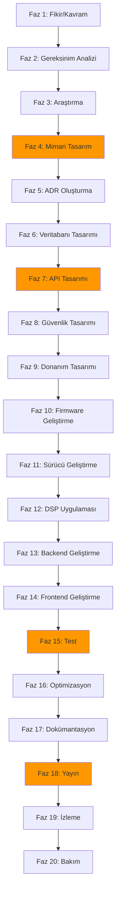

# 20-Phase Development Workflow for CoreMusic ELECTRONICS

**Zorunlu Bağlantılar:** [[WORKFLOW.md]] · [[ai/ai-workflow]] · [[architecture/03-contracts/project-structure]] · [[architecture/03-contracts/shared-library]] · [[decisions/accepted/ADR-007-cache-namespace]]

---

## 1. Amaç

CoreMusic ELECTRONICS geliştirme sürecinin 20 fazlı yaşam döngüsünü tanımlayan standarttır. Her fazın girdileri, çıktıları, sorumlu ajanları ve kalite kapıları belirlenmiştir.

---

## 2. 20 Fazlı Yaşam Döngüsü

---

## 3. Faz Detayları

### Faz 1: Fikir/Kavram

| Alan | Değer |
|------|-------|
| Girdi | Kullanıcı isteği, piyasa ihtiyacı |
| Çıktı | Fikir beyanı, ön fizibilite |
| Sorumlu | Tüm ajanlar |
| Kalite Kapısı | — |
| Tahmini Süre | 1-2 gün |

### Faz 2: Gereksinim Analizi

| Alan | Değer |
|------|-------|
| Girdi | Fikir beyanı |
| Çıktı | Fonksiyonel olmayan gereksinimler dokümanı |
| Sorumlu | Backend Architect, Security Engineer |
| Kalite Kapısı | — |
| Tahmini Süre | 2-3 gün |

### Faz 3: Araştırma

| Alan | Değer |
|------|-------|
| Girdi | Gereksinimler |
| Çıktı | Araştırma raporu, bileşen listesi |
| Sorumlu | Embedded Engineer, Data Engineer |
| Kalite Kapısı | — |
| Tahmini Süre | 3-5 gün |

### Faz 4: Mimari Tasarım → ✅ HARD GATE

| Alan | Değer |
|------|-------|
| Girdi | Araştırma raporu |
| Çıktı | Mimari tasarım dokümanı |
| Sorumlu | Master Orchestrator |
| Kalite Kapısı | **HARD GATE** — İnsan onayı zorunlu |
| Tahmini Süre | 5-7 gün |

**Kurallar:**
- [[decisions/accepted/ADR-007-cache-namespace]] uyarınca kod yazmadan önce plan zorunlu
- Mimari onay olmadan sonraki fazlara geçilemez
- Layer Violation kontrolü zorunlu

### Faz 5: ADR Oluşturma

| Alan | Değer |
|------|-------|
| Girdi | Mimari tasarım |
| Çıktı | ADR dokümanı (Draft) |
| Sorumlu | İsteyen ajan |
| Kalite Kapısı | — |
| Tahmini Süre | 1-2 gün |

### Faz 6: Veritabanı Tasarımı

| Alan | Değer |
|------|-------|
| Girdi | Gereksinimler, ADR |
| Çıktı | BCNF şema tasarımı |
| Sorumlu | Data Engineer |
| Kalite Kapısı | — |
| Tahmini Süre | 2-3 gün |

**Kurallar:**
- [[decisions/accepted/ADR-002-pdo-mandatory-no-orm]] — ORM yasak
- [[decisions/accepted/ADR-040-database-authority]] — BCNF zorunlu
- SELECT * yasak, açık sütun listesi zorunlu

### Faz 7: API Tasarımı → ✅ HARD GATE

| Alan | Değer |
|------|-------|
| Girdi | Gereksinimler, ADR, şema |
| Çıktı | API tasarım dokümanı |
| Sorumlu | Backend Architect |
| Kalite Kapısı | **HARD GATE** — İnsan onayı zorunlu |
| Tahmini Süre | 3-5 gün |

### Faz 8: Güvenlik Tasarımı

| Alan | Değer |
|------|-------|
| Girdi | Gereksinimler, API tasarımı |
| Çıktı | Güvenlik tasarım dokümanı |
| Sorumlu | Security Engineer |
| Kalite Kapısı | — |
| Tahmini Süre | 2-3 gün |

**Kurallar:**
- [[decisions/accepted/ADR-010-csrf-protection-strategy]] — csrf_token zorunlu
- [[decisions/accepted/ADR-011-session-management]] — Session yönetimi
- [[decisions/accepted/ADR-022-database-hardened-security]] — Şifreleme standartları

### Faz 9: Donanım Tasarımı

| Alan | Değer |
|------|-------|
| Girdi | Gereksinimler, mimari |
| Çıktı | Donanım tasarım dokümanı, PCB şeması |
| Sorumlu | Audio Hardware Engineer |
| Kalite Kapısı | — |
| Tahmini Süre | 5-10 gün |

### Faz 10: Firmware Geliştirme

| Alan | Değer |
|------|-------|
| Girdi | Donanım tasarımı, gereksinimler |
| Çıktı | Firmware kodu |
| Sorumlu | DSP Firmware Engineer |
| Kalite Kapısı | — |
| Tahmini Süre | 10-20 gün |

### Faz 11: Sürücü Geliştirme

| Alan | Değer |
|------|-------|
| Girdi | Donanım tasarımı, OS gereksinimleri |
| Çıktı | Sürücü kodu |
| Sorumlu | Windows Software Engineer |
| Kalite Kapısı | — |
| Tahmini Süre | 10-15 gün |

### Faz 12: DSP Uygulaması

| Alan | Değer |
|------|-------|
| Girdi | Gereksinimler, donanım |
| Çıktı | DSP zincir kodu |
| Sorumlu | Embedded Engineer |
| Kalite Kapısı | — |
| Tahmini Süre | 10-15 gün |

### Faz 13: Backend Geliştirme

| Alan | Değer |
|------|-------|
| Girdi | API tasarımı, şema |
| Çıktı | Backend kodu |
| Sorumlu | Backend Architect |
| Kalite Kapısı | — |
| Tahmini Süre | 15-25 gün |

### Faz 14: Frontend Geliştirme

| Alan | Değer |
|------|-------|
| Girdi | UI tasarımı, API |
| Çıktı | Frontend kodu |
| Sorumlu | UI Designer |
| Kalite Kapısı | — |
| Tahmini Süre | 15-25 gün |

### Faz 15: Test → ✅ HARD GATE

| Alan | Değer |
|------|-------|
| Girdi | Tüm kod |
| Çıktı | Test sonuçları, coverage raporu |
| Sorumlu | QA Engineer |
| Kalite Kapısı | **HARD GATE** — ≥%80 coverage zorunlu |
| Tahmini Süre | 5-10 gün |

**Kurallar:**
- Minimum %80 coverage zorunlu
- Hedef %90 coverage
- Regression test zorunlu

### Faz 16: Optimizasyon

| Alan | Değer |
|------|-------|
| Girdi | Test edilmiş kod |
| Çıktı | Optimize edilmiş kod |
| Sorumlu | Embedded Engineer, Backend Architect |
| Kalite Kapısı | — |
| Tahmini Süre | 3-5 gün |

### Faz 17: Dokümantasyon

| Alan | Değer |
|------|-------|
| Girdi | Tüm kod ve tasarım |
| Çıktı | API dokümanı, kullanıcı rehberi |
| Sorumlu | Tüm ajanlar |
| Kalite Kapısı | — |
| Tahmini Süre | 3-5 gün |

### Faz 18: Yayın → ✅ HARD GATE

| Alan | Değer |
|------|-------|
| Girdi | Tüm dokümanlar ve kod |
| Çıktı | Yayın paketi |
| Sorumlu | DevOps Engineer |
| Kalite Kapısı | **HARD GATE** — İnsan onayı zorunlu |
| Tahmini Süre | 1-2 gün |

### Faz 19: İzleme

| Alan | Değer |
|------|-------|
| Girdi | Yayınlanmış sistem |
| Çıktı | İzleme raporları |
| Sorumlu | DevOps Engineer |
| Kalite Kapısı | — |
| Tahmini Süre | Sürekli |

### Faz 20: Bakım

| Alan | Değer |
|------|-------|
| Girdi | İzleme verileri |
| Çıktı | Bakım görevleri |
| Sorumlu | Tüm ajanlar |
| Kalite Kapısı | — |
| Tahmini Süre | Sürekli |

---

## 4. Hard Gate Kuralları

| Faz | Hard Gate | Açıklama | İhlal Sonucu |
|-----|-----------|----------|-------------|
| Faz 4 | Mimari Tasarım | İnsan onayı zorunlu | Kod revert edilir |
| Faz 7 | API Tasarımı | İnsan onayı zorunlu | Kod revert edilir |
| Faz 15 | Test | ≥%80 coverage zorunlu | Yayın durdurulur |
| Faz 18 | Yayın | İnsan onayı zorunlu | Yayın iptal edilir |

---

## 5. Temel Prensipler

| Prensipl | Açıklama | ADR |
|----------|----------|-----|
| Kod Yazmadan Önce Plan | Plan onayı olmadan kod yasağı | [[ADR-007-cache-namespace]] |
| Dokümantasyon Önce | Koddan önce doküman yazılır | — |
| Test Önce | Koddan önce test yazılır | — |
| Zero Hallucination | Doğrulanamayan bilgi → `VERIFICATION REQUIRED` | [[ADR-005-ultrathink-protocol]] |

---

## 6. Çapraz Referanslar

| Bölüm | Hedef | İlişki |
|-------|-------|--------|
| § 2 20 Faz | [[WORKFLOW.md]] §6 | Ürün yaşam döngüsü |
| § 3.4 Mimari | [[ADR-007-cache-namespace]] | Zero Code Before Plan |
| § 3.6 Veritabanı | [[ADR-040-database-authority]] | BCNF otoritesi |
| § 3.8 Güvenlik | [[ADR-010-csrf-protection-strategy]] | CSRF koruması |
| § 4 Hard Gates | [[ADR-007-cache-namespace]] | Onay mekanizması |

---

## 7. Quality Report

| Metrik | Değer |
|--------|-------|
| Version | 1.0.0 |
| Status | Red Team · Human Mode · Truth Mode verified |
| Sections | 7 |
| Total Phases | 20 |
| Hard Gates | 4 |
| Core Principles | 4 |
| ADR References | 4 |
| Cross References | 5 |

---

**Authority:** Bayram Ali / Vault Steward
**Last Updated:** 2026-08-09
**Mode:** Red Team · Human Mode · Truth Mode
