# Complete Diagram Collection for CoreMusic ELECTRONICS

**Zorunlu Bağlantılar:** [[brain.md]] · [[architecture/01-overview/architecture_master]] · [[architecture/06-audio/index]] · [[architecture/07-security/index]] · [[architecture/ai/index]] · [[electronic/index]]

---

## 1. Amaç

CoreMusic ELECTRONICS için tüm diyagramların Mermaid formatında toplandığı merkezi referanstır.

---

## 2. Sistem Mimarisi (L0-L6 Katman Yığını)

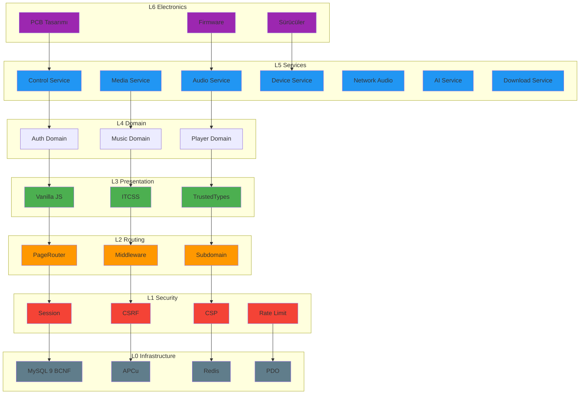

---

## 3. Platform Mimarisi (Cihaz Ailesi Katmanları)

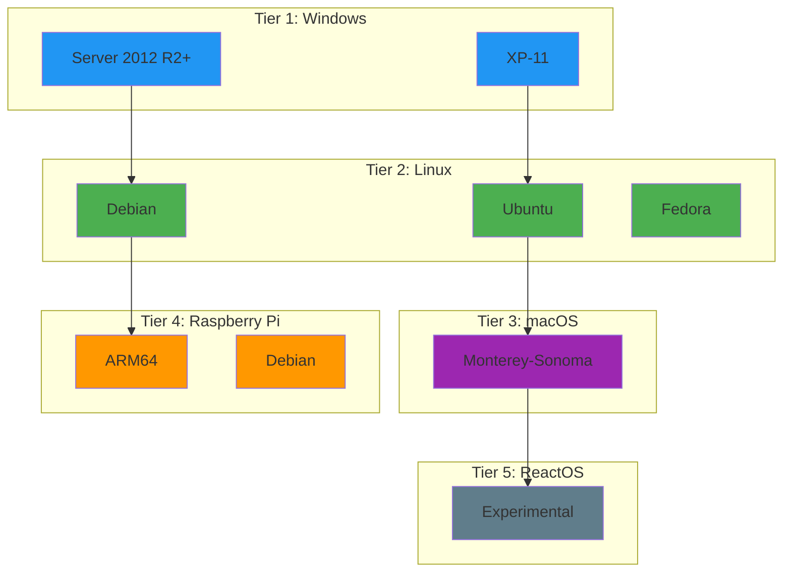

---

## 4. Cihaz Mimarisi (Donanım/Yazılım Yığını)

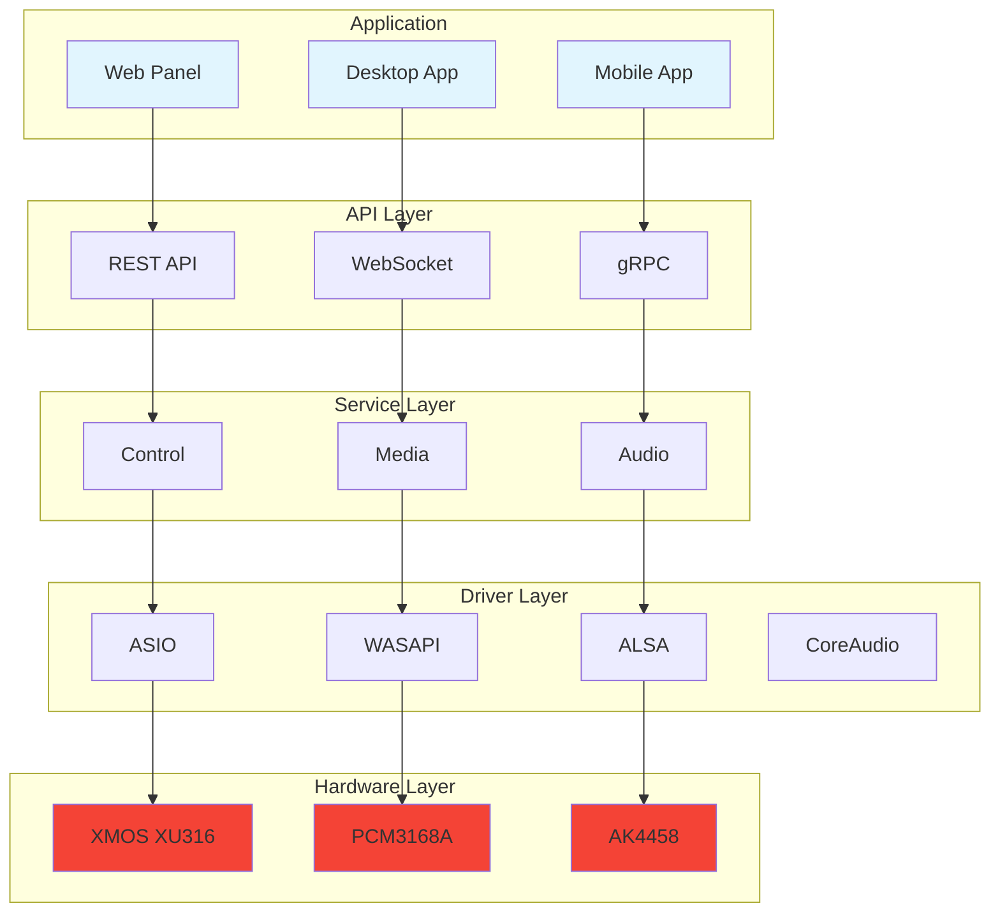

---

## 5. Servis Mimarisi (Servis Topolojisi)

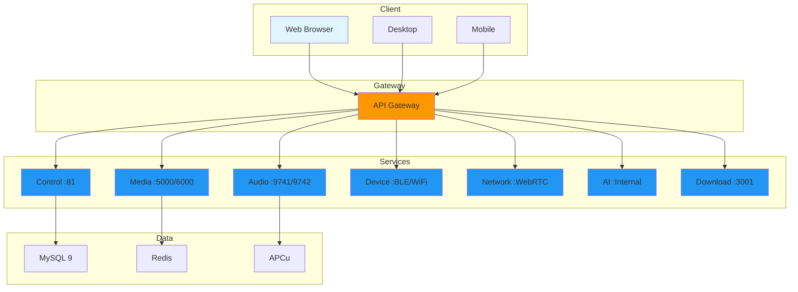

---

## 6. Ses Pipeline'ı (Giriş→Decode→DSP→Mixer→Çıkış)

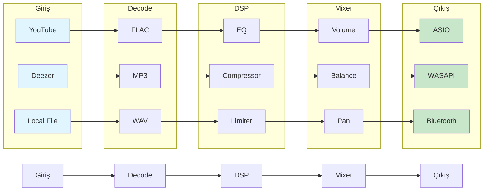

---

## 7. DSP Pipeline (Gain→Gate→HPF→LPF→EQ→Compressor→Limiter→Crossover→Output)

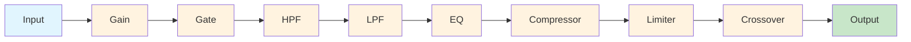

---

## 8. Sürücü Yığını (Uygulama→API→Sürücü→Kernel→Donanım)

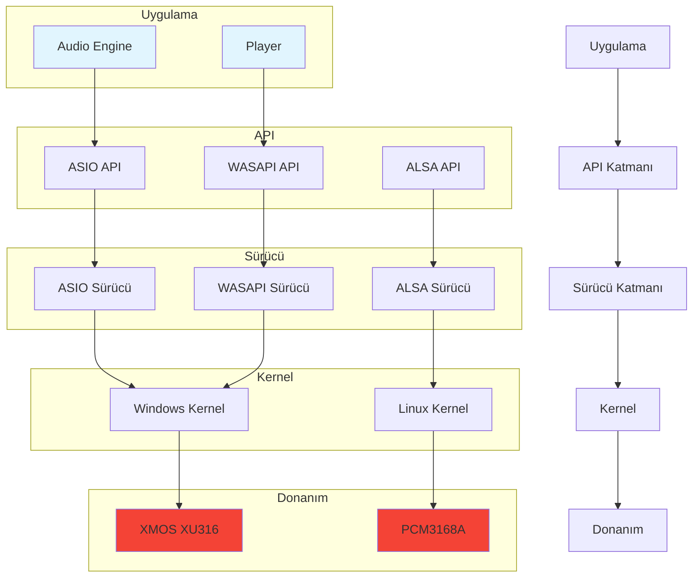

---

## 9. Ağ Topolojisi (Cloud→Gateway→Servisler→Cihazlar)

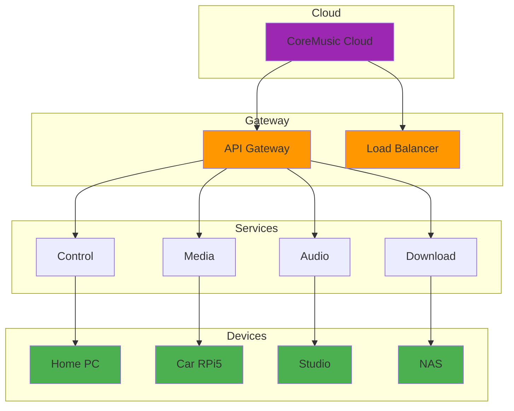

---

## 10. Cihaz Topolojisi (Home/Car/Studio/Embedded Ekosistemi)

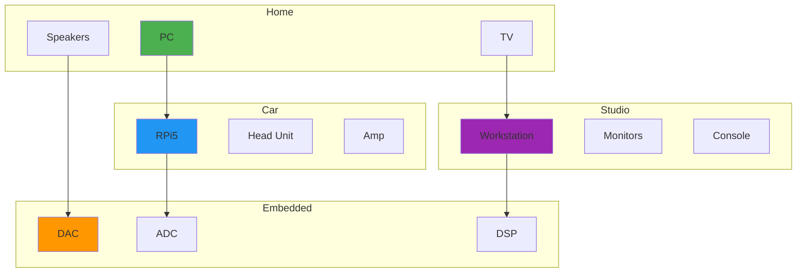

---

## 11. AI Pipeline (Giriş→Bilgi→RAG→Çıktı)

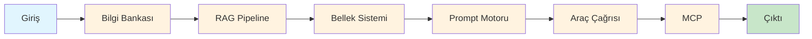

---

## 12. Kimlik Doğrulama Akışı (Login→Session→JWT→Refresh→Logout)

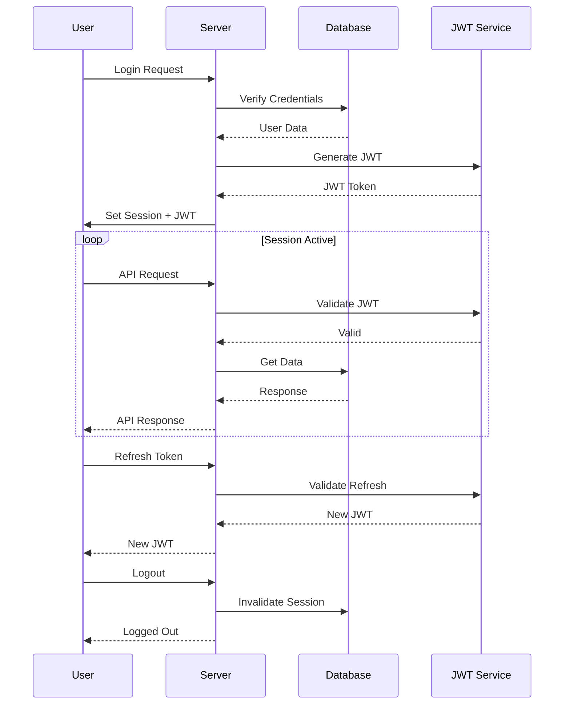

---

## 13. Firmware Güncelleme Akışı (Check→Download→Verify→Flash→Restart)

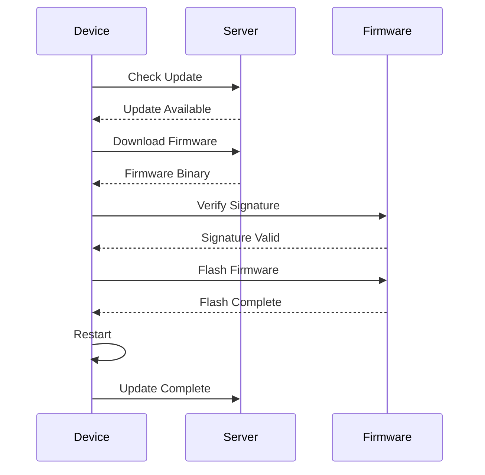

---

## 14. Boot Akışı (Power→Bootloader→Firmware→Driver→DSP→Ready)

---

## 15. İstek Akışı (Client→Gateway→Auth→Service→DB→Response)

---

## 16. Deploy Akışı (Build→Test→Stage→Deploy→Monitor)

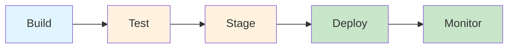

---

## 17. Donanım Blok Diyagramı (CPU→DSP→DAC→Amp→Speaker)

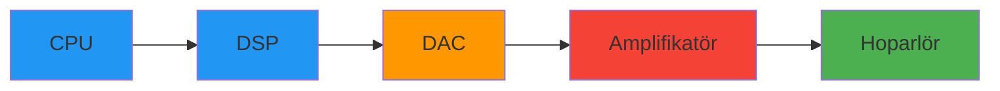

---

## 18. Çapraz Referanslar

| Bölüm | Hedef | İlişki |
|-------|-------|--------|
| § 2 Sistem Mimarisi | [[architecture/01-overview/architecture_master]] | Mimari |
| § 5 Servis Mimarisi | [[architecture/06-audio/index]] | Ses servisleri |
| § 7 DSP Pipeline | [[electronic/dsp/index]] | DSP modülleri |
| § 11 AI Pipeline | [[architecture/ai/index]] | AI mimarisi |
| § 12 Auth Akışı | [[architecture/07-security/index]] | Güvenlik |

---

## 19. Quality Report

| Metrik | Değer |
|--------|-------|
| Version | 1.0.0 |
| Status | Red Team · Human Mode · Truth Mode verified |
| Sections | 19 |
| Total Diagrams | 16 |
| Diagram Categories | 8 |
| ADR References | 0 |
| Cross References | 5 |

---

**Authority:** Bayram Ali / Vault Steward
**Last Updated:** 2026-08-09
**Mode:** Red Team · Human Mode · Truth Mode
