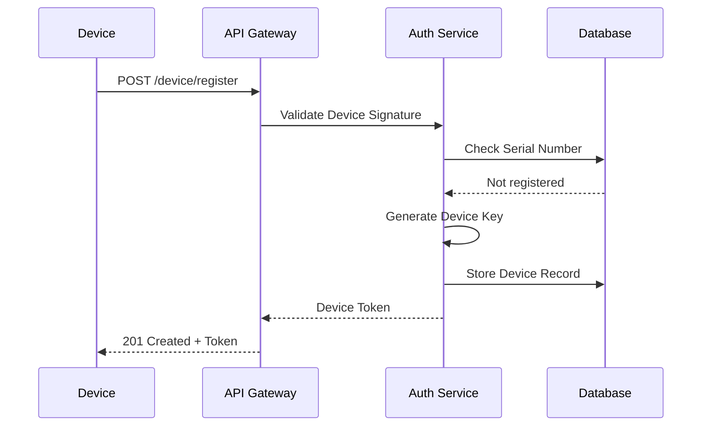

# CoreMusic — Device Authentication

**See also:** [[architecture/07-security/index]] · [[electronic/index]]

---

## 1. Amaç

Device Authentication, CoreMusic ELECTRONICS cihazlarının sisteme güvenli bir şekilde bağlanmasını ve kimlik doğrulamasını yönetir.

---

## 2. Device Registration Flow



---

## 3. Device Identity

| Alan | Tür | Açıklama |
|------|-----|----------|
| device_id | UUID | Benzersiz cihaz kimliği |
| serial_number | VARCHAR | Üretici seri numarası |
| device_type | ENUM | amplifier, interface, player |
| hardware_revision | VARCHAR | Donanım revizyonu |
| firmware_version | VARCHAR | Mevcut firmware |
| driver_version | VARCHAR | Mevcut driver |

---

## 4. Authentication Methods

| Yöntem | Kullanım | Güvenlik |
|--------|----------|----------|
| API Key | IoT cihazları | Orta |
| Device Certificate | Yüksek güvenlik | Yüksek |
| HMAC Signature | IPC iletişim | Yüksek |
| JWT Token | Servisler arası | Yüksek |

---

## 5. Device Token Lifecycle

```
Device Register
    ↓
Token Al (24 saat)
    ↓
API Kullan
    ↓
Token Yenile (1 saat kala)
    ↓
Kullanım
    ↓
Token Süresi Doldu → Yeniden Register
```

---

## 6. Device Authorization

| Yetki | Açıklama |
|-------|----------|
| device:read | Cihaz bilgisi okuma |
| device:write | Cihaz konfigürasyonu |
| firmware:update | Firmware güncelleme |
| dsp:configure | DSP parametreleri |
| audio:play | Ses oynatma |
| telemetry:send | Telemetri veri gönderme |

---

## 7. Trust Chain

```
Root CA (CoreMusic)
    ↓
Intermediate CA
    ↓
Device Certificate
    ↓
Service Token
    ↓
API Access
```

---

## 8. Security Policies

| Politika | Değer |
|----------|-------|
| Token TTL | 24 saat |
| Refresh Window | 1 saat |
| Max Failed Attempts | 5 |
| Lockout Duration | 30 dakika |
| Rate Limit | 10 req/s per device |
| TLS Required | Evet (min 1.2) |

---

## 9. ADR Referansları

| ADR | Konu |
|-----|------|
| [[ADR-011-session-management]] | Session yönetimi |

---

## 10. Çapraz Referanslar

| Kaynak | Hedef | İlişki |
|--------|-------|--------|
| Device Auth | [[architecture/08-auth/index]] | Auth mimarisi |
| Device Auth | [[electronic/index]] | Cihaz ekosistemi |
| Device Auth | [[architecture/07-security/session-management]] | Session yönetimi |

---

**Authority:** Bayram Ali / Vault Steward
**Last Updated:** 2026-08-09
**Mode:** Red Team · Human Mode · Truth Mode
