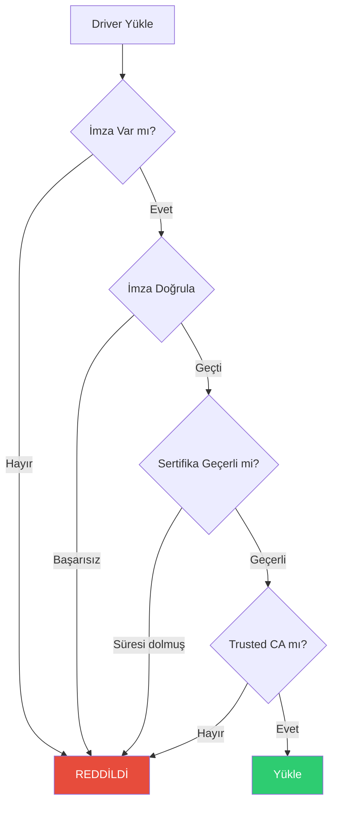

# CoreMusic — Driver Signing

**See also:** [[architecture/07-security/index]] · [[electronic/drivers/index]] · [[ADR-022-database-hardened-security]]

---

## 1. Amaç

Driver Signing, CoreMusic ELECTRONICS sürücülerinin yalnızca imzalı ve doğrulanmış olarak yüklenmesini sağlar. Yetkisiz veya değiştirilmiş sürücülerin yüklenmesi engellenir.

---

## 2. Driver Signing Akışı

```
Driver Geliştirme
    ↓
Test & QA
    ↓
Code Signing (Private Key)
    ↓
Digital Certificate
    ↓
Driver Package
    ↓
Installation
    ↓
OS Verification (Public Key)
    ↓
Yükleme / Red
```

---

## 3. İmza Standartları

| OS | İmza Türü | Araç |
|----|-----------|------|
| Windows | EV Code Signing | signtool.exe |
| Windows (Kernel) | WHQL + Attestation | WDK |
| macOS | Apple Developer ID | codesign |
| Linux | Module Signing | sign-file |

---

## 4. Windows Driver Signing

### Gereksinimler

| Gereksinim | Açıklama |
|------------|----------|
| EV Certificate | Extended Validation Code Signing |
| WHQL | Windows Hardware Quality Labs |
| Attestation | Kernel-mode driver signing |
| Dashboard | Microsoft Partner Center |

### Süreç

```powershell
# Driver imzalama
signtool sign /v /ac GlobalSignRootCA.crt /fd sha256 /tr http://timestamp.digicert.com /td sha256 /d "CoreMusic Audio Driver" /du "https://coremusic.net" coremusic-audio.sys
```

---

## 5. Linux Module Signing

```bash
# Module imzalama
sign-file sha256 certs/signing_key.pem certs/signing_key.x509 coremusic.ko
```

### Konfigürasyon

| Parametre | Değer |
|-----------|-------|
| CONFIG_MODULE_SIG |=y |
| CONFIG_MODULE_SIG_FORCE |=y |
| CONFIG_MODULE_SIG_SHA256 |=y |

---

## 6. Güvenlik Kuralları

| Kural | Açıklama |
|-------|----------|
| Imzasız sürücü yasak | Tüm driver'lar imzalı olmalı |
| Debug modunda bypass | Sadece development ortamında |
| Key rotation | Yılda 1 kez |
| Revocation | Compromised key iptal |
| Audit log | Tüm yükleme kayıtları |

---

## 7. Driver Verification Flow



---

## 8. CoreMusic Driver İmza Gereksinimleri

| Driver | OS | İmza | Zorunlu |
|--------|-----|------|---------|
| ASIO Driver | Windows | EV Code Signing + WHQL | ✅ |
| WASAPI Driver | Windows | EV Code Signing | ✅ |
| WDM Driver | Windows | WHQL | ✅ |
| ALSA Module | Linux | Module Signing | ✅ |
| CoreAudio Plugin | macOS | Developer ID | ✅ |
| Virtual Audio | Tümü | OS-specific | ✅ |

---

## 9. ADR Referansları

| ADR | Konu |
|-----|------|
| [[ADR-022-database-hardened-security]] | Şifreleme |
| [[ADR-017-dsp-hardware-mode]] | DSP sürücüleri |

---

## 10. Çapraz Referanslar

| Kaynak | Hedef | İlişki |
|--------|-------|--------|
| Driver Signing | [[electronic/drivers/index]] | Driver framework |
| Driver Signing | [[electronic/firmware/index]] | Firmware imzası |
| Driver Signing | [[architecture/07-security/index]] | Genel güvenlik |

---

**Authority:** Bayram Ali / Vault Steward
**Last Updated:** 2026-08-09
**Mode:** Red Team · Human Mode · Truth Mode
