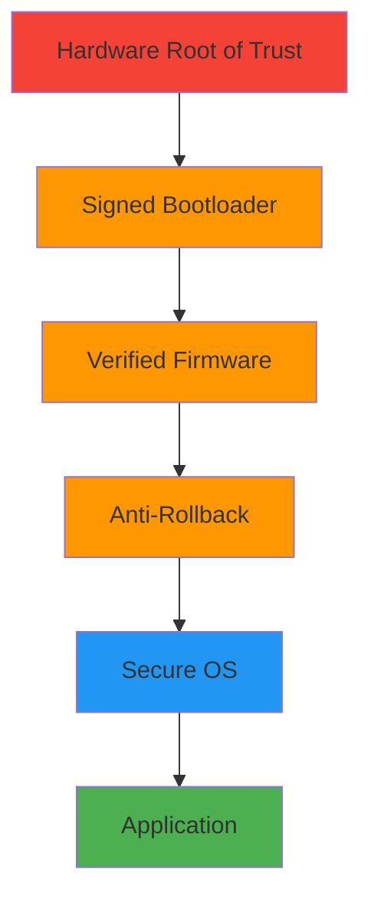

# Electronics Security for CoreMusic ELECTRONICS

**Zorunlu Bağlantılar:** [[architecture/07-security/index]] · [[architecture/07-security/secure-boot]] · [[architecture/07-security/driver-signing]] · [[architecture/07-security/encryption]] · [[architecture/07-security/encryption-layers]] · [[architecture/07-security/device-auth]] · [[decisions/accepted/ADR-022-database-hardened-security]] · [[decisions/accepted/ADR-010-csrf-protection-strategy]]

---

## 1. Amaç

CoreMusic ELECTRONICS donanım ve gömülü cihazlara özgü güvenlik standartlarını tanımlayan SSOT dokümanıdır.

---

## 2. Güvenli Boot Zinciri

### 2.1 Secure Boot Aşamaları

| Aşama | İşlem | Doğrulama |
|-------|-------|-----------|
| 1 | Hardware Root of Trust | Fuse-based key |
| 2 | Signed Bootloader | RSA-2048/Ed25519 |
| 3 | Verified Firmware | Imza doğrulama |
| 4 | Anti-Rollback | Versiyon kontrolü |
| 5 | Secure OS | Kernel integrity |
| 6 | Application | Code signing |

---

## 3. Firmware İmzalama

| Özellik | Değer |
|---------|-------|
| Algoritma | RSA-2048 veya Ed25519 |
| İmza Doğrulama | Boot'ta imza kontrolü |
| Anahtar Yönetimi | HSM veya Secure Element |
| Anahtar Saklama | Fuse-based veya TPM |

---

## 4. Sürücü İmzalama

| Platform | Yöntem | Zorunluluk |
|----------|-------|------------|
| Windows | WHQL Sertifikası | Zorunlu |
| Linux | Kernel Module Signing | Önerilen |
| macOS | kext Signing | Zorunlu |

---

## 5. Cihaz Kimlik Doğrulama

| Özellik | Değer |
|---------|-------|
| Cihaz Sertifikaları | X.509 tabanlı |
| Güvenli Eşleştirme | ECDH key exchange |
| Karşılıklı Doğrulama | Mutual TLS |

---

## 6. İletişim Güvenliği

| Protokol | Kullanım Alanı |
|----------|---------------|
| TLS 1.3 | Tüm ağ iletişimi |
| mTLS | Servisler arası |
| Certificate Pinning | Mobil uygulamalar |
| Şifreli Yerel Depolama | Hassas veriler |

---

## 7. Veri Güvenliği

| Özellik | Değer | ADR |
|---------|-------|-----|
| Şifreleme | AES-256-GCM | [[ADR-022-database-hardened-security]] |
| Güvenli Anahtar Saklama | TPM, Secure Element | — |
| Şifreli Firmware | Imza + şifreleme | — |
| Hassas Veri | `[REDACTED]` ile loglama | [[ADR-022-database-hardened-security]] |

---

## 8. Fiziksel Güvenlik

| Özellik | Tanım |
|---------|-------|
| Tahrifat Algılama | Tamper detection |
| Güvenli Debug | JTAG koruması |
| Fuse-based Anahtar | Hardware key storage |
| Debug Port Koruması | Devre dışı bırakma |

---

## 9. OTA Güvenliği

| Özellik | Tanım |
|---------|-------|
| İmzalı Güncellemeler | RSA-2048/Ed25519 |
| Şifreli İletişim | TLS 1.3 |
| Rollback Koruması | Anti-rollback mekanizması |
| Aşamalı Yayınlama | Staged rollout |
| Kill Switch | Acil durdurma |

---

## 10. Erişim Kontrolü

| Özellik | Tanım |
|---------|-------|
| Asgari Ayrıcalık | Least privilege |
| Rol Bazlı Erişim | Role-based device access |
| API Anahtarı Yönetimi | Key rotation |
| Cihaz Bazlı Rate Limiting | Per-device limits |

---

## 11. Güvenlik İzleme

| Özellik | Tanım |
|---------|-------|
| Sızıntı Algılama | Intrusion detection |
| Anomali Tespiti | Anomaly detection |
| Audit Loglama | Audit logging |
| Olay Müdahalesi | Incident response |

---

## 12. OWASP Top 10:2025 (Gömülü Sistemler için Uyarlanmış)

| # | Zafiyet | Önlem |
|---|---------|-------|
| A01 | Broken Access Control (SSRF dahil) | Rol bazlı erişim, URL allowlist |
| A02 | Security Misconfiguration | Secure defaults, hardened config |
| A03 | Software Supply Chain Failures | Dependency scanning, SBOM |
| A04 | Cryptographic Failures | AES-256-GCM, code signing |
| A05 | Injection | Prepared statement, input validation |
| A06 | Insecure Design | Security by design, threat modeling |
| A07 | Authentication Failures | MFA, rate limiting, account lockout |
| A08 | Software or Data Integrity Failures | Code signing, CI integrity |
| A09 | Security Logging & Alerting Failures | Audit trail, real-time alerting |
| A10 | Mishandling of Exceptional Conditions | Error handling, graceful degradation |

---

## 13. Çapraz Referanslar

| Bölüm | Hedef | İlişki |
|-------|-------|--------|
| § 2 Secure Boot | [[architecture/07-security/secure-boot]] | Güvenli boot |
| § 3 Firmware İmzalama | [[architecture/07-security/driver-signing]] | İmzalama |
| § 7 Veri Güvenliği | [[ADR-022-database-hardened-security]] | Şifreleme |
| § 12 OWASP | [[architecture/07-security/security/owasp-compliance]] | OWASP kontrolü |
| § 10 Erişim Kontrolü | [[ADR-010-csrf-protection-strategy]] | CSRF koruması |

---

## 14. Quality Report

| Metrik | Değer |
|--------|-------|
| Version | 1.0.0 |
| Status | Red Team · Human Mode · Truth Mode verified |
| Sections | 14 |
| Security Categories | 10 |
| OWASP Items | 10 |
| ADR References | 2 |
| Cross References | 5 |

---

**Authority:** Bayram Ali / Vault Steward
**Last Updated:** 2026-08-09
**Mode:** Red Team · Human Mode · Truth Mode
