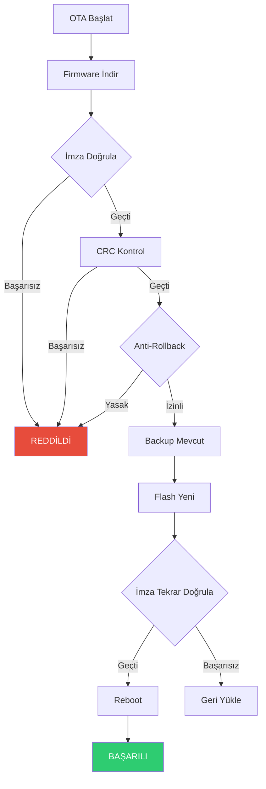

# CoreMusic — Secure Boot & Firmware Signing

**See also:** [[architecture/07-security/index]] · [[ADR-022-database-hardened-security]] · [[electronic/firmware/index]]

---

## 1. Amaç

Secure Boot ve Firmware Signing, CoreMusic ELECTRONICS cihazlarının yalnızca imzalı ve güvenilir firmware ile açılmasını sağlayan güvenlik mekanizmalarıdır.

---

## 2. Secure Boot Zinciri

```
ROM Bootloader (Read-Only)
    ↓ Signature Verify
Primary Bootloader
    ↓ Signature Verify
Secondary Bootloader (OTA capable)
    ↓ Signature Verify
Application Firmware
    ↓ Runtime Checks
Device Operation
```

---

## 3. İmza Algoritması

| Parametre | Değer |
|-----------|-------|
| Algoritma | RSA-2048 veya ECDSA-P256 |
| Hash | SHA-256 |
| Key Storage | Hardware Security Module (HSM) veya TPM |
| Key Rotation | Yılda 1 veya compromise durumunda |

---

## 4. Firmware Image Format

```
┌─────────────────────────────┐
│        Header (64 bytes)    │
│  - Magic: "CMFW"           │
│  - Version: 1.2.3          │
│  - Size: 512KB             │
│  - Timestamp: 2026-08-09   │
│  - Device Type: rpi5       │
├─────────────────────────────┤
│     Firmware Payload        │
│  (ELF/Binary)              │
├─────────────────────────────┤
│     Signature (256 bytes)   │
│  (RSA/ECDSA)               │
├─────────────────────────────┤
│     CRC32 (4 bytes)         │
└─────────────────────────────┘
```

---

## 5. Güvenlik Katmanları

| Katman | KorumA | ADR |
|--------|--------|-----|
| ROM Bootloader | Salt okunur, değişmez | — |
| Primary Bootloader | İmza doğrulama | [[ADR-022]] |
| Secure Boot | Yetkisiz firmware engeli | [[ADR-022]] |
| Anti-Rollback | Eski sürüme geçiş engeli | — |
| Encrypted Flash | Şifreli firmware depolama | [[ADR-022]] |
| Tamper Detection | Fiziksel erişim algılama | — |

---

## 6. Anti-Rollback Mekanizması

```
Mevcut Firmware: v2.1.0
    ↓
Yeni Firmware: v2.2.0 → Install
    ↓
Geri Dönüş Denemesi: v2.0.0 → REDDEDİLDİ
    ↓
Güvenli Mod: v2.1.0 veya v2.2.0
```

| Kural | Açıklama |
|-------|----------|
| Version Counter | Flash'da saklanan sayaç |
| Monotonic | Sadece yukarı yönlü |
| Emergency | v1.0.0 her zaman erişilebilir (recovery) |

---

## 7. OTA Güvenlik Akışı



---

## 8. Key Management

| Anahtar | Kullanım | Saklama |
|---------|----------|---------|
| Private Key | Firmware imzalama | HSM / Air-gapped |
| Public Key | İmza doğrulama | Her cihazda |
| Device Key | Cihaz kimliği | TPM / Secure Element |
| Session Key | İletişim şifreleme | RAM (volatile) |

---

## 9. Recovery Modu

| Durum | Recovery |
|-------|----------|
| Boot başarısız | Emergency firmware (v1.0.0) |
| Flash hatası | USB DFU modu |
| Korupt firmware | Serial recovery |
| Bricked | JTAG/SWD debug |

---

## 10. ADR Referansları

| ADR | Konu |
|-----|------|
| [[ADR-022-database-hardened-security]] | Şifreleme standartları |
| [[ADR-038-8.1-sound-card-chip-selection]] | XMOS secure boot |

---

## 11. Çapraz Referanslar

| Kaynak | Hedef | İlişki |
|--------|-------|--------|
| Secure Boot | [[electronic/firmware/index]] | Firmware mimarisi |
| Secure Boot | [[electronic/hardware/index]] | Donanım güvenliği |
| Secure Boot | [[architecture/07-security/index]] | Genel güvenlik |

---

**Authority:** Bayram Ali / Vault Steward
**Last Updated:** 2026-08-09
**Mode:** Red Team · Human Mode · Truth Mode
