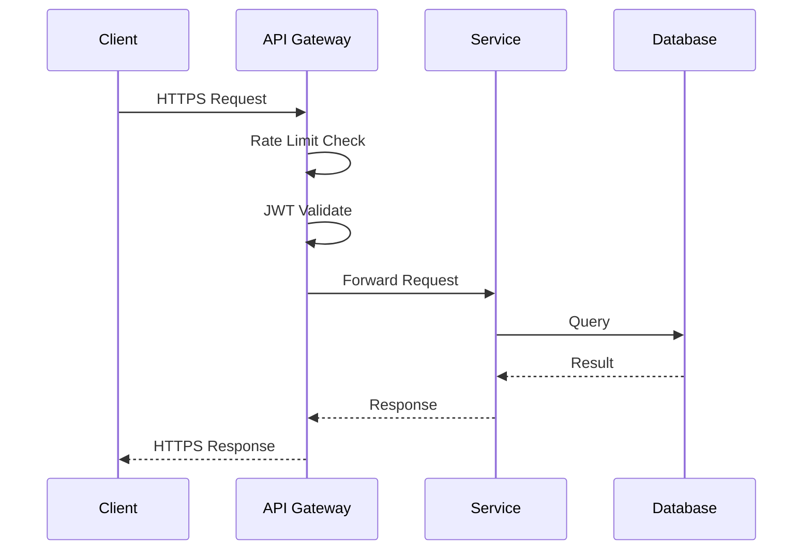

# CoreMusic — HTTP/HTTPS Protocol

**See also:** [[architecture/10-network/index]] · [[architecture/03-contracts/api-architecture-master]]

---

## 1. Amaç

HTTP/HTTPS, CoreMusic platformunun temel iletişim protokolüdür. REST API, web sayfaları ve dosya transferi HTTP üzerinden yapılır.

---

## 2. HTTP Stack

```
Client (Browser / Mobile / Desktop)
    ↓
HTTPS (TLS 1.3)
    ↓
API Gateway (Rate Limit, Auth, Routing)
    ↓
Microservice (Auth, Media, Device, etc.)
    ↓
Database / Cache / File System
```

---

## 3. HTTPS Konfigürasyonu

| Parametre | Değer |
|-----------|-------|
| TLS Version | 1.3 (minimum 1.2) |
| Cipher Suite | AES-256-GCM, ChaCha20 |
| Certificate | Let's Encrypt / Custom CA |
| HSTS | max-age=31536000; includeSubDomains |
| OCSP Stapling | Aktif |
| HTTP/2 | Aktif |

---

## 4. HTTP Headers (Security)

| Header | Değer | ADR |
|--------|-------|-----|
| Strict-Transport-Security | max-age=31536000 | [[ADR-022]] |
| X-Content-Type-Options | nosniff | — |
| X-Frame-Options | DENY | — |
| X-XSS-Protection | 0 | — |
| Content-Security-Policy | nonce-based, strict-dynamic | [[ADR-012]] |
| Referrer-Policy | strict-origin-when-cross-origin | — |
| Permissions-Policy | camera=(), microphone=() | — |

---

## 5. REST API Standartları

| Kural | Değer |
|-------|-------|
| Versioning | URL-based (/v1/, /v2/) |
| Naming | kebab-case (/user-profiles) |
| Response | JSON only |
| Pagination | cursor-based |
| Filtering | query params (?sort=name&order=asc) |
| Rate Limit | 60 req/60s (APCu) |

Detay: [[architecture/03-contracts/api-design-rules]]

---

## 6. HTTP Status Codes

| Code | Kullanım |
|------|----------|
| 200 | Başarılı |
| 201 | Oluşturuldu |
| 204 | İçerik yok (删除成功) |
| 400 | Kötü istek |
| 401 | Yetkisiz |
| 403 | Yasak |
| 404 | Bulunamadı |
| 409 | Çakışma |
| 422 | İşlenemedi |
| 429 | Çok fazla istek |
| 500 | Sunucu hatası |
| 503 | Bakım |

---

## 7. Request/Response Flow



---

## 8. Caching Strategy

| Layer | TTL | Kullanım |
|-------|-----|----------|
| Client Cache | 60s | Static assets |
| CDN Cache | 1h | Public API |
| Gateway Cache | 5min | Auth cache |
| Service Cache | 15min | Business data |
| Database Cache | — | Query cache |

---

## 9. Error Handling

```json
{
    "error": {
        "code": "VALIDATION_ERROR",
        "message": "Invalid email format",
        "details": [
            {
                "field": "email",
                "message": "Must be a valid email address"
            }
        ],
        "request_id": "req_abc123",
        "timestamp": "2026-08-09T12:00:00Z"
    }
}
```

---

## 10. ADR Referansları

| ADR | Konu |
|-----|------|
| [[ADR-012-csp-nonce-strict-dynamic]] | CSP header |
| [[ADR-013-rate-limiting-apcu]] | Rate limiting |
| [[ADR-020-api-public-security]] | API güvenlik |
| [[ADR-022-database-hardened-security]] | TLS |

---

**Authority:** Bayram Ali / Vault Steward
**Last Updated:** 2026-08-09
**Mode:** Red Team · Human Mode · Truth Mode
