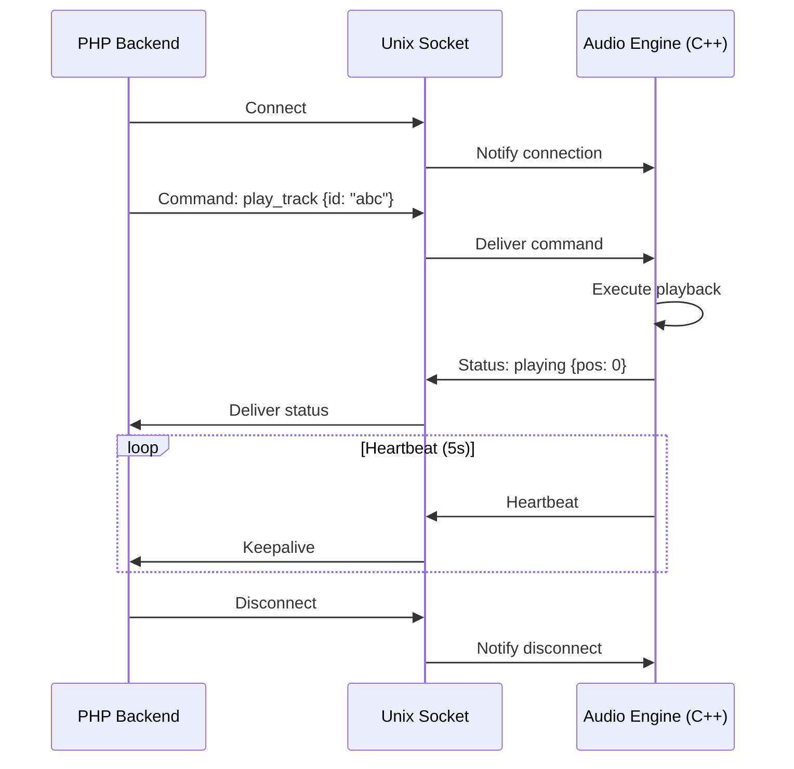

# CoreMusic — Local Socket & Unix Socket

**See also:** [[architecture/10-network/index]] · [[architecture/l6-electronics]]

---

## 1. Amaç

Local Socket ve Unix Socket, CoreMusic platformunun aynı makinedeki process'ler arası düşük gecikmeli iletişimini sağlar. Özellikle Audio Engine (C++) ile PHP Backend arasındaki iletişim için kritiktir.

---

## 2. Unix Socket (Linux/macOS)

### Yapılandırma

| Parametre | Değer |
|-----------|-------|
| Socket Path | `/tmp/coremusic-audio.sock` |
| Max Connections | 10 |
| Buffer Size | 64KB |
| Timeout | 5s |
| Permissions | 0660 (owner + group) |

### Kullanım Senaryoları

| Senaryo | Direction | Veri |
|---------|-----------|------|
| Audio Status | C++ → PHP | Playing, Paused, Stopped |
| Playback Control | PHP → C++ | Play, Pause, Stop, Seek |
| DSP Parameters | PHP → C++ | EQ, Volume, Crossover |
| Device Status | Driver → PHP | Online, Offline, Error |
| Firmware Progress | Firmware → PHP | Progress % |

---

## 3. Named Pipe (Windows)

Windows'ta Unix Socket karşılığı Named Pipe kullanılır.

### Yapılandırma

| Parametre | Değer |
|-----------|-------|
| Pipe Name | `\\.\pipe\coremusic-audio` |
| Max Instances | 10 |
| Buffer Size | 64KB |
| Timeout | 5s |
| Security | DACL (owner + admin) |

---

## 4. Socket Communication Pattern



---

## 5. Message Protocol

### Request Format

```json
{
    "id": "req_001",
    "type": "command",
    "action": "play",
    "data": {
        "track_id": "abc123",
        "offset": 0
    }
}
```

### Response Format

```json
{
    "id": "req_001",
    "type": "response",
    "status": "ok",
    "data": {
        "position": 0,
        "duration": 245000
    }
}
```

### Event Format

```json
{
    "type": "event",
    "event": "track_ended",
    "data": {
        "track_id": "abc123",
        "reason": "completed"
    }
}
```

---

## 6. Shared Memory (High-Performance)

Gerçek zamanlı ses durumu için Shared Memory kullanılır:

```cpp
// Audio Engine (C++) - Writer
struct AudioState {
    alignas(64) std::atomic<float> volume;
    alignas(64) std::atomic<bool> isPlaying;
    alignas(64) std::atomic<uint64_t> position;
    alignas(64) std::atomic<uint32_t> sampleRate;
};

// PHP Backend - Reader (via extension)
// mmap() ile shared memory okunur
```

---

## 7. Security

| Önlem | Açıklama |
|-------|----------|
| File Permissions | Sadece owner/group read/write |
| No Root | Socket'ta root erişimi yok |
| No Secrets | Hassas veri socket'tan geçmez |
| Size Limit | Max 64KB per message |
| Timeout | 5s, bağlantı koparsa reconnect |
| Reconnect | Otomatik yeniden bağlanma |

---

## 8. Error Handling

| Durum | Çözüm |
|-------|-------|
| Socket NotFound | Engine henüz başlatılmadı → wait + retry |
| Connection Refused | Engine çöktü → restart |
| Timeout | Engine dondu → kill + restart |
| Partial Read | Buffer yeniden oku |
| Invalid Message | Parse error → log + skip |

---

## 9. Platform Mapping

| Platform | Socket Türü | Path |
|----------|-------------|------|
| Linux | Unix Socket | `/tmp/coremusic-*.sock` |
| macOS | Unix Socket | `/tmp/coremusic-*.sock` |
| Windows | Named Pipe | `\\.\pipe\coremusic-*` |
| Raspberry Pi | Unix Socket | `/tmp/coremusic-*.sock` |

---

## 10. ADR Referansları

| ADR | Konu |
|-----|------|
| [[ADR-032-ipc-contract-versioning]] | IPC sözleşme versiyonlama |
| [[ADR-017-dsp-hardware-mode]] | DSP-engine iletişimi |

---

## 11. Çapraz Referanslar

| Kaynak | Hedef | İlişki |
|--------|-------|--------|
| Local Socket | [[electronic/dsp/index]] | DSP engine iletişimi |
| Local Socket | [[electronic/drivers/index]] | Driver manager |
| Local Socket | [[architecture/l5-services]] | Servis katmanı |

---

**Authority:** Bayram Ali / Vault Steward
**Last Updated:** 2026-08-09
**Mode:** Red Team · Human Mode · Truth Mode
