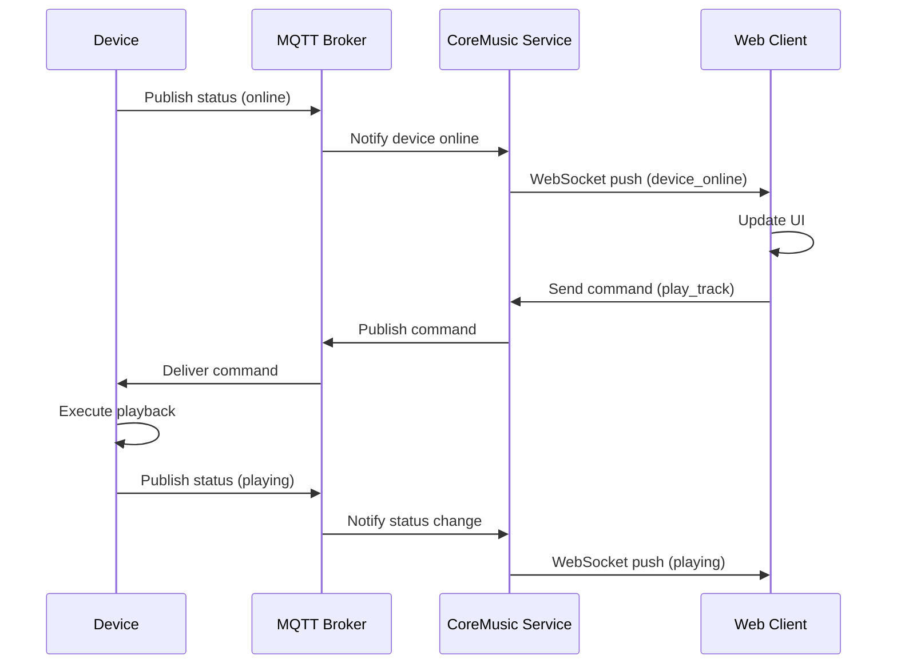

# CoreMusic — WebSocket & MQTT

**See also:** [[architecture/10-network/index]] · [[architecture/l6-electronics]]

---

## 1. Amaç

WebSocket ve MQTT, CoreMusic platformunun gerçek zamanlı iletişim protokolleridir. WebSocket tarayıcı-sunucu, MQTT ise IoT cihaz-sunucu iletişimi için kullanılır.

---

## 2. WebSocket

### Kullanım Alanları
- Gerçek zamanlı ses durumu bildirimi
- Cihaz durumu değişikliği
- Canlı EQ/DSP parametre güncelleme
- Multi-device senkronizasyon
- Chat/listening room iletişimi

### WebSocket Stack

```
Client (Browser)
    ↓
WSS (WebSocket Secure - TLS 1.3)
    ↓
WebSocket Server (Port 8443)
    ↓
Channel Manager
    ├── /audio/status
    ├── /device/status
    ├── /dsp/params
    ├── /notifications
    └── /chat
    ↓
Message Bus
```

### WebSocket Kanalları

| Channel | Kullanım | Frequency |
|---------|----------|-----------|
| `/audio/status` | Oynatma durumu | Real-time |
| `/device/status` | Cihaz online/offline | On-change |
| `/dsp/params` | EQ parametreleri | On-change |
| `/firmware/progress` | Güncelleme ilerlemesi | 1s interval |
| `/notifications` | Bildirimler | On-event |
| `/chat` | Listening room | Real-time |

### WebSocket Güvenliği

| Önlem | Açıklama |
|-------|----------|
| WSS only | Plain WS yasak |
| JWT Auth | Connection handshake'de |
| Rate Limit | Max 100 msg/s per client |
| Origin Check | Trusted origins only |
| Max Message | 64KB limit |

---

## 3. MQTT

### Kullanım Alanları
- IoT cihaz iletişimi (Raspberry Pi, ESP32)
- Düşük bant genişliği, yüksek güvenilirlik
- Uzaktan cihaz yönetimi
- Sensör veri toplama
- OTA güncelleme bildirimi

### MQTT Stack

```
IoT Device (RPi, ESP32, STM32)
    ↓
MQTT Publisher
    ↓
MQTT Broker (Mosquitto / HiveMQ)
    ↓
MQTT Subscriber (CoreMusic Service)
    ↓
Device Management Service
```

### MQTT Topic Yapısı

```
coremusic/
├── devices/
│   ├── {device_id}/status
│   ├── {device_id}/telemetry
│   ├── {device_id}/commands
│   └── {device_id}/firmware
├── audio/
│   ├── {device_id}/playback
│   └── {device_id}/dsp
└── system/
    ├── alerts
    └── updates
```

### MQTT QoS Seviyeleri

| QoS | Kullanım | Guarantee |
|-----|----------|-----------|
| 0 | Telemetry data | At most once |
| 1 | Status updates | At least once |
| 2 | Commands | Exactly once |

### MQTT Güvenliği

| Önlem | Açıklama |
|-------|----------|
| MQTTS | TLS 1.3 over MQTT |
| Client Auth | Username/password veya certificate |
| ACL | Topic bazlı erişim |
| Rate Limit | Per-client message limit |

---

## 4. WebSocket vs MQTT Karşılaştırması

| Özellik | WebSocket | MQTT |
|---------|-----------|------|
| Protokol | HTTP upgrade | TCP native |
| Port | 8443 (WSS) | 8883 (MQTTS) |
| Overhead | Yüksek (HTTP headers) | Düşük (2 byte header) |
| Kullanım | Tarayıcı | IoT / Embedded |
| QoS | Yok | 0, 1, 2 |
| Retained Messages | Yok | Var |
| Last Will | Yok | Var |
| Bant Genişliği | Yüksek | Düşük |
| Güvenlik | TLS + JWT | TLS + Certificate |

---

## 5. Real-time Communication Flow



---

## 6. ADR Referansları

| ADR | Konu |
|-----|------|
| [[ADR-032-ipc-contract-versioning]] | IPC sözleşme versiyonlama |
| [[ADR-017-dsp-hardware-mode]] | DSP real-time iletişim |

---

## 7. Çapraz Referanslar

| Kaynak | Hedef | İlişki |
|--------|-------|--------|
| WebSocket | [[architecture/l5-services]] | Servis katmanı |
| MQTT | [[electronic/firmware/index]] | Firmware iletişimi |
| MQTT | [[electronic/drivers/index]] | Driver yönetimi |

---

**Authority:** Bayram Ali / Vault Steward
**Last Updated:** 2026-08-09
**Mode:** Red Team · Human Mode · Truth Mode
