# AI Electronics Engine

**Zorunlu Bağlantılar:** [[ai/index]] · [[ai/ai-engine]] · [[ai/ai-orchestrator]] · [[ai/knowledge-base]] · [[ai/memory-system]] · [[ai/prompt-engine]] · [[ai/tool-calling]] · [[ai/mcp-integration]] · [[ai/ai-workflow]]

---

## 1. Amaç

CoreMusic ELECTRONICS geliştirme ve operasyon süreçlerinde yapay zeka entegrasyonunu tanımlayan standarttır. AI, tüm katmanlarda (PCB, Devre, Firmware, Sürücü, Performans, Hata, Log, Ses) aktif olarak kullanılır.

---

## 2. Kapsam

| Kapsam | Kapsam Dışı |
|--------|-------------|
| AI destekli donanım analizi | İnsan mühendis kararları |
| AI destekli firmware geliştirme | Otomatik kod üretimi (onaysız) |
| AI destekli sürücü optimizasyonu | Üretim süreçleri |
| AI destekli DSP tasarımı | |
| AI destekli test otomasyonu | |
| AI destekli dokümantasyon | |

---

## 3. AI Kullanım Alanları

### 3.1 Donanım için AI

| Alan | AI Kullanımı | Çıktı |
|------|-------------|-------|
| Tasarım İnceleme | PCB layout analizi, bileşen yerleşimi | Tasarım raporu |
| Bileşen Seçimi | Piyasa taraması, spesifikasyon karşılaştırma | Bileşen listesi |
| Termal Analiz | Sıcaklık simülasyonu, soğutma önerileri | Termal rapor |
| EMI Tahmini | Elektromanyetik uyumluluk analizi | EMI raporu |
| Layout Optimizasyonu | Sinyal bütünlüğü, güç bütünlüğü | Optimizasyon raporu |

### 3.2 Firmware için AI

| Alan | AI Kullanımı | Çıktı |
|------|-------------|-------|
| Kod İnceleme | Código kalitesi, güvenlik açığı taraması | İnceleme raporu |
| Hata Tespiti | Bug detection, memory leak analizi | Hata listesi |
| Optimizasyon | Performans iyileştirme önerileri | Optimizasyon planı |
| Test Üretimi | Unit test, edge case oluşturma | Test dosyaları |

### 3.3 Sürücü için AI

| Alan | AI Kullanımı | Çıktı |
|------|-------------|-------|
| Uyumluluk Analizi | OS versiyon uyumu, donanım uyumu | Uyumluluk raporu |
| Performans Profili | Latency, throughput analizi | Performans raporu |
| Çakışma Tespiti | Kaynak çakışması, interrupt analizi | Çakışma raporu |

### 3.4 DSP için AI

| Alan | AI Kullanımı | Çıktı |
|------|-------------|-------|
| Filtre Tasarımı | Butterworth, Chebyshev, Linkwitz-Riley | Filtre parametreleri |
| EQ Optimizasyonu | Frekans yanıtı düzeltmesi | EQ eğrileri |
| Oda Düzeltme | Room correction algoritmaları | Düzeltme parametreleri |

### 3.5 Ses için AI

| Alan | AI Kullanımı | Çıktı |
|------|-------------|-------|
| Akustik Analiz | Oda akustiği, yankı analizi | Akustik rapor |
| Hoparlör Yerleşimi | Optimal konumlandırma | Yerleşim planı |
| Frekans Yanıtı | Düzeltme eğrileri | Correction data |

### 3.6 Operasyon için AI

| Alan | AI Kullanımı | Çıktı |
|------|-------------|-------|
| Öngörücü Bakım | Arıza tahmini, bakım planı | Bakım programı |
| Hata Tespiti | Otomatik teşhis | Teşhis raporu |
| Konfigürasyon | Otomatik ayar önerileri | Konfigürasyon dosyası |

---

## 4. AI Mimarisi

```mermaid
graph TB
    subgraph "AI Electronics Engine"
        A[Girdi] --> B[Bilgi Bankası]
        B --> C[RAG Pipeline]
        C --> D[Bellek Sistemi]
        D --> E[Prompt Motoru]
        E --> F[Araç Çağrısı]
        F --> G[MCP Entegrasyonu]
        G --> H[Çıktı]
    end

    subgraph "Bilgi Bankası"
        B1[Doğrulanmış] --> B2[Doğrulanmamış]
        B2 --> B3[Reddedilmiş]
    end

    subgraph "RAG Pipeline"
        C1[ADR'leri Al] --> C2[Mimari Dokümanları Al]
        C2 --> C3[Bileşen Datasheet'lerini Al]
        C3 --> C4[Uygulama Notlarını Al]
    end

    subgraph "Bellek Sistemi"
        D1[Oturum Kalıcılığı] --> D2[Vault-Sync]
    end

    style A fill:#e1f5fe
    style H fill:#c8e6c9
    style B1 fill:#a5d6a7
    style B2 fill:#fff9c4
    style B3 fill:#ef9a9a
```

---

## 5. AI Pipeline Akışı

| Adım | İşlem | Girdi | Çıktı |
|------|-------|-------|-------|
| 1 | Girdi Al | Kullanıcı isteği | Ham veri |
| 2 | Bilgi Bankası Taraması | Ham veri | İlgili bilgiler |
| 3 | RAG Pipeline | İlgili bilgiler | Zenginleştirilmiş bağlam |
| 4 | Bellek Sistemi | Zenginleştirilmiş bağlam | Oturum bağlamı |
| 5 | Prompt Motoru | Oturum bağlamı | Optimize edilmiş prompt |
| 6 | Araç Çağrısı | Prompt | AI yanıtı |
| 7 | MCP Entegrasyonu | AI yanıtı | Doğrulanmış çıktı |
| 8 | Çıktı | Doğrulanmış çıktı | Sonuç |

---

## 6. AI Kalite Kontrolü

| Kontrol | Yöntem | Sorumlu |
|---------|--------|---------|
| Hallüsinasyon Kontrolü | `VERIFICATION REQUIRED` etiketi | Tüm ajanlar |
| ADR Uyumluluğu | ADR dokümanlarıyla çapraz kontrol | MO |
| Güvenlik İncelemesi | OWASP Top 10:2025 kontrolü | Security Engineer |
| İnsan Onayı | Kritik kararlar için insan onayı | Vault Steward |

---

## 7. Çapraz Referanslar

| Bölüm | Hedef | İlişki |
|-------|-------|--------|
| § 3 AI Kullanım Alanları | [[ai/ai-engine]] | AI motoru |
| § 4 AI Mimarisi | [[ai/knowledge-base]] | Bilgi bankası |
| § 5 AI Pipeline | [[ai/ai-workflow]] | İş akışı |
| § 6 Kalite Kontrolü | [[ai/memory-system]] | Bellek sistemi |

---

## 8. Quality Report

| Metrik | Değer |
|--------|-------|
| Version | 1.0.0 |
| Status | Red Team · Human Mode · Truth Mode verified |
| Sections | 8 |
| AI Application Areas | 6 (Donanım, Firmware, Sürücü, DSP, Ses, Operasyon) |
| Pipeline Steps | 8 |
| Quality Controls | 4 |
| Cross References | 4 |

---

**Authority:** Bayram Ali / Vault Steward
**Last Updated:** 2026-08-09
**Mode:** Red Team · Human Mode · Truth Mode
