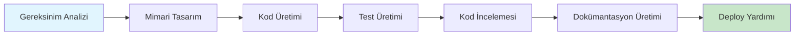

# AI Workflow for Electronics Development

**Zorunlu Bağlantılar:** [[ai/index]] · [[ai/ai-engine]] · [[ai/ai-orchestrator]] · [[ai/ai-workflow]] · [[ai/knowledge-base]] · [[ai/memory-system]] · [[ai/prompt-engine]] · [[ai/tool-calling]] · [[ai/mcp-integration]]

---

## 1. Amaç

CoreMusic ELECTRONICS geliştirme süreçlerinde AI araçlarının kullanımını standartlaştıran iş akışı protokolüdür.

---

## 2. AI Araç Zinciri

| Sıra | Araç | Kullanım Alanı | Öncelik |
|------|------|---------------|---------|
| 1 | Claude | Mimari, kod incelemesi, dokümantasyon | Birincil |
| 2 | ChatGPT | Araştırma, beyin fırtınası | İkincil |
| 3 | Gemini | Çoklu mod analizi | İkincil |
| 4 | Codex | Kod üretimi | Destekleyici |
| 5 | Cursor | IDE entegrasyonu | Destekleyici |
| 6 | RooCode | Kod asistanı | Destekleyici |
| 7 | MCP | Bağlam enjeksiyonu | Altyapı |
| 8 | Bilgi Bankası | Doğrulanmış bilgi | Altyapı |

---

## 3. AI Destekli Geliştirme İş Akışı

---

## 4. Geliştirme Fazları için AI

### 4.1 Araştırma

| Görev | AI Kullanımı | Çıktı |
|-------|-------------|-------|
| Literatür Taraması | Makale ve patent analizi | Araştırma raporu |
| Bileşen Araştırması | Piyasa taraması, spesifikasyon | Bileşen listesi |
| Rakip Analizi | Mevcut çözümlerin analizi | Rekabet raporu |

### 4.2 Mimari

| Görev | AI Kullanımı | Çıktı |
|-------|-------------|-------|
| Desen Seçimi | Mimari desen önerileri | Desen seçimi |
| Katman Tasarımı | L0-L6 katman planlaması | Katman diyagramı |
| Arayüz Tanımlama | API ve modül arayüzleri | Arayüz sözleşmeleri |

### 4.3 Uygulama

| Görev | AI Kullanımı | Çıktı |
|-------|-------------|-------|
| Kod Üretimi | Otomatik kod oluşturma | Kaynak kodu |
| Refaktörleme | İyileştirme önerileri | Refaktör planı |
| En İyi Uygulamalar | Standart kontrolü | Uyumluluk raporu |

### 4.4 Test

| Görev | AI Kullanımı | Çıktı |
|-------|-------------|-------|
| Test Senaryosu Üretimi | Edge case keşfi | Test dosyaları |
| Edge Case Keşfi | Sınır durum analizi | Edge case listesi |
| Kapsama Analizi | Coverage optimizasyonu | Coverage raporu |

### 4.5 Dokümantasyon

| Görev | AI Kullanımı | Çıktı |
|-------|-------------|-------|
| Otomatik Üretim | API dokümanı, kullanıcı rehberi | Dokümanlar |
| API Dokümanı | Endpoint açıklamaları | API reference |
| Kullanıcı Rehberi | Kullanım kılavuzu | User guide |

### 4.6 Deploy

| Görev | AI Kullanımı | Çıktı |
|-------|-------------|-------|
| Konfigürasyon İncelemesi | Deploy config analizi | Konfigürasyon raporu |
| Güvenlik Denetimi | OWASP kontrolü | Güvenlik raporu |
| Performans Kontrolü | Benchmark analizi | Performans raporu |

---

## 5. Bilgi Bankası Yapısı

| Kategori | Tanım | Güven Skoru |
|----------|-------|-------------|
| Doğrulanmış | Vault ile doğrulanmış bilgi | %95+ |
| Doğrulanmamış | Henüz doğrulanmamış bilgi | %50-94 |
| Reddedilmiş | Yanlış veya geçersiz bilgi | %0-49 |

---

## 6. RAG Pipeline (Elektronik için)

| Adım | İşlem | Kaynak |
|------|-------|--------|
| 1 | İlgili ADR'leri al | [[decisions/accepted/]] |
| 2 | Mimari dokümanları al | [[architecture/]] |
| 3 | Bileşen datasheet'lerini al | Datasheet arşivi |
| 4 | Uygulama notlarını al | App note arşivi |
| 5 | Bağlamı zenginleştir | RAG pipeline |
| 6 | Prompt üret | [[ai/prompt-engine]] |

---

## 7. Çapraz Referanslar

| Bölüm | Hedef | İlişki |
|-------|-------|--------|
| § 2 AI Araç Zinciri | [[ai/ai-engine]] | AI motoru |
| § 3 İş Akışı | [[ai/ai-workflow]] | Genel iş akışı |
| § 5 Bilgi Bankası | [[ai/knowledge-base]] | Bilgi yönetimi |
| § 6 RAG Pipeline | [[ai/mcp-integration]] | MCP entegrasyonu |

---

## 8. Quality Report

| Metrik | Değer |
|--------|-------|
| Version | 1.0.0 |
| Status | Red Team · Human Mode · Truth Mode verified |
| Sections | 8 |
| AI Tools | 8 |
| Development Phases | 6 |
| Knowledge Categories | 3 |
| RAG Steps | 6 |
| Cross References | 4 |

---

**Authority:** Bayram Ali / Vault Steward
**Last Updated:** 2026-08-09
**Mode:** Red Team · Human Mode · Truth Mode
