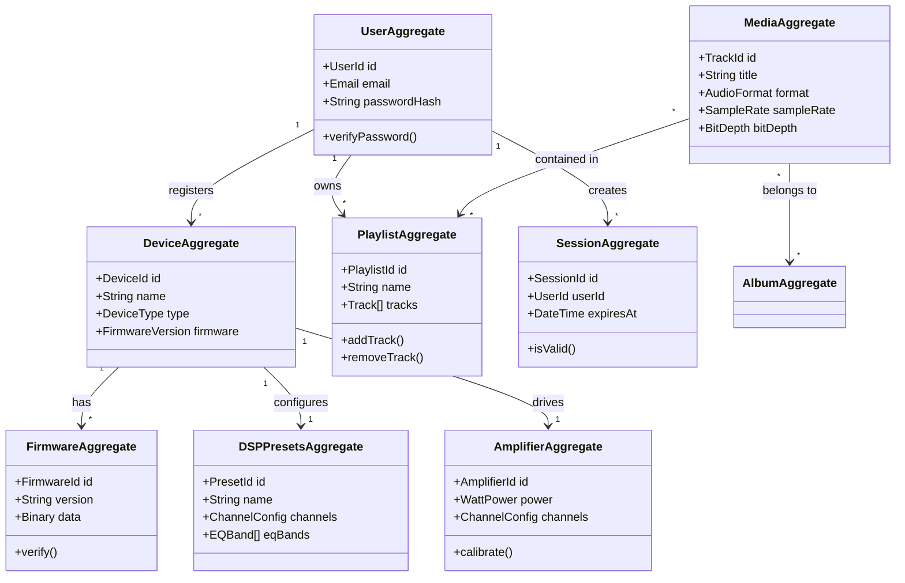
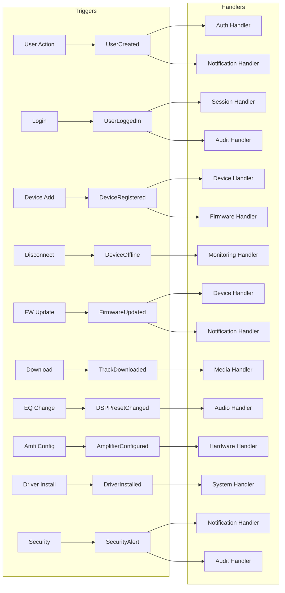

# L4 — Domain Layer

**See also:** [[index]] · [[CLAUDE.md]] · [[brain.md]] · [[architecture/00-overview/architecture-master]]

---

## 1. Purpose

L4, CoreMusic platformunun **Domain katmanıdır**. Business rules, domain services, entities, value objects, aggregates ve domain events bu katmanda yönetilir.

L4; framework, veritabanı, UI ve donanımdan **tamamen bağımsızdır**.

**Katman Sırası (Dıştan içe):**
```
L6 Electronics → L5 Services → L4 Domain ← BU DOSYA → L3 Presentation → L2 Routing → L1 Security → L0 Infrastructure
```

---

## 2. Responsibilities

| Bileşen | Sorumluluk |
|---------|------------|
| **Entities** | İş mantığı olan nesneler (User, Device, Track, Album) |
| **Value Objects** | Değiştirilemez değerler (Email, Money, AudioFormat) |
| **Aggregates** | Entity grupları (UserAggregate, DeviceAggregate) |
| **Domain Events** | Sistem içi olaylar (UserCreated, DeviceRegistered) |
| **Domain Services** | Birden fazla entity gerektiren işlemler |
| **Repository Interfaces** | Veri erişim arayüzleri (impl L0'da) |
| **Use Case Interfaces** | Uygulama katmanı arayüzleri |

---

## 3. Domain Entities

### 3.1 Entity-Relationship Diagram



### Core Entities

| Entity | Aggregate | Açıklama |
|--------|-----------|----------|
| User | UserAggregate | Kullanıcı hesabı |
| Device | DeviceAggregate | Elektronik cihaz |
| Track | MediaAggregate | Müzik dosyası |
| Album | MediaAggregate | Albüm |
| Playlist | PlaylistAggregate | Çalma listesi |
| Session | SessionAggregate | Kullanıcı oturumu |
| Firmware | FirmwareAggregate | Cihaz yazılımı |
| Driver | DriverAggregate | Sürücü |
| DSPProfile | DSPPresetsAggregate | EQ/DSP ayarları |
| Amplifier | AmplifierAggregate | Amfi konfigürasyonu |

---

## 4. Value Objects

| Value Object | Domain | Özellik |
|-------------|--------|---------|
| Email | User | Geçerli e-posta |
| IPAddress | Network | IPv4/IPv6 |
| AudioFormat | Media | FLAC, MP3, WAV |
| SampleRate | Audio | 44.1k, 48k, 96k |
| BitDepth | Audio | 16, 24, 32-bit |
| ChannelConfig | Audio | 2.0, 5.1, 7.1, 8.1 |
| WattPower | Amplifier | 10W-2000W |
| FirmwareVersion | Firmware | Semantic version |
| DeviceID | Device | UUID |
| Money | Commerce | Currency + amount |

---

## 5. Domain Events

### 5.1 Event Flow Diagram



### Event List
|-------|---------|------------|
| UserCreated | Kayıt | Auth, Notification |
| UserLoggedIn | Login | Session, Audit |
| DeviceRegistered | Cihaz ekleme | Device, Firmware |
| DeviceOffline | Bağlantı kopması | Monitoring |
| FirmwareUpdated | Güncelleme | Device, Notification |
| TrackDownloaded | İndirme | Media, Library |
| DSPPresetChanged | EQ değişikliği | Audio, Device |
| AmplifierConfigured | Amfi ayarı | Hardware, DSP |
| DriverInstalled | Sürücü yükleme | System, Device |
| SecurityAlert | Güvenlik olayı | Notification, Audit |

---

## 6. Domain Services

| Service | Kullanım | Entity İlişkisi |
|---------|----------|-----------------|
| PricingService | Abonelik/hesaplama | User, Money |
| MediaConversionService | Format dönüştürme | Track, AudioFormat |
| DeviceProvisioningService | Cihaz kaydı | Device, Firmware |
| AudioRoutingService | Ses yönlendirme | Device, ChannelConfig |
| AmplifierCalibrationService | Amfi kalibrasyonu | Amplifier, DSPProfile |

---

## 7. Repository Interfaces

```php
// Interface — Implementation L0'da
interface UserRepositoryInterface {
    public function findById(UserId $id): ?User;
    public function save(User $user): void;
    public function findByEmail(Email $email): ?User;
}

interface DeviceRepositoryInterface {
    public function findById(DeviceId $id): ?Device;
    public function save(Device $device): void;
    public function findActive(): array;
}
```

**Kural:** Domain katmanı repository interface'ini tanımlar, implementasyon L0'da yapılır.

---

## 8. Dependency Rules

| Kural | Açıklama |
|-------|----------|
| ✅ L4 → Hiçbir şey | Domain bağımsızdır |
| ❌ L0 → L4 | Infrastructure domain'e bağımlı olamaz |
| ❌ L3 → L4 | Presentation domain'i doğrudan çağıramaz |
| ✅ L5 → L4 | Services domain'i kullanabilir |
| ✅ L2 → L4 | Routing use case'leri çağırabilir |

---

## 9. Design Principles

| İlke | Uygulama |
|------|----------|
| SOLID | Tek sorumluluk, açık-kapalı, Liskov, arayüz ayrımı, bağımlılık tersi |
| DDD | Aggregate root, value object, domain event |
| Clean Architecture | Domain merkezde, bağımlılıklar dışa doğru |
| CQRS | Command ve Query ayrımı |
| Event Sourcing | Domain event'lerden durum yeniden oluşturma |

---

## 10. ADR Referansları

| ADR | Konu |
|-----|------|
| [[ADR-039-7-service-platform-architecture]] | 7-servis mimarisi |

---

## 11. Çapraz Referanslar

| Kaynak | Hedef | İlişki |
|--------|-------|--------|
| L4 Domain | [[architecture/l5-services]] | Üst katman |
| L4 Domain | [[architecture/l3-presentation]] | Alt katman |
| L4 Domain | [[electronic/index]] | Electronics domain |
| L4 Domain | [[architecture/06-audio/index]] | Audio domain |

---

**Authority:** Bayram Ali / Vault Steward
**Last Updated:** 2026-08-10
**Mode:** Red Team · Human Mode · Truth Mode
