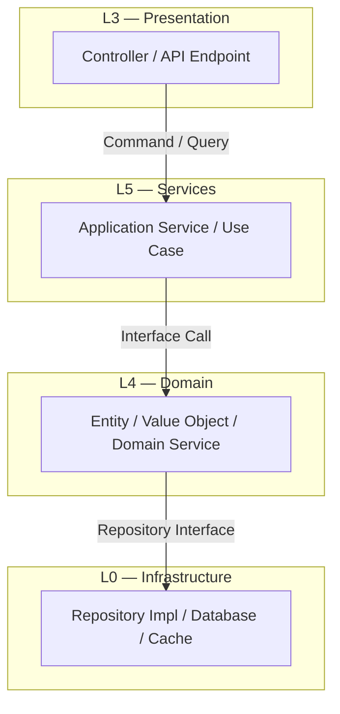
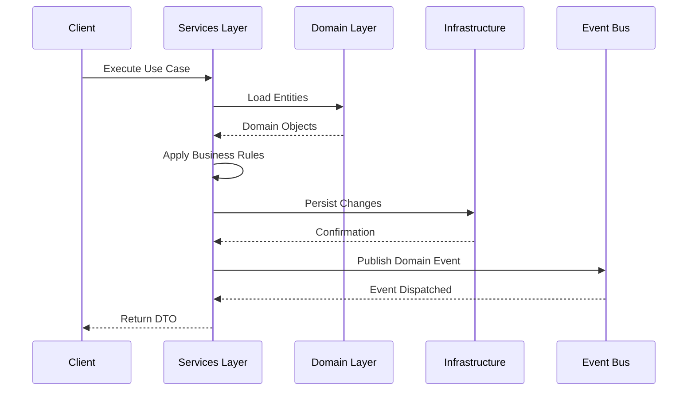
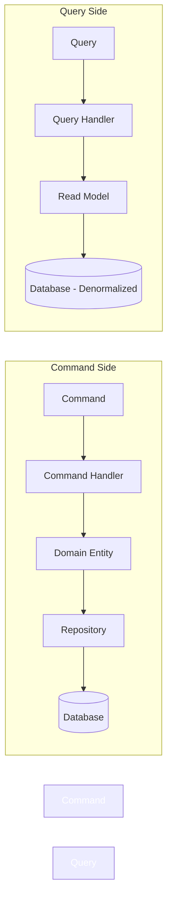

# L5 — Services Layer

**See also:** [[index]] · [[CLAUDE.md]] · [[brain.md]] · [[architecture/00-overview/architecture-master]]

---

## 1. Purpose

L5, CoreMusic platformunun **Servis katmanıdır**. Application services, use case implementations, transaction management ve orchestrator bu katmanda yönetilir.

L5, L4 (Domain) ile etkileşime girer ve L6 (Electronics) ile koordinasyon sağlar.

**Katman Sırası (Dıştan içe):**
```
L6 Electronics → L5 Services ← BU DOSYA → L4 Domain → L3 Presentation → L2 Routing → L1 Security → L0 Infrastructure
```

---

## 2. Responsibilities

| Bileşen | Sorumluluk |
|---------|------------|
| **Application Services** | Use case orchestrasyonu |
| **Use Case Implementations** | İş akışı yürütme |
| **Transaction Management** | Atomik işlemler |
| **Event Publishing** | Domain event dağıtımı |
| **Service Orchestration** | Servisler arası koordinasyon |
| **DTO Mapping** | Veri dönüşümü |
| **Authorization** | Yetkilendirme kontrolü |

---

## 3. Service Listesi

### Core Services

| Service | Sorumluluk | Domain Entity |
|---------|------------|---------------|
| AuthenticationService | Login, logout, session | User, Session |
| UserService | Profil, tercihler | User |
| DeviceService | Cihaz yönetimi | Device |
| MediaService | Müzik kütüphanesi | Track, Album |
| PlaylistService | Çalma listesi | Playlist |
| DownloadService | İndirme yönetimi | Track, Catalog |
| NotificationService | Bildirim yönetimi | User |

### Electronics Services

| Service | Sorumluluk | Domain Entity |
|---------|------------|---------------|
| FirmwareService | Firmware güncelleme | Firmware |
| DriverService | Sürücü yönetimi | Driver |
| DSPService | EQ/DSP yönetimi | DSPProfile |
| AmplifierService | Amfi konfigürasyonu | Amplifier |
| AudioEngineService | Ses oynatma | Track, Device |
| HardwareMonitoringService | Donanım izleme | Device |

---

## 4. Use Case Pattern

```php
class LoginUseCase {
    public function __construct(
        private UserRepositoryInterface $users,
        private SessionService $sessions,
        private EventDispatcher $events
    ) {}

    public function execute(LoginCommand $command): SessionDTO {
        // 1. Domain entities yükle
        $user = $this->users->findByEmail($command->email);

        // 2. Business rules kontrolü
        if (!$user || !$user->verifyPassword($command->password)) {
            throw new InvalidCredentialsException();
        }

        // 3. İşlemi gerçekleştir
        $session = $this->sessions->create($user);

        // 4. Domain event yayınla
        $this->events->dispatch(new UserLoggedIn($user->id));

        // 5. DTO döndür
        return SessionDTO::from($session);
    }
}
```

---

## 5. Service Communication

### 5.1 Layer Communication Diagram



### 5.2 Service Orchestration Flow



---

## 6. Transaction Management

| Pattern | Kullanım | Örnek |
|---------|----------|-------|
| Unit of Work | Tek request içinde birden fazla write | Kayıt + profil oluşturma |
| Outbox Pattern | Event publishing garanti | Sipariş + event |
| Saga | Dağınık transaction | Multi-device sync |
| Idempotency | Tekrarlanabilir istekler | Payment, download |

---

## 7. Event Publishing

```php
class DeviceService {
    public function register(RegisterDeviceCommand $command): void {
        $device = Device::create($command->name, $command->type);
        $this->devices->save($device);

        // Domain event publish
        $this->events->dispatch(new DeviceRegistered(
            deviceId: $device->id,
            deviceType: $device->type,
            firmwareVersion: $device->firmwareVersion
        ));
    }
}
```

---

## 8. Dependency Rules

| Kural | Açıklama |
|-------|----------|
| ✅ L5 → L4 | Services domain'i kullanır |
| ✅ L5 → L0 | Repository implementasyonlarını çağırır |
| ❌ L5 → L3 | Services UI'a bağımlı olamaz |
| ❌ L5 → L6 | Services donanımı doğrudan yönetemez |
| ✅ L6 → L5 | Electronics services'i kullanır |

---

## 9. CQRS Pattern

### 9.1 CQRS Flow Diagram



---

## 10. ADR Referansları

| ADR | Konu |
|-----|------|
| [[ADR-039-7-service-platform-architecture]] | 7-servis mimarisi |
| [[ADR-032-ipc-contract-versioning]] | IPC sözleşmeleri |

---

## 11. Çapraz Referanslar

| Kaynak | Hedef | İlişki |
|--------|-------|--------|
| L5 Services | [[architecture/l4-domain]] | Alt katman |
| L5 Services | [[architecture/l6-electronics]] | Üst katman |
| L5 Services | [[architecture/06-audio/index]] | Audio servisleri |
| L5 Services | [[architecture/10-network/index]] | Ağ iletişimi |

---

**Authority:** Bayram Ali / Vault Steward
**Last Updated:** 2026-08-10
**Mode:** Red Team · Human Mode · Truth Mode
