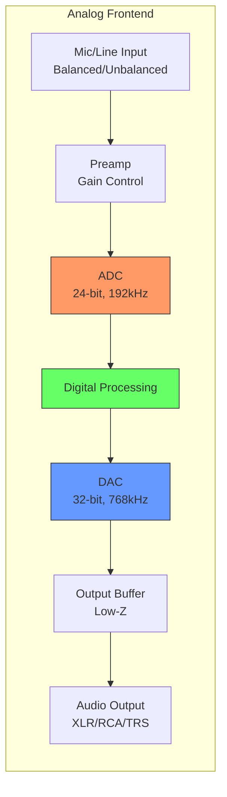
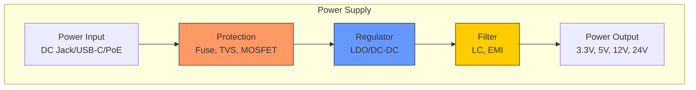

# L6 Electronics Layer — CoreMusic System Architecture

**Zorunlu Bağlantılar:** [[architecture/l0-infrastructure]] · [[architecture/l1-security]] · [[architecture/l2-routing]] · [[architecture/l3-presentation]] · [[electronic/core-music-electronics-overview]] · [[ADR-061-electronics-architecture]] · [[ADR-064-electronics-platform-architecture]]

---

## 1. Amaç

L6 Electronics, CoreMusic sistem mimarisindeki **en üst donanım/elektronik katmanıdır** (L0-L6). L6, fiziksel elektronik ile yazılımın buluştuğu noktadır. CoreMusic'in L0-L3 katman yapısıyla uyumlu olarak genişletilmiştir.

---

## 2. L0-L6 Katman Yığını

CoreMusic'in L0-L3 katman yapısı (CLAUDE.md §5) üzerine inşa edilmiştir. L4-L6, electronics ekosistemi için genişletilmiştir.

```mermaid
graph TB
    subgraph "CoreMusic System Architecture L0-L6"
        L0[L0 — Infrastructure<br/>DB, Cache, Filesystem, IPC]
        L1[L1 — Security<br/>Middleware, Session, CSRF, CSP]
        L2[L2 — Routing<br/>SPA, PageRouter, Subdomain]
        L3[L3 — Presentation<br/>Vanilla JS, ITCSS, Web Audio]
        L4[L4 — Domain<br/>Business Logic, DDD, Use Cases]
        L5[L5 — Services<br/>13 Servis, API Gateway, Event Bus]
        L6[L6 — Electronics<br/>Hardware, Firmware, Driver, DSP]
    end

    L6 --> L5
    L5 --> L4
    L4 --> L3
    L3 --> L2
    L2 --> L1
    L1 --> L0

    style L0 fill:#6ff,stroke:#333,stroke-width:2px
    style L1 fill:#96f,stroke:#333,stroke-width:2px
    style L2 fill:#69f,stroke:#333,stroke-width:2px
    style L3 fill:#6f6,stroke:#333,stroke-width:2px
    style L4 fill:#fc0,stroke:#333,stroke-width:2px
    style L5 fill:#f90,stroke:#333,stroke-width:2px
    style L6 fill:#f96,stroke:#333,stroke-width:3px
```

---

## 3. Katman Tanımları

| Katman | Ad | Kapsam | Teknoloji |
|--------|-----|--------|-----------|
| **L0** | Infrastructure | DB, cache, filesystem, IPC, credential vault | PDO, APCu, Redis, SQLite |
| **L1** | Security | Middleware pipeline, session, CSRF, CSP, rate limit | Argon2id, AES-256-GCM, OWASP |
| **L2** | Routing | SPA PageRouter, subdomain routing, URL normalization | PHP 8.4 PageRouter, JS Router.js |
| **L3** | Presentation | Frontend, UI, DOM, responsive, accessibility | Vanilla JS ES6+, ITCSS 7-layer, TrustedTypes |
| **L4** | Domain | İş mantığı, use case'ler, entity'ler, DDD | PHP 8.4 (strict_types), SOLID |
| **L5** | Services | 13 servis, API Gateway, event bus, message queue | REST, WebSocket, gRPC, MQTT |
| **L6** | Electronics | Hardware, firmware, driver, DSP, PCB, devre | C++20, JUCE 9, ASIO SDK 2.3.4, XMOS |

**Bağımlılık Kuralları:**
- ✅ L6→L5, L5→L4, L4→L3, L3→L2, L2→L1, L1→L0: İzinli
- ❌ L0→L2/L3, L1→L3, L3→L0: Yasak (Layer Violation)
- ❌ Yukarı doğru bağımlılık yasak
- ❌ Katmanlar arası doğrudan bağımlılık yasak

**Layer Violation İhlali:** Tespit edilirse derhal revert + log CRITICAL.

---

## 4. L6 Electronics Kapsamı

### 4.1 PCB Tasarımı

| Özellik | Açıklama |
|---------|----------|
| Katman Sayısı | 4-16 katman |
| Trace Width | Impedance-controlled routing |
| Via Types | Through-hole, blind, buried, microvia |
| Material | FR-4, Rogers, Metal Core |
| Copper Weight | 1oz-3oz |
| Surface Finish | ENIG, HASL, OSP |
| Design Rules | IPC-2221, IPC-2222 |

### 4.2 Bileşen Seçimi

| Sınıf | Kullanım | Örnek |
|-------|----------|-------|
| Endüstriyel | -40°C to +85°C | industrial DAC |
| Otomotiv | -40°C to +125°C | automotive MCU |
| Askeri | -55°C to +125°C | military grade |
| Tüketici | 0°C to +70°C | consumer IC |

### 4.3 Devre Tasarımı

| Blok | Açıklama |
|------|----------|
| Analog Frontend | ADC, DAC, preamp, buffer |
| Digital Processing | DSP, FPGA, MCU |
| Power Supply | Regülatör, filtre, koruma |
| Connectivity | USB, Ethernet, WiFi, BT |
| Output Stage | Amplifikatör, röle, koruma |

### 4.4 Sinyal Yönlendirme

| Sinyal Türü | Dikkat |
|-------------|--------|
| High-speed Digital | Impedance matching, length matching |
| Analog Audio | Low-noise routing, ground separation |
| Power | Wide traces, thermal relief |
| Clock | Low-jitter, matched length |
| RF | 50Ω impedance, shield |

### 4.5 Güç Dağıtımı

| Gereksinim | Açıklama |
|------------|----------|
| Multi-Rail | Farklı voltaj seviyeleri (1.2V, 3.3V, 5V, 12V, 24V) |
| Low-Noise | Audio sinyal gürültüsü minimum |
| EMI Filtering | Giriş/çıkış filtreleme |
| Protection | Aşırı akım, aşırı gerilim, kısa devre |
| Efficiency | >85% verimlilik hedefi |

### 4.6 Termal Yönetim

| Yöntem | Kullanım |
|--------|----------|
| Heatsink | Yüksek güç bileşenleri |
| Fan | Aktif soğutma |
| Thermal Pad | Isı iletimi |
| Copper Pour | Yüzey soğutma |
| airflow | Konveksiyon soğutma |

### 4.7 EMI/EMC Uyumluluğu

| Standart | Kapsam |
|----------|--------|
| CE Marking | Avrupa uyumluluk |
| FCC Part 15 | ABD EMI |
| CISPR 22 | Uluslararası EMI |
| EN 55032 | Avrupa EMI |
| EN 61000 | EMC genel |

### 4.8 Üretim Standartları

| Standart | Açıklama |
|----------|----------|
| IPC-A-610 | PCB kabul kriterleri |
| IPC-A-620 | Kablo ve kablo demeti |
| J-STD-001 | Lehimleme gereksinimleri |
| IPC-7711/7721 | PCB onarımı |
| ISO 9001 | Kalite yönetimi |

---

## 5. L6 Alt Katmanları

### 5.1 Analog Frontend

### 5.2 Dijital İşleme

| İşlemci | Kullanım | Performans |
|---------|----------|------------|
| DSP | Real-time EQ, compressor | 100+ MIPS |
| FPGA | Paralel işleme, low-latency | 1000+ LUT |
| MCU | Kontrol, iletişim | 200+ MHz |

### 5.3 Güç Kaynağı

### 5.4 Bağlantı

| Protokol | Fiziksel | Kullanım |
|----------|----------|----------|
| USB | Type-B, Type-C | Audio interface |
| Ethernet | RJ45, MagJack | Ağ |
| WiFi | Antenna, U.FL | Kablosuz |
| Bluetooth | Antenna, Chip antenna | Kablosuz kısa |
| I2S | PCB trace | Ses verisi |
| TDM | PCB trace | Çoklu kanal |
| SPI | PCB trace | Yüksek hız |
| I2C | PCB trace | Düşük hız |

### 5.5 Çıkış Katmanı

| Çıkş | Amplifikatör | Güç | Yük |
|------|-------------|-----|-----|
| XLR (Balanced) | — | — | 600Ω+ |
| TRS (Balanced) | — | — | 600Ω+ |
| RCA (Unbalanced) | — | — | 10kΩ+ |
| Speaker Terminal | Class AB/D | 100W @ 8Ω | 4-8Ω |
| Headphone | Class A/AB | 500mW | 16-600Ω |

---

## 6. L6-L5 Arayüzü

L6 Electronics ile L5 Hardware Abstraction arasındaki arayüz:

| L6 Çıktısı | L5 Girdisi |
|-------------|------------|
| Ham analog sinyal | Dijital örneklenmiş sinyal |
| Güç voltajları | Güç durumu bildirimi |
| Sıcaklık sensörü | Termal veri |
| Durum LED'leri | LED kontrol komutları |
| Fiziksel düğme | Dijital giriş olayı |

---

## 7. Cross References

| Dosya | Kapsam |
|-------|--------|
| [[architecture/l0-infrastructure]] | L0 Infrastructure |
| [[architecture/l1-security]] | L1 Security |
| [[architecture/l2-routing]] | L2 Routing |
| [[architecture/l3-presentation]] | L3 Presentation |
| [[electronic/core-music-electronics-overview]] | Electronics genel bakış |
| [[electronic/platform-architecture]] | Platform mimarisi |
| [[electronic/device-architecture]] | Cihaz mimarisi |
| [[electronic/hardware/index]] | Hardware tasarım |
| [[ADR-061-electronics-architecture]] | Electronics ADR |
| [[ADR-062-dsp-pipeline-architecture]] | DSP pipeline ADR |
| [[ADR-063-hardware-design-standards]] | Hardware standartları ADR |
| [[ADR-064-electronics-platform-architecture]] | Electronics platform ADR |

---

## 8. Quality Report

| Metrik | Değer |
|--------|-------|
| Version | 2.0.0 |
| Status | Red Team · Human Mode · Truth Mode verified |
| System Layers | 7 (L0-L6) |
| L6 Sub-layers | 5 (Analog, Digital, Power, Connectivity, Output) |
| PCB Standards | IPC-2221/2222 |
| EMI Standards | CE, FCC, CISPR |
| Cross References | 12 |
| ADR References | ADR-061, ADR-062, ADR-063, ADR-064 |

---

**Authority:** Bayram Ali / Vault Steward
**Last Updated:** 2026-08-09
**Mode:** Red Team · Human Mode · Truth Mode
