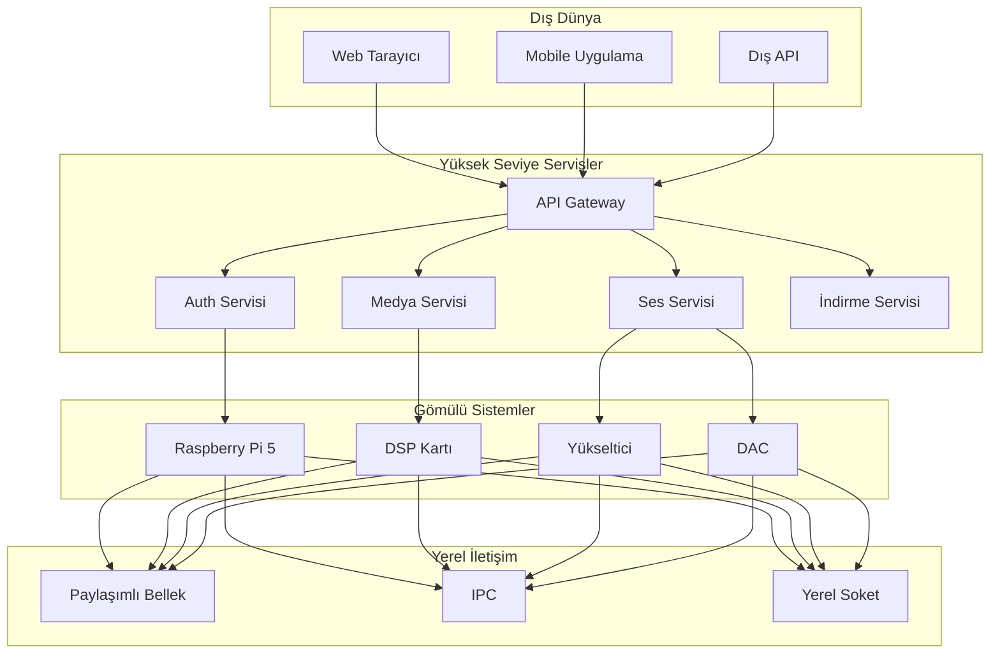

# CoreMusic — Network Architecture

**Zorunlu Bağlantılar:** [[CLAUDE.md]] · [[AGENTS.md]] · [[WORKFLOW.md]] · [[index.md]] · [[keys.md]] · [[brain.md]] · [[MEMORY.md]] · [[log.md]]

---

## 1. Amaç

CoreMusic ELECTRONICS'in tüm iletişim protokollerini yöneten Ağ Mimarisi. Tüm servisler arası, cihazlar arası ve dış dünya ile iletişimi standartlaştırır.

---

## 2. İletişim Protokolleri

### 2.1 HTTP/HTTPS

| Özellik | Değer |
|---------|-------|
| Kullanım Alanları | REST API, web yönetimi, firmware indirme |
| Avantajları | Evrensel destek, proxy uyumlu, firewall dostu |
| Dezavantajları | Başlık overhead, getStateless |
| Güvenlik | TLS 1.3 zorunlu |

### 2.2 REST API

| Özellik | Değer |
|---------|-------|
| Kullanım Alanları | CRUD işlemleri, cihaz yönetimi, konfigürasyon |
| Avantajları | Basit, stateless, cachelenebilir |
| Dezavantajları | Over-fetching, under-fetching |
| Güvenlik | JWT/OAuth2, rate limiting |

### 2.3 WebSocket

| Özellik | Değer |
|---------|-------|
| Kullanım Alanları | Gerçek zamanlı izleme, canlı ses durumu, push bildirimleri |
| Avantajları | Düşük gecikme, bidirectional |
| Dezavantajları | Stateful, proxy güçlükleri |
| Güvenlik | WSS (TLS), token doğrulama |

### 2.4 MQTT

| Özellik | Değer |
|---------|-------|
| Kullanım Alanları | IoT cihazları, gömülü sistemler, düşük bant genişliği |
| Avantajları | Hafif, publish/subscribe, QoS desteği |
| Dezavantajları | TCP tabanlı, güvenlik sınırlı |
| Güvenlik | TLS, username/password, client certificate |

### 2.5 gRPC

| Özellik | Değer |
|---------|-------|
| Kullanım Alanları | Servisler arası iletişim, yüksek performanslı RPC |
| Avantajları | Protobuf, bidirectional streaming, HTTP/2 |
| Dezavantajları | Tarayıcı desteği sınırlı, öğrenme eğrisi |
| Güvenlik | mTLS, token |

### 2.6 IPC (Inter-Process Communication)

| Özellik | Değer |
|---------|-------|
| Kullanım Alanları | Süreçler arası iletişim, paylaşımlı bellek, yerel soket |
| Avantajları | Ultra düşük gecikme, yüksek bant genişliği |
| Dezavantajları | Platform bağımlı |
| Güvenlik | Process-level izinler |

### 2.7 Paylaşımlı Bellek (Shared Memory)

| Özellik | Değer |
|---------|-------|
| Kullanım Alanları | Sıfır kopyalama veri aktarımı, ses arabellek paylaşımı, gerçek zamanlı DSP iletişimi |
| Avantajları | En düşük gecikme, sıfır kopyalama |
| Dezavantajları | Senkronizasyon karmaşık |
| Güvenlik | Bellek izinleri |

### 2.8 Yerel Soket (Local Socket)

| Özellik | Değer |
|---------|-------|
| Kullanım Alanları | Unix soket, Windows adlı boru, düşük gecikmeli yerel iletişim |
| Avantajları | TCP'den hızlı, güvenli |
| Dezavantajları | Yerel makine ile sınırlı |
| Güvenlik | Dosya izinleri |

---

## 3. Protokol Seçim Matrisi

| Ortam | Birincil Protokol | İkincil Protokol |
|-------|-------------------|------------------|
| Web | HTTP/HTTPS + WebSocket | — |
| Gömülü | MQTT + Yerel Soket | — |
| Servislerarası | gRPC + IPC | — |
| Gerçek Zamanlı Ses | Paylaşımlı Bellek + IPC | — |

---

## 4. Ağ Topolojisi



---

## 4A. Haberleşme Katmanları

| Katman | Protokol | Kullanım |
|--------|----------|----------|
| **Application** | HTTP, WebSocket, MQTT, gRPC | Servisler arası iletişim |
| **Transport** | TCP, UDP | Güvenilir/ Güvenilmez veri aktarımı |
| **Network** | IP, ICMP | Yönlendirme, keşif |
| **Data Link** | Ethernet, WiFi, BLE | Fiziksel bağlantı |
| **Physical** | USB, I2S, TDM, SPI, I2C | Donanım iletişimi |

**Katman Haritası:**
- Web servisleri: Application (HTTP/WS) → Transport (TCP) → Network (IP) → Data Link (Ethernet/WiFi)
- Gömülü sistemler: Application (MQTT/gRPC) → Transport (TCP/UDP) → Network (IP) → Data Link (Ethernet/WiFi) → Physical (USB/I2S)
- Ses DSP: Application (IPC) → Transport (Shared Memory) → Physical (I2S/TDM)

---

## 4B. API Gateway

| Özellik | Değer |
|---------|-------|
| Merkezi Nokta | Tüm istekler Gateway'den geçer |
| Routing | URL tabanlı servis yönlendirme |
| Authentication | JWT/Session doğrulama (ADR-052) |
| Rate Limiting | APCu tabanlı, 60 req/60s (ADR-013) |
| Load Balancing | Round-robin, weighted |
| Circuit Breaker | Bağımsız servis hatalarında devre kesme |
| Request Transformation | Header/body dönüştürme |
| Response Caching | APCu/Redis önbellek |
| Logging | Tüm istekler audit trail'e loglanır |

**Gateway Akışı:**
```
Client → [Rate Limit] → [Auth] → [Route] → [Service] → [Response Cache] → Client
```

---

## 4C. Service Discovery

| Yöntem | Kullanım | Detay |
|--------|----------|-------|
| DNS | Ana servis keşfi | A/AAAA kayıtları |
| mDNS | Yerel ağ keşfi | Bonjour/Avahi |
| Consul | Dinamik servis kaydı | Health check, DNS interface |
| Static Config | Gömülü sistemler | Sabit IP/PORT |

**Keşif Akışı:**
```
Servis Başlat → [Kayıt] → [Health Check] → [Keşif] → [İletişim]
```

---

## 4D. Health Check

| Protokol | Aralık | Timeout | Hedef |
|----------|--------|---------|-------|
| HTTP GET /health | 10s | 5s | Tüm servisler |
| TCP Ping | 30s | 3s | Veritabanı, Redis |
| Heartbeat (MQTT) | 60s | 10s | Gömülü cihazlar |
| WebSocket Ping | 15s | 5s | Gerçek zamanlı servisler |

**Durum Kodları:**
| Durum | Kod | Anlam |
|-------|-----|-------|
| Healthy | 200 | Servis aktif |
| Degraded | 301 | Yavaş yanıt (>5s) |
| Unhealthy | 500 | Servis dışı |
| Starting | 103 | Başlatılıyor |

---

## 5. Güvenlik

| Protokol | Güvenlik Önlemi |
|----------|-----------------|
| HTTP/HTTPS | TLS 1.3 zorunlu |
| Servislerarası | mTLS (Mutual TLS) |
| API | JWT/OAuth2 |
| Tüm Protokoller | Rate limiting |

---

## 6. İlgili ADR'ler

| ADR | Konu |
|-----|------|
| [[decisions/accepted/ADR-039-7-service-platform-architecture]] | 7 servis platform mimarisi |
| [[decisions/accepted/ADR-032-ipc-contract-versioning]] | IPC sözleşme versioning |
| [[decisions/accepted/ADR-042-vault-restructuring-2026-08-03]] | Vault yeniden yapılandırma |

---

## 7. İlgili Dosyalar

| Dosya | Amaç |
|-------|------|
| [[architecture/l0-infrastructure]] | L0 altyapı katmanı |
| [[architecture/l1-security]] | L1 güvenlik katmanı |
| [[architecture/l2-routing]] | L2 yönlendirme katmanı |
| [[ecosystem/7-service-integration]] | 7 servis entegrasyonu |
| [[ecosystem/network-architecture]] | Ağ mimarisi |

---

## 8. Quality Report

| Metrik | Değer |
|--------|-------|
| Version | 2.0.0 |
| Status | Red Team · Human Mode · Truth Mode verified |
| Sections | 8 |
| ADR References | 4 |
| Mermaid Diagrams | 1 |
| Protocols | 8 |
| Security Layers | 4 |
| Network Layers | 5 (Application→Physical) |
| Health Check Protocols | 4 |
| Service Discovery Methods | 4 |

---

**Authority:** Bayram Ali / Vault Steward
**Last Updated:** 2026-08-09
**Mode:** Red Team · Human Mode · Truth Mode