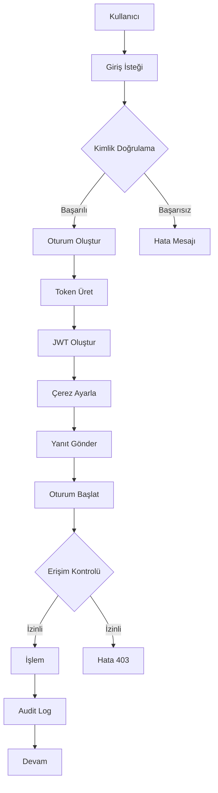

# CoreMusic — Security Architecture

**Zorunlu Bağlantılar:** [[CLAUDE.md]] · [[AGENTS.md]] · [[WORKFLOW.md]] · [[index.md]] · [[keys.md]] · [[brain.md]] · [[MEMORY.md]] · [[log.md]]

---

## 1. Amaç

CoreMusic ELECTRONICS için kapsamlı güvenlik mimarisi. Kimlik doğrulama, yetkilendirme, oturum yönetimi, şifreleme ve güzergah güvenliğini sağlar.

---

## 2. Kimlik Doğrulama (Authentication)

CoreMusic, [[decisions/accepted/ADR-052-hybrid-auth-architecture]] ile belirlenen **Hybrid Auth** mimarisini kullanır: Session + JWT kombinasyonu.

### 2.1 Oturum Tabanlı (Session-based)

| Özellik | Değer |
|---------|-------|
| Motor | PHP 8.4 |
| Çerez | COREMUSIC_SESS |
| Zaman Aşımı | 3600s boşta |
| Yenileme | Otomatik |
| Güvenlik | Secure, HttpOnly, SameSite=Strict |

### 2.2 JWT Tokenleri (Hybrid Auth — ADR-052)

| Özellik | Değer |
|---------|-------|
| Algoritma | RS256 |
| Erişim Tokeni | Kısa ömürlü (15dk) |
| Yenileme Tokeni | Uzun ömürlü (7 gün) |
| İmza | RSA-2048 |
| Kullanım Alanı | API, cihazlar, microservice iletişimi |

### 2.3 Cihaz Kimlik Doğrulaması

| Özellik | Değer |
|---------|-------|
| Sertifika | Cihaz sertifikaları |
| Eşleştirme | Güvenli pairing |
| Zincir | Güven zinciri |

### 2.4 OAuth2 Hazırlığı

| Özellik | Değer |
|---------|-------|
| Akış | Authorization Code + PKCE |
| İzin | Sınırlı scope |
| Token | Bearer token |

---

## 3. Yetkilendirme (Authorization)

### 3.1 RBAC (Rol Bazlı Erişim Kontrolü)

| # | Rol | Yetki |
|---|-----|-------|
| 1 | super_admin | Tam erişim |
| 2 | admin | Yönetim |
| 3 | editor | Düzenleme |
| 4 | user | Normal kullanıcı |
| 5 | viewer | Salt okunur |
| 6 | device | Cihaz erişimi |
| 7 | api | API erişimi |

### 3.2 İzin Matrisi

| Rol | Oku | Yaz | Sil | Yönet |
|-----|-----|-----|-----|-------|
| super_admin | ✅ | ✅ | ✅ | ✅ |
| admin | ✅ | ✅ | ✅ | ❌ |
| editor | ✅ | ✅ | ❌ | ❌ |
| user | ✅ | ✅ | ❌ | ❌ |
| viewer | ✅ | ❌ | ❌ | ❌ |

### 3.3 Cihaz Düzeyi İzinler

- Cihaz kaydı
- Cihaz silme
- Cihaz güncelleme
- Uzaktan yönetim

### 3.4 API Anahtarı Yönetimi

- Oluşturma
- Döndürme (rotation)
- İptal etme
- Kullanım izleme

---

## 4. Oturum Yönetimi (ADR-011)

[[decisions/accepted/ADR-011-session-management]] ile belirlenen standartlar:

| Özellik | Değer |
|---------|-------|
| Çerez Güvenliği | Secure, HttpOnly, SameSite=Strict |
| Oturum Yenileme | Kimlik doğrulama sonrası |
| Eşzamanlı Oturum | Sınırlı |
| Zaman Aşımı | 3600s boşta |
| Oturum Kapatma | Tüm cihazlarda |

---

## 5. CSRF Koruması (ADR-010)

[[decisions/accepted/ADR-010-csrf-protection-strategy]] ile belirlenen standartlar:

| Özellik | Değer |
|---------|-------|
| Token Adı | `csrf_token` (NOT `_csrf_token`) |
| Doğrulama | `hash_equals()` (timing-safe) |
| Kapsam | Per-session token |
| Zorunluluk | POST/PUT/DELETE |

---

## 6. CSP (ADR-012)

[[decisions/accepted/ADR-012-csp-nonce-strict-dynamic]] ile belirlenen standartlar:

| Özellik | Değer |
|---------|-------|
| Nonce | `base64_encode(random_bytes(32))` |
| Politika | strict-dynamic |
| Kapsam | Per-request nonce |
| Üretim | SessionManager içinde |

---

## 7. Hız Sınırlandırma (ADR-013)

[[decisions/accepted/ADR-013-rate-limiting-apcu]] ile belirlenen standartlar:

| Özellik | Değer |
|---------|-------|
| Motor | APCu |
| Limit | 60 istek/60 saniye |
| Kapsam | Per-endpoint |
| Aşım | 429 Too Many Requests |

---

## 8. Şifreleme

### 8.1 Durumdaki Veri (At Rest)

| Özellik | Değer |
|---------|-------|
| Algoritma | AES-256-GCM |
| IV | 96-bit (12 byte) |
| Tag | 16 byte |
| Key | 256-bit (32 byte) |
| Standart | NIST SP 800-38D |

### 8.2 Şifre Hash'leme

| Özellik | Değer |
|---------|-------|
| Algoritma | Argon2id |
| Bellek | 64MB |
| Süre | 4 iterasyon |
| İş Parçacığı | 2 |

### 8.3 Taşıma Katmanı (Transport)

| Özellik | Değer |
|---------|-------|
| Protokol | TLS 1.3 |
| Sertifika | Let's Encrypt / Commercial |
| HSTS | 1 yıl |

---

## 9. Güvenli Önyükleme (Secure Boot)

| Özellik | Değer |
|---------|-------|
| Amaç | Firmware bütünlüğü |
| İmza | RSA-2048 |
| Zincir | Root → Intermediate → Firmware |
| Geri Alma | Failsafe modu |

---

## 10. Firmware İmzalama

| Özellik | Değer |
|---------|-------|
| Algoritma | RSA-2048 |
| Zincir | Güven zinciri |
| Doğrulama | Her önyüklemede |
| Red | İmzasız firmware |

---

## 11. Sürücü İmzalama

| Platform | Yöntem |
|----------|--------|
| Windows | WHQL (Windows Hardware Quality Labs) |
| Linux | Kernel module signing |
| macOS | Apple noter |

---

## 12. Girdi Doğrulama

| Katman | Yöntem |
|--------|--------|
| Sunucu tarafı | Whitelist tabanlı |
| Çıktı kodlama | Context-aware encoding |
| Parametre | Prepared statements |
| Header | Injection prevention |

---

## 13. OWASP Top 10:2025 Uyumluluğu

*Kaynak: OWASP Top 10:2025 (owasp.org/Top10/2025/) — 2026-08-10'da doğrulandı*

| # | OWASP 2025 Riski | CoreMusic Karşılığı | ADR |
|---|------------------|---------------------|-----|
| A01 | Broken Access Control (SSRF dahil) | RBAC, permission matrix, URL allowlist | ADR-010, ADR-043 |
| A02 | Security Misconfiguration | Secure defaults, middleware hardening | ADR-010/011/012/013/022 |
| A03 | Software Supply Chain Failures | Dependency scanning, version pinning | ADR-054 |
| A04 | Cryptographic Failures | AES-256-GCM, Argon2id | ADR-022, ADR-034 |
| A05 | Injection | PDO prepared statements, CSP nonce | ADR-002, ADR-012 |
| A06 | Insecure Design | L0-L6 layered architecture | ADR-001–ADR-008 |
| A07 | Authentication Failures | Rate limiting, lockout, session mgmt | ADR-011, ADR-013, ADR-052 |
| A08 | Software or Data Integrity Failures | Firmware signing, HMAC verification | ADR-061–ADR-063 |
| A09 | Security Logging & Alerting Failures | Audit trail, real-time alerting | ADR-004 |
| A10 | Mishandling of Exceptional Conditions | Error handling, fail-closed, graceful degradation | CLAUDE.md §7 |

---

## 14. Güvenlik İzleme

| Özellik | Açıklama |
|---------|----------|
| Olay Günlüğü | Tüm güvenlik olayları |
| Anomali Tespit | Olağandışı davranış |
| Uyarı | Gerçek zamanlı bildirim |
| Raporlama | Güvenlik raporları |

---

## 15. Olay Müdahalesi

| Aşama | Açıklama |
|-------|----------|
| Tespit | Olay tespiti |
| Değerlendirme | Öncelik belirleme |
| Müdahale | Düzeltme uygulama |
| Kurtarma | Normal duruma dönme |
| Ders | İyileştirme |

---

## 16. Cihaz Güvenliği

| Özellik | Açıklama |
|---------|----------|
| Şifreli İletişim | TLS/mTLS |
| Sıfır Güven | Zero Trust |
| Cihaz Kimlik Doğrulaması | Sertifika tabanlı |
| Güvenli Güncelleme | İmzalı firmware |

---

## 17. Auth Akışı

---

## 18. İlgili ADR'ler

| ADR | Konu |
|-----|------|
| [[decisions/accepted/ADR-008-bypass-auth-middleware]] | Auth bypass middleware |
| [[decisions/accepted/ADR-010-csrf-protection-strategy]] | CSRF koruması |
| [[decisions/accepted/ADR-011-session-management]] | Oturum yönetimi |
| [[decisions/accepted/ADR-012-csp-nonce-strict-dynamic]] | CSP |
| [[decisions/accepted/ADR-013-rate-limiting-apcu]] | Hız sınırlandırma |
| [[decisions/accepted/ADR-022-database-hardened-security]] | DB güvenlik |
| [[decisions/accepted/ADR-034-credential-vault-normalization]] | Credential vault |
| [[decisions/accepted/ADR-043-auth-subdomain-consolidation]] | Auth subdomain |
| [[decisions/accepted/ADR-052-hybrid-auth-architecture]] | Hybrid Auth (Session + JWT) |

---

## 19. İlgili Dosyalar

| Dosya | Amaç |
|-------|------|
| [[architecture/l1-security]] | L1 güvenlik katmanı |
| [[architecture/07-security/index]] | Güvenlik indeksi |
| [[architecture/07-security/middleware-security]] | Middleware güvenliği |
| [[architecture/07-security/session-management]] | Oturum yönetimi |
| [[architecture/08-auth/index]] | Auth indeksi |

---

## 20. Quality Report

| Metrik | Değer |
|--------|-------|
| Version | 2.0.0 |
| Status | Red Team · Human Mode · Truth Mode verified |
| Sections | 20 |
| ADR References | 9 |
| Mermaid Diagrams | 1 |
| Auth Methods | 4 (Session, JWT, Device, OAuth2) |
| Roles | 7 |
| OWASP Coverage | 10/10 |
| Hybrid Auth | ADR-052 uyumlu |

---

**Authority:** Bayram Ali / Vault Steward
**Last Updated:** 2026-08-09
**Mode:** Red Team · Human Mode · Truth Mode