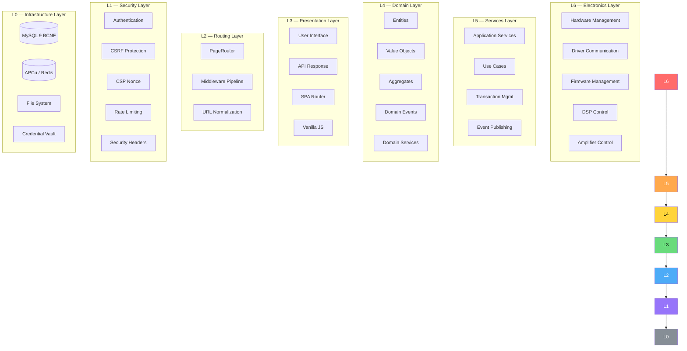
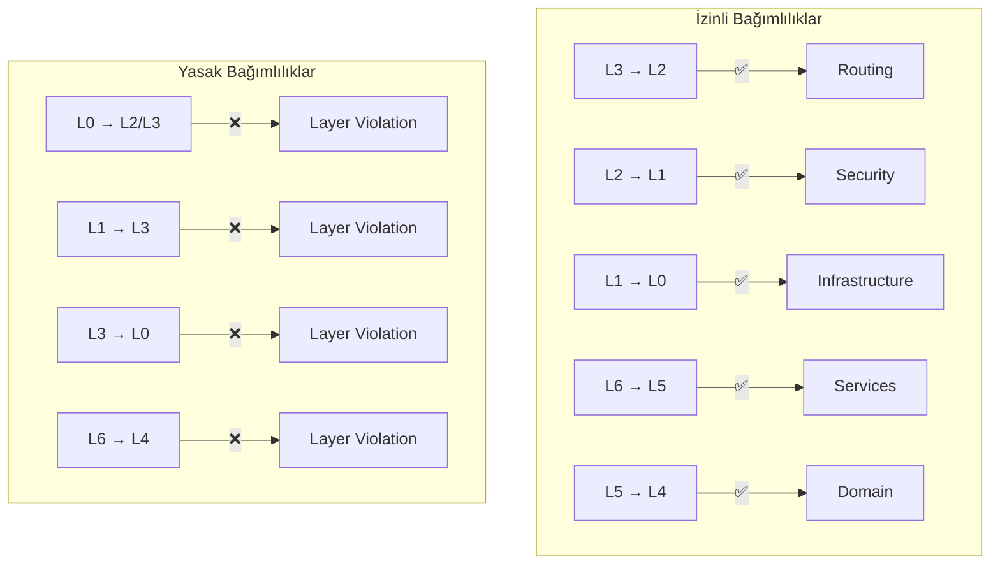
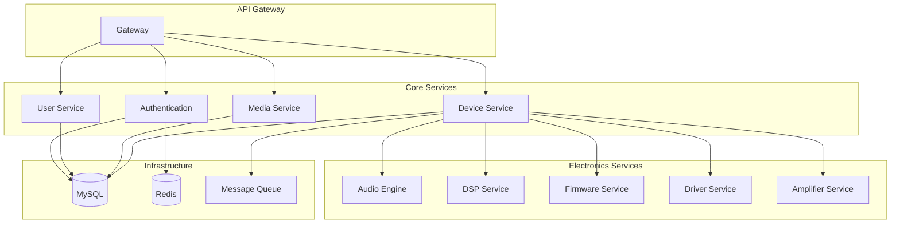
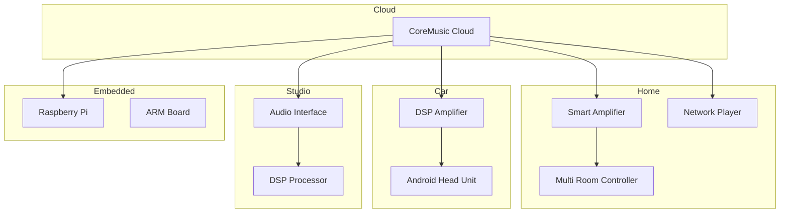
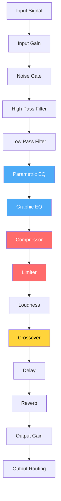
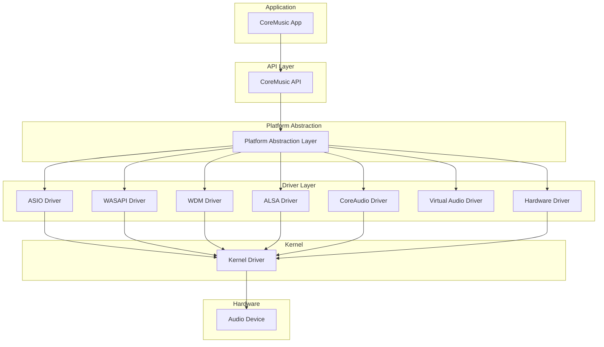
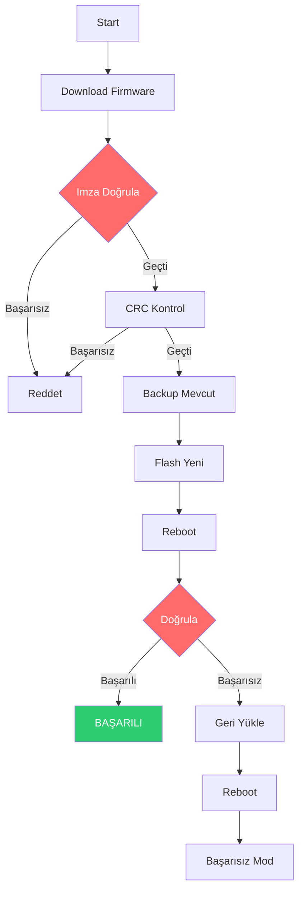
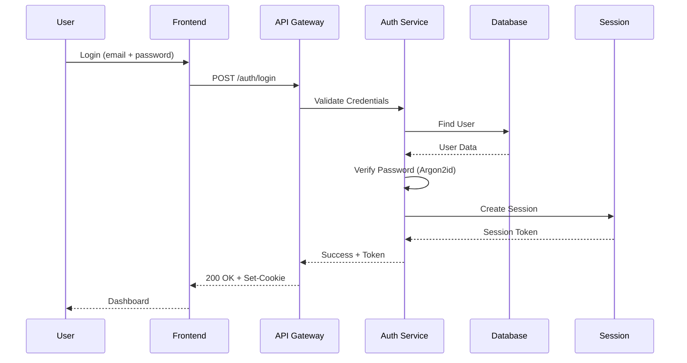

# CoreMusic — System Architecture Diagrams

**See also:** [[architecture/l0-infrastructure]] · [[architecture/l1-security]] · [[architecture/l2-routing]] · [[architecture/l3-presentation]] · [[architecture/l4-domain]] · [[architecture/l5-services]] · [[architecture/l6-electronics]]

---

## 1. L0-L6 Katman Diyagramı

---

## 2. Dependency Flow (Bağımlılık Akışı)

---

## 3. Katman Bağımlılık Matrisi

---

## 4. Service Architecture

---

## 5. Device Ecosystem

---

## 6. Audio Pipeline

```mermaid
graph LR
    IN[Audio Input] --> DEC[Decoder]
    DEC --> NOR[Normalize]
    NOR --> DSP[DSP]
    DSP --> MIX[Mixer]
    MIX --> EQ[Equalizer]
    EQ --> FX[Effects]
    FX --> LIM[Limiter]
    LIM --> ROUT[Output Routing]
    ROUT --> AMP[Amplifier]
    AMP --> SPK[Speaker]

    style DSP fill:#ff6b6b,color:#fff
    style EQ fill:#ffa94d,color:#fff
    style FX fill:#ffd43b,color:#000
```

---

## 7. DSP Pipeline

---

## 8. Driver Stack

---

## 9. Firmware Update Flow

---

## 10. Authentication Flow

---

**Authority:** Bayram Ali / Vault Steward
**Last Updated:** 2026-08-09
**Mode:** Red Team · Human Mode · Truth Mode
