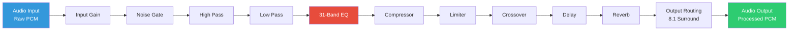

# CoreMusic — Audio Pipeline

```mermaid
graph LR
    INPUT[Audio Input<br/>Raw PCM] --> GAIN[Input Gain]
    GAIN --> GATE[Noise Gate]
    GATE --> HPF[High Pass]
    HPF --> LPF[Low Pass]
    LPF --> EQ[31-Band EQ]
    EQ --> COMP[Compressor]
    COMP --> LIMIT[Limiter]
    LIMIT --> CROSS[Crossover]
    CROSS --> DELAY[Delay]
    DELAY --> REVERB[Reverb]
    REVERB --> ROUTE[Output Routing<br/>8.1 Surround]
    ROUTE --> OUTPUT[Audio Output<br/>Processed PCM]

    style INPUT fill:#3498db,color:#fff
    style OUTPUT fill:#2ecc71,color:#fff
    style EQ fill:#e74c3c,color:#fff
```

---

**Authority:** Bayram Ali / Vault Steward
**Mode:** Red Team · Human Mode · Truth Mode
