# CoreMusic — Electronics Mermaid Diagram Collection

**Zorunlu Bağlantılar:** [[electronic/index]] · [[electronic/platform-architecture]] · [[electronic/device-architecture]] · [[electronic/audio-architecture]] · [[electronic/software-architecture]] · [[electronic/service-architecture]]

---

## 1. Device Architecture — Cihaz Aileleri

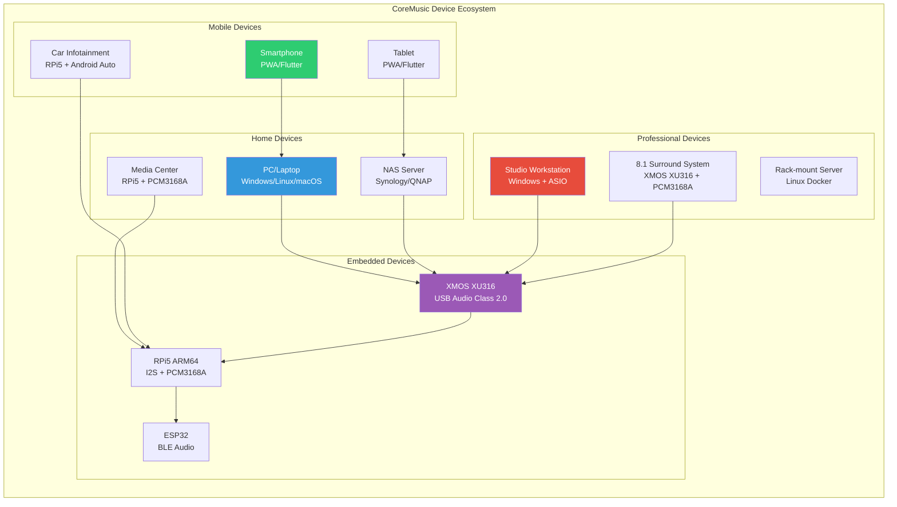

---

## 2. DSP Pipeline — Sinyal İşleme Zinciri

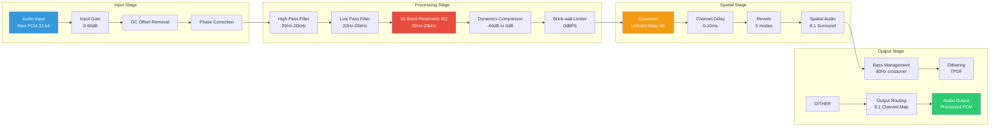

---

## 3. I2S/TDM Connection — XMOS to PCM3168A

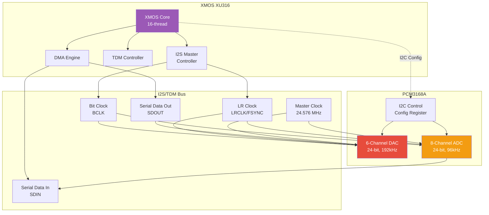

---

## 4. Amplifier Architecture — Class AB 8.1

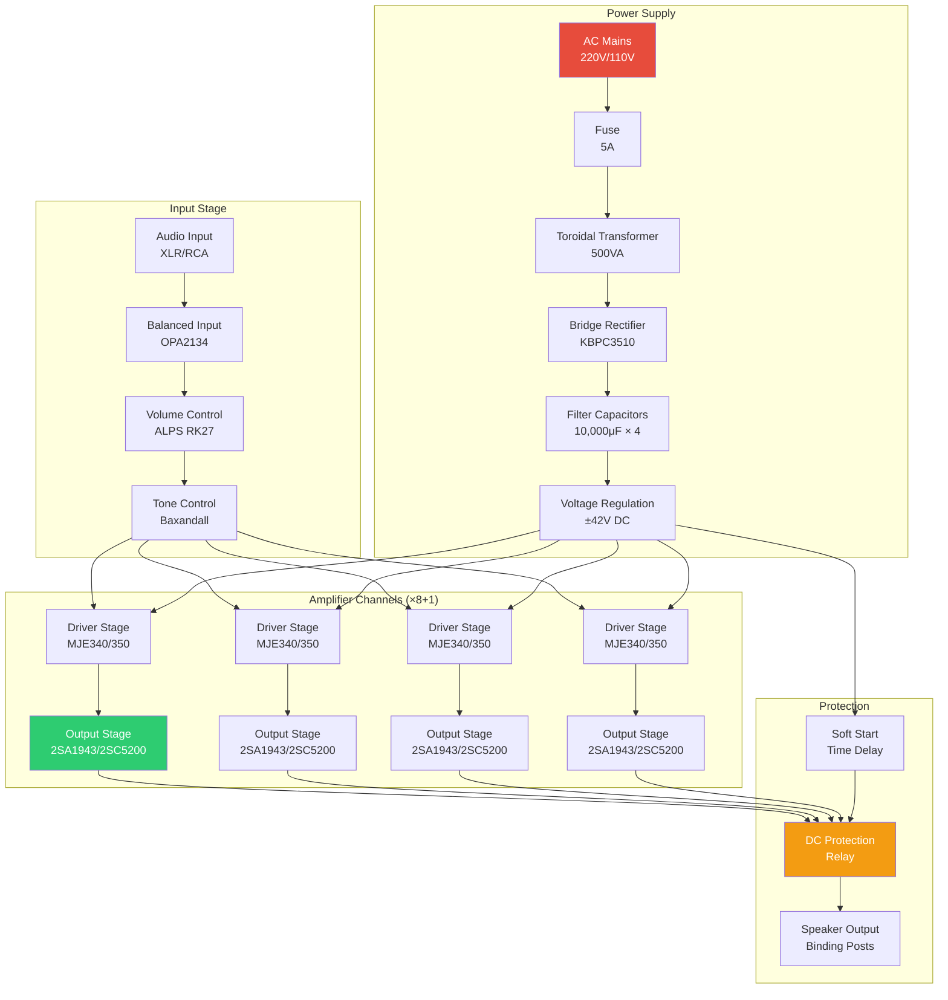

---

## 5. USB Audio Class 2.0 — XMOS USB Pipeline

```mermaid
graph LR
    subgraph "Host (PC/RPi5)"
        USB_H[USB Host<br/>UAC 2.0 Driver]
        ASIO_D[ASIO Driver<br/>Steinberg]
        WASAPI_D[WASAPI Driver<br/>Windows]
    end
    
    subgraph "USB Transport"
        USB_EP1[ISO Endpoint<br/>OUT (Playback)]
        USB_EP2[ISO Endpoint<br/>IN (Capture)]
        USB_CTRL[Control Endpoint<br/>Settings]
    end
    
    subgraph "XMOS XU316"
        USB_D[USB Device<br/>UAC 2.0 Class]
        DECOUPLE[Decoupler Thread<br/>Async FIFO]
        MIXER[Mixer Thread<br/>Volume/Pan]
        HUB[AudioHub Thread<br/>I2S/TDM Master]
    end
    
    subgraph "Audio Output"
        I2S_O[I2S Output<br/>8 channels]
        DAC_O[PCM3168A<br/>6-CH DAC]
        AMP_O[Amplifier<br/>8.1 Surround]
    end
    
    USB_H --> USB_EP1
    USB_H --> USB_EP2
    USB_H --> USB_CTRL
    
    ASIO_D --> USB_H
    WASAPI_D --> USB_H
    
    USB_EP1 --> USB_D
    USB_EP2 --> USB_D
    USB_CTRL --> USB_D
    
    USB_D --> DECOUPLE
    DECOUPLE --> MIXER
    MIXER --> HUB
    
    HUB --> I2S_O
    I2S_O --> DAC_O
    DAC_O --> AMP_O
    
    style USB_H fill:#3498db,color:#fff
    style USB_D fill:#9b59b6,color:#fff
    style HUB fill:#e74c3c,color:#fff
```

---

## 6. Service Architecture — 13 Microservices

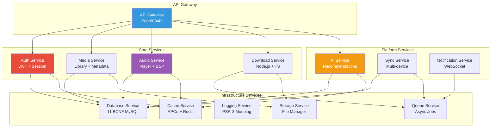

---

## 7. Platform Architecture — 9 Katman

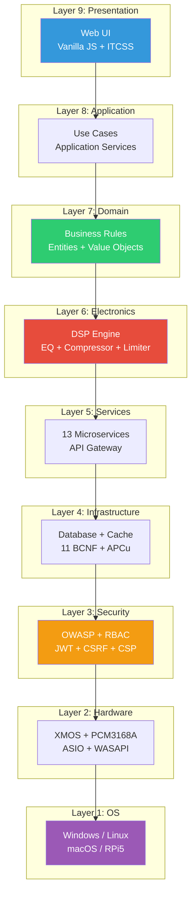

---

## 8. Driver Framework — 4 Sürücü Tipi

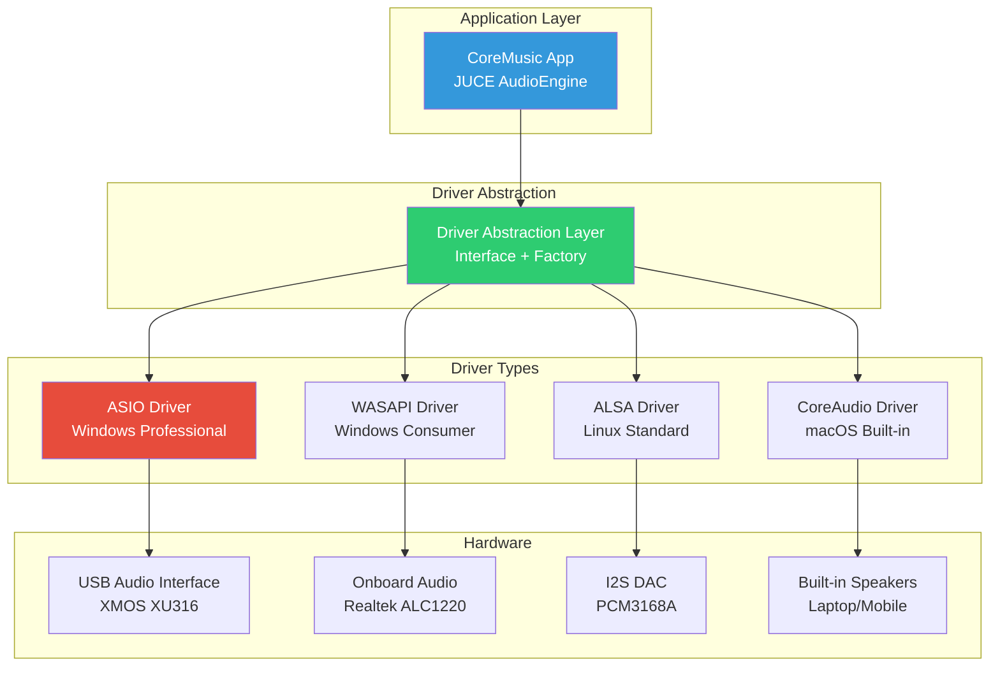

---

## 9. Firmware Architecture — XMOS Boot Sequence

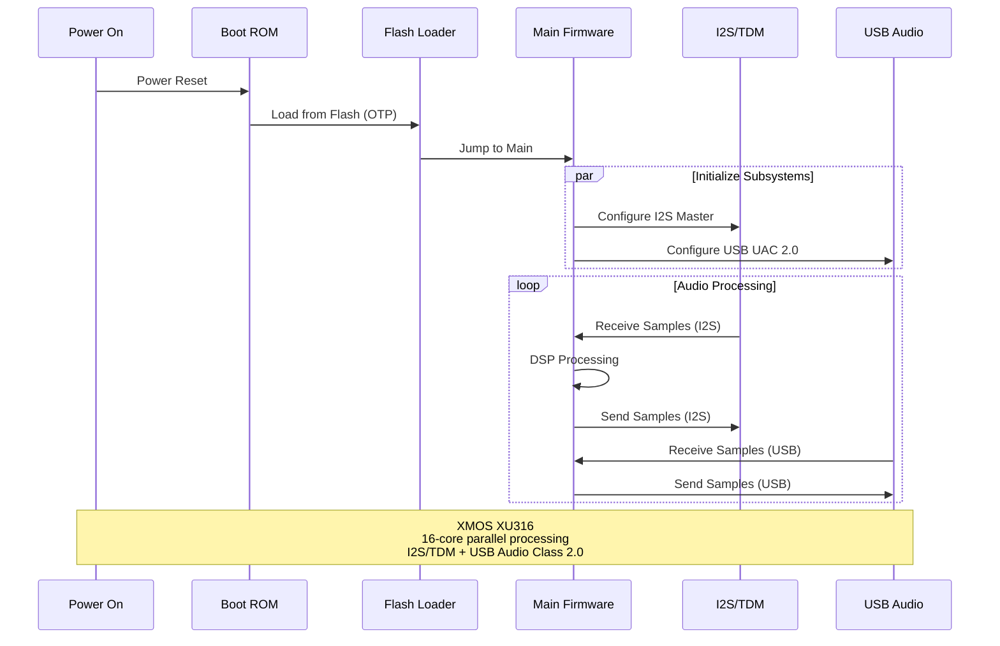

---

## 10. Security Architecture — OWASP 2025

```mermaid
graph TB
    subgraph "OWASP Top 10:2025"
        direction TB
        A01[A01: Broken Access Control]
        A02[A02: Cryptographic Failures]
        A03[A03: Injection]
        A04[A04: Insecure Design]
        A05[A05: Security Misconfiguration]
        A06[A06: Vulnerable Components]
        A07[A07: Auth Failures]
        A08[A08: Data Integrity Failures]
        A09[A09: Logging Failures]
        A10[A10: Exceptional Conditions]
    end
    
    subgraph "CoreMusic Defenses"
        DEF1[RBAC + JWT<br/>Authentication]
        DEF2[AES-256-GCM<br/>Encryption]
        DEF3[PDO Prepared<br/>SQL Injection Prevention]
        DEF4[Secure Design<br/>DDD + CQRS]
        DEF5[CSP + CSRF<br/>Security Headers]
        DEF6[Dependency Audit<br/>Composer + npm]
        DEF7[Argon2id<br/>Password Hashing]
        DEF8[HMAC Validation<br/>Data Integrity]
        DEF9[PSR-3 Logging<br/>Audit Trail]
        DEF10[Error Handling<br/>Graceful Degradation]
    end
    
    A01 --> DEF1
    A02 --> DEF2
    A03 --> DEF3
    A04 --> DEF4
    A05 --> DEF5
    A06 --> DEF6
    A07 --> DEF7
    A08 --> DEF8
    A09 --> DEF9
    A10 --> DEF10
    
    style A01 fill:#e74c3c,color:#fff
    style DEF1 fill:#2ecc71,color:#fff
```

---

## 11. RAG System Integration — AI + Electronics

```mermaid
graph TB
    subgraph "User Query"
        Q[User: "Nasıl 8.1 surround kurarım?"]
    end
    
    subgraph "RAG Pipeline"
        Q --> NLU[Query Understanding<br/>Intent: setup_guide]
        NLU --> RETRIEVE[Retrieval<br/>Vector + BM25]
        RETRIEVE --> RERANK[Reranking<br/>Cross-Encoder]
        RERANK --> GENERATE[Generation<br/>LLM + Context]
    end
    
    subgraph "Knowledge Sources"
        RETRIEVE --> V1[Electronics Vault<br/>ADR-038, hardware docs]
        RETRIEVE --> V2[Architecture Docs<br/>service-architecture]
        RETRIEVE --> V3[Audio Pipeline<br/>DSP chain, routing]
        RETRIEVE --> V4[Driver Framework<br/>ASIO, WASAPI, ALSA]
    end
    
    subgraph "Output"
        GENERATE --> A1[Step-by-step guide<br/>PCM3168A + XMOS config]
        GENERATE --> A2[Code examples<br/>I2S/TDM setup]
        GENERATE --> A3[Hardware diagram<br/>Connection schematic]
    end
    
    style Q fill:#3498db,color:#fff
    style RETRIEVE fill:#9b59b6,color:#fff
    style GENERATE fill:#2ecc71,color:#fff
```

---

## 12. 8.1 Surround Channel Mapping

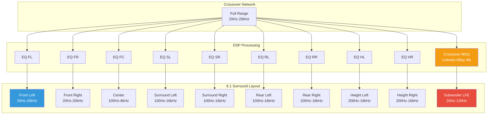

---

## 13. Hardware Block Diagram — Enhanced

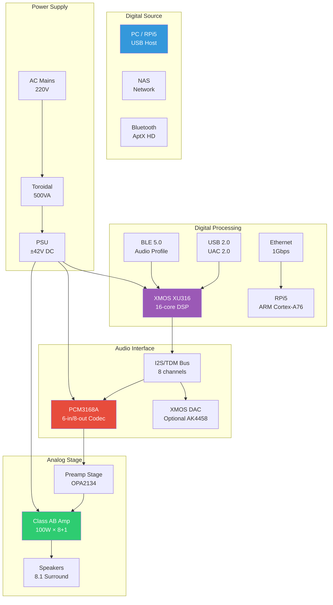

---

## 14. Development Workflow — 20 Faz

```mermaid
graph LR
    subgraph "Phase 1-6: Vision"
        P1[Faz 1: Requirements]
        P2[Faz 2: Use Cases]
        P3[Faz 3: Architecture]
        P4[Faz 4: Design]
        P5[Faz 5: Prototyping]
        P6[Faz 6: Validation]
    end
    
    subgraph "Phase 7-12: Hardware"
        P7[Faz 7: Schematic<br/>⚠️ HARD GATE]
        P8[Faz 8: PCB Layout]
        P9[Faz 9: Fabrication]
        P10[Faz 10: Assembly]
        P11[Faz 11: Firmware]
        P12[Faz 12: Hardware Test]
    end
    
    subgraph "Phase 13-18: Software"
        P13[Faz 13: Driver Dev]
        P14[Faz 14: DSP Implementation]
        P15[Faz 15: UI Integration]
        P16[Faz 16: API Integration]
        P17[Faz 17: Security Audit<br/>⚠️ HARD GATE]
        P18[Faz 18: Performance Test]
    end
    
    subgraph "Phase 19-20: Release"
        P19[Faz 19: Beta Release<br/>⚠️ HARD GATE]
        P20[Faz 20: Production]
    end
    
    P1 --> P2 --> P3 --> P4 --> P5 --> P6
    P6 --> P7 --> P8 --> P9 --> P10 --> P11 --> P12
    P12 --> P13 --> P14 --> P15 --> P16 --> P17 --> P18
    P18 --> P19 --> P20
    
    style P7 fill:#e74c3c,color:#fff
    style P17 fill:#e74c3c,color:#fff
    style P19 fill:#e74c3c,color:#fff
```

---

## 15. Audio Platform Decision Matrix

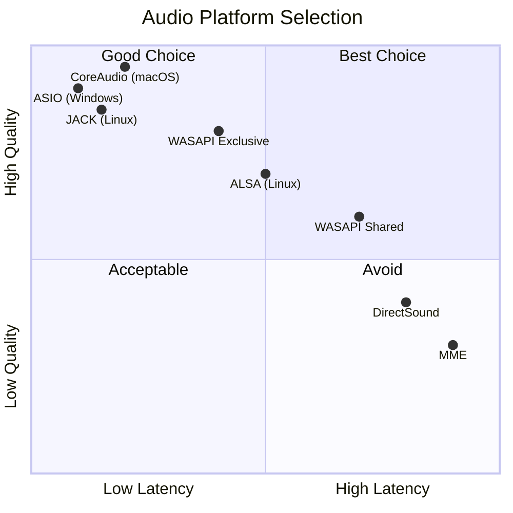

---

## 16. Network Architecture — Service Communication

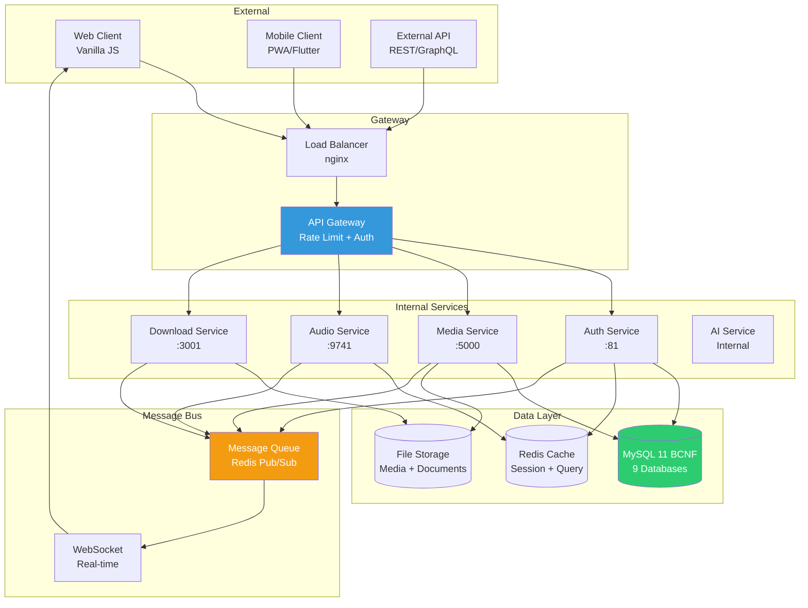

---

## 17. Testing Pyramid — Electronics

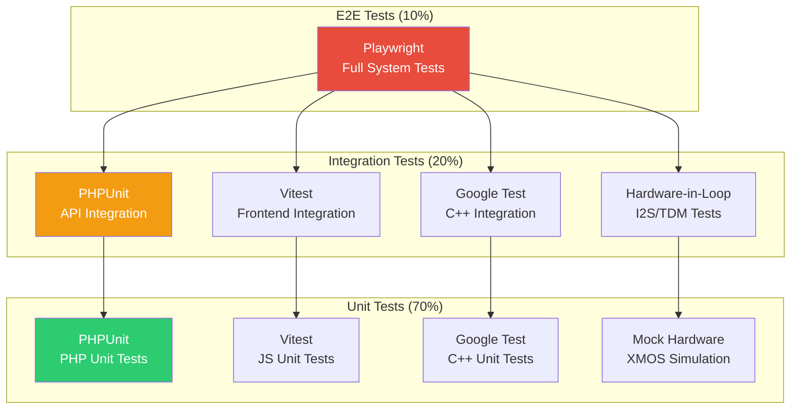

---

## 18. Deployment Modes

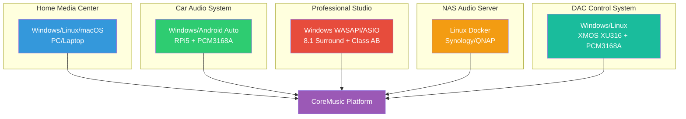

---

## 19. Layer Dependency Matrix

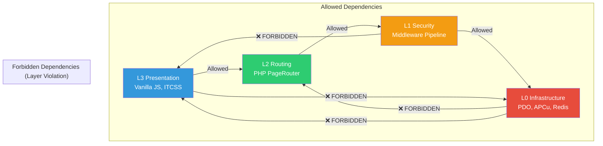

---

## 20. Real-Time Audio Thread Budget

```mermaid
gantt
    title Audio Callback Budget (512 samples @ 48kHz = 10.67ms)
    dateFormat X
    axisFormat %L ms
    
    section Audio Thread
    Input Acquisition      :a1, 0, 1
    DSP Processing         :a2, 1, 6
    Output Routing         :a3, 6, 8
    Buffer Transfer (DMA)  :a4, 8, 10
    
    section Deadline
    Total Budget (10.67ms) :crit, 0, 11
    
    section Safety Margin
    Buffer Underrun Risk   :milestone, 10, 10
```

---

## Quality Report

| Metrik | Değer |
|--------|-------|
| Version | 1.0.0 |
| Status | Red Team · Human Mode · Truth Mode verified |
| Total Diagrams | 20 |
| Diagram Types | Architecture (8), Pipeline (4), Sequence (1), Network (2), Testing (1), Deployment (1), Gantt (1), Quadrant (1), Matrix (2) |
| Mermaid Version | Compatible with Mermaid 10+ |
| Cross References | 6 |

---

**Authority:** Bayram Ali / Vault Steward
**Last Updated:** 2026-08-10
**Mode:** Red Team · Human Mode · Truth Mode
