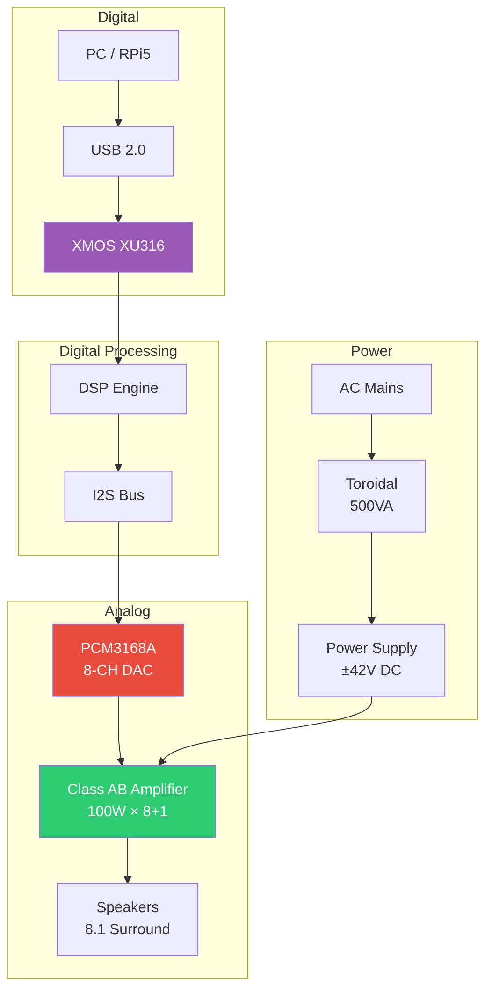

# CoreMusic — Hardware Block Diagram

```mermaid
graph TB
    subgraph Digital
        PC[PC / RPi5] --> USB[USB 2.0]
        USB --> XMOS[XMOS XU316]
    end

    subgraph "Digital Processing"
        XMOS --> DSP[DSP Engine]
        DSP --> I2S[I2S Bus]
    end

    subgraph Analog
        I2S --> DAC[PCM3168A<br/>8-CH DAC]
        DAC --> AMP[Class AB Amplifier<br/>100W × 8+1]
        AMP --> SPK[Speakers<br/>8.1 Surround]
    end

    subgraph Power
        AC[AC Mains] --> TRAFO[Toroidal<br/>500VA]
        TRAFO --> PSU[Power Supply<br/>±42V DC]
        PSU --> AMP
    end

    style XMOS fill:#9b59b6,color:#fff
    style DAC fill:#e74c3c,color:#fff
    style AMP fill:#2ecc71,color:#fff
```

---

**Authority:** Bayram Ali / Vault Steward
**Mode:** Red Team · Human Mode · Truth Mode
