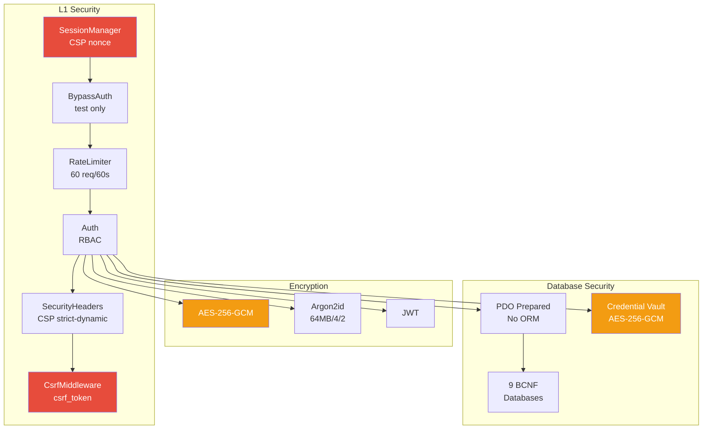

# CoreMusic — Security Layers

```mermaid
graph TB
    subgraph "L1 Security"
        SESSION[SessionManager<br/>CSP nonce]
        BYPASS[BypassAuth<br/>test only]
        RATE[RateLimiter<br/>60 req/60s]
        AUTH[Auth<br/>RBAC]
        HEADERS[SecurityHeaders<br/>CSP strict-dynamic]
        CSRF[CsrfMiddleware<br/>csrf_token]
    end

    subgraph "Encryption"
        AES[AES-256-GCM]
        ARGON[Argon2id<br/>64MB/4/2]
        JWT[JWT]
    end

    subgraph "Database Security"
        PDO[PDO Prepared<br/>No ORM]
        BCNF[9 BCNF<br/>Databases]
        VAULT[Credential Vault<br/>AES-256-GCM]
    end

    SESSION --> BYPASS --> RATE --> AUTH --> HEADERS --> CSRF
    AUTH --> AES
    AUTH --> ARGON
    AUTH --> JWT
    AUTH --> PDO
    PDO --> BCNF
    AUTH --> VAULT

    style SESSION fill:#e74c3c,color:#fff
    style CSRF fill:#e74c3c,color:#fff
    style AES fill:#f39c12,color:#fff
    style VAULT fill:#f39c12,color:#fff
```

---

**Authority:** Bayram Ali / Vault Steward
**Mode:** Red Team · Human Mode · Truth Mode
