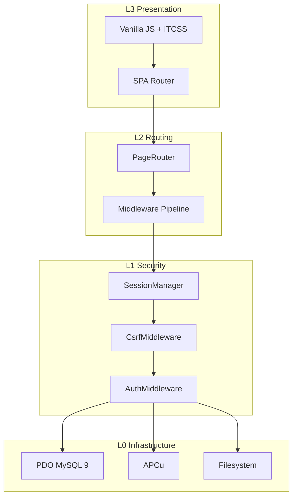

# CoreMusic — System Architecture

```mermaid
graph TB
    subgraph L3["L3 Presentation"]
        UI[Vanilla JS + ITCSS]
        SPA[SPA Router]
    end

    subgraph L2["L2 Routing"]
        PR[PageRouter]
        MW[Middleware Pipeline]
    end

    subgraph L1["L1 Security"]
        SESSION[SessionManager]
        CSRF[CsrfMiddleware]
        AUTH[AuthMiddleware]
    end

    subgraph L0["L0 Infrastructure"]
        PDO[PDO MySQL 9]
        CACHE[APCu]
        FS[Filesystem]
    end

    UI --> SPA
    SPA --> PR
    PR --> MW
    MW --> SESSION
    SESSION --> CSRF
    CSRF --> AUTH
    AUTH --> PDO
    AUTH --> CACHE
    AUTH --> FS
```

---

**Authority:** Bayram Ali / Vault Steward
**Mode:** Red Team · Human Mode · Truth Mode
