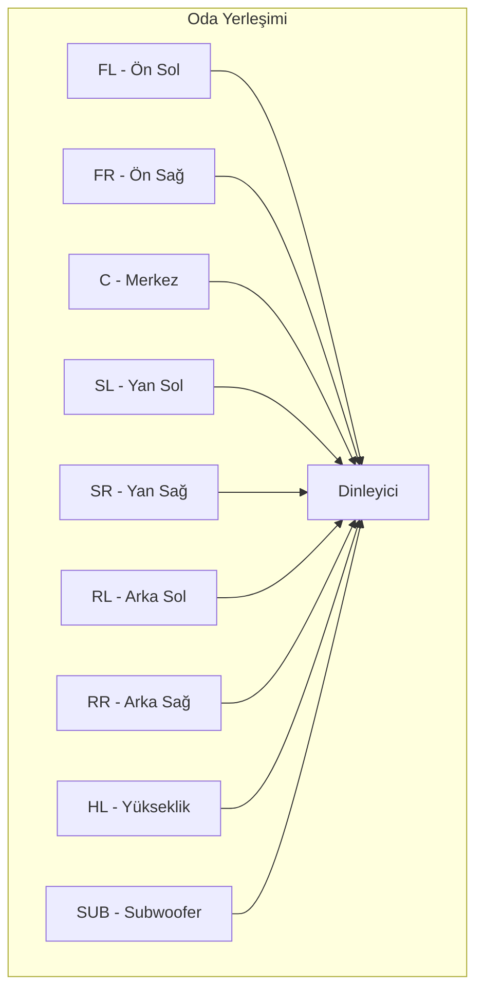
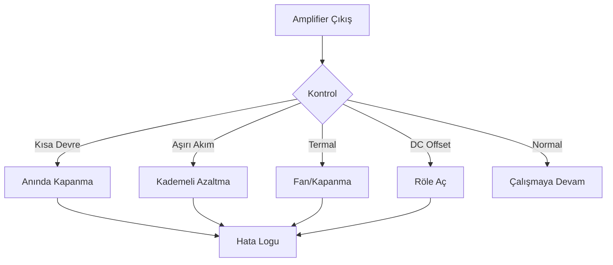
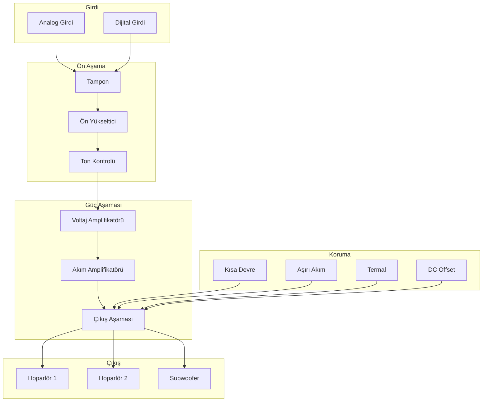

# CoreMusic — Amplifier Architecture

**Zorunlu Bağlantılar:** [[CLAUDE.md]] · [[AGENTS.md]] · [[WORKFLOW.md]] · [[index.md]] · [[keys.md]] · [[brain.md]] · [[MEMORY.md]] · [[log.md]]

---

## 1. Amaç

CoreMusic ELECTRONICS'in yükseltici mimarisi. Amplifier türleri, kanal yapıları, güç seviyeleri, koruma sistemleri, soğutma, PSU, gain stage, hoparlör yönetimi ve amplifier manager'ı kapsar.

---

## 2. Amplifier Türleri

### 2.1 Class A

| Özellik | Değer |
|---------|-------|
| Verimlilik | %25–50 |
| Kalite | En yüksek (doyma yok) |
| Isı | En yüksek |
| Bias | Sürekli akım |
| Kullanım | Stüdyo, high-end |

### 2.2 Class AB

| Özellik | Değer |
|---------|-------|
| Verimlilik | %50–70 |
| Kalite | İyi denge |
| Isı | Orta |
| Kullanım | **CoreMusic varsayılan** |

**CoreMusic Class AB Spesifikasyonları:**
| Parametre | Değer |
|-----------|-------|
| Çıkış Gücü | 100W @ 8Ω |
| THD+N | < %0.01 |
| SNR | > 100dB |
| Frekans Yanıtı | 20Hz–20kHz (±0.5dB) |
| Kanal Ayrımı | > 80dB |
| Damping Factor | > 100 |

### 2.3 Class D

| Özellik | Değer |
|---------|-------|
| Verimlilik | %85–95 |
| Kalite | İyi (PLL filtre gerekir) |
| Isı | Düşük |
| Kullanım | Araç, taşınabilir |

### 2.4 Hybrid

| Özellik | Değer |
|---------|-------|
| Avantaj | Sınıfların birleşimi |
| Kalite | Yüksek |
| Uygulama | Özel tasarımlar |

### 2.5 Sınıf Karşılaştırma

| Sınıf | Verimlilik | Kalite | Isı | Boyut | Uygulama |
|-------|-----------|--------|-----|-------|----------|
| A | %25–50 | En yüksek | En yüksek | Büyük | Stüdyo |
| AB | %50–70 | İyi | Orta | Orta | **CoreMusic** |
| D | %85–95 | İyi | Düşük | Küçük | Araç |
| Hybrid | %70–90 | Yüksek | Orta | Orta | Özel |

---

## 3. Kanal Konfigürasyonları

### 3.1 Yapı Tablosu

| Konfigürasyon | Kanallar | Hoparlör | Varsayılan mı? |
|---------------|----------|----------|---------------|
| Stereo | 2 | 2 hoparlör | Hayır |
| 2.1 | 2+1 | 2 hoparlör + sub | Hayır |
| 5.1 | 5+1 | FL/FR/C/SL/SR + Sub | Hayır |
| 7.1 | 7+1 | FL/FR/C/SL/SR/RL/RR + Sub | Hayır |
| **8.1** | **8+1** | **FL/FR/C/SL/SR/RL/RR/HL + Sub** | **Evet** |

### 3.2 8.1 Kanal Yerleşimi

| Kanal | Kısaltma | Pozisyon | Frekans Aralığı |
|-------|----------|----------|----------------|
| Front Left | FL | Ön sol | 20Hz–20kHz |
| Front Right | FR | Ön sağ | 20Hz–20kHz |
| Center | C | Ön merkez | 100Hz–8kHz |
| Surround Left | SL | Yan sol | 100Hz–16kHz |
| Surround Right | SR | Yan sağ | 100Hz–16kHz |
| Rear Left | RL | Arka sol | 100Hz–16kHz |
| Rear Right | RR | Arka sağ | 100Hz–16kHz |
| Height | HL | Yükseklik | 200Hz–16kHz |
| Subwoofer | SUB | Alt frekans | 20Hz–120Hz |

### 3.3 Kanal Yerleşim Diyagramı

---

## 4. Güç Seviyeleri

| Seviye | Watt (8Ω) | Watt (4Ω) | Uygulama |
|--------|-----------|-----------|----------|
| Micro | 10W | 20W | Masaüstü |
| Mini | 35W | 70W | Küçük oda |
| Kompakt | 50W | 100W | Orta oda |
| **Standart** | **100W** | **200W** | **CoreMusic** |
| Güçlü | 250W | 500W | Salon |
| Ultra | 500W | 1000W | Büyük salon |
| Mega | 1000W | 2000W | Konser |
| Extreme | 2000W | — | MAX |

### 4.1 Güç ve Empedans

| Empedans | 10W | 50W | 100W | 250W | 500W | 1000W |
|----------|-----|-----|------|------|------|-------|
| 8Ω | 9V | 20V | 28V | 45V | 63V | 89V |
| 4Ω | 6.3V | 14V | 20V | 32V | 45V | 63V |
| 2Ω | 4.5V | 10V | 14V | 22V | 32V | 45V |

---

## 5. Gain Stage

### 5.1 Gain Stage Diyagramı

### 5.2 Gain Stage Parametreleri

| Aşama | Parametre | Aralık | Varsayılan |
|-------|-----------|--------|------------|
| Input Gain | Kazanç | -∞ ile +12 dB | 0 dB |
| Volume | Seviye | -∞ ile 0 dB | 0 dB |
| Balance | Sol/Sağ | -100% ile +100% | 0% |
| Voltage Gain | Voltaj | Cihaza özel | Sabit |
| Current Gain | Akım | Cihaza özel | Sabit |

---

## 6. Koruma Sistemleri

| Koruma | Tetikleme | Tepki | Süre | Öncelik |
|--------|-----------|-------|------|---------|
| Kısa Devre | 0Ω çıkış | Anında kapanma | <1µs | CRITICAL |
| Aşırı Akım | >max akım | Kademeli azaltma | <100µs | CRITICAL |
| Aşırı Gerilim | >max voltaj | Güç kesme | <100µs | CRITICAL |
| Ters Polarite | Ters +/− | Koruma rölesi | Anında | HIGH |
| Termal | >80°C | Fan ↑, >100°C kapanma | Sürekli | HIGH |
| DC Offset | >0.5V DC | Röle aç | <10ms | CRITICAL |
| Hoparlör Rölesi | Açma/kapama | Gecikmeli bağlantı | 500ms | MEDIUM |

### 6.1 Koruma Akışı

---

## 7. Soğutma

### 7.1 Soğutma Türleri

| Tür | Özellik | Kullanım |
|-----|---------|----------|
| Pasif | Alüminyum heatsink | Düşük–orta güç |
| Aktif | Fan + heatsink | Yüksek güç |
| Heatpipe | Isı iletimi | Kompakt tasarım |
| Sıvı Soğutma | Su/soğutucu | Ultra yüksek güç |

### 7.2 Fan Kontrolü

| Sensör | Aksiyon |
|--------|---------|
| 40°C | Fan başlar (minimum hız) |
| 60°C | Fan hızı %50 |
| 80°C | Fan hızı %100 |
| 100°C | Kapanma |

---

## 8. PSU (Power Supply)

### 8.1 PSU Türleri

| Tür | Verimlilik | Gürültü | Boyut | Kullanım |
|-----|-----------|---------|-------|----------|
| Doğrusal | %40–60 | En düşük | Büyük | Stüdyo |
| Anahtarlamalı | %80–95 | Orta | Küçük | Genel |
| Dual Rail | Değişken | Düşük | Orta | Simetrik güç |

### 8.2 Güç Sıralaması

| Sıra | Bölge | Bekleme |
|------|-------|---------|
| 1 | Ana Güç | — |
| 2 | CPU/MCU | — |
| 3 | DSP | 10ms |
| 4 | Analog (DAC/ADC) | 20ms |
| 5 | Amplifier | 50ms |

---

## 9. Hoparlör Yönetimi

### 9.1 Hoparlör Parametreleri

| Parametre | Aralık | Varsayılan | Açıklama |
|-----------|--------|------------|----------|
| Volume | -∞ ile 0 dB | 0 dB | Seviye ayarı |
| Delay | 0–100ms | 0ms | Mesafe telafisi |
| Phase | 0° / 180° | 0° | Faz uyumu |
| Gain | -∞ ile +12 dB | 0 dB | Kanal dengesi |
| Mute | On/Off | Off | Sessizlik |
| Crossover | 40–200Hz | 80Hz | Alt frekans geçişi |

### 9.2 Hoparlör Mesafe Ayarı

| Kanal | Tipik Mesafe | Gecikme |
|-------|-------------|---------|
| FL/FR | 2–3m | 0ms |
| C | 2–3m | 0ms |
| SL/SR | 1.5–2.5m | 0–5ms |
| RL/RR | 1–2m | 0–5ms |
| HL | 2–3m | 0–5ms |
| SUB | Değişken | 0–10ms |

---

## 10. Amplifier Manager

### 10.1 Manager Özellikleri

| Özellik | Görev |
|---------|-------|
| Gain Control | Per-channel gain ayarı |
| Mute Control | Tekli/çoklu mute |
| Soft Start | Açılışta yumuşak başlangıç |
| Soft Stop | Kapanışta yumuşak kapatma |
| Sıcaklık İzleme | Sürekli sıcaklık ölçümü |
| Clip Detection | Sinyal doyma tespiti |
| VU Meter | Seviye göstergesi |

### 10.2 Amplifier Durumları

| Durum | LED | Davranış |
|-------|-----|----------|
| Kapalı | Kırmızı (sabit) | Güç yok |
| Bekleme | Sarı (sabit) | Güç var, çıkış yok |
| Aktif | Yeşil (sabit) | Çalışıyor |
| Uyarı | Sarı (yanıp sönme) | Sıcaklık yüksek |
| Hata | Kırmızı (yanıp sönme) | Koruma aktif |
| Mute | Turuncu (sabit) | Sessiz mod |

---

## 11. Performans Metrikleri

| Metrik | Hedef |
|--------|-------|
| THD+N | < %0.01 |
| SNR | > 100dB |
| Frekans Yanıtı | 20Hz–20kHz (±0.5dB) |
| Gecikme | < 1ms |
| Kanal Ayrımı | > 80dB |
| Damping Factor | > 100 |

---

## 12. Mermaid: Amplifier Mimarisi

---

## 13. İlgili ADR'ler

| ADR | Konu |
|-----|------|
| [[decisions/accepted/ADR-038-8.1-sound-card-chip-selection]] | 8.1 ses kartı çip seçimi |
| [[decisions/accepted/ADR-061-electronics-architecture]] | Elektronik mimarisi (L6 katmanı) |
| [[decisions/accepted/ADR-063-hardware-design-standards]] | Donanım tasarım standartları |

---

## 14. İlgili Dosyalar

| Dosya | Amaç |
|-------|------|
| [[electronic/index]] | Elektronik indeksi |
| [[electronic/amplifier/index]] | Yükseltici mimarisi |
| [[electronic/audio-architecture]] | Ses mimarisi |
| [[electronic/hardware-design]] | Donanım tasarım rehberi |
| [[electronic/dsp-engine-architecture]] | DSP motoru |

---

## 15. Quality Report

| Metrik | Değer |
|--------|-------|
| Version | 2.0.0 |
| Status | Red Team · Human Mode · Truth Mode verified |
| Sections | 15 |
| ADR References | 3 |
| Mermaid Diagrams | 3 |
| Amplifier Classes | 4 (A, AB, D, Hybrid) |
| Channel Configs | 6 (Mono → 8.1) |
| Power Levels | 8 (10W–2000W) |
| Protection Systems | 7 |
| Cooling Types | 4 |
| PSU Types | 3 |
| Speaker Parameters | 6 |

---

**Authority:** Bayram Ali / Vault Steward
**Last Updated:** 2026-08-09
**Mode:** Red Team · Human Mode · Truth Mode
