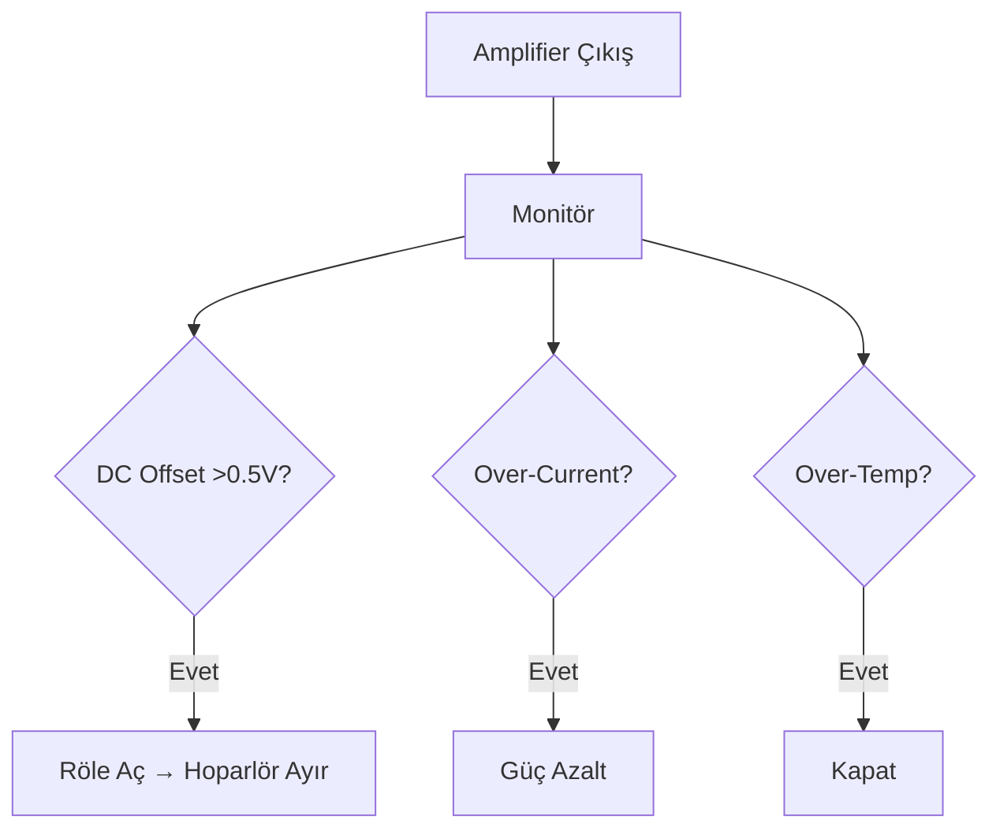

# CoreMusic — Amplifier Protection

**See also:** [[electronic/amplifier/index]] · [[electronic/hardware/test-protocols]]

---

## 1. Amaç

Amplifier Protection Circuits, CoreMusic amfi koruma devrelerini tanımlar. Hoparlör ve amfi güvenliğini sağlar.

---

## 2. Koruma Türleri

| Koruma | Tetikleme | Aksiyon |
|--------|-----------|---------|
| DC Offset | >±0.5V DC | Röle ile hoparlör ayırma |
| Over-Current | >5A tepe akım | Güç azaltma |
| Over-Temperature | >80°C | Sistemi kapatma |
| Short-Circuit | Çıkış kısa devre | Hemen kapatma |
| Over-Voltage | >±48V DC | Güç azaltma |
| Soft-Start | İlk açılış | 2 saniye gecikme |

---

## 3. Koruma Devresi Akışı

---

## 4. Soft-Start Devresi

| Parametre | Değer |
|-----------|-------|
| Gecikme | 2 saniye |
| Rush Current | Sınırlı |
| Kapasitör Şarj | Yavaş |
| Röle Kapanma | Gecikmeli |

---

## 5. ADR Referansları

| ADR | Konu |
|-----|------|
| [[ADR-038-8.1-sound-card-chip-selection]] | Donanım seçimi |
| [[ADR-008-bypass-auth-middleware]] | Auth bypass (koruma) |

---

**Authority:** Bayram Ali / Vault Steward
**Last Updated:** 2026-08-09
**Mode:** Red Team · Human Mode · Truth Mode
