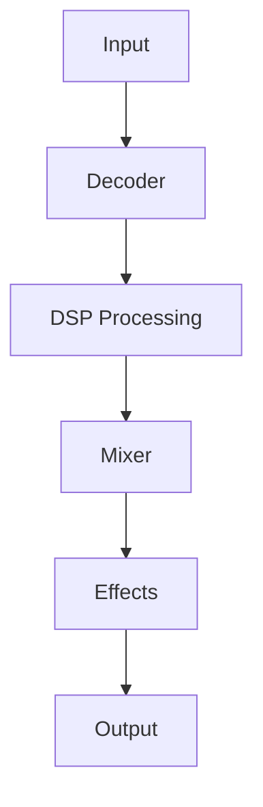
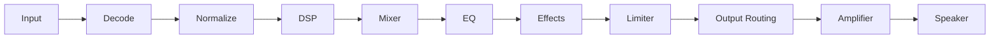
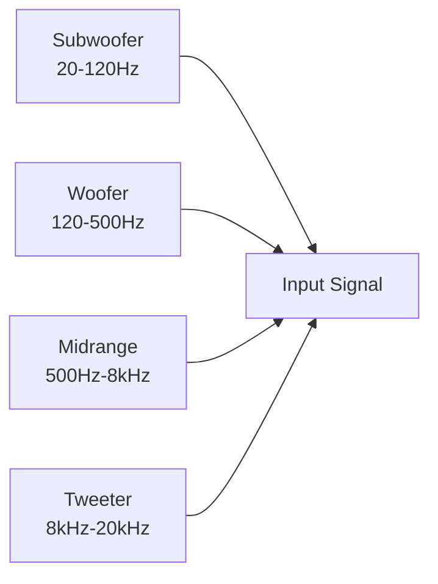
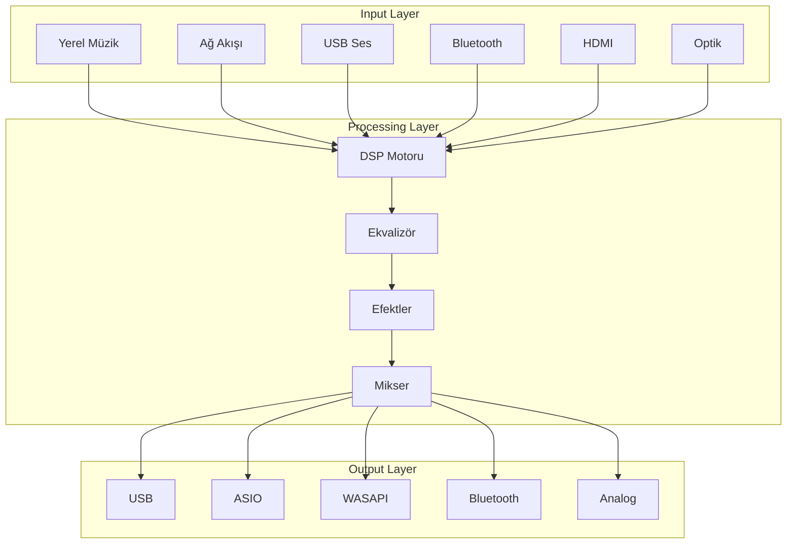

# CoreMusic — Audio Architecture

**Zorunlu Bağlantılar:** [[electronic/core-music-electronics-overview]] · [[electronic/platform-architecture]] · [[electronic/device-architecture]] · [[electronic/operating-system-architecture]] · [[ADR-062-dsp-pipeline-architecture]]

---

## 1. Amaç

CoreMusic ELECTRONICS'in en kritik bileşeni olan Ses Mimarisi, müzik çalma, girdi yakalama, işleme, yönlendirme, dönüştürme, filtreleme, analiz, yükseltme ve dağıtma süreçlerini yönetir. Gerçek zamanlı (real-time) olarak tasarlanmıştır.

---

## 2. Ses Motoru Katmanları

| Katman | Görev |
|--------|-------|
| **Input** | Girdi kaynağı yönetimi (lokal, ağ, USB, BT) |
| **Decoder** | Ses formatı çözümleme (MP3, FLAC, WAV vb.) |
| **DSP Processing** | EQ, compressor, limiter, crossover |
| **Mixer** | Çoklu kanal karıştırma |
| **Effects** | Reverb, delay, echo, spatial |
| **Output** | Çıktı yönlendirme (ASIO, WASAPI, ALSA) |

---

## 3. Ses Hattı (Audio Pipeline)

Her aşama bağımsız bir modüldür:

1. **Input** → 2. **Decode** → 3. **Normalize** → 4. **DSP** → 5. **Mixer** → 6. **EQ** → 7. **Effects** → 8. **Limiter** → 9. **Output Routing** → 10. **Amplifier** → 11. **Speaker**

---

## 4. Desteklenen Formatlar

| Biçim | Açıklama | Tür |
|-------|----------|-----|
| MP3 | MPEG-1 Audio Layer III | Kayıplı |
| FLAC | Free Lossless Audio Codec | Kayıpsız |
| WAV | Waveform Audio File Format | Ham |
| AAC | Advanced Audio Coding | Kayıplı |
| OGG | Ogg Vorbis | Kayıplı |
| OPUS | Opus Interactive Audio Codec | Kayıplı |
| AIFF | Audio Interchange File Format | Ham |
| ALAC | Apple Lossless Audio Codec | Kayıpsız |
| WMA | Windows Media Audio | Kayıplı |
| DSD | Direct Stream Digital | Ham |
| PCM | Pulse-Code Modulation | Ham |

---

## 5. DSP Hattı (DSP Pipeline)

| Aşama | Görev |
|-------|-------|
| Input Signal | Ham girdi sinyali |
| Input Gain | Girdi seviyesi ayarı |
| Noise Gate | Gürültü engelleme |
| HPF | High-pass filtre |
| LPF | Low-pass filtre |
| Parametric EQ | Parametrik equalizer |
| Graphic EQ | Grafik equalizer |
| Compressor | Sinyal sıkıştırma |
| Limiter | Sinyal sınırlama |
| Loudness | Yoğunluk ayarı |
| Crossover | Frekans bölme |
| Delay | Gecikme efekti |
| Reverb | Yankı efekti |
| Output Gain | Çıktı seviyesi ayarı |
| Output Routing | Çıktı yönlendirme |

---

## 6. Ekvalizör Tipleri

| Tip | Bant Sayısı | Parametreler |
|-----|-------------|--------------|
| Graphic | 2-31 bant | Kazanç (dB) |
| Parametric | 2-31 bant | Frekans, Kazanç, Q Faktörü |

---

## 7. Ses Efektleri

### 7.1 Dinamikler
- **Compressor** — Sinyal sıkıştırma
- **Limiter** — Sinyal sınırlama
- **Gate** — Gürültü engelleme
- **Expander** — Sinyal genişletme

### 7.2 Frekans
- **Graphic EQ** — Grafik equalizer
- **Parametric EQ** — Parametrik equalizer
- **FIR** — Finite Impulse Response
- **IIR** — Infinite Impulse Response

### 7.3 Mekânsal
- **Reverb** — Yankı
- **Delay** — Gecikme
- **Echo** — Yankı tekrarı
- **Stereo Genişliği** — Stereo genişletme
- **Surround Geliştirme** — Surround geliştirme

### 7.4 Bas
- **Bass Boost** — Bas güçlendirme
- **Bass Management** — Bas yönetimi
- **LFE Yönlendirmesi** — Subwoofer yönlendirme
- **Subwoofer Kazancı** — Subwoofer seviyesi

---

## 8. Geçirgen (Crossover) Motoru

| Özellik | Değer |
|---------|-------|
| Topoloji | Linkwitz-Riley 4. nesil |
| Varsayılan Geçiş Noktası | 80Hz |
| Kanal Çıkışları | Her kanal için bağımsız |
| Frekans Bantları | Yapılandırılabilir |
| Subwoofer | 20-120Hz |
| Woofer | 120-500Hz |
| Midrange | 500Hz-8kHz |
| Tweeter | 8kHz-20kHz |

---

## 9. Kanal Konfigürasyonları

| Konfigürasyon | Kanallar |
|---------------|----------|
| Stereo 2.0 | Sol, Sağ |
| Subwoofer 2.1 | Sol, Sağ, LFE |
| Surround 5.1 | Ön L/R, Merkez, Arka L/R, LFE |
| Surround 7.1 | Ön + Arka + Yan + Merkez + LFE |
| **Surround 8.1 (Varsayılan)** | Ön L/R + Merkez + Arka L/R + Yan L/R + Yükseklik + LFE |
| Profesyonel Mono | Tek kanal |
| Profesyonel Çift Mono | İki bağımsız kanal |
| Profesyonel Çok Kanallı | Çoklu kanal |

---

## 10. Mikser Motoru

Birden fazla kaynağı eşzamanlı olarak yönetir:
- Kaynak seviye dengeleme
- Pan kontrolü
- Solo/Mute
- Bus yönlendirme
- Alt mikser oluşturma

---

## 11. Ses Yönlendirme

Herhangi bir girdi → herhangi bir çıktıyı yönlendirir:
- Esnek yönlendirme matrisi
- Çoklu çıkış hedefleme
- Paralel yönlendirme
- Öncelik tabanlı yönlendirme

---

## 12. Çıktı Yöneticisi

| Çıktı Türü | Teknoloji |
|------------|-----------|
| USB Ses | USB Audio Class 1/2 |
| ASIO | ASIO SDK 2.3.4 |
| WASAPI | Windows Audio Session API |
| ALSA | Advanced Linux Sound Architecture |
| CoreAudio | macOS/iOS Audio |
| HDMI | HDMI Audio |
| Bluetooth | A2DP, aptX, LDAC |
| Optik | S/PDIF, TOSLINK |
| Analog | RCA, TRS, XLR |

---

## 13. Yükseltici (Amplifier) Yöneticisi

| Özellik | Açıklama |
|---------|----------|
| Kazanç | Ayarlanabilir |
| Sessiz | Mute |
| Yumuşak Başlangıç/Durak | Soft Start/Stop |
| Sıcaklık İzleme | Thermal Monitor |
| Koruma | Protection |
| Klip Algılama | Clip Detection |

---

## 14. Hoparlör Yöneticisi

| Parametre | Açıklama |
|-----------|----------|
| Ses Seviyesi | Volume |
| Gecikme | Delay |
| Faz | Phase |
| Kazanç | Gain |
| Sessiz | Mute |
| Mesafe | Distance |
| Frekans Aralığı | Frequency Range |

---

## 15. Yapay Zeka Ses Motoru

| Özellik | Açıklama |
|---------|----------|
| Oda Akustiği | Room acoustics analysis |
| Hoparlör Yerleşimi | Speaker placement optimization |
| Frekans Analizi | Frequency analysis |
| Gürültü Analizi | Noise analysis |
| Faz Analizi | Phase analysis |
| Bozulma Analizi | Distortion analysis |
| Otomatik EQ | Auto EQ |
| Otomatik Crossover | Auto crossover |

---

## 16. Performans Hedefleri

| Metrik | Hedef |
|--------|-------|
| Gecikme | Ultra düşük (10ms altı) |
| Gerçek Zamanlı | Kesintisiz işleme |
| Kararlılık | Sistem kararlılığı |
| CPU/Kullanım | Düşük |
| Bellek Kullanımı | Düşük |
| Kesintisiz Çalma | Seamless playback |
| Yüksek Kanal Kapasitesi | 8+ kanal desteği |

---

## 17. Modüler Yapı

---

## 18. İlgili ADR'ler

| ADR | Konu |
|-----|------|
| [[decisions/accepted/ADR-017-dsp-hardware-mode]] | DSP donanım modu |
| [[decisions/accepted/ADR-038-8.1-sound-card-chip-selection]] | 8.1 ses kartı çip seçimi |
| [[decisions/accepted/ADR-062-dsp-pipeline-architecture]] | DSP hattı mimarisi |

---

## 19. İlgili Dosyalar

| Dosya | Amaç |
|-------|------|
| [[electronic/index]] | Elektronik indeksi |
| [[electronic/dsp/index]] | DSP motoru |
| [[electronic/amplifier/index]] | Yükseltici mimarisi |
| [[electronic/drivers/index]] | Sürücü çerçevesi |
| [[electronic/hardware/index]] | Donanım tasarımı |
| [[electronic/firmware/index]] | Firmware mimarisi |

---

## 20. Quality Report

| Metrik | Değer |
|--------|-------|
| Version | 2.0.0 |
| Status | Red Team · Human Mode · Truth Mode verified |
| Sections | 20 |
| ADR References | 3 |
| Mermaid Diagrams | 5 |
| Input Sources | 10 |
| Audio Formats | 11 |
| DSP Stages | 15 |
| Channel Configurations | 8 |
| Output Types | 9 |
| AI Features | 8 |

---

**Authority:** Bayram Ali / Vault Steward
**Last Updated:** 2026-08-09
**Mode:** Red Team · Human Mode · Truth Mode