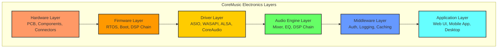

# CoreMusic Electronics Overview

**Zorunlu Bağlantılar:** [[architecture/l6-electronics]] · [[electronic/platform-architecture]] · [[electronic/device-architecture]] · [[electronic/software-architecture]] · [[electronic/service-architecture]] · [[electronic/audio-architecture]] · [[electronic/operating-system-architecture]]

---

## 1. Amaç

CoreMusic ELECTRONICS, CoreMusic platformunun **fiziksel donanım katmanını yöneten elektronik sistem mimarisidir.** Amaç, aynı yazılım mimarisini kullanarak farklı elektronik cihazların geliştirilmesini sağlamaktır.

- Fiziksel donanım ile yazılım arasındaki köprü
- Ortak mühendislik platformu yaklaşımı
- AI destekli elektronik geliştirme
- Çoklu cihaz ailesi desteği

---

## 2. Vizyon

Aynı yazılım mimarisiyle farklı elektronik cihazların geliştirilmesini sağlamak:

| Cihaz Ailesi | Açıklama | Örnekler |
|--------------|----------|----------|
| Professional Audio | Stüdyo ses donanımı | Audio interface, Rack DSP, Mixer |
| Home Audio | Ev ses sistemleri | Amplifikatör, Receiver, Streaming |
| Car Audio | Araç içi ses | DSP Amplifikatör, Head Unit |
| Embedded Audio | Gömülü sistemler | RPi HAT, ARM Board, Linux Device |
| Development Boards | Geliştirme kartları | Eval Board, Prototype Board |

---

## 3. Felsefe

**Tüm katmanlar birlikte geliştirilir** — sadece firmware değil:

| Katman | Kapsam |
|--------|--------|
| **Hardware** | PCB, bileşenler, güç dağıtımı, EMI/EMC |
| **Firmware** | RTOS, boot loader, DSP chain |
| **Driver** | İşletim sistemi sürücüleri (ASIO, WASAPI, ALSA) |
| **Audio Engine** | Mixer, EQ, compressor, limiter, crossover |
| **Middleware** | Auth, logging, caching, rate limiting |
| **Application** | Web UI, mobile app, desktop app |

---

## 4. Mimari Katmanlar (6 Katman)

---

## 5. Cihaz Aileleri

| Aile | Sorumluluk | ADR |
|------|------------|-----|
| Professional Audio | Stüdyo ses arayüzü, rack DSP, mixer | [[electronic/device-architecture]] |
| Home Audio | Amplifikatör, receiver, streaming player | [[electronic/device-architecture]] |
| Car Audio | DSP amplifikatör, Android head unit | [[electronic/device-architecture]] |
| Embedded Audio | RPi HAT, ARM board, gömülü Linux | [[electronic/device-architecture]] |
| Development Boards | Eval board, prototip kartı | [[electronic/device-architecture]] |

---

## 6. Ortak Mühendislik Platformu

Her cihaz ailesi aynı altyapıyı paylaşır:

| Ortak Altyapı | Açıklama |
|---------------|----------|
| Mimari | Aynı 6 katmanlı mimari yapı |
| Yazılım Standartları | SOLID, Clean Architecture, DDD |
| İletişim Protokolleri | USB, I2S, TDM, Ethernet, Wireless |
| AI Altyapısı | Otomatik EQ, oda akustiği, bakım tahmini |
| Geliştirme Süreci | 16 fazlı cihaz yaşam döngüsü |

---

## 7. AI Destekli Elektronik Geliştirme

| AI Yeteneği | Açıklama | Kullanım |
|-------------|----------|----------|
| Otomatik EQ | Hoparlör ve oda analizine göre EQ | Tüm cihazlar |
| Oda Akustiği | Oda yanıt analizi ve düzeltme | Home, Studio |
| Hoparlör Yerleşimi | Optimal yerleşim önerisi | Home, Car |
| Frekans Analizi | Spektral analiz ve optimizasyon | Tüm cihazlar |
| Öngörücü Bakım | Donanım arıza tahmini | Tüm cihazlar |
| Performans Optimizasyonu | DSP parametre optimizasyonu | Tüm cihazlar |
| Isı Yönetimi | Termal analiz ve soğutma | Tüm cihazlar |

---

## 8. CoreMusic Electronics Bileşenleri

### 8.1 Donanım Bileşenleri

| Bileşen | Örnekler | ADR |
|---------|----------|-----|
| DAC/ADC | PCM3168A, AK4458, CS4272 | [[ADR-038-8.1-sound-card-chip-selection]] |
| DSP | XMOS XU316, SHARC, TMS320 | [[ADR-017-dsp-hardware-mode]] |
| Amplifikatör | Class AB, Class D, TPA3255 | [[electronic/amplifier-design]] |
| MCU | STM32, ESP32, NXP i.MX | — |
| FPGA | Xilinx, Intel (Altera) | — |

### 8.2 Yazılım Bileşenleri

| Bileşen | Kapsam | Katman |
|---------|--------|--------|
| Firmware | RTOS, boot, DSP chain | Firmware |
| Driver | ASIO, WASAPI, ALSA, CoreAudio | Driver |
| Audio Engine | Mixer, EQ, compressor, limiter | [[electronic/dsp/index]] |
| Middleware | Auth, logging, caching | Middleware |
| Web Management | Dashboard, config, monitoring | Application |

### 8.3 AI Bileşenleri

| Bileşen | Kapsam |
|---------|--------|
| Auto-EQ | Otomatik equalizer ayarlama |
| Room Correction | Oda akustik düzeltmesi |
| Bass Management | Otomatik bas yönetimi |
| DSP Profile | Kişiselleştirilmiş DSP profilleri |
| Predictive Maintenance | Öngörücü bakım |

---

## 9. Geliştirme Felsefesi

| Prensipl | Açıklama | ADR |
|----------|----------|-----|
| SOLID | Tek sorumluluk, açık-kapalı, yerine koyma | [[brain.md]] §3 |
| Clean Architecture | L0-L6 katmanlı yapı | [[architecture/l6-electronics]] |
| Hexagonal Architecture | Adapter/Port pattern | [[brain.md]] §3 |
| DDD | Domain-Driven Design | [[electronic/software-architecture]] |
| CQRS | Command Query Responsibility Segregation | [[electronic/service-architecture]] |
| Event Driven | Asenkron olay tabanlı iletişim | [[electronic/service-architecture]] |
| Zero-Allocation | Audio thread'de heap allocation yasak | [[brain.md]] §7.1 |
| Lock-Free | Audio thread'de mutex yasak | [[brain.md]] §7.1 |

---

## 10. Referanslar

| Dosya | Kapsam |
|-------|--------|
| [[electronic/platform-architecture]] | 9 katmanlı platform mimarisi |
| [[electronic/device-architecture]] | 4 ana cihaz ailesi |
| [[electronic/audio-architecture]] | Ses motoru ve DSP pipeline |
| [[electronic/operating-system-architecture]] | 8 OS desteği ve PAL |
| [[electronic/device-ecosystem]] | Cihaz ekosistemi |
| [[electronic/software-architecture]] | Yazılım mimarisi |
| [[electronic/service-architecture]] | Servis mimarisi |
| [[architecture/l6-electronics]] | L6 Electronics katmanı |
| [[electronic/audio-organization]] | 5 bölüm organizasyonu |
| [[electronic/hardware-roadmap]] | 3 fazlı yol haritası |
| [[ADR-061-electronics-architecture]] | Electronics mimarisi ADR |
| [[ADR-062-dsp-pipeline-architecture]] | DSP pipeline ADR |
| [[ADR-063-hardware-design-standards]] | Hardware design standartları ADR |

---

## 11. Quality Report

| Metrik | Değer |
|--------|-------|
| Version | 2.0.0 |
| Status | Red Team · Human Mode · Truth Mode verified |
| Cross References | 13 |
| Device Families | 5 (Professional, Home, Car, Embedded, Dev Board) |
| Architecture Layers | 6 (HW→FW→Driver→Audio Engine→Middleware→Application) |
| AI Capabilities | 7 |

---

**Authority:** Bayram Ali / Vault Steward
**Last Updated:** 2026-08-09
**Mode:** Red Team · Human Mode · Truth Mode
