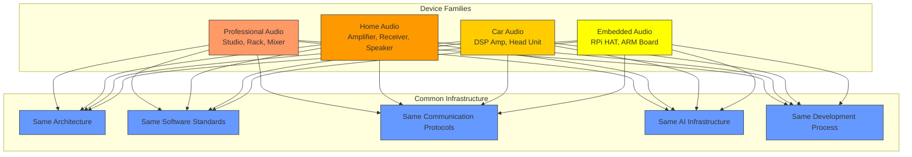
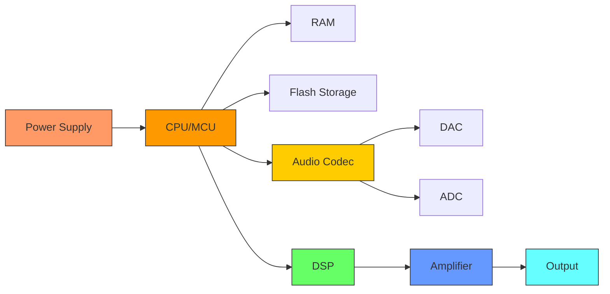
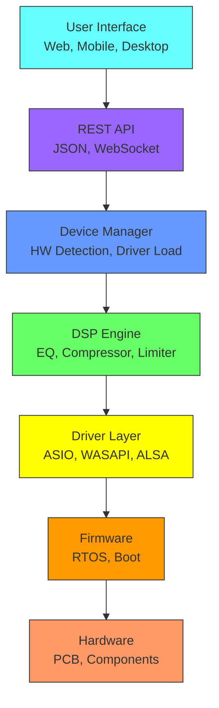

# CoreMusic Electronics Device Architecture

**Zorunlu Bağlantılar:** [[electronic/platform-architecture]] · [[electronic/software-architecture]] · [[electronic/device-ecosystem]] · [[electronic/operating-system-architecture]] · [[electronic/audio-architecture]] · [[ADR-063-hardware-design-standards]]

---

## 1. Amaç

CoreMusic ELECTRONICS platformu, **birden fazla cihaz ailesini** desteklemek için tasarlanmıştır. Her cihaz ailesi ortak mühendislik altyapısını paylaşır: aynı mimari yapı, aynı yazılım standartları, aynı iletişim protokolleri, aynı AI altyapısı ve aynı geliştirme süreci.

---

## 2. Cihaz Ailesi Mimarisi

### 2.1 Cihaz Aileleri

| Aile | Cihazlar | Öncelik |
|------|----------|---------|
| Professional Audio | Studio Interface, Rack DSP, Mixer, Monitor Controller | Yüksek |
| Home Audio | Smart Amplifier, Receiver, Multi-Room, Streaming Player | Yüksek |
| Car Audio | DSP Amplifier, Head Unit, Digital Crossover | Yüksek |
| Embedded Audio | RPi HAT, ARM Board, Embedded Linux Device | Orta |

---

## 3. Donanım Mimarisi

### 3.1 Güç → CPU → RAM → Flash → Audio Codec → DAC/ADC → DSP → Amplifier → Output

### 3.2 Güç Yönetimi

| Güç Kaynağı | Voltaj | Kullanım |
|-------------|--------|----------|
| USB-C PD | 5V/9V/12V/15V/20V | Taşınabilir cihazlar |
| PoE | 48V | Ağ cihazları |
| DC Jack | 5V/9V/12V/24V | Sabit cihazlar |
| Batarya | 3.7V-12V | Kablosuz cihazlar |
| Automotive | 12V/24V | Araç içi |

### 3.3 İşlemci Katmanı

| İşlemci | Mimarisi | Kullanım |
|---------|----------|----------|
| STM32H7 | ARM Cortex-M7 | DSP amplifikatör |
| ESP32-S3 | Xtensa LX7 | Kablosuz cihazlar |
| NXP i.MX8 | ARM Cortex-A53 | Android head unit |
| XMOS XU316 | xCORE-200 | USB audio interface |
| Raspberry Pi 4/5 | ARM Cortex-A72/A76 | Gömülü Linux |
| Intel NUC | x86_64 | Desktop/studio |
| Xilinx Zynq | ARM+FPGA | Yüksek performans |
| SHARC ADSP-21489 | SHARC | Profesyonel DSP |

### 3.4 Bellek Yapısı

| Bellek Türü | Kapasite | Kullanım |
|-------------|----------|----------|
| SRAM | 256KB-1MB | Hızlı erişim, buffer |
| DDR4/DDR5 | 4GB-64GB | Ana bellek |
| LPDDR4/5 | 1GB-8GB | Düşük güç |
| SPI Flash | 4MB-128MB | Firmware, config |
| EEPROM | 2KB-64KB | Kalıcı ayarlar |
| eMMC | 8GB-128GB | Depolama |
| NVMe SSD | 256GB-4TB | Yüksek hız depolama |

---

## 4. Haberleşme Protokolleri

### 4.1 Yerel İletişim

| Protokol | Hız | Kullanım |
|----------|-----|----------|
| USB 2.0 | 480 Mbps | Audio interface |
| USB 3.0 | 5 Gbps | Yüksek hız |
| UART | 115200 baud | Debug, seri |
| SPI | 10 MHz | Yüksek hız |
| I2C | 400 kHz | Düşük hız |
| I2S | 3.072 MHz | Ses verisi |
| TDM | 8.192 MHz | Çoklu kanal ses |
| CAN Bus | 1 Mbps | Araç içi |

### 4.2 Ağ İletişimi

| Protokol | Hız | Kullanım |
|----------|-----|----------|
| Ethernet | 100M/1G/10G | Ağ bağlantısı |
| Wi-Fi 6 | 2.4/5/6 GHz | Kablosuz |
| Bluetooth 5.3 | 1-3 Mbps | Kablosuz ses |

---

## 5. Ses Çıkışları

| Çıkış | Kullanım | Seviye |
|-------|----------|--------|
| RCA | Consumer | 2Vrms |
| TRS (6.35mm) | Prosumer | +4dBu |
| XLR | Profesyonel | +4dBu (dengeli) |
| Optical (TOSLINK) | Dijital | — |
| SPDIF (Coaxial) | Dijital | — |
| AES-EBU | Profesyonel dijital | 110Ω |
| HDMI ARC/eARC | TV entegrasyonu | — |
| Speaker Terminals | Amplifikatör çıkışı | — |

---

## 6. Ses Donanımı

| Bileşen | Model | Özellik | ADR |
|---------|-------|---------|-----|
| DAC | PCM3168A | 6-in/8-out, 24-bit | [[ADR-038-8.1-sound-card-chip-selection]] |
| DAC | AK4458 | 8-kanal, 32-bit, 768kHz | [[electronic/audio-interface-design]] |
| ADC | PCM3168A | 6-in, 24-bit, 96kHz | [[ADR-038-8.1-sound-card-chip-selection]] |
| DSP | XMOS XU316 | USB Audio Class 2.0 | [[ADR-017-dsp-hardware-mode]] |
| Codec | CS4272 | 24-bit, 192kHz | — |

**⚠️ PCM5122 REDDEDİLMİŞTİR (H001):** Sadece 2 kanal, 8.1 surround için yetersiz.

---

## 7. Yazılım Mimarisi

### 7.1 Device Manager Sorumlulukları

| Sorumluluk | Açıklama |
|------------|----------|
| Hardware Detection | Donanım otomatik algılama |
| Driver Loading | Sürücü otomatik yükleme |
| Firmware Control | Firmware yönetimi |
| Update Management | Güncelleme yönetimi |
| Health Check | Sağlık kontrolü |
| Error Reporting | Hata raporlama |
| AI Analysis | AI analizi |

---

## 8. AI Device Layer

| AI Yeteneği | Açıklama | Kullanım |
|-------------|----------|----------|
| Donanım Analizi | Donanım durumu ve performans analizi | Tüm cihazlar |
| Performans İzleme | CPU, bellek, disk kullanımı | Tüm cihazlar |
| Isı Yönetimi | Termal analiz ve soğutma optimizasyonu | Tüm cihazlar |
| Arıza Tahmini | Donanım arıza olasılığı tahmini | Tüm cihazlar |
| Otomatik Konfigürasyon | Donanım parametre otomatik ayarı | Tüm cihazlar |

---

## 9. Ortak Standartlar

### 9.1 Yazılım Standartları

| Standart | Açıklama |
|----------|----------|
| SOLID | Tek sorumluluk, açık-kapalı, yerine koyma |
| Clean Architecture | Katmanlı yapı |
| Hexagonal Architecture | Adapter/Port pattern |
| DDD | Domain-Driven Design |
| CQRS | Command Query Segregation |
| Event Driven | Asenkron olay tabanlı |

Detaylar: [[brain.md]] §3, [[electronic/software-architecture]]

### 9.2 Donanım Standartları

| Standart | Açıklama |
|----------|----------|
| EMI/EMC | Elektromanyetik uyumluluk |
| CE | Avrupa uyumluluk |
| RoHS | Zararlı madde kısıtlaması |
| Modular PCB | Modüler kart tasarımı |
| IPC Standards | PCB üretim standartları |

Detaylar: [[ADR-063-hardware-design-standards]], [[electronic/test-protocols]]

### 9.3 Güvenlik Standartları

| Standart | Açıklama |
|----------|----------|
| Secure Boot | Güvenli başlatma |
| Signed Firmware | İmzalı firmware |
| Secure Update | Güvenli güncelleme |
| Encrypted Communication | Şifreli iletişim |
| Device Authentication | Cihaz kimlik doğrulama |

Detaylar: [[architecture/l1-security]], [[ADR-022-database-hardened-security]]

---

## 10. Cross References

| Dosya | Kapsam |
|-------|--------|
| [[electronic/platform-architecture]] | 9 katmanlı platform mimarisi |
| [[electronic/audio-architecture]] | Ses mimarisi ve DSP pipeline |
| [[electronic/software-architecture]] | Yazılım mimarisi |
| [[electronic/operating-system-architecture]] | OS mimarisi ve PAL |
| [[electronic/device-ecosystem]] | Cihaz ekosistemi |
| [[electronic/service-architecture]] | Servis mimarisi |
| [[electronic/hardware-roadmap]] | Hardware yol haritası |
| [[ADR-038-8.1-sound-card-chip-selection]] | Ses kartı seçimi |
| [[ADR-063-hardware-design-standards]] | Hardware standartları |

---

## 11. Quality Report

| Metrik | Değer |
|--------|-------|
| Version | 2.0.0 |
| Status | Red Team · Human Mode · Truth Mode verified |
| Device Families | 4 (Professional, Home, Car, Embedded) |
| Hardware Components | 30+ |
| Communication Protocols | 12 |
| Audio Outputs | 8 |
| AI Capabilities | 5 |
| Cross References | 9 |

---

**Authority:** Bayram Ali / Vault Steward
**Last Updated:** 2026-08-09
**Mode:** Red Team · Human Mode · Truth Mode
