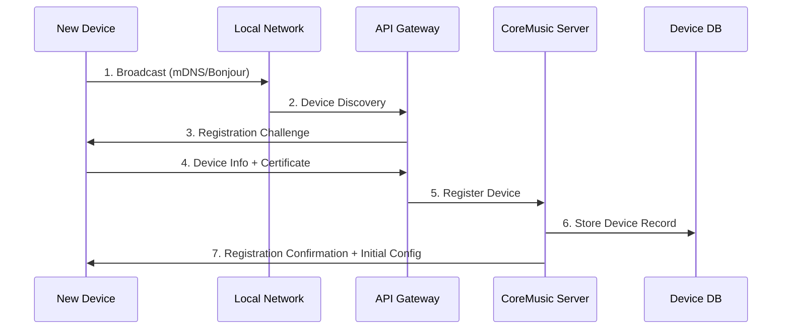
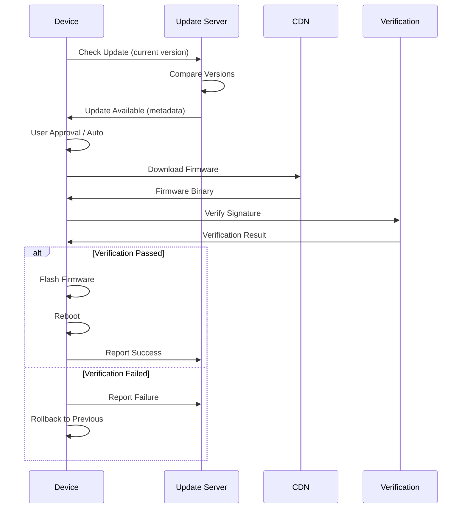
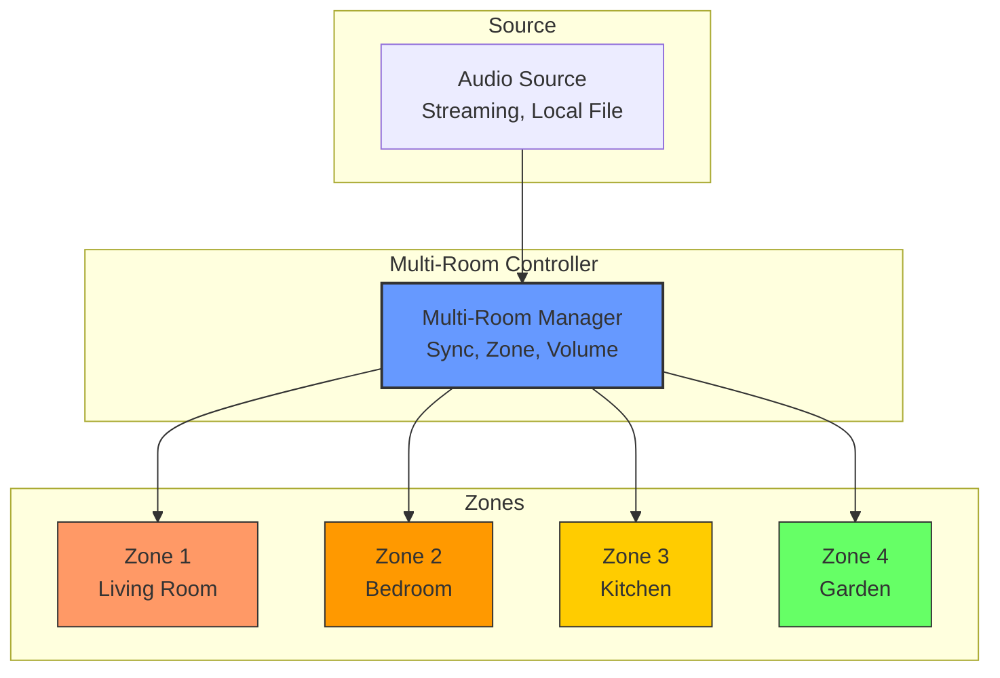
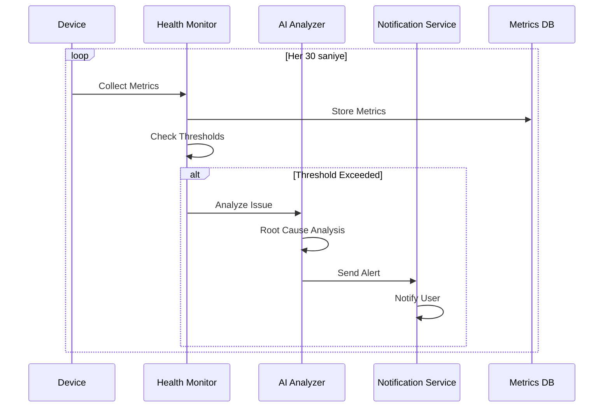

# CoreMusic Electronics Device Ecosystem

**Zorunlu Bağlantılar:** [[electronic/device-architecture]] · [[electronic/platform-architecture]] · [[electronic/software-architecture]] · [[electronic/service-architecture]] · [[ADR-061-electronics-architecture]]

---

## 1. Amaç

CoreMusic ELECTRONICS tek bir cihaz değil, **bir ekosistemdir**. Cihazlar ortak standartlar üzerinden birbirleriyle iletişim kurar, senkronize çalışır ve merkezi olarak yönetilir. CoreMusic Cloud → API → Home/Car/Studio Audio → Embedded/Mobile → Web Management zinciri üzerinden koordine edilir.

---

## 2. Ekosistem Mimarisi

```
┌─────────────────────────────────────────────────────────┐
│  CoreMusic Cloud                                       │
│  Remote Management, OTA, Analytics, AI                  │
├─────────────────────────────────────────────────────────┤
│  API Gateway                                           │
│  Auth, Rate Limit, Routing, Service Discovery          │
├──────────────┬──────────────┬───────────────────────────┤
│  Home Audio  │  Car Audio   │  Professional Studio     │
│  7 cihaz     │  5 cihaz     │  6 cihaz                 │
├──────────────┴──────────────┴───────────────────────────┤
│  Embedded / Mobile                                     │
│  RPi, ARM Board, Phone, Tablet                        │
├─────────────────────────────────────────────────────────┤
│  Web Management                                        │
│  Admin Dashboard, Config, Monitoring                  │
└─────────────────────────────────────────────────────────┘
```

---

## 3. Cihaz Aileleri (4 Aile, 22 Cihaz)

### 3.1 Ev Sesi (Home Audio) — 7 Cihaz

| # | Cihaz | Açıklama | İletişim | Öncelik |
|---|-------|----------|----------|---------|
| 1 | Smart Amplifier | Akıllı amplifikatör | Ethernet, Wi-Fi, USB | Yüksek |
| 2 | Smart Receiver | Akıllı alıcı | Ethernet, Wi-Fi, HDMI ARC | Yüksek |
| 3 | Network Audio Player | Ağ ses oynatıcısı | Ethernet, Wi-Fi | Yüksek |
| 4 | Multi Room Controller | Çoklu oda kontrolcüsü | Ethernet, Wi-Fi, BLE | Yüksek |
| 5 | Streaming Player | Streaming oynatıcı | Wi-Fi, Bluetooth | Orta |
| 6 | Wireless Speaker | Kablosuz hoparlör | Wi-Fi, Bluetooth | Orta |
| 7 | Subwoofer Controller | Subwoofer kontrolcüsü | Wi-Fi, I2S | Düşük |

### 3.2 Araç Sesi (Car Audio) — 5 Cihaz

| # | Cihaz | Açıklama | İletişim | Öncelik |
|---|-------|----------|----------|---------|
| 1 | DSP Amplifier | DSP amplifikatör | CAN Bus, USB, I2S | Yüksek |
| 2 | Android Multimedia Unit | Android bilgi-eğlence | USB, HDMI, Wi-Fi | Yüksek |
| 3 | OEM Audio Processor | OEM ses işlemcisi | CAN Bus, I2S | Orta |
| 4 | Navigation Audio Controller | Navigasyon ses kontrolcüsü | CAN Bus | Orta |
| 5 | CAN Bus Audio Controller | CAN Bus ses kontrolcüsü | CAN Bus | Yüksek |

### 3.3 Profesyonel Ses (Professional Audio) — 6 Cihaz

| # | Cihaz | Açıklama | İletişim | Öncelik |
|---|-------|----------|----------|---------|
| 1 | Studio Audio Interface | Stüdyo ses arayüzü | USB, Thunderbolt | Yüksek |
| 2 | Rack DSP Processor | Raf tipi DSP | Ethernet, USB | Yüksek |
| 3 | Digital Mixer | Dijital mikser | Ethernet, USB, Dante | Yüksek |
| 4 | Audio Matrix | Ses matrisi | AES-EBU, Dante | Orta |
| 5 | Monitor Controller | Monitör kontrolcüsü | USB, AES-EBU | Orta |
| 6 | Recording Interface | Kayıt arayüzü | USB, Thunderbolt | Yüksek |

### 3.4 Gömülü Ses (Embedded Audio) — 4 Cihaz

| # | Cihaz | Açıklama | İletişim | Öncelik |
|---|-------|----------|----------|---------|
| 1 | Raspberry Pi Audio Player | RPi ses oynatıcı | Ethernet, Wi-Fi, I2S | Yüksek |
| 2 | ARM Audio Controller | ARM ses kontrolcüsü | Ethernet, SPI, I2C | Orta |
| 3 | Embedded Linux Audio Device | Gömülü Linux ses | Ethernet, USB | Orta |
| 4 | Industrial Audio Gateway | Endüstriyel ses gateway | Ethernet, RS-485 | Düşük |

---

## 4. İletişim Protokolleri

### 4.1 Yerel İletişim (Local)

| Protokol | Hız | Mesafe | Kullanım |
|----------|-----|--------|----------|
| USB 2.0 | 480 Mbps | 5m | Audio interface, firmware update |
| USB 3.0 | 5 Gbps | 3m | Yüksek hız veri |
| UART | 115200 baud | 15m | Debug, seri iletişim |
| SPI | 10 MHz | 1m | Yüksek hız sensör/EEPROM |
| I2C | 400 kHz | 1m | Düşük hız cihaz yönetimi |
| CAN Bus | 1 Mbps | 40m | Araç içi iletişim |
| RS-485 | 10 Mbps | 1200m | Endüstriyel |
| I2S | 3.072 MHz | Board-level | Ses verisi transferi |

### 4.2 Ağ İletişimi (Network)

| Protokol | Hız | Menzil | Kullanım |
|----------|-----|--------|----------|
| Ethernet 100M | 100 Mbps | 100m | Güvenilir bağlantı |
| Ethernet 1G | 1 Gbps | 100m | Yüksek hız |
| Ethernet 10G | 10 Gbps | 100m | Profesyonel |
| Wi-Fi 6 | 2.4 Gbps | 50m | Kablosuz yüksek hız |
| Bluetooth 5.3 | 3 Mbps | 10m | Kısa menzil kablosuz |
| BLE | 1 Mbps | 30m | Düşük güç |

### 4.3 Uygulama İletişimi (Application)

| Protokol | Tür | Kullanım |
|----------|-----|----------|
| HTTP/HTTPS | REST | CRUD işlemleri |
| WebSocket | Real-time | Canlı güncelleme |
| MQTT | Pub/Sub | IoT, hafif iletişim |
| gRPC | RPC | Yüksek performans |
| Dante/AES67 | Audio-over-IP | Profesyonel ses |
| AirPlay | Streaming | Apple ekosistemi |
| Chromecast | Streaming | Google ekosistemi |

---

## 5. Cihaz Kimliği ve Kaydı

### 5.1 Cihaz Kimliği

Her cihaz benzersiz bir kimliğe sahiptir:

| Alan | Format | Açıklama |
|------|--------|----------|
| Device ID | UUID v4 | Benzersiz cihaz tanımlayıcı |
| Device Name | String | Kullanıcı tanımlı ad |
| Device Type | Enum | amplifier, receiver, interface, etc. |
| Hardware Rev | `Rev X.Y` | Donanım revisyonu |
| Firmware Version | `vX.Y.Z` | Mevcut firmware |
| Driver Version | `vX.Y.Z` | Mevcut sürücü |
| Production Date | ISO 8601 | Üretim tarihi |
| Serial Number | `CM-XXXX-XXXX` | Üretim seri numarası |

### 5.2 Kayıt Akışı (7 Adım)



### 5.3 Cihaz Profili

| Alan | Tür | Açıklama |
|------|-----|----------|
| audio_config | Object | Sample rate, bit depth, channels, outputs |
| dsp_config | Object | EQ bands, compressor, limiter, crossover |
| eq_config | Object | 31-band parametric EQ settings |
| crossover_config | Object | Frequency splits, slopes, phases |
| network_config | Object | IP, DNS, proxy, static/DHCP |
| permissions | Array | Device capabilities and restrictions |
| ai_config | Object | AI features, auto-EQ, recommendations |

---

## 6. Merkezi Yönetim

| Yönetim | Açıklama |
|---------|----------|
| Remote Restart | Uzaktan yeniden başlatma |
| Remote Update | Uzaktan firmware/driver güncelleme |
| Configuration | Uzaktan konfigürasyon yönetimi |
| Health Monitoring | Sağlık durumu izleme |
| Performance Monitoring | Performans metrikleri |
| Diagnostics | Tanılama ve hata analizi |
| Log Collection | Uzaktan log toplama |
| Backup/Restore | Konfigürasyon yedekleme |

---

## 7. OTA Güncelleme Desteği

### 7.1 Güncelleme Türleri

| Tür | Kapsam |
|-----|--------|
| Firmware | Ana yazılım güncellemesi |
| Driver | Sürücü güncellemesi |
| DSP | DSP preset/profil güncellemesi |
| Config | Konfigürasyon güncellemesi |
| AI Models | AI model güncellemesi |
| UI Assets | UI varlık güncellemesi |

### 7.2 Güncelleme Kanalları

| Kanal | Kullanım | Sıklık |
|-------|----------|--------|
| Stable | Üretim cihazları | Aylık |
| Beta | Test cihazları | Haftalık |
| Nightly | Geliştirme | Günlük |
| Security | Güvenlik yamaları | Acil |

### 7.3 OTA Akışı



### 7.4 Güncelleme Gereksinimleri

| Gereksinim | Açıklama |
|------------|----------|
| Signed Firmware | Tüm güncellemeler imzalı olmalı |
| Rollback Support | Güncelleme başarısız olursa geri dönüş |
| Delta Update | Sadece değişiklikler indirilmeli |
| Interrupted Recovery | Kesinti durumunda kurtarma |
| Bandwidth Management | Bant genişliği yönetimi |
| Scheduled Update | Zamanlanmış güncelleme |

---

## 8. Senkronizasyon

### 8.1 Multi-Room Senkronizasyonu



### 8.2 Senkronizasyon Türleri

| Tür | Açıklama |
|-----|----------|
| Multi-Room | Ev içi çoklu oda senkronizasyonu |
| Studio Setup | Profesyonel stüdyo kurulumu |
| Car Audio | Araç içi çoklu zone |

### 8.3 Senkronizasyon Gereksinimleri

| Gereksinim | Değer |
|------------|-------|
| Clock Sync | PTP/NTP ile <1ms |
| Latency | Zone'lar arası <50ms |
| Jitter | <10ms |
| Sample Rate | 48kHz senkron |
| Bit Depth | 24-bit |

---

## 9. Cihaz Sağlık İzleme

### 9.1 Sağlık Metrikleri

| Metrik | Eşik | Aksiyon |
|--------|------|---------|
| CPU Kullanımı | >90% | Warn |
| RAM Kullanımı | >85% | Warn |
| DSP Yükü | >80% | Warn |
| Sıcaklık | >80°C | Critical |
| Güç Voltajı | ±%10 | Critical |
| Ağ Durumu | Packet loss >1% | Error |
| Gecikme | >20ms | Warn |
| Hatalar | >0 | Critical |
| Ses Buffer | Underrun | Critical |

### 9.2 Sağlık İzleme Akışı



---

## 10. AI Cihaz İzleme

| AI Yeteneği | Açıklama | Kullanım |
|-------------|----------|----------|
| Performans Analizi | CPU, RAM, DSP kullanım analizi | Optimizasyon |
| Donanım Analizi | PCB, termal, sinyal kalitesi | Bakım |
| Ses Analizi | Frekans yanıtı, THD, SNR | Kalite |
| Anomaly Detection | Anormal durum tespiti | Erken uyarı |
| Predictive Maintenance | Öngörücü bakım | Arıza önleme |
| Usage Analytics | Kullanım analizi | Optimizasyon |
| Sound Quality AI | Ses kalitesi AI | Otomatik EQ |
| Room Correction | Oda düzeltme | Akustik optimizasyon |

Detaylar: [[architecture/ai/ai-engine]], [[architecture/ai/ai-workflow]]

---

## 11. Güvenlik Mimarisi

| Güvenlik Katmanı | Açıklama | Standart |
|------------------|----------|----------|
| Device Authentication | Cihaz kimlik doğrulama | X.509 Certificate |
| Encrypted Communication | Şifreli iletişim | TLS 1.3 |
| Secure Boot | Güvenli başlatma | UEFI Secure Boot |
| Signed Firmware | İmzalı firmware | RSA/ECDSA |
| Rollback Protection | Geri dönüş koruması | Secure Boot chain |
| Secure OTA | Güvenli güncelleme | Code signing |
| Access Control | Erişim kontrolü | RBAC |
| Audit Logging | Denetim günlüğü | OWASP |
| Zero Trust | Sıfır güven | NIST 800-207 |

Detaylar: [[architecture/l1-security]], [[ADR-022-database-hardened-security]]

---

## 12. Cross References

| Dosya | Kapsam |
|-------|--------|
| [[electronic/device-architecture]] | Cihaz mimarisi |
| [[electronic/platform-architecture]] | Platform mimarisi |
| [[electronic/software-architecture]] | Yazılım mimarisi |
| [[electronic/service-architecture]] | Servis mimarisi |
| [[electronic/operating-system-architecture]] | OS mimarisi |
| [[ecosystem/7-service-integration]] | Servis entegrasyonu |
| [[ecosystem/service-health-check]] | Health check |
| [[ADR-061-electronics-architecture]] | Electronics ADR |

---

## 13. Quality Report

| Metrik | Değer |
|--------|-------|
| Version | 2.0.0 |
| Status | Red Team · Human Mode · Truth Mode verified |
| Device Families | 4 |
| Total Devices | 22 |
| Local Protocols | 8 |
| Network Protocols | 6 |
| Application Protocols | 7 |
| OTA Update Types | 6 |
| Security Layers | 9 |
| AI Capabilities | 8 |
| Cross References | 8 |

---

**Authority:** Bayram Ali / Vault Steward
**Last Updated:** 2026-08-10
**Mode:** Red Team · Human Mode · Truth Mode
