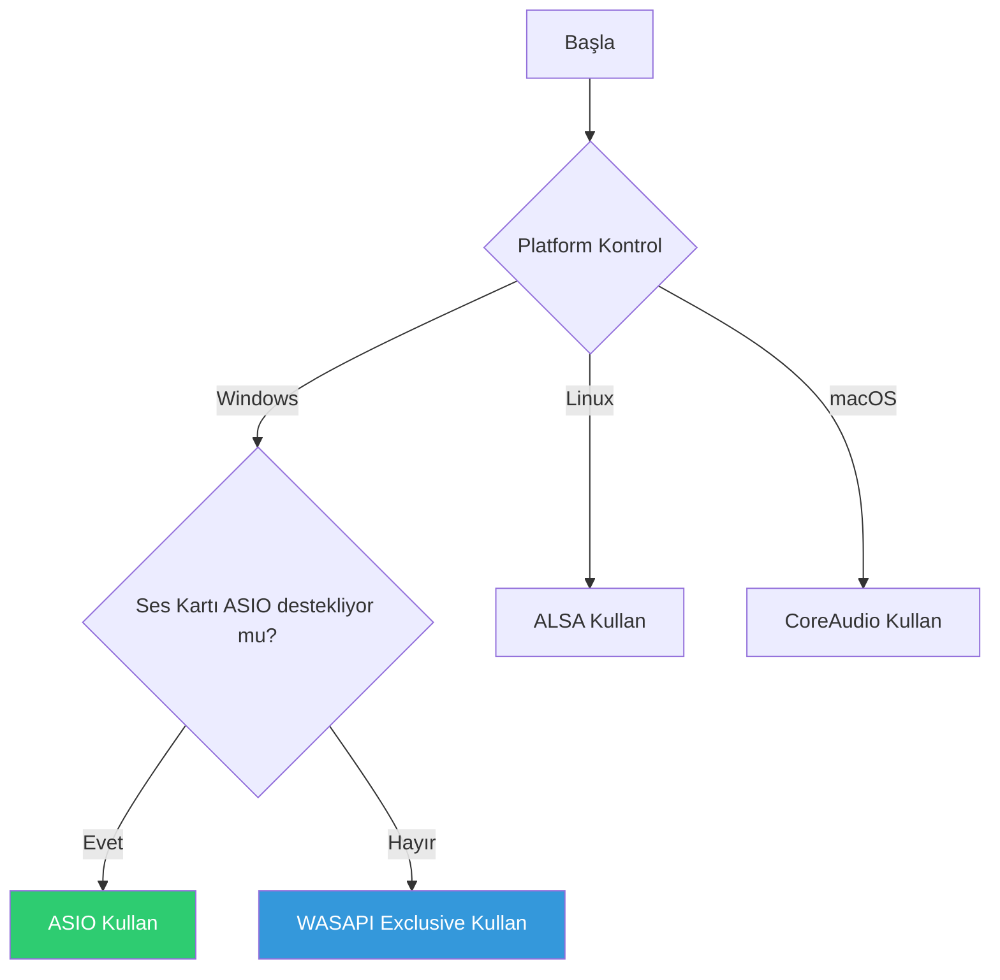

# CoreMusic — Audio Drivers

**See also:** [[electronic/drivers/index]] · [[ADR-017-dsp-hardware-mode]] · [[ADR-038-8.1-sound-card-chip-selection]]

---

## 1. Amaç

Audio Drivers, CoreMusic platformunun ses kartları ve ses cihazlarıyla iletişimini sağlayan sürücüleri tanımlar.

---

## 2. ASIO Driver

| Özellik | Değer |
|---------|-------|
| Sürüm | 2.3.4 |
| Platform | Windows XP-11, Server 2012 R2+ |
| Latency | <10ms (512 sample) |
| Buffer | 64-1024 sample |
| Kanal | 2-8 (8+1 surround) |
| Bit | 32-bit float |
| Exclusive | Tek uygulama |
| Multi-client | Devre dışı (güvenlik) |

### ASIO Buffer Hesaplama

```
Sample Rate: 48000 Hz
Buffer Size: 512 sample
Latency: 512/48000 = 10.67ms
```

---

## 3. WASAPI Driver

| Özellik | Değer |
|---------|-------|
| Mod | Shared + Exclusive |
| Platform | Windows 7-11 |
| Latency | <20ms (Shared), <10ms (Exclusive) |
| Format | 32-bit float, 48kHz |
| Multi-client | Shared modda evet |
| Exclusive Lock | Tek uygulama |

---

## 4. ALSA Driver

| Özellik | Değer |
|---------|-------|
| Platform | Linux (Ubuntu, Debian, Fedora, Arch) |
| Latency | <15ms |
| Format | 32-bit float, 48kHz |
| Plugin | dmix (paylaşımlı), direct (özel) |

---

## 5. CoreAudio Driver

| Özellik | Değer |
|---------|-------|
| Platform | macOS (Monterey-Sonoma) |
| Latency | <10ms |
| Format | 32-bit float, 48kHz |
| Multi-client | Evet |

---

## 6. WASAPI vs ASIO Karşılaştırma

| Kriter | WASAPI | ASIO |
|--------|--------|------|
| Latency | <20ms | <10ms |
| Multi-client | Shared evet | Hayır |
| Exclusive | Var | Var |
| Desteği | Tüm Windows | Ses kartı |
| Kurulum | Otomatik | Manuel |

---

## 7. Driver Seçim Akışı



---

## 8. ADR Referansları

| ADR | Konu |
|-----|------|
| [[ADR-017-dsp-hardware-mode]] | DSP hardware, XMOS, JUCE |
| [[ADR-038-8.1-sound-card-chip-selection]] | PCM3168A, XMOS XU316 |

---

**Authority:** Bayram Ali / Vault Steward
**Last Updated:** 2026-08-09
**Mode:** Red Team · Human Mode · Truth Mode
