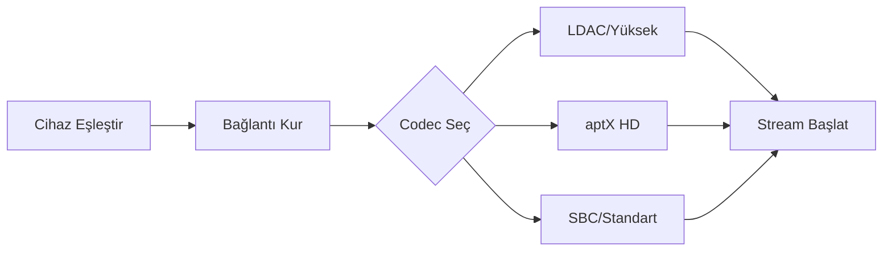

# CoreMusic — Bluetooth Audio Drivers

**See also:** [[electronic/drivers/index]] · [[electronic/firmware/index]]

---

## 1. Amaç

Bluetooth Audio Drivers, CoreMusic platformunun Bluetooth kulaklık, hoparlör ve cihazlarıyla iletişimini tanımlar.

---

## 2. Bluetooth Ses Codec'leri

| Codec | Bit Derinliği | Örnekleme | Bitrate | Latency |
|-------|--------------|-----------|---------|---------|
| SBC | 16-bit | 48kHz | 345kbps | 100-200ms |
| AAC | 16-bit | 44.1kHz | 256kbps | 80-200ms |
| aptX | 16-bit | 48kHz | 352kbps | 60-80ms |
| aptX HD | 24-bit | 48kHz | 576kbps | 60-80ms |
| aptX Adaptive | 24-bit | 96kHz | 420kbps | 50-80ms |
| LDAC | 24-bit | 96kHz | 990kbps | 100-200ms |
| LC3 | 16-24-bit | 48kHz | 345kbps | 20-30ms |

---

## 3. Bluetooth 5.3 Desteği

| Özellik | Değer |
|---------|-------|
| Range | 240m (maksimum) |
| Latency | 2-8ms (bağlantı) |
| Throughput | 2Mbps |
| Multi-device | 2 cihaz aynı anda |
| LE Audio | Destekli |

---

## 4. A2DP Profile

| Özellik | Değer |
|---------|-------|
| Direction | Tek yönlü (audio streaming) |
| Codec | SBC, AAC, aptX, LDAC |
| Kanal | Stereo |
| Max Bitrate | 990kbps (LDAC) |

---

## 5. HFP Profile (Hands-Free)

| Özellik | Değer |
|---------|-------|
| Direction | Çift yönlü |
| Kullanım | Telefon görüşmesi |
| Quality | 8kHz mono (CVSD), 16kHz mono (mSBC) |

---

## 6. Bluetooth Driver Akışı

---

## 7. ADR Referansları

| ADR | Konu |
|-----|------|
| [[ADR-017-dsp-hardware-mode]] | DSP hardware |
| [[ADR-020-api-public-security]] | API güvenlik |

---

**Authority:** Bayram Ali / Vault Steward
**Last Updated:** 2026-08-09
**Mode:** Red Team · Human Mode · Truth Mode
