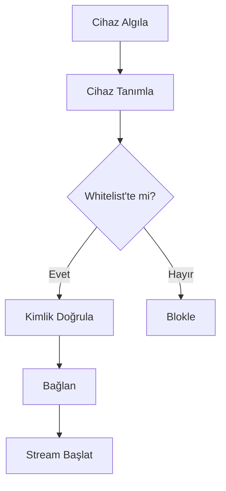

# CoreMusic — Device Integration

**See also:** [[electronic/drivers/index]] · [[architecture/07-security/device-auth]]

---

## 1. Amaç

Device Integration, CoreMusic platformunun cihaz algılama, eşleştirme ve yönetimi mekanizmalarını tanımlar.

---

## 2. Cihaz Türleri

| Cihaz | Bağlantı | Kullanım |
|-------|----------|----------|
| USB DAC | USB 2.0/3.0 | Stüdyo ses |
| Bluetooth Kulaklık | BT 5.0+ | Mobil |
| Bluetooth Hoparlör | BT 5.0+ | Ev |
| WiFi Receiver | DLNA/AirPlay | Ev medya |
| Roon Endpoint | Ethernet | Profesyonel |
| Araç Sistemi | USB/BT | Araç içi |

---

## 3. Hot-Plug Mekanizması

| Olay | Davranış |
|------|----------|
| Cihaz takıldı | Otomatik algılama, driver yükle |
| Cihaz çıkarıldı | Graceful stop, kaynak serbest bırak |
| Cihaz yeniden takıldı | Otomatik reconnect |
| Cihaz değişti | Yeni driver ile devam |

---

## 4. Device Auth Akışı

---

## 5. ADR Referansları

| ADR | Konu |
|-----|------|
| [[ADR-038-8.1-sound-card-chip-selection]] | Donanım seçimi |
| [[ADR-008-bypass-auth-middleware]] | Auth bypass |

---

**Authority:** Bayram Ali / Vault Steward
**Last Updated:** 2026-08-09
**Mode:** Red Team · Human Mode · Truth Mode
