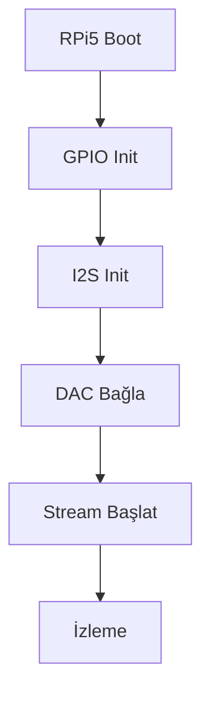

# CoreMusic — Embedded Platform Drivers

**See also:** [[electronic/drivers/index]] · [[electronic/hardware/index]]

---

## 1. Amaç

Embedded Platform Drivers, CoreMusic platformunun gömülü sistemlerdeki (Raspberry Pi 5, ARM64) donanım sürücülerini tanımlar.

---

## 2. Raspberry Pi 5 Destek

| Özellik | Değer |
|---------|-------|
| CPU | BCM2712, Quad-core 2.4GHz Cortex-A76 |
| RAM | 4GB/8GB LPDDR4X |
| GPIO | 40-pin header |
| I2S | PCM5102A, PCM3168A |
| USB | USB 3.0 x2, USB 2.0 x2 |
| WiFi | 802.11ac |
| Bluetooth | 5.0, BLE |

---

## 3. GPIO Pin Atamaları

| Pin | İşlev | Not |
|-----|-------|-----|
| 18 | I2S BCLK | Bit Clock |
| 19 | I2S LRCLK | Word Select |
| 21 | I2S DIN | Data In (TX) |
| 20 | I2S DOUT | Data Out (RX) |
| 3 | SDA | I2C Data |
| 5 | SCL | I2C Clock |
| 25 | Reset | Hardware Reset |

---

## 4. I2S Driver

| Özellik | Değer |
|---------|-------|
| Format | I2S, Left-justified |
| Bit | 24-bit, 32-bit |
| Örnekleme | 44.1kHz, 48kHz, 96kHz |
| DMA Buffer | 4096 byte |
| Latency | <5ms |

---

## 5. Embedded Driver Akışı

---

## 6. ADR Referansları

| ADR | Konu |
|-----|------|
| [[ADR-017-dsp-hardware-mode]] | DSP hardware |
| [[ADR-038-8.1-sound-card-chip-selection]] | PCM3168A |

---

**Authority:** Bayram Ali / Vault Steward
**Last Updated:** 2026-08-09
**Mode:** Red Team · Human Mode · Truth Mode
