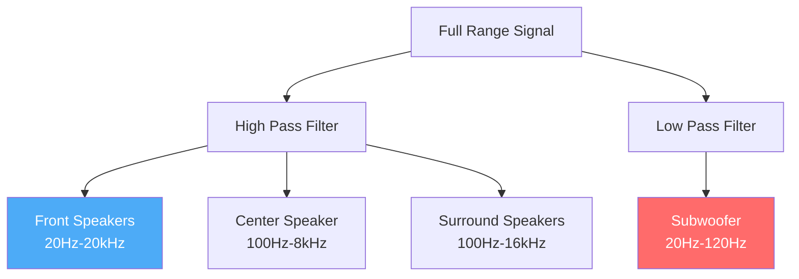

# CoreMusic — Crossover Engine

**See also:** [[electronic/dsp/index]] · [[electronic/amplifier/index]] · [[ADR-025-professional-eq-system]]

---

## 1. Amaç

Crossover Engine, ses sinyalini frekans aralıklarına göre böler ve ilgili hoparlörlere (woofer, tweeter, subwoofer) yönlendirir.

---

## 2. Crossover Noktaları (8.1 Surround)

```
20Hz ──────────── Subwoofer (LFE)
                 │
80Hz ──────────── Crossover Point
                 │
120Hz ─────────── Woofer → Midrange
                 │
3500Hz ────────── Midrange → Tweeter
                 │
20kHz ─────────── Üst Limit
```

---

## 3. Kanal Yapısı

| Kanal | Frekans Aralığı | Hoparlör |
|-------|------------------|----------|
| Front Left | 20Hz - 20kHz | Full Range |
| Front Right | 20Hz - 20kHz | Full Range |
| Center | 100Hz - 8kHz | Mid Range |
| Rear Left | 100Hz - 16kHz | Surround |
| Rear Right | 100Hz - 16kHz | Surround |
| Side Left | 100Hz - 16kHz | Surround |
| Side Right | 100Hz - 16kHz | Surround |
| Height | 200Hz - 16kHz | Height |
| Subwoofer | 20Hz - 120Hz | LFE |

---

## 4. Crossover Parametreleri

| Parametre | Aralığı | Varsayılan |
|-----------|---------|------------|
| Crossover Frequency | 60Hz - 120Hz | 80Hz |
| Slope | 12dB/oct - 48dB/oct | 24dB/oct |
| Type | Linkwitz-Riley / Butterworth | Linkwitz-Riley |
| Phase | 0° / 180° | 0° |
| Subwoofer Gain | -∞ - 0dB | 0dB |

---

## 5. Bass Management

| Özellik | Değer |
|---------|-------|
| Bass Redirect | Tüm kanallardan bass → subwoofer |
| High-Pass | Seçilen kanallarda bass kesme |
| Low-Pass | Subwoofer'da bass geçme |
| LFE Channel | Ayrı 120Hz kanal |
| Phase Alignment | Subwoofer ile Front phase senkronu |

---

## 6. Crossover Diyagramı



---

## 7. ADR Referansları

| ADR | Konu |
|-----|------|
| [[ADR-025-professional-eq-system]] | EQ sistemi |
| [[ADR-038-8.1-sound-card-chip-selection]] | 8.1 surround |

---

**Authority:** Bayram Ali / Vault Steward
**Last Updated:** 2026-08-09
**Mode:** Red Team · Human Mode · Truth Mode
