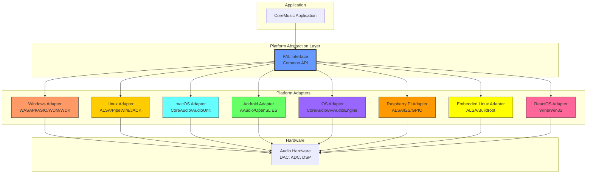
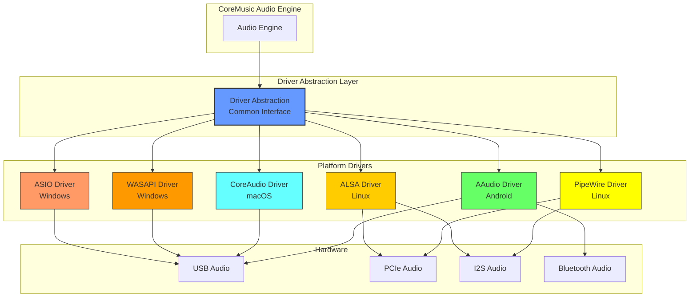
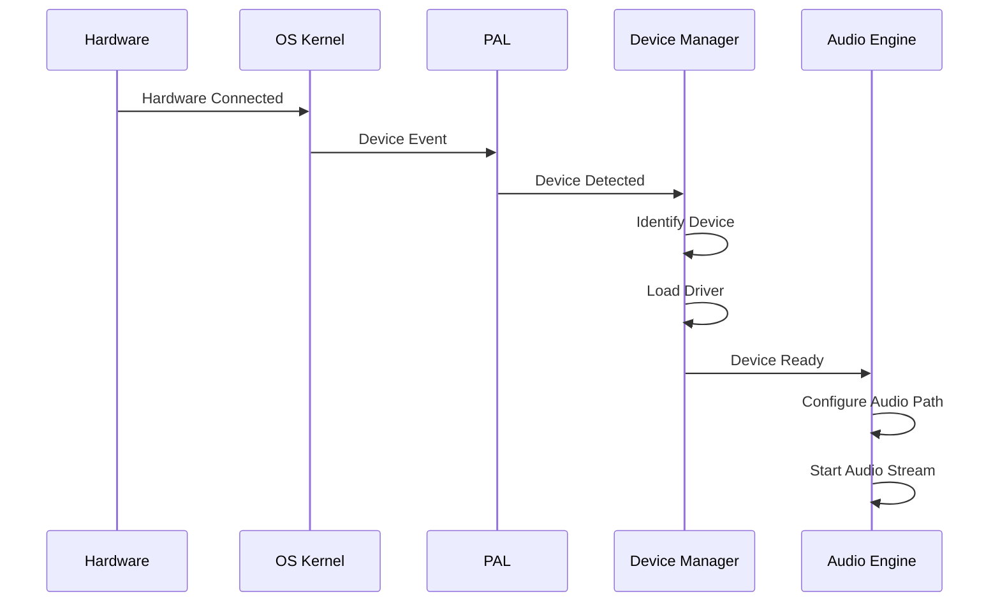

# CoreMusic Electronics Operating System Architecture

**Zorunlu Bağlantılar:** [[electronic/device-architecture]] · [[electronic/platform-architecture]] · [[electronic/software-architecture]] · [[electronic/audio-architecture]] · [[ADR-017-dsp-hardware-mode]] · [[ADR-038-8.1-sound-card-chip-selection]]

---

## 1. Amaç

CoreMusic ELECTRONICS platformu birden fazla işletim sistemini destekler. Her OS için **Platform Abstraction Layer (PAL)** ile OS-specific kod izole edilir. Tüm OS'ler aynı çekirdek mimariyi paylaşır, sadece platform adaptörleri değişir.

---

## 2. Desteklenen İşletim Sistemleri (8 OS)

| OS | Tier | Durum | Kullanım |
|----|------|-------|----------|
| Windows (XP-11, Server 2012 R2+) | Tier 1 | ✅ Ana geliştirme | Desktop, Studio |
| Linux (Ubuntu, Debian, Fedora, Arch) | Tier 2 | ✅ Destekli | Server, Embedded |
| macOS (Monterey–Sonoma) | Tier 3 | ✅ Destekli | Desktop, Studio |
| Android | Tier 3 | ✅ Destekli | Mobile, Automotive |
| iOS | Tier 3 | ✅ Destekli | Mobile |
| Raspberry Pi OS | Tier 4 | ✅ Destekli | Embedded |
| Embedded Linux (Yocto/Buildroot) | Tier 4 | ✅ Destekli | Industrial |
| ReactOS | Tier 5 | ⚠️ Experimental | Uyumluluk |

Detaylar: [[brain.md]] §15, [[CLAUDE.md]] §13

---

## 3. Platform Abstraction Layer (PAL)

---

## 4. OS Bazlı Teknoloji Yığınları

### 4.1 Windows

| Teknoloji | Açıklama | Öncelik |
|-----------|----------|---------|
| Win32 API | Temel Windows API | Yüksek |
| COM | Component Object Model | Yüksek |
| WASAPI | Windows Audio Session API | Yüksek |
| ASIO | Audio Stream Input/Output | Yüksek |
| WDM | Windows Driver Model | Orta |
| WDK | Windows Driver Kit | Yüksek |
| Kernel Streaming | Düşük seviye ses | Orta |

### 4.2 Linux

| Teknoloji | Açıklama | Öncelik |
|-----------|----------|---------|
| ALSA | Advanced Linux Sound Architecture | Yüksek |
| PipeWire | Modern ses sunucusu | Yüksek |
| JACK | Jack Audio Connection Kit | Orta |
| PulseAudio | Eski ses sunucusu | Düşük |
| POSIX | Taşınabilir sistem arayüzü | Yüksek |
| udev | Cihaz yönetimi | Yüksek |
| SystemD | Servis yönetimi | Yüksek |

### 4.3 macOS

| Teknoloji | Açıklama | Öncelik |
|-----------|----------|---------|
| CoreAudio | Temel ses çerçevesi | Yüksek |
| AudioUnit | Ses eklentisi API'si | Yüksek |
| AVFoundation | Multimedya çerçevesi | Orta |
| IOKit | Donanım sürücüleri | Yüksek |

### 4.4 Android

| Teknoloji | Açıklama | Öncelik |
|-----------|----------|---------|
| AAudio | Düşük gecikmeli ses API | Yüksek |
| OpenSL ES | Open Sound Library | Orta |
| AudioTrack | Ses çalma | Yüksek |
| AudioRecord | Ses kayıt | Yüksek |

### 4.5 iOS

| Teknoloji | Açıklama | Öncelik |
|-----------|----------|---------|
| CoreAudio | Temel ses çerçevesi | Yüksek |
| AVAudioEngine | Ses motoru API | Yüksek |
| AudioUnit | Ses eklentisi API | Yüksek |

### 4.6 Raspberry Pi

| Teknoloji | Açıklama | Öncelik |
|-----------|----------|---------|
| ALSA | Ses altyapısı | Yüksek |
| I2S | Seri ses verisi | Yüksek |
| GPIO | Genel amaçlı giriş/çıkış | Yüksek |
| SPI | Seri periferal arayüz | Orta |
| I2C | İki telli haberleşme | Orta |
| Device Tree | Donanım tanımlama | Yüksek |

### 4.7 Embedded Linux

| Teknoloji | Açıklama | Öncelik |
|-----------|----------|---------|
| ALSA | Ses altyapısı | Yüksek |
| Buildroot | Sistem oluşturma | Yüksek |
| Yocto | Embedded Linux | Yüksek |
| Device Tree | Donanım tanımlama | Yüksek |

### 4.8 ReactOS

| Teknoloji | Açıklama | Öncelik |
|-----------|----------|---------|
| Win32 API | Windows uyumluluğu | Yüksek |
| Wine | Linux üzerinde Windows | Orta |

---

## 5. Sürücü Mimarisi

### 5.1 Driver Seviyeleri

| Seviye | Tür | Açıklama |
|--------|-----|----------|
| Level 0 | Virtual | Yazılım tabanlı driver (test) |
| Level 1 | Physical | Donanım sürücüsü |
| Level 2 | USB | USB audio class driver |
| Level 3 | DSP | DSP tabanlı driver |

---

## 6. Ses Backend Öncelik Sırası

### 6.1 Windows

| Sıra | Backend | Gecikme | Kullanım |
|------|---------|---------|----------|
| 1 | ASIO | <10ms | Profesyonel |
| 2 | WASAPI Exclusive | <15ms | Düşük gecikme |
| 3 | WASAPI Shared | <20ms | Genel kullanım |
| 4 | WDM/KS | <30ms | Geriye uyumluluk |

### 6.2 Linux

| Sıra | Backend | Gecikme | Kullanım |
|------|---------|---------|----------|
| 1 | ALSA (direct) | <5ms | Profesyonel |
| 2 | PipeWire | <10ms | Modern |
| 3 | JACK | <10ms | Profesyonel |
| 4 | PulseAudio | <30ms | Genel kullanım |

### 6.3 macOS

| Sıra | Backend | Gecikme | Kullanım |
|------|---------|---------|----------|
| 1 | CoreAudio | <5ms | Tüm kullanım |
| 2 | AudioUnit | <10ms | Plugin desteği |

### 6.4 Android

| Sıra | Backend | Gecikme | Kullanım |
|------|---------|---------|----------|
| 1 | AAudio | <10ms | Düşük gecikme |
| 2 | OpenSL ES | <20ms | Geriye uyumluluk |

### 6.5 Raspberry Pi

| Sıra | Backend | Gecikme | Kullanım |
|------|---------|---------|----------|
| 1 | ALSA (I2S) | <5ms | Doğrudan donanım |
| 2 | ALSA (USB) | <10ms | USB ses |

---

## 7. Cihaz Algılama (Device Discovery)

---

## 8. Hot Plug Desteği

| Özellik | Windows | Linux | macOS | Android | RPi |
|---------|---------|-------|-------|---------|-----|
| USB Hot Plug | ✅ | ✅ | ✅ | ✅ | ✅ |
| Bluetooth Hot Plug | ✅ | ✅ | ✅ | ✅ | ✅ |
| PCIe Hot Plug | ⚠️ | ✅ | ✅ | ❌ | ❌ |
| I2S Hot Plug | ❌ | ✅ | ❌ | ❌ | ✅ |

**Hot Plug Prosedürü:**
1. Cihaz bağlantısı algılanır
2. OS kernel olay üretir
3. PAL arayüzü üzerinden bildirim yapılır
4. Device Manager cihazı tanımlar
5. Sürücü yüklenir
6. Ses yolu yapılandırılır
7. Ses akışı başlatılır

---

## 9. Sürücü Güvenliği

| Gereksinim | Açıklama | Standart |
|------------|----------|----------|
| Code Signing | Sürücü imzalama | EV Certificate |
| WHQL Certification | Windows uyumluluk | Microsoft |
| Kernel Protection | Kernel-mode koruma | ASLR, DEP |
| Secure Boot | Güvenli başlatma | UEFI |
| Audit Logging | Denetim günlüğü | OWASP |

Detaylar: [[architecture/l1-security]], [[ADR-022-database-hardened-security]]

---

## 10. Cross References

| Dosya | Kapsam |
|-------|--------|
| [[electronic/device-architecture]] | Cihaz mimarisi |
| [[electronic/platform-architecture]] | Platform mimarisi |
| [[electronic/audio-architecture]] | Ses mimarisi |
| [[electronic/software-architecture]] | Yazılım mimarisi |
| [[electronic/drivers/index]] | Driver detayları |
| [[electronic/asio-driver-design]] | ASIO sürücü tasarımı |
| [[ADR-017-dsp-hardware-mode]] | DSP hardware mode |
| [[ADR-038-8.1-sound-card-chip-selection]] | Ses kartı seçimi |

---

## 11. Quality Report

| Metrik | Değer |
|--------|-------|
| Version | 2.0.0 |
| Status | Red Team · Human Mode · Truth Mode verified |
| Supported OS | 8 |
| Audio Backends | 15+ |
| Driver Levels | 4 |
| Cross References | 8 |
| Mermaid Diagrams | 4 |

---

**Authority:** Bayram Ali / Vault Steward
**Last Updated:** 2026-08-09
**Mode:** Red Team · Human Mode · Truth Mode
