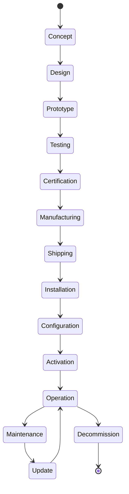

# CoreMusic Electronics Platform Architecture

**Zorunlu Bağlantılar:** [[electronic/core-music-electronics-overview]] · [[electronic/device-architecture]] · [[electronic/software-architecture]] · [[architecture/l6-electronics]] · [[ADR-061-electronics-architecture]] · [[electronic/audio-architecture]] · [[electronic/operating-system-architecture]]

---

## 1. Amaç

CoreMusic ELECTRONICS platformu, çoklu cihaz ailelerini destekleyen **9 katmanlı bir mimariye** sahiptir. Her katman belirli bir sorumluluk alanı tanımlar ve katmanlar arası bağımlılıklar sıkı şekilde kontrol edilir. Ortak yazılım altyapısı ile tüm cihaz aileleri aynı geliştirme sürecini paylaşır.

---

## 2. Platform Katmanları (9 Katman)

```mermaid
graph TB
    subgraph "CoreMusic Electronics Platform (9 Layers)"
        AI[AI Layer<br/>Auto-EQ, Room Correction, Prediction]
        APP[Application Layer<br/>Web UI, Mobile App, Desktop]
        API[API Layer<br/>REST, WebSocket, gRPC]
        MW[Middleware Layer<br/>Auth, Logging, Caching]
        AE[Audio Engine Layer<br/>Mixer, EQ, DSP Chain]
        DRV[Driver Layer<br/>ASIO, WASAPI, ALSA]
        FW[Firmware Layer<br/>RTOS, Boot, DSP Chain]
        HW[Hardware Layer<br/>PCB, Components, Connectors]
        DF[Device Family Layer<br/>Pro, Home, Car, Embedded]
    end

    DF --> HW
    HW --> FW
    FW --> DRV
    DRV --> AE
    AE --> MW
    MW --> API
    API --> APP
    APP --> AI

    style DF fill:#f96,stroke:#333,stroke-width:2px
    style HW fill:#f90,stroke:#333,stroke-width:2px
    style FW fill:#fc0,stroke:#333,stroke-width:2px
    style DRV fill:#ff0,stroke:#333,stroke-width:2px
    style AE fill:#6f6,stroke:#333,stroke-width:2px
    style MW fill:#69f,stroke:#333,stroke-width:2px
    style API fill:#96f,stroke:#333,stroke-width:2px
    style APP fill:#6ff,stroke:#333,stroke-width:2px
    style AI fill:#f69,stroke:#333,stroke-width:2px
```

---

## 3. Ürün Aileleri

### 3.1 Professional Audio

| Cihaz | Açıklama | Öncelik |
|-------|----------|---------|
| Studio Audio Interface | Stüdyo ses arayüzü (USB/Thunderbolt) | Yüksek |
| Rack DSP Processor | Raf tipi DSP işlemcisi | Yüksek |
| Professional DAC/ADC | Profesyonel dönüşürücü | Orta |
| Professional Mixer | Profesyonel mikser | Orta |
| Monitor Controller | Monitör kontrolcüsü | Düşük |

### 3.2 Home Audio

| Cihaz | Açıklama | Öncelik |
|-------|----------|---------|
| Smart Amplifier | Akıllı amplifikatör | Yüksek |
| Home Audio Receiver | Ev ses alıcısı | Yüksek |
| Multi Room Controller | Çoklu oda kontrolcüsü | Yüksek |
| Streaming Audio Player | Streaming ses oynatıcı | Orta |
| Smart Speaker | Akıllı hoparlör | Orta |

### 3.3 Car Audio

| Cihaz | Açıklama | Öncelik |
|-------|----------|---------|
| DSP Amplifier | DSP amplifikatör | Yüksek |
| Digital Crossover | Dijital crossover | Orta |
| OEM Audio Processor | OEM ses işlemcisi | Orta |
| Android Head Unit | Android bilgi-eğlence | Yüksek |

### 3.4 Embedded Audio

| Cihaz | Açıklama | Öncelik |
|-------|----------|---------|
| Raspberry Pi Audio HAT | RPi ses genişletme kartı | Yüksek |
| ARM Audio Board | ARM ses kartı | Orta |
| Embedded Linux Audio Device | Gömülü Linux ses cihazı | Orta |

### 3.5 Development Boards

| Cihaz | Açıklama | Öncelik |
|-------|----------|---------|
| Audio Development Board | Ses geliştirme kartı | Yüksek |
| DSP Evaluation Board | DSP değerlendirme kartı | Yüksek |
| Driver Test Board | Sürücü test kartı | Orta |

---

## 4. Cihaz Standartları

Her cihaz aşağıdaki standart yaşam döngüsüne uyar:

| Standart Katman | Açıklama |
|-----------------|----------|
| Device | Cihaz tanımı ve konfigürasyonu |
| Hardware | Fiziksel bileşen ve devre tasarımı |
| Firmware | Gömülü yazılım ve RTOS |
| Driver | İşletim sistemi sürücüsü |
| DSP | Dijital sinyal işleme zinciri |
| API | Dış erişim arayüzü |
| Application | Kullanıcı arayüzü |
| Cloud | Uzaktan yönetim ve güncelleme |
| AI | Akıllı özellikler ve otomasyon |

---

## 5. Ortak Yazılım Altyapısı

| Altyapı | Açıklama |
|---------|----------|
| Kimlik Yönetimi | Cihaz kimlik doğrulama, token yönetimi |
| Güncelleme (OTA) | Over-the-air firmware güncellemesi |
| Telemetri | Cihaz durumu izleme, loglama |
| AI Servisleri | Otomatik EQ, oda akustiği, bakım tahmini |
| Güvenlik | Secure boot, imzalı firmware, şifreleme |

---

## 6. Katman Detayları

### 6.1 Device Family Layer

Her cihaz ailesi ortak mimariyi paylaşır:

| Cihaz Ailesi | Ortak Altyapı |
|--------------|---------------|
| Professional Audio | Aynı mimari, yazılım standartları, protokoller |
| Home Audio | Aynı mimari, yazılım standartları, protokoller |
| Car Audio | Aynı mimari, yazılım standartları, protokoller |
| Embedded Audio | Aynı mimari, yazılım standartları, protokoller |
| Development Boards | Aynı mimari, yazılım standartları, protokoller |

### 6.2 Hardware Layer

Fiziksel bileşenler ve devre tasarımı:

- **PCB Tasarımı:** 4-16 katmanlı PCB, high-speed routing
- **Bileşen Seçimi:** endüstriyel/otomotiv/askeri sınıf
- **Güç Dağıtımı:** multi-rail, low-noise, EMI filtering
- **Termal Yönetim:** heatsink, fan, thermal pad
- **EMI/EMC:** uyumluluk testleri, sertifikasyon

Detaylar: [[electronic/hardware/index]], [[ADR-063-hardware-design-standards]]

### 6.3 Firmware Layer

Gömülü yazılım katmanı:

- **RTOS:** FreeRTOS, Zephyr, bare-metal
- **Boot Loader:** secure boot, OTA update
- **DSP Chain:** real-time audio processing
- **Communication:** USB, Ethernet, I2S, TDM

Detaylar: [[electronic/firmware/index]], [[ADR-062-dsp-pipeline-architecture]]

### 6.4 Driver Layer

İşletim sistemi sürücüleri:

- **Windows:** ASIO, WASAPI, WDM, Kernel Streaming
- **Linux:** ALSA, PipeWire, JACK, PulseAudio
- **macOS:** CoreAudio, AudioUnit

Detaylar: [[electronic/drivers/index]], [[electronic/asio-driver-design]]

### 6.5 Audio Engine Layer

Ses işleme motoru:

- **Mixer:** çoklu kanal karıştırma
- **EQ:** 31-bant parametrik equalizer
- **DSP Chain:** EQ → compressor → limiter → crossover
- **Spatial Audio:** surround, atmos

Detaylar: [[electronic/audio-architecture]], [[electronic/dsp/index]]

### 6.6 Middleware Layer

Ortak katman hizmetleri:

- **Authentication:** cihaz kimlik doğrulama
- **Logging:** olay günlüğü
- **Caching:** performans önbellekleme
- **Rate Limiting:** istek sınırlandırma

### 6.7 API Layer

Dış erişim arayüzü:

- **REST API:** CRUD işlemleri
- **WebSocket:** real-time iletişim
- **gRPC:** yüksek performanslı iletişim

### 6.8 Application Layer

Kullanıcı arayüzü:

- **Web UI:** tarayıcı tabanlı yönetim
- **Mobile App:** iOS/Android kumanda
- **Desktop App:** yerel uygulama

### 6.9 AI Layer

Akıllı özellikler:

- **Auto-EQ:** Otomatik equalizer ayarlama
- **Room Correction:** Oda akustik düzeltmesi
- **Predictive Maintenance:** Öngörücü bakım
- **Performance Optimization:** DSP parametre optimizasyonu

---

## 7. Cihaz Yaşam Döngüsü (16 Faz)

| Faz | Açıklama |
|-----|----------|
| 1. Concept | Konsept geliştirme |
| 2. Design | Donanım/yazılım tasarımı |
| 3. Prototype | Prototip üretimi |
| 4. Testing | Test ve doğrulama |
| 5. Certification | Sertifikasyon (CE, FCC) |
| 6. Manufacturing | Üretim |
| 7. Shipping | Sevkiyat |
| 8. Installation | Kurulum |
| 9. Configuration | Konfigürasyon |
| 10. Activation | Aktivasyon |
| 11. Operation | Normal kullanım |
| 12. Maintenance | Bakım |
| 13. Update | Güncelleme (OTA) |
| 14. Upgrade | Yükseltme |
| 15. Support | Teknik destek |
| 16. Decommission | Emekliye ayırma |

---

## 8. Cross References

| Dosya | Kapsam |
|-------|--------|
| [[electronic/core-music-electronics-overview]] | Genel bakış |
| [[electronic/device-architecture]] | Cihaz mimarisi |
| [[electronic/audio-architecture]] | Ses mimarisi |
| [[electronic/operating-system-architecture]] | OS mimarisi |
| [[electronic/device-ecosystem]] | Cihaz ekosistemi |
| [[electronic/software-architecture]] | Yazılım mimarisi |
| [[electronic/service-architecture]] | Servis mimarisi |
| [[architecture/l6-electronics]] | L6 Electronics katmanı |
| [[ADR-061-electronics-architecture]] | Electronics ADR |

---

## 9. Quality Report

| Metrik | Değer |
|--------|-------|
| Version | 2.0.0 |
| Status | Red Team · Human Mode · Truth Mode verified |
| Platform Layers | 9 |
| Device Families | 5 |
| Lifecycle Phases | 16 |
| Cross References | 9 |

---

**Authority:** Bayram Ali / Vault Steward
**Last Updated:** 2026-08-09
**Mode:** Red Team · Human Mode · Truth Mode
