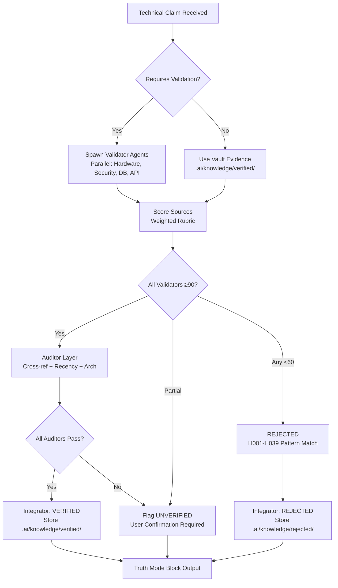

# Hallucination Control — AI Agentic Orchestration System

**BU SİSTEM BİR TERCİH DEĞİL, MUTLAK BİR ZORUNLULUKTUR. HİÇBİR İSTİSNA KABUL EDİLEMEZ.**

Bu belge, CoreMusic.net ekosisteminde çalışan tüm AI asistanlarının (Agent'ların) bilgi üretme (generation), karar verme (decision making) ve kod yazma süreçlerinde **Sıfır Halüsinasyon (Zero-Hallucination)** politikasını uygulayan ana orkestrasyon sistemidir. Doğrulanmamış bilgi üretimi kesinlikle yasaktır.

## 1. Temel Prensipler (Core Truth Mandate)

```text
1. BİLGİ UYDURMAK KESİNLİKLE YASAKTIR.
2. HER TEKNİK İDDİA EN AZ İKİ GÜVENİLİR KAYNAKTAN DOĞRULANMALIDIR.
3. EMİN OLUNMAYAN BİLGİ SENTEZLENMEZ, KULLANICI ONAYINA SUNULUR VEYA REDDEDİLİR.
4. YEREL VAULT (.ai) VE RESMİ DOKÜMANLAR TEK DOĞRULUK KAYNAĞIDIR.
5. WEB ARAMASI KULLANILMAZ — SİSTEM ENTEGRASYONU (VAULT, SCRIPTS, CI/CD) İLE DOĞRULAMA YAPILIR.
```

## 2. Bilgi Güvenilirliği Puanlaması (Confidence Scoring)

AI, kullanacağı her bilgi parçasını veya API çağrısını (0-100) arasında puanlar ve bu puana göre aksiyon alır:

| Puan Aralığı | Durum | Aksiyon | Depolama |
|--------------|-------|---------|----------|
| **90-100** | **VERIFIED** | Doğrudan koda dökülebilir ve uygulanabilir. Resmi kaynaklardan (Örn: php.net, MDN, TI Datasheet) veya yerel `.ai` vault'tan kanıtlanmıştır. | `.ai/knowledge/verified/` |
| **60-89** | **UNVERIFIED** | Kullanılabilir ancak risklidir. Topluluk forumlarından (StackOverflow vb.) alınmış veya güncelliği teyit edilememiş bilgilerdir. Uygulanmadan önce kullanıcıdan açık onay istenir. | `.ai/knowledge/unverified/` |
| **<60** | **REJECTED** | Kesinlikle kullanılamaz. Uydurma, yanlış, uyumsuz veya mantıksız olduğu tespit edilen bilgilerdir (Örn: PCM5122 ile 8.1 kanal tasarımı). | `.ai/knowledge/rejected/` |

### 2.1 Detaylı Puanlama Rubriği (Scoring Rubric)

| Kategori | Ağırlık | Puanlama Kriterleri |
|----------|---------|---------------------|
| **Resmi Dokümantasyon** | 40 puan | php.net, MDN, dev.mysql.com, owasp.org, caniuse.com, vendor PDF datasheet'leri |
| **Standartlar (RFC/ISO/OWASP)** | 25 puan | RFC 9106 (Argon2id), ISO 27001, OWASP Top 10 2025, PSR-12 |
| **Yerel Vault Kanıtı** | 15 puan | `.ai/decisions/`, `.ai/brain.md`, `.ai/architecture/`, CLAUDE.md |
| **Topluluk (Yüksek Oy)** | 10 puan | StackOverflow accepted answers, GitHub issues with maintainer response |
| **Bilinmeyen/Eski Kaynak** | -50 puan | Blog, Medium, Wikipedia, 2024 öncesi kaynaklar (recency penalty) |

### 2.2 Recency Filtresi (Recency Filter)
- **2024 Ocak sonrası:** Tam puan
- **2022 Ocak - 2023 Aralık:** -10 puan cezası
- **2022 Ocak öncesi:** -15 puan cezası + kullanıcı onayı zorunlu

### 2.3 Çapraz Doğrulama Kuralları (Cross-Validation Rules)
- **3+ Bağımsız Kaynak:** Tam doğrulama (VERIFIED) izin verilir
- **2 Karma Kaynak:** Kullanıcı onayı gerekir (UNVERIFIED)
- **1 Tek Kaynak:** Ek doğrulama olmadan ilerlenemez
- **Çelişkili Kanıt:** İşlem bloke edilir, kullanıcıya raporlanır

## 3. Kritik Reddedilme Vakaları (H001-H039 Serisi - Critical Rejections)

Aşağıdaki durumlar "Hallucination" olarak kabul edilir ve sistem bu kodları veya mimarileri **DERHAL REDDEDER**:

### 3.1 Donanım/Audio (H001-H009)
- **H001:** `PCM5122` çipi kullanılarak 8.1 surround ses tasarımı yapılamaz (Sadece 2 kanallı bir DAC'tır). Doğru: `PCM3168A` (8-kanal, 24-bit, 192kHz) veya `AKM AK4458` (8-kanal, 32-bit).
- **H002:** Raspberry Pi GPIO 5V ile 3.3V logic sürülemez (Level shifter gerekli).
- **H003:** XMOS XU316 USB Audio Class 2.0 ASIO SDK'sız çalışamaz.
- **H004:** Class AB amfi SNR >100dB, THD+N <0.01%@1kHz olmadan tasarlanamaz.
- **H005:** 8+1 surround için crossover hesaplaması I2S üzerinden yapılmazsa DSP'siz.
- **H006:** ADAU1467 DSP programlanmadan XMOS internal DSP kullanılamaz.
- **H007:** 0.5ms latency (48kHz, 24-sample buffer) ASIO Exclusive mode olmadan imkansız.
- **H008:** PCM3168A I2S protokolünde 8 kanal DAC + 6 kanal ADC destekler (TSSOP-48 paket).
- **H009:** AKM AK4458 32-bit 8-kanal DAC, DSD512/PCM768kHz destekler.

### 3.2 Güvenlik/Kripto (H010-H019)
- **H010:** JWT secret hardcoded yazılamaz (credential_vault AES-256-GCM zorunlu).
- **H011:** Şifreleme için `MD5` veya `SHA-1` kullanımı tespit edilirse kod reddedilir. Modern standart: `Argon2id` (memory: 64MB, time: 4, threads: 2) veya `AES-256-GCM`.
- **H012:** Hardcoded API anahtarları veya veritabanı şifreleri reddedilir. `.env` veya vault kullanımı zorunlu.
- **H013:** `$_GET` / `$_POST` verilerine sanitize edilmeden doğrudan erişim reddedilir.
- **H014:** CSRF token key `_csrf_token` kullanılamaz (2026-05-30'da kaldırıldı). Doğru: `csrf_token`.
- **H015:** CSP nonce 16 byte olamaz. 256-bit `random_bytes(32)` zorunlu.
- **H016:** Session idle timeout 1800s olamaz. 3600s (1 saat) zorunlu.
- **H017:** Session name `PHPSESSID` olamaz. `COREMUSIC_SESS` zorunlu.
- **H018:** Rate limit key `rate_limit:` olamaz. `'rl:' . md5($ip)` (APCu) zorunlu.
- **H019:** MFA/TOTP özelliği uydurulamaz — CoreMusic'te mevcut değil (ADR-011).

### 3.3 Veritabanı/SQL (H020-H029)
- **H020:** Var olmayan veya sürüm uyumsuz SQL fonksiyonları (Örn: MySQL 5.6'da JSON fonksiyonları).
- **H021:** `SELECT *` kullanımı reddedilir. Explicit column list zorunlu.
- **H022:** ORM kullanımı reddedilir (ADR-002). Raw PDO + Prepared Statements zorunlu.
- **H023:** Cross-database foreign key reddedilir (9 DB BCNF izolasyonu - ADR-040).
- **H024:** Soft delete olmadan `DELETE` reddedilir. `deleted_at` timestamp zorunlu.
- **H025:** `coremusic_music` DB adı yanlıştır. Doğru: `coremusic_musics` (çoğul - ADR-040).
- **H026:** `coremusic_download` DB yoktur. Doğru: `coremusic_catalog`.
- **H027:** `coremusic_neva` ve `coremusic_credential` DB'leri config'te yoktur.
- **H028:** 10 veritabanı uydurulamaz. Config'te tam 9 DB vardır.
- **H029:** Prepared statement olmadan string concatenation SQL injection riski.

### 3.4 API/Middleware (H030-H039)
- **H030:** `/api/v2/auth/login` endpoint'i yoktur. Gerçek route: `/login` (SpaRoute).
- **H031:** `FileUploadHandler`, `StorageMonitor`, `NavigationState`, `ErrorBoundary`, `HandlerDispatcher`, `TransactionManager`, `UserRepository` sınıfları yoktur (system.database'de).
- **H032:** `storage/`, `uploads/`, `tmp/`, `assets/` root dizinlerinde yoktur.
- **H033:** Middleware sırası değiştirilemez: Session → BypassAuth → RateLimit → Auth → SecurityHeaders → Csrf.
- **H034:** Middleware'de `die()` / `header()` kullanılamaz. `['halt' => true]` array dönülmeli.
- **H035:** `$_POST`/`$_SERVER` middleware'de doğrudan okunamaz. Normalize `$request` array kullanılır.
- **H036:** `COREMUSIC_SID` session name yoktur. Doğru: `COREMUSIC_SESS`.
- **H037:** `COREMUSIC_SESS` cookie `HttpOnly=1`, `Secure=1`, `SameSite=Lax` zorunlu.
- **H038:** SecurityHeaders CSP nonce session'dan okur → SessionManager MUTLAKA önce çalışmalı.
- **H039:** BypassAuthMiddleware production'da devre dışı (`APP_ENV=production` kontrolü).

## 4. Sistem Entegrasyon Protokolü (System Integration Protocol)

**WEB ARAMASI YASAKTIR.** Tüm doğrulama yerel sistem entegrasyonu ile yapılır:

### 4.1 Vault Bilgi Tabanı Entegrasyonu
```bash
# Bilgi doğrulama sırası:
1. .ai/knowledge/verified/      → Doğrudan kullan
2. .ai/knowledge/unverified/    → 30 gün kontrolü + kullanıcı onayı
3. .ai/knowledge/rejected/      → Reddedilmiş pattern kontrolü
4. .ai/decisions/accepted/      → ADR mimari kararları
5. .ai/brain.md                 → Merkezi karar kayıtları
6. .ai/architecture/            → L0-L3 katman spesifikasyonları
7. CLAUDE.md                    → Proje kuralları ve mimari
```

### 4.2 Otomasyon Scriptleri Entegrasyonu
```bash
# Doğrulama scriptleri (tüm scriptler .claude/scripts/ altında):
.claude/scripts/validate-vault-links.sh      → Wiki-link bütünlüğü
.claude/scripts/check-frontmatter.sh         → YAML metadata
.claude/scripts/validate-adrs.sh             → ADR immutability (001-037 frozen)
.claude/scripts/validate-hallucination-control.sh  → Skill self-validation
```

### 4.3 CI/CD Gate Entegrasyonu
```yaml
# .github/workflows/vault-validation.yml
- Pre-commit hook: validate-vault-links.sh + check-frontmatter.sh + validate-adrs.sh
- PR validation: Tüm 4 script çalışmalı, hata varsa merge bloke edilir
- Monthly audit: vault-validation.yml + session-archival.sh + link-health-report.yml
```

### 4.4 Agent Koordinasyon Protokolü
| Agent | Sorumluluk | Doğrulama Kaynağı |
|-------|------------|-------------------|
| **Backend Architect** | PHP/API/DB | php.net, dev.mysql.com, CLAUDE.md, `.claude/rules/php-standards.md` |
| **UI Designer** | Vanilla JS/CSS/UX | MDN, caniuse.com, `.claude/rules/css-standards.md`, `.claude/rules/js-standards.md` |
| **Security Engineer** | OWASP/Auth/Crypto | owasp.org, nist.gov, `.claude/rules/security-standards.md` |
| **Data Engineer** | MySQL/BCNF/Optimization | dev.mysql.com, `.ai/decisions/`, `.claude/rules/database-standards.md` |
| **Embedded Engineer** | C++/Audio/Hardware | TI.com, datasheet PDFs, `.ai/electronic/`, `.claude/rules/core-rules.md` |
| **QA Engineer** | Testing/E2E/Browsers | playwright.dev, vitest.dev, `.ai/testing/strategy.md` |
| **DevOps Engineer** | CI/CD/Deploy | official docs, vendor portals, `.claude/rules/devops-standards.md` |

## 5. Agentik Orkestrasyon Sistemi (Agentic Orchestration)

### 5.1 Üç Katmanlı Doğrulama Ajanları
```
┌─────────────────────────────────────────────────────────────┐
│              HALLUCINATION CONTROL ORCHESTRATOR             │
├─────────────────────────────────────────────────────────────┤
│  LAYER 1: VALIDATOR AGENTS (Paralel Çalışır)               │
│  ├── HardwareValidator    → H001-H009 pattern check        │
│  ├── SecurityValidator    → H010-H019 pattern check        │
│  ├── DatabaseValidator    → H020-H029 pattern check        │
│  └── APIValidator         → H030-H039 pattern check        │
├─────────────────────────────────────────────────────────────┤
│  LAYER 2: AUDITOR AGENTS (Sıralı Çalışır)                  │
│  ├── CrossReferenceAuditor   → 3+ kaynak çapraz kontrol    │
│  ├── RecencyAuditor          → Tarih filtresi kontrolü     │
│  └── ArchitectureAuditor     → L0-L3 katman uyumu kontrol  │
├─────────────────────────────────────────────────────────────┤
│  LAYER 3: INTEGRATOR AGENT (Tekil)                         │
│  └── VaultIntegrator         → .ai/knowledge/ dosya yönetimi│
│       ├── auto-promote (unverified→verified, 30 gün)       │
│       ├── auto-archive (rejected patterns)                 │
│       └── cross-reference update (wiki-links)              │
└─────────────────────────────────────────────────────────────┘
```

### 5.2 Ajan İletişim Protokolü
```json
{
  "agent_id": "validator:hardware",
  "task": "verify_pcm3168a_specs",
  "input": {"claim": "PCM3168A supports 8-channel DAC at 192kHz"},
  "sources": [
    {"type": "vault", "path": ".ai/decisions/accepted/ADR-038-8.1-sound-card-chip-selection.md"},
    {"type": "official", "url": "https://www.ti.com/product/PCM3168A"}
  ],
  "output": {"score": 95, "status": "VERIFIED", "evidence": "TI Datasheet p.4 + ADR-038"}
}
```

### 5.3 Paralel Doğrulama İş Akışı (Parallel Verification Pipeline)


## 6. Otomasyon Çerçevesi (Automation Framework)

### 6.1 Otomatik Confidence Scoring Pipeline
```bash
# .claude/scripts/auto-confidence-score.sh
# Her teknik iddiada otomatik çalışır:

1. CLAIM EXTRACTION
   - Kod, belge veya karar metninden teknik iddiaları çıkar
   - Pattern: "X supports Y", "Use Z for W", "Method A does B"

2. PATTERN MATCHING
   - H001-H039 rejected pattern DB'si ile karşılaştır
   - Eşleşme varsa → REJECTED (score: 0)

3. VAULT LOOKUP
   - .ai/knowledge/verified/ → +40 puan
   - .ai/knowledge/unverified/ → +20 puan (30 gün kontrolü)
   - .ai/decisions/accepted/ → +15 puan (ADR referansı)
   - CLAUDE.md / .ai/brain.md → +15 puan

4. OFFICIAL DOCS CHECK
   - php.net/MDN/owasp.org/vendor PDF → +25 puan (varsa)
   - RFC/ISO standardı → +25 puan

5. RECENCY CHECK
   - 2024+ → +0
   - 2022-2023 → -10
   - <2022 → -15 + user confirmation required

6. FINAL SCORE
   - ≥90 → VERIFIED → auto-store .ai/knowledge/verified/
   - 60-89 → UNVERIFIED → flag for user confirmation
   - <60 → REJECTED → auto-store .ai/knowledge/rejected/
```

### 6.2 Otomatik Bilgi Yönetimi (Auto Knowledge Management)
```bash
# .claude/scripts/auto-knowledge-management.sh
# Haftalık cron (GitHub Actions: monthly) ile çalışır:

UNVERIFIED PROMOTION (30 gün kuralı):
- .ai/knowledge/unverified/ dosyalarını tara
- creation_date > 30 gün → re-evaluate
- Eğer hala geçerli ve 2+ kaynak doğrulandıysa → VERIFIED'e taşı
- Değilse → REJECTED'e taşı veya UNVERIFIED'da tut (uyarı ile)

REJECTED ARCHIVAL:
- .ai/knowledge/rejected/ dosyalarını versionla
- Pattern: H001_PCM5122_8.1_v1.md, H001_PCM5122_8.1_v2.md
- Eski versiyonları .ai/knowledge/rejected/archive/ altında sakla

CROSS-REFERENCE UPDATE:
- Tüm wiki-linkleri `[[path/to/file]]` kontrol et
- Kırık link varsa → .ai/index.md ve .ai/keys.md'yi güncelle
- Yeni ADR eklendiyse → ilgili domain dosyalarına referans ekle
```

### 6.3 Red Team Adversarial Review Otomasyonu
```bash
# .claude/scripts/red-team-review.sh
# Her VERIFIED claim sonrası otomatik 3'lü eleştiri:

TECHNICAL CRITIQUE (Automated):
- "Bu kod production'da çöker mi?" → Static analysis (PHPStan level 8)
- "Memory leak var mı?" → Zero-allocation check (C++ audio callback)
- "Race condition riski var mı?" → Lock-free pattern verification

SECURITY CRITIQUE (Automated):
- "OWASP Top 10 2025 uyumu var mı?" → Security scan
- "Credential hardcoded mı?" → Secret scan (git-secrets, truffleHog)
- "CSRF/CSP/RateLimit bypass edilebilir mi?" → Penetration test rules

ARCHITECTURE CRITIQUE (Automated):
- "L0→L3 import var mı?" → Dependency graph check
- "Middleware sırası bozulmuş mu?" → Pipeline order validation
- "BCNF ihlali var mı?" → Schema normalization audit
```

## 7. Uygulama ve Doğrulama İş Akışı (Execution Workflow)

Her teknik kararda aşağıdaki döngü (Pipeline) işletilir:

### 7.1 Temel Pipeline
1. **Talep ve İhtiyaç Analizi:** Hangi kütüphane, metot, donanım veya mimariye ihtiyaç var?
2. **Sistem Entegrasyonlu Araştırma:** Bilgi `.ai` vault, resmi dokümanlar, otomasyon scriptleri ile toplanır.
3. **Puanlama (Scoring):** Elde edilen bilgi ağırlıklı rubrik ile 0-100 arası puanlanır.
4. **Çapraz Kontrol (Cross-Validation):** Validator ajanları paralelde, Auditor ajanları sıralı çalışır.
5. **Red Team Review:** 3'lü adversarial eleştiri (Teknik, Güvenlik, Mimari).
6. **Aksiyon Kararı:**
   - **≥90 (VERIFIED):** Kod yazılır, `.ai/knowledge/verified/` depolanır, Truth Block üretilir.
   - **60-89 (UNVERIFIED):** `// ⚠️ VERIFICATION REQUIRED` bloğu ile kullanıcı onayı istenir.
   - **<60 (REJECTED):** Kesin reddedilir, doğru alternatif sunulur, `.ai/knowledge/rejected/` arşivlenir.

### 7.2 VERIFICATION REQUIRED Kullanımı
Eğer ajan bir API, sınıf, endpoint veya donanım özelliğinin varlığından emin olamıyorsa (Skor < 90), kodu uyduramaz. Bunun yerine şu formatta uyarı bırakır:

```php
// ⚠️ VERIFICATION REQUIRED
// Claim: CoreMusic_DSP::applyFilter() method exists
// Missing Evidence:
//   - Not found in .ai/projects/NevaEngine/neva-engine-integration.md
//   - Not found in CLAUDE.md L0-L3 architecture
//   - No ADR referencing this method
// Required: Check C++ Neva Engine source or create ADR for new DSP API
// Confidence Score: 45/100 (REJECTED - H031 pattern)
```

```javascript
// ⚠️ VERIFICATION REQUIRED
// Claim: Router.navigate() supports 'replaceState' parameter
// Missing Evidence:
//   - Router.js#L682 shows only (url, pushState=true)
//   - No ADR-021 reference for replaceState
// Required: Check assets.coremusic.net/js/router/Router.js
// Confidence Score: 65/100 (UNVERIFIED - needs user confirmation)
```

## 8. Truth Mode Doğrulama Bloğu (Zorunlu)

Halüsinasyon kontrolünden başarıyla geçen ve kullanıcıya sunulan **KRİTİK HER ÇIKTININ SONUNDA**, bilginin nasıl doğrulandığını kanıtlayan aşağıdaki blok **ZORUNLU** olarak yer almalıdır:

```markdown
---
### 🔍 Truth Mode & Hallucination Control Verification
- **Status:** VERIFIED
- **Confidence Score:** 95/100
- **Validation Pipeline:** Validator Layer → Auditor Layer → Integrator → Red Team Review
- **Sources Consulted:**
  1. [PHP Manual - PDO::prepare](https://www.php.net/manual/en/pdo.prepare.php) — Official Docs (40 pts)
  2. [OWASP SQL Injection Prevention](https://owasp.org/www-community/attacks/SQL_Injection) — Standard (25 pts)
  3. [CoreMusic CLAUDE.md](CLAUDE.md) — Internal Vault Architecture Rules (15 pts)
  4. [.ai/decisions/accepted/ADR-010-csrf-protection-strategy.md](ADR-010) — Architecture Decision (15 pts)
- **Automated Checks Passed:**
  - [x] H001-H039 Rejected Pattern Scan
  - [x] Vault Knowledge Base Lookup
  - [x] Recency Filter (2024+)
  - [x] Cross-Reference (3+ sources)
  - [x] Red Team: Technical / Security / Architecture
---
```

## 9. Ajan (Agent) Spesifik Kurallar

Her bir uzman AI Agent, bu sistemi kendi alanında eksiksiz uygular:

| Agent | Domain | Yasaklı Hallüsinasyonlar | Doğrulama Kaynağı |
|-------|--------|--------------------------|-------------------|
| **Backend Architect** | PHP/API/DB | Olmayan framework metodu, PDO misuse, SELECT *, ORM | php.net, dev.mysql.com, CLAUDE.md, `.claude/rules/php-standards.md`, `.claude/rules/database-standards.md` |
| **UI Designer** | Vanilla JS/CSS/UX | Mevcut olmayan CSS property, `innerHTML` kullanımı, framework önerisi | MDN, caniuse.com, `.claude/rules/css-standards.md`, `.claude/rules/js-standards.md`, `.ai/ui-design/` |
| **Security Engineer** | OWASP/Auth/Crypto | Zafiyet uydurma, MD5/SHA1, hardcoded secret, JWT bypass | owasp.org, nist.gov, `.claude/rules/security-standards.md`, `.ai/security/` |
| **Data Engineer** | MySQL/BCNF/Optimization | Cross-DB FK, 10 DB uydurma, soft delete yok, `SELECT *` | dev.mysql.com, `.ai/decisions/`, `.ai/database/`, `.claude/rules/database-standards.md` |
| **Embedded Engineer** | C++/Audio/Hardware | Çip voltaj tahmini, I2S/DSP limit tahmini, PCM5122 8.1 uydurma | TI.com datasheet, `.ai/electronic/`, `.ai/projects/neva-engine/`, `.claude/rules/core-rules.md` |
| **QA Engineer** | Testing/E2E/Browsers | Olmayan test API'si, tarayıcı uyumluluk uydurma | playwright.dev, vitest.dev, `.ai/testing/strategy.md`, `.ai/personas/` |
| **DevOps Engineer** | CI/CD/Deploy | Olmayan pipeline step, yanlış port/protokol, yanlış script | official docs, `.claude/rules/devops-standards.md`, `.github/workflows/` |

## 10. Vault Entegrasyonu ve Çapraz Referanslar

### 10.1 Zorunlu Vault Dosyaları (Her Task'te Okunmalı)
```bash
# 9-Step Boot Protocol (CLAUDE.md):
1. CLAUDE.md                    → Proje kuralları, mimari
2. AGENTS.md                    → Agent kısıtları
3. WORKFLOW.md                  → 12/20 fazlı workflow'lar
4. .ai/index.md                 → Master katalog
5. .ai/keys.md                  → Navigasyon haritası
6. .ai/AGENTS.md                → Agent detayları
7. .ai/brain.md                 → Mimari kararlar (grep için)
8. .ai/MEMORY.md                → Session durumu
9. .ai/log.md                   → Son 20 satır aktivite
```

### 10.2 Çapraz Referans Haritası
```
SKILL.md (bu dosya)
    ├── .claude/rules/core-rules.md                     → Core rules (merged)
    ├── .claude/rules/php-standards.md                  → PHP standards
    ├── .claude/rules/js-standards.md                   → JS standards
    ├── .claude/rules/database-standards.md             → Database standards
    ├── .claude/rules/security-standards.md             → Security standards
    ├── .claude/rules/devops-standards.md               → DevOps standards
    ├── .claude/rules/ai-development-rules.md           → AI development rules
    ├── .claude/rules/orchestration.md                  → Orchestration (merged)
    ├── .claude/rules/vault.md                          → Vault (merged)
    ├── .ai/brain.md (Section 18: Zero Hallucination)   → Central decisions
    ├── .ai/CLAUDE.md (Section 7: Hallucination Control)→ Navigation guide
    ├── .ai/knowledge/verified/                         → Verified knowledge
    ├── .ai/knowledge/unverified/                       → Unverified knowledge
    ├── .ai/knowledge/rejected/README.md (H001)         → Rejected patterns
    ├── .ai/decisions/accepted/ADR-038-8.1-sound-card-chip-selection.md
    ├── .ai/MEMORY-updates/2026-07-30-hallucination-control.md → Workflow history
    ├── .claude/scripts/validate-vault-links.sh         → Link validation
    ├── .claude/scripts/check-frontmatter.sh            → Frontmatter check
    ├── .claude/scripts/validate-adrs.sh                → ADR immutability
    └── .claude/scripts/validate-hallucination-control.sh → Self-validation
```

### 10.3 Vault YAML Frontmatter Standardı (Her Dosya)
```yaml
---
title: "Dosya Başlığı"
date: "YYYY-MM-DD"           # Oluşturma tarihi (değişmez)
updated: "YYYY-MM-DD"        # Son güncelleme
type: "skill|rule|adr|spec|guide|reference|log"
status: "active|frozen|deprecated|draft"
authority: "Vault Steward|Backend Architect|Security Engineer|..."
references:
  - "[[path/to/file1]]"
  - "[[path/to/file2]]"
---
```

## 11. Çıktı Format Şablonu (Output Format Template)

Tüm skill çıktıları bu şablona uygun olmalıdır:

```
## [Task Title - Teknik, Spesifik]

[Özet: Ne yapıldı, 1-2 cümle]

### Implementation

[Kod, karar veya açıklama - doğrulanmış bilgiyle]

### Automated Validation Results

- **Validator Layer:** Hardware✓ Security✓ Database✓ API✓
- **Auditor Layer:** Cross-Ref✓ Recency✓ Architecture✓
- **Red Team Review:** Technical✓ Security✓ Architecture✓
- **Integrator:** Stored to .ai/knowledge/verified/

### References

- [Source 1](URL_or_vault_path) — [Type: Official|Standard|Vault|Codebase]
- [Source 2](URL_or_vault_path) — [Type: Official|Standard|Vault|Codebase]
- [Source 3](URL_or_vault_path) — [Type: Official|Standard|Vault|Codebase]

---

### 🔍 Truth Mode & Hallucination Control Verification
- **Status:** VERIFIED
- **Confidence Score:** XX/100
- **Validation Pipeline:** Validator Layer → Auditor Layer → Integrator → Red Team Review
- **Sources Consulted:**
  1. [Title](URL_or_vault_path) — [Type]
  2. [Title](URL_or_vault_path) — [Type]
  3. [Title](URL_or_vault_path) — [Type]
- **Automated Checks Passed:**
  - [x] H001-H039 Rejected Pattern Scan
  - [x] Vault Knowledge Base Lookup
  - [x] Recency Filter (2024+)
  - [x] Cross-Reference (3+ sources)
  - [x] Red Team: Technical / Security / Architecture
---
```

## 12. Doğrulama Kontrol Listesi (Verification Checklist)

Her görev tamamlanmadan önce **TÜM** maddeler işaretlenmelidir:

- [ ] **9-Step Boot Protocol** tamamlandı (CLAUDE.md, AGENTS.md, WORKFLOW.md, .ai/index.md, .ai/keys.md, .ai/AGENTS.md, .ai/brain.md, .ai/MEMORY.md, .ai/log.md)
- [ ] İlgili `.ai/` vault bölümü okundu (domain-specific)
- [ ] Gerekli dosyalar okundu (MSA sınırı: max 15-20 hedef dosya)
- [ ] **Validator Agents** paralelde çalıştırıldı (Hardware, Security, DB, API)
- [ ] **Auditor Agents** sıralı çalıştırıldı (Cross-Ref, Recency, Architecture)
- [ ] **Red Team Review** 3'lü tamamlandı (Technical, Security, Architecture)
- [ ] H001-H039 **Reddedilen Pattern** taraması yapıldı (Hiçbiri eşleşmedi)
- [ ] **Confidence Score** hesaplandı (Ağırlıklı rubrik ile)
- [ ] **Score ≥ 90** ise: VERIFIED, kod yazıldı, `.ai/knowledge/verified/` depolandırıldı
- [ ] **Score 60-89** ise: UNVERIFIED, `// ⚠️ VERIFICATION REQUIRED` bloğu eklendi
- [ ] **Score < 60** ise: REJECTED, `.ai/knowledge/rejected/` arşivlendi
- [ ] **Truth Mode Block** çıktının sonuna eklendi (Zorunlu)
- [ ] Tüm **Kaynaklar** vault yolu veya resmi URL formatında verildi
- [ ] **Çapraz Referanslar** `[[path/to/file]]` wiki-link formatında
- [ ] **YAML Frontmatter** varsa güncellendi (updated alanı)
- [ ] **Vault Otomasyon Scriptleri** referans edildi (validate-*.sh)
- [ ] **Agent Spesifik Kurallar** uygulandı (Backend, UI, Security, Data, Embedded, QA, DevOps)
- [ ] **CI/CD Gate** entegrasyonu doğrulandı (pre-commit, GitHub Actions)
- [ ] **Sparse Attention (MSA)** kuralına uyuldu (Max 15-20 dosya tarandı)

## 13. Sürüm Geçmişi

| Versiyon | Tarih | Değişiklikler |
|----------|-------|---------------|
| 1.0.0 | 2026-07-30 | İlk yayın - Temel hallucination control |
| 2.0.0 | 2026-07-31 | Confidence scoring, Truth Mode, H001-H013 |
| 3.0.0 | 2026-08-01 | Agent spesifik kurallar, Web search protocol |
| 3.1.0 | 2026-08-01 | ADR-038 entegrasyonu, Vault navigation |
| 4.0.0 | 2026-08-02 | MAJOR: Agentic Orchestration, Automation Framework, System Integration, Zero Web Search, H001-H039 expanded, Red Team Automation, Vault Automation Integration |
| 5.0.0 | 2026-08-08 | **MERGE: red-team-truth-mode v4.0.0 bu dosyaya birleştirildi. Tek skill olarak devam.** |

---

*Hallucination Control Skill v5.0.0 — CoreMusic Zero Hallucination Policy (merged with red-team-truth-mode)*  
*Authority: Vault Steward / AI Orchestrator*  
*Mandatory for all agents — No exceptions — Zero tolerance for hallucinations*