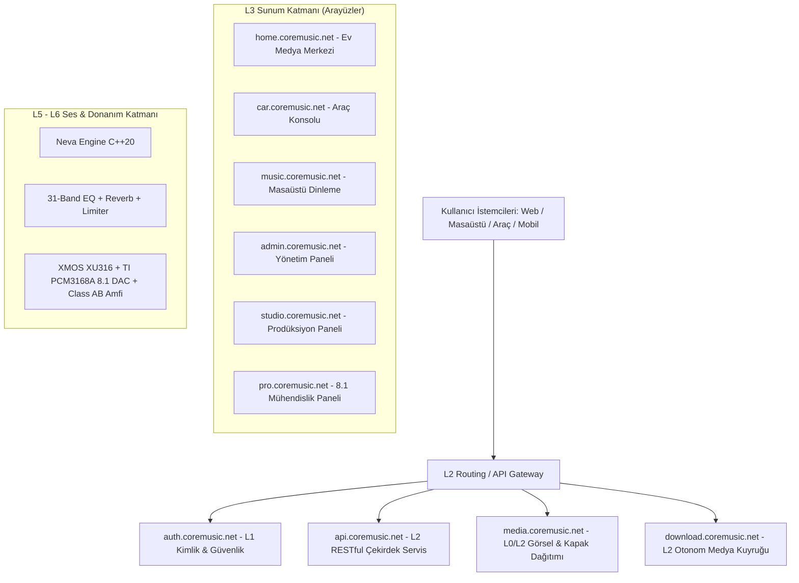
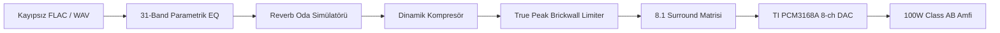

# CoreMusic — Technical Documentation & Developer Guide
**Software • Audio • Hardware • AI**  
*Music Connects Everywhere — Music Beyond Limits*  
*Version 1.0.0 — September 2026 — CoreMusic Confidential*

---

> *"Great sound is not a luxury. It's a better way to live."*  
> — **CoreMusic**

---

## Table of Contents

| Bölüm | Başlık | Sayfa / Kapsam |
| :---: | :--- | :--- |
| **01** | **Introduction** (Overview, Vision & Key Concepts, Features, Target Users) | § 1.1 – 1.3 |
| **02** | **System Architecture** (Overview, Layer Structure L0–L6, Component Diagram) | § 2.1 – 2.3 |
| **03** | **Installation & Setup** (System Requirements, 6-Step Installation) | § 3.1 – 3.2 |
| **04** | **Configuration** (Environment Variables `.env`, Service Configuration) | § 4.1 – 4.2 |
| **05** | **API Documentation** (Authentication, Endpoints, JSON Payload Examples) | § 5.1 – 5.3 |
| **06** | **Audio Engine** (Neva Engine C++20, Real-Time DSP Chain, Hardware Entegrasyonu) | § 6.1 – 6.2 |
| **07** | **User Interface** (Screens, Mockup SSOT, Component Inventory C01–C16) | § 7.1 – 7.2 |
| **08** | **Security & Compliance** (OWASP, AES-256-GCM Vault, CSP Nonce, 10-Step Pipeline) | § 8.1 – 8.3 |
| **09** | **Deployment & Operations** (RPi5 Home OS, Docker, Reverse Proxy, Edge Sync) | § 9.1 – 9.2 |
| **10** | **Freelancer & Developer Coding Standards** (Hard Guardrails, Zero ORM, Vanilla JS) | § 10.1 – 10.7 |
| **11** | **Appendices & Troubleshooting** (11.1 File Structure, 11.2 Troubleshooting, Vault) | § 11.1 – 11.3 |

---

# CHAPTER 01: Introduction
### Overview, Vision, Key Concepts & Commercial Value

## 1.1. What is CoreMusic? (CoreMusic Nedir?)

**CoreMusic**; müzik arşivi yönetimi, stüdyo kalitesinde gerçek zamanlı ses işleme, gömülü donanım entegrasyonu ve çok kanallı medya dağıtım süreçlerini tek bir merkezi çatı altında birleştirmek amacıyla geliştirilen **yeni nesil kurumsal dijital medya yönetim sistemi ve ticari ses ekosistemidir**.

CoreMusic, klasik bir müzik oynatıcısının (*media player*) basit dosya çalma yaklaşımını kökten reddeder. Kullanıcının sahip olduğu yerel müzik arşivlerini, yüksek çözünürlüklü dijital ses dosyalarını, fiziksel ses donanımlarını, medya servislerini ve kişisel akustik tercihlerini **tek bir ekosistem içerisinde uçtan uca yönetmesini sağlayan büyük ölçekli bir teknoloji omurgası** olarak tasarlanmıştır.

```
       [ Any Device Anytime ]            [ Your Music Everywhere ]
                 \                                  /
                  ───>  COREMUSIC EKOSİSTEMİ  <───
                 /                                  \
       [ Smarter With AI ]               [ For a More Musical Life ]
```

### Çözülen Yapısal Pazar Problemleri
1. **Arşiv Dağınıklığı:** Farklı bilgisayarlarda, telefonlarda ve harici disklerde dağılmış, meta verileri bozuk kontrolsüz müzik koleksiyonları.
2. **Kiralama Tuzağı ve Hak Sınırlamaları:** Streaming platformlarında kullanıcılar her ay abonelik öder ancak hiçbir parçanın mülkiyetine sahip olamaz. Platform lisans anlaşması bittiğinde şarkılar arşivden habersizce silinir.
3. **İşletim Sistemi Ses Bozulması:** Standart işletim sistemi mikserleri (Windows DirectSound/WASAPI Shared vb.) ses verisini zorunlu yeniden örneklemeye (*resampling*) sokarak dinamik aralığı daraltır ve distorsiyona yol açar.
4. **Donanım ve Protokol Uyumsuzluğu:** Evdeki ses sistemi, arabadaki multimedya paneli ve iş istasyonundaki stüdyo monitörleri birbirini tanımaz; bağımsız ve uyumsuz yazılımlar gerektirir.

**CoreMusic Çözümü:**  
CoreMusic, **Offline-First (Önce Çevrimdışı)** mimarisi ve **Kullanıcı Veri Mülkiyeti** felsefesiyle bu krizi yüksek kârlı bir değere dönüştürür. Dağınık ses dosyalarını ilişkisel bir veri varlığı olarak ele alır; 24-bit/32-bit kayıpsız **FLAC**, ALAC ve WAV formatlarını stüdyo referansında kataloglar ve doğrudan sürücü erişimiyle donanıma iletir.

---

## 1.2. Key Features & Commercial Value (Temel Yetenekler ve Ticari Vizyon)

CoreMusic; trilyon dolarlık dijital ses, otomotiv ve tüketici elektroniği pazarındaki boşluğu doğrudan yüksek kârlılığa dönüştüren çok kanallı bir **Ticari Dijital Ses Ekosistemi ve Gelir Platformudur**.

### 4 Ayaklı Gelir Stratejisi
1. **B2C Donanım Satış Geliri (%50+ Brüt Kâr Marjı):** Özel üretim XMOS XU316 ses kartı, TI PCM3168A 8-kanallı DAC, RPi5 ev sunucusu ve 100W Class AB analog amplifikatör donanım paketleri.
2. **Otomotiv OEM Lisanslama:** Otomobil üreticilerine ve araç elektroniği entegratörlerine araç başına lisanslanan düşük gecikmeli, gömülü I2S/TDM araç içi bilgi-eğlence yazılımı.
3. **B2B Profesyonel Stüdyo Paketleri:** Ses mühendisleri ve stüdyolar için 8.1 surround izleme, parametrik EQ ve ses işleme kurumsal iş istasyonu lisansları.
4. **B2C Ekosistem Abonelikleri (ARR):** `regular`, `premium`, `studio` ve `car` RBAC katmanlarıyla sunulan bulut senkronizasyonu, yapay zekâ kütüphane otomasyonu ve gelişmiş medya servisleri.

### Operasyonel Kârlılık (Düşük COGS)
- **18 BCNF Veritabanı ve Ham PDO:** ORM katmanlarının getirdiği sunucu şişkinliğini sıfırlayarak **bulut altyapı giderlerini (*COGS*) %70'in üzerinde** azaltır.
- **Uçta Bilişim (*Edge Computing*):** RPi5, yerel PC ve araç içi donanımda çalışan yerel işlem gücü sayesinde merkezi sunucu bant genişliği maliyetlerini minimize ederek **%85'in üzerinde brüt yazılım kâr marjı** sağlar.

---

## 1.3. Target Users (Hedef Kitle ve 6 Kullanım Senaryosu)

1. **Kişisel Kullanıcılar:** Otomatik kataloglama, albüm kapakları, senkronize şarkı sözleri (*karaoke stili*) ve dinamik kişisel çalma listeleri.
2. **Müzik Tutkunları (Audiophile):** 24-bit/192kHz ve 32-bit Float bit-perfect aktarım, kayıpsız FLAC/ALAC/WAV çözme ve işletim sistemi yeniden örnekleme baypası.
3. **Ev Medya Merkezleri (`home.coremusic.net`):** Raspberry Pi 5 veya yerel NAS üzerinde 7/24 kesintisiz çalışan merkezi müzik beyni; WebRTC ve WebSocket ile çok odalı senkron ses dağıtımı (**Multi-Room Audio**).
4. **Araç İçi Eğlence Sistemleri (`car.coremusic.net`):** Sürüş güvenliği için büyük dokunmatik hedeflere (min 48×48px) sahip, dikkat dağıtmayan yüksek kontrastlı arayüz; tünellerde kesilmeyen yerel SSD önbelleği (*Offline-First*).
5. **Profesyonel Ses Kullanıcıları & Canlı Performans:** <10ms Steinberg ASIO ve <15ms WASAPI Exclusive ultra düşük gecikme; 31-band parametrik EQ, gerçek zamanlı DSP efekt zinciri.
6. **Stüdyo Ortamları (`studio.coremusic.net` & `pro.coremusic.net`):** 8.1 surround ses (7.1 + LFE), esnek kanal yönlendirme matrisi, gerçek zamanlı FFT spektrum ve LUFS monitörleri.

---

# CHAPTER 02: System Architecture
### Architecture Overview, Layer Structure (L0–L6) & Component Diagram

## 2.1. Architecture Overview

CoreMusic; bileşenlerin bağımsız geliştirilebilmesini, test edilebilmesini ve donanım soyutlamasını garanti altına alan katı bir **Clean Architecture & Hexagonal Mimari** üzerine yapılandırılmıştır.

Tüm sistem, katmanlar arasında yalnızca tek yönlü bağımlılık ilkesine uyar. Üst katmanlar alt katmanları tüketebilir; ancak alt katmanlar üst katmanlara doğrudan bağımlı olamaz (*Dependency Inversion Principle*).

---

## 2.2. Layer Structure (L0 – L6)

CoreMusic 7 katmanlı (*L0-L6*) mimari modeli kullanır:

```
┌────────────────────────────────────────────────────────────────────────┐
│  L6: Electronics & Hardware                                            │
│  Hardware, Firmware, Driver, DSP (XMOS XU316, TI PCM3168A, Class AB)   │
├────────────────────────────────────────────────────────────────────────┤
│  L5: Services                                                          │
│  Application Services, Real-Time Audio Engine, Use Cases               │
├────────────────────────────────────────────────────────────────────────┤
│  L4: Domain                                                            │
│  Business Rules, Core Entities, Value Objects, Domain Events           │
├────────────────────────────────────────────────────────────────────────┤
│  L3: Presentation                                                      │
│  Frontend UI, Vanilla JS, ITCSS 9-Layer, Web & Embedded Interfaces    │
├────────────────────────────────────────────────────────────────────────┤
│  L2: Routing & Gateway                                                 │
│  SPA Router, API Gateway, Controller, DTO Validation                   │
├────────────────────────────────────────────────────────────────────────┤
│  L1: Security                                                          │
│  Authentication, RBAC Session, CSRF, CSP Nonce, AES-256-GCM Vault      │
├────────────────────────────────────────────────────────────────────────┤
│  L0: Infrastructure                                                    │
│  18 BCNF Databases, Raw PDO Engine, Cache, Local Filesystem, UUID v7   │
└────────────────────────────────────────────────────────────────────────┘
```

> [!IMPORTANT]
> **Katman İhlali (Layer Violation) Yasağı:**  
> Her katmanın sorumlulukları ve bağımlılık sınırları kesin çizgilerle tanımlanmıştır. Ters yönlü bağımlılıklar ve katman atlamalar (örneğin L3 Presentation'ın doğrudan L0 Infrastructure'a erişmesi) derleme ve CI/CD süreçlerinde engellenir.

---

## 2.3. Component Diagram & Subdomain Haritası

CoreMusic, işlevsel sorumlulukları ayrılmış 10 alt etki alanından (*subdomain*) oluşur:



---

# CHAPTER 03: Installation & Setup
### Requirements & 6-Step Installation Guide

## 3.1. System Requirements

### Sunucu & Altyapı
- **İşletim Sistemi:** Linux (Debian 12 / Ubuntu 24.04 LTS), Raspberry Pi OS (64-bit), Windows 11 / Server 2022.
- **PHP Sürümü:** PHP 8.4+ (Zorunlu uzantılar: `pdo_mysql`, `sodium`, `mbstring`, `curl`, `json`, `opcache`).
- **Veritabanı:** MySQL 9.x veya MariaDB 11.x (InnoDB motoru, `utf8mb4_unicode_ci`).
- **Web Sunucusu:** Nginx 1.26+ veya Microsoft IIS (URL Rewrite modülü aktif).
- **Bellek & Depolama:** Minimum 2 GB RAM (Önerilen 4 GB+), yüksek hızlı SSD / NVMe depolama.

### İstemci & Ses Donanımı
- **Masaüstü:** Windows 10/11 x64 (Steinberg ASIO SDK 2.3.4 veya WASAPI Exclusive).
- **Gömülü Ünite:** Raspberry Pi 5 (4GB/8GB RAM) + MicroSD/NVMe Hat.
- **Tescilli Ses Kartı:** CoreMusic XMOS XU316 USB Board + TI PCM3168A 8-ch DAC.

---

## 3.2. Installation Steps (6 Adımlı Kurulum)

Sistemi üretim veya geliştirme ortamına kurmak için aşağıdaki 6 adımı sırasıyla uygulayın:

### Adım 1: İndirme (Download)
En güncel kararlı CoreMusic paketini resmi dağıtım sunucusundan indirin:
```bash
wget https://www.coremusic.net/download/coremusic-latest.tar.gz
```

### Adım 2: Paketi Açma (Extract)
İndirilen arşiv dosyasını web sunucunuzun kök dizinine çıkarın:
```bash
tar -xvf coremusic-latest.tar.gz
cd coremusic
```

### Adım 3: Bağımlılıkları Yükleme (Install Dependencies)
Composer aracılığıyla üretim bağımlılıklarını optimize edilmiş autoloader ile kurun:
```bash
composer install --no-dev --optimize-autoloader
```

### Adım 4: Yapılandırma (Configure)
Örnek ortam dosyasını kopyalayın ve ortam parametrelerini düzenleyin:
```bash
cp env.example .env
nano .env
```

### Adım 5: Veritabanını Başlatma (Initialize Database)
18 BCNF veritabanı şemasını ve başlangıç tohum verilerini oluşturun:
```bash
php bin/console migrate
php bin/console db:seed
```

### Adım 6: Servisleri Başlatma (Start Services)
Web sunucunuzu yeniden başlatın ve tarayıcınızdan kurulumu doğrulayın:
```
http://localhost
```

---

# CHAPTER 04: Configuration
### Environment Variables & Service Configuration

## 4.1. Environment Variables (`.env`)

CoreMusic yapılandırması ortam değişkenleri üzerinden yönetilir:

```ini
# ==============================================================================
# COREMUSIC MERKEZİ ORTAM YAPILANDIRMASI
# ==============================================================================
APP_ENV=production
APP_DEBUG=false
APP_KEY=base64:coremusic_super_secret_master_key_32bytes_min==
APP_URL=https://coremusic.net

# Domain ve Alt Alan Adı Tanımları
DOMAIN_API=https://api.coremusic.net
DOMAIN_AUTH=https://auth.coremusic.net
DOMAIN_MEDIA=https://media.coremusic.net
DOMAIN_HOME=https://home.coremusic.net
DOMAIN_CAR=https://car.coremusic.net

# Veritabanı Bağlantısı (MySQL 9 - Raw PDO)
DB_HOST=127.0.0.1
DB_PORT=3306
DB_USER=coremusic_root
DB_PASS=StrictPass_2026_Secure!
DB_CHARSET=utf8mb4

# Güvenlik ve Kriptografi
SECURITY_AES_KEY=64_character_hex_string_for_aes_256_gcm_vault_encryption
JWT_SECRET=super_secret_jwt_hmac_sha256_signing_key_here
SESSION_LIFETIME=3600
SESSION_SECURE_COOKIE=true

# Ses Çekirdeği (Neva Engine)
AUDIO_DRIVER=ASIO
AUDIO_BUFFER_SIZE=256
AUDIO_SAMPLE_RATE=192000
AUDIO_CHANNELS=8
```

## 4.2. Service Configuration

Her alt servis, `config/services.php` altında izole yapılandırma nesnelerine sahiptir. Bu dosyalarda veritabanı bağlantı havuzu boyutları, dosya önbellek yolları ve harici API hız sınırları yapılandırılır.

---

# CHAPTER 05: API Documentation
### Authentication, Endpoints & Examples

## 5.1. Authentication

CoreMusic, yüksek güvenlikli hibrit kimlik doğrulama mimarisi kullanır:
- İstemciler için **JWT (JSON Web Token)** ve güvenli `HttpOnly` oturum çerezleri.
- Tüm oturum açma istekleri `auth.coremusic.net` uç noktası üzerinden doğrulanır.

---

## 5.2. Authentication Endpoints

### 5.2.1. Login Request
`POST /api/auth/login`

**İstek Başlıkları (Headers):**
```http
Content-Type: application/json
X-CSRF-Token: a9b8c7d6e5f4...
```

**JSON İstek Gövdesi (Payload):**
```json
{
  "username": "user@example.com",
  "password": "your_password"
}
```

### 5.2.2. Login Response
**Başarılı Yanıt (HTTP 200 OK):**
```json
{
  "token": "eyJhbGciOiJIUzI1NiIsInR5cCI6IkpXVCJ9...",
  "expires_in": 3600,
  "user": {
    "id": 1,
    "role": "user"
  }
}
```

> [!NOTE]
> Kimlik doğrulama başarılı olduğunda dönen JWT belirteci, sonraki tüm API çağrılarında `Authorization: Bearer <token>` başlığıyla iletilmelidir.

---

## 5.3. Temel API Uç Noktaları Tablosu

| Metot | Uç Nokta | Açıklama | Yetki |
| :---: | :--- | :--- | :---: |
| `POST` | `/api/auth/login` | Kullanıcı kimlik doğrulama ve token üretimi | Public |
| `GET` | `/api/tracks` | Müzik kütüphanesini sayfalı listeleme | `regular+` |
| `GET` | `/api/tracks/{uuid}` | Belirli bir parçanın akustik detayları ve meta verisi | `regular+` |
| `POST` | `/api/playlists` | Yeni akıllı çalma listesi oluşturma | `regular+` |
| `GET` | `/api/hardware/status` | Tescilli ses kartı (XMOS/DAC) durum ve tampon telemetrisi | `premium+` |
| `POST` | `/api/dsp/profile` | 31-Band EQ ve efekt profilini donanıma aktarma | `studio+` |

---

# CHAPTER 06: Audio Engine
### Neva Engine C++20, Real-Time DSP Chain & Hardware Integration

## 6.1. Audio Engine Overview (Neva Engine)

**Neva Engine**, sıradan medya oynatıcıların işletim sistemi ses mikserlerine bağımlılığını ortadan kaldıran profesyonel gerçek zamanlı C++20 ses çekirdeğidir:

- **Zero-Allocation Kuralı:** Ses işleme döngüsü (*Audio Thread*) içinde dinamik bellek tahsisi (`malloc`, `free`, `new`, `delete`) kesinlikle yasaktır.
- **Lock-Free Veri İletimi:** UI ve ses iş parçacıkları arasında veri aktarımı kilitlenmeleri önlemek için tek yazıcı / tek okuyucu dairesel tamponlar (*SPSC Lock-Free Ring Buffer*) ile gerçekleştirilir.
- **64-Bayt Önbellek Hizalaması (`alignas(64)`):** Çok çekirdekli işlemcilerde yalancı paylaşımı (*false sharing*) engellemek amacıyla tüm kritik tampon yapıları önbellek sınırlarına hizalanır.
- **32-Bit Float Dahili Çözünürlük:** Dahili sinyal yolu yuvarlama kayıplarını sıfırlamak için 32-bit Float PCM hassasiyetinde işlenir.

---

## 6.2. DSP Chain & Hardware Entegrasyonu



### Donanım Mimarisi (ADR-038)
- **USB Audio İşlemcisi:** **XMOS XU316** (16 çekirdekli xCORE-200, USB Audio Class 2.0).
- **Dijital-Analog Dönüştürücü (DAC):** **Texas Instruments PCM3168A** (24-bit 192kHz, 112dB SNR, 8 kanal diferansiyel çıkış).
- **Analog Güç Katı:** Kanal başına **100W @ 8Ω Class AB analog amplifikasyon devresi**; THD+N <%0.01, SNR >100dB ve >0.5V DC offset algılandığında hoparlörleri koruyan mikrodenetleyici denetimli hızlı röle devresi.

---

# CHAPTER 07: User Interface
### Screens, Component Inventory (C01–C16) & Design System

## 7.1. Screens & Mockup SSOT

CoreMusic arayüzü, `.ai/ui-design/00-mockup-index.md` altındaki **19 kanonik PNG mockup** tasarımına birebir piksel sadakatiyle üretilmiştir.

### Ana Ekran (Home Screen - Mockup 01)
- **Sol Kenar Çubuğu (Sidebar):** Logo, Arama (*Search*), Kütüphane (*Library*), Çalma Listeleri (*Playlists*), Sanatçılar (*Artists*) ve Ayarlar (*Settings*).
- **Gövde Alanı:** Akıllı selamlama (*"Good Evening"*), Son Çalınanlar grid kartları (*Midnight Vibes, Dreamscape, Etherial, Ocean Drive*) ve Kişiselleştirilmiş Öneriler (*For You: Chill Mix, Focus, Acoustic, Jazz*).
- **Alt Çalar Çubuğu (Persistent Player Bar):** Çalan parça albüm görseli, parça adı (*"Hayat Rüya Gibi - Göksel"*), süre göstergesi (*2:34 / 6:09*), oynatma/duraklatma kontrolleri, ses seviyesi ve cihaz yönlendirme düğmesi.

---

## 7.2. Component Inventory (C01 – C16)

Tüm arayüz bileşenleri modüler ve yeniden kullanılabilir formatta tescillenmiştir:

| Kod | Bileşen Adı | Sorumluluk ve Kullanım Alanı |
| :---: | :--- | :--- |
| **C01** | `SidebarNavigation` | Masaüstü ve tablet dikey gezinme menüsü. |
| **C02** | `TopHeaderBar` | Arama girişi, bildirimler ve kullanıcı profil avatarı. |
| **C03** | `PlayerBarBottom` | Sayfa geçişlerinde kesintisiz çalan sabit alt oynatıcı. |
| **C04** | `TrackRowItem` | Şarkı listelerinde parça adı, sanatçı, süre ve menü satırı. |
| **C05** | `AlbumCard` | Albüm ve çalma listesi grid kapak kartı. |
| **C06** | `VolumeControlSlider` | Akustik logaritmik ses seviye kaydırıcısı. |
| **C07** | `Equalizer31Band` | Stüdyo ve pro panelleri için interaktif 31-band EQ slider matrisi. |
| **C08** | `SpectrumAnalyzerFFT`| 60 FPS hızında çalışan gerçek zamanlı ses spektrum göstergesi. |
| **C09** | `MultiRoomSelector` | Ev içindeki aktif hoparlör odalarını seçme modalı. |
| **C10** | `LyricsViewModal` | Senkronize zaman damgalı şarkı sözü karaoke katmanı. |
| **C11** | `CarTouchButton` | Araç içi paneller için min 48×48px büyük dokunma butonu. |
| **C12** | `SurroundMatrixView` | 8.1 ses kanallarının stüdyo monitörlerine atama ızgarası. |
| **C13** | `NotificationToast` | İşlem onay ve sistem hata bildirim balonu. |
| **C14** | `OfflineStatusBadge` | İnternet bağlantı durumunu gösteren yerel önbellek rozeti. |
| **C15** | `DevicePickerMenu` | ASIO, WASAPI ve ağ hoparlörleri çıkış seçim menüsü. |
| **C16** | `CredentialVaultKey` | Yönetici paneli şifreli anahtar kasası yönetim kartı. |

---

# CHAPTER 08: Security & Compliance
### OWASP Top 10:2025, Encryption Vault & Security Pipeline

CoreMusic kurumsal B2B iş birliklerini ve telifli içerik dağıtımını garanti altına alan bankacılık seviyesinde güvenlik mimarisine sahiptir:

1. **Değişmez 10 Adımlı Güvenlik Hattı:**  
   Her HTTP isteği kontrol edilir: `IP Filtresi` → `Rate Limiter` → `CORS` → `CSRF Doğrulama` → `CSP Nonce` → `Security Headers` → `JWT/Session Auth` → `RBAC Doğrulama` → `Input Sanitization` → `Strict Output Encoding`.
2. **NIST SP 800-38D AES-256-GCM Vault:** Veritabanındaki hassas API anahtarları, donanım kimlikleri ve kullanıcı kimlik bilgileri 256-bit GCM moduyla şifrelenir.
3. **İçerik Güvenlik Politikası (CSP):** `script-src 'nonce-{RANDOM}' 'strict-dynamic'` kullanılarak sayfaya XSS betiği enjeksiyonu matematiksel olarak imkânsız kılınır.
4. **Parola Koruma:** Endüstri standardı **Argon2id** hash algoritması.

---

# CHAPTER 09: Deployment & Operations
### RPi5 Home OS, Docker & Edge Synchronization

## 9.1. Raspberry Pi 5 Home Media Center Kurulumu
1. **İmaj Yazma:** Resmi CoreMusic Home OS görüntüsünü RPi Imager ile NVMe SSD veya MicroSD karta yazdırın.
2. **Ağ Yapılandırması:** Cihaz yerel ağa Ethernet veya 5GHz Wi-Fi üzerinden bağlandığında `http://home.coremusic.local` üzerinden yayın yapar.
3. **Multi-Room Dağıtımı:** WebRTC protokolüyle evin farklı odalarındaki alıcılara sıfır gecikmeli çok kanallı ses yayını başlatılır.

## 9.2. Docker ve Mikro Servis Mimarisi
Üretim ortamında her subdomain bağımsız konteynerler halinde çalıştırılabilir:
```bash
docker compose -f docker-compose.prod.yml up -d
```

---

# CHAPTER 10: Freelancer & Developer Coding Standards
### Hard Guardrails, Zero ORM, Strict Types & C++ Safety Rules

CoreMusic projesinde görev alan tüm yazılım mühendisleri ve freelancer geliştiriciler aşağıdaki katı kurallara uymakla yükümlüdür:

## 10.1. Strict Types ve Tip Güvenliği (PHP 8.4+)
- İstisnasız her PHP dosyasının en başında `declare(strict_types=1);` yer almalıdır.
- Fonksiyon argümanları ve dönüş değerleri açıkça tiplendirilmelidir. `mixed` ve örtük tip dönüşümleri yasaktır.

## 10.2. ORM KESİNLİKLE YASAKTIR (Zero-ORM Kuralı)
- Doctrine, Eloquent veya üçüncü parti ORM paketleri kullanılamaz.
- Tüm veritabanı işlemleri çekirdek `Database` bağlantı havuzu ve ham **PDO** prepared statement ifadeleriyle yazılmalıdır.

## 10.3. SQL Kuralları
- **`SELECT *` KESİNLİKLE YASAKTIR:** Sadece ihtiyaç duyulan sütun adları tek tek yazılmalıdır.
- **Parametrik Sorgu Zorunluluğu:** Değişkenler asla SQL dizesine birleştirilemez (`$sql = "... WHERE id = " . $id;` YASAKTIR). İstisnasız `:param` veya `?` yer tutucuları kullanılmalıdır.
- **N+1 Sorgu Yasağı:** Döngü içinde SQL sorgusu atılamaz. İhtiyaç duyulan veriler `JOIN` veya `WHERE IN (...)` ile çekilmelidir.

## 10.4. Frontend Kuralları (No-Framework)
- React, Vue, Angular, Svelte, jQuery veya TailwindCSS kesinlikle eklenemez.
- Yalnızca saf **Vanilla JS ES6+** ve 9 katmanlı **ITCSS/BEM** mimarisi kullanılır.
- `var` kullanımı yasaktır; `const` ve `let` kullanılmalıdır. Asenkron işlemler `async / await` ile yürütülür.

## 10.5. C++20 Ses Motoru Güvenlik Kuralları
- Ses döngüsü (*Audio Thread*) fonksiyonları içinde dinamik bellek ayırma (`malloc`, `new`), I/O dosya işlemleri, `std::mutex` kilitleme ve `sleep` çağrıları **kesinlikle yasaktır**.
- Kilitlenmesiz veri aktarımı için yalnızca **Lock-Free ring buffer** kullanılır.

## 10.6. Güvenlik Zorunlulukları
- Durum değiştiren (POST, PUT, DELETE) tüm HTTP isteklerinde geçerli bir CSRF token başlığı aranmalıdır.
- Sayfaya basılan tüm dinamik HTML içerikleri XSS saldırılarına karşı `htmlspecialchars(..., ENT_QUOTES | ENT_SUBSTITUTE, 'UTF-8')` ile filtrelenmelidir.

## 10.7. Git ve ADR Protokolü
- Commit mesajları Conventional Commits standartlarına uygun olmalıdır (`feat:`, `fix:`, `refactor:`, `docs:`).
- Mimariyi veya veritabanını etkileyen her değişiklik için `.ai/ADR/` klasörüne yeni bir Mimari Karar Kaydı (ADR) eklenmelidir.
- Her kritik geliştirme adımı `.ai/log.md` dosyasına append-only formatta kaydedilmelidir.

---

# CHAPTER 11: Appendices & Troubleshooting
### File Structure, Troubleshooting & Vault References

## 11.1. File Structure (Dizin Ağacı)

```
coremusic/
├── api.coremusic.net/          # Çekirdek RESTful API servisi (L2)
├── auth.coremusic.net/         # Kimlik doğrulama ve RBAC servisi (L1)
├── music.coremusic.net/        # Masaüstü ve web dinleme arayüzü (L3)
├── admin.coremusic.net/        # Sistem ve veritabanı yönetim konsolu (L3)
├── home.coremusic.net/         # RPi5 Ev Medya Merkezi ve Multi-Room (L3)
├── car.coremusic.net/          # Araç içi dokunmatik bilgi-eğlence (L3)
├── studio.coremusic.net/       # Stüdyo prodüksiyon ve yönlendirme (L3)
├── pro.coremusic.net/          # 8.1 surround ve ses mühendisliği (L3)
├── media.coremusic.net/        # Kapak ve görsel dağıtım varlıkları (L0/L2)
├── download.coremusic.net/     # Otonom kütüphane indirme kuyruğu (L2)
├── shared/                     # Ortak L0-L2 PHP sınıfları ve DTO'lar
└── .ai/                        # Vault: SSOT Mimari ve Karar Belgeleri
    ├── ADR/                    # Mimari Karar Kayıtları (ADR 001 - 087)
    ├── ui-design/              # 19 Kanonik PNG Mockup & Bileşen Envanteri
    ├── templates/              # Kodlama ve mimari şablonları
    ├── AGENTS.md               # 11 Agent rolleri ve kuralları
    ├── CLAUDE.md               # AI anayasası ve 16 Hard Guardrail
    ├── WORKFLOW.md             # Süreç ve onay mekanizmaları
    ├── brain.md                # Karar ve mimari hafıza
    └── log.md                  # Değişmez denetim izi (Audit Trail)
```

---

## 11.2. Sık Karşılaşılan Sorunlar ve Çözümler (Troubleshooting)

| Sorun | Olası Neden | Çözüm Adımı |
| :--- | :--- | :--- |
| **Audio Glitch / Çıtırtı** | Audio Thread içinde bellek tahsisi veya yüksek tampon gecikmesi | Tampon boyutunu 256 veya 512 örneğe yükseltin; Audio Thread içinde `new`/`malloc` çağrılmadığını doğrulayın. |
| **ASIO Donanım Görünmüyor** | XMOS sürücüsü veya USB bağlantı hatası | XMOS USB Class 2.0 sürücüsünü yeniden başlatın; `Thesycon` ASIO kontrol panelini doğrulayın. |
| **403 CSRF Token Mismatch** | Sayfa formunda veya API isteğinde eksik/geçersiz token | İsteğe `X-CSRF-Token` başlığını ekleyin ve oturum çerezinin geçerliliğini kontrol edin. |
| **MySQL N+1 Yavaşlığı** | Döngü içinde veritabanı sorgusu tetiklenmesi | Sorguları tek bir `JOIN` veya `WHERE IN (...)` sorgusuna dönüştürerek toplu veri çekin. |

---

## 11.3. Vault Referans Kaynakları
- **Agent Görev Haritası:** [AGENTS.md](file:///c:/www/coremusic.net/.ai/AGENTS.md)
- **Kurumsal Güvenlik & Guardrails:** [CLAUDE.md](file:///c:/www/coremusic.net/.ai/CLAUDE.md)
- **İş Akışı & Faz Onayları:** [WORKFLOW.md](file:///c:/www/coremusic.net/.ai/WORKFLOW.md)
- **Mimari Karar Kayıtları:** [brain.md](file:///c:/www/coremusic.net/.ai/brain.md)
- **UI Mockup İndeksi (19 PNG):** [.ai/ui-design/00-mockup-index.md](file:///c:/www/coremusic.net/.ai/ui-design/00-mockup-index.md)
- **Bileşen Envanteri (C01–C16):** [.ai/ui-design/01-component-inventory.md](file:///c:/www/coremusic.net/.ai/ui-design/01-component-inventory.md)

---

*CoreMusic Proje Ekosistemi — Tüm Hakları Saklıdır.*
