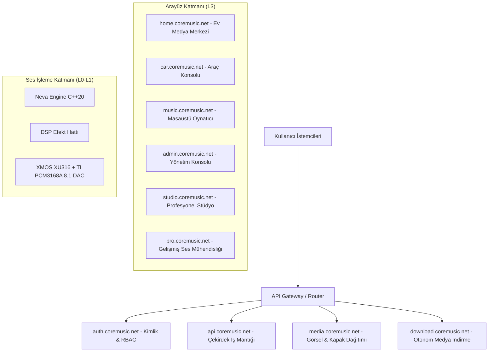

# CoreMusic Nedir? — Kapsamlı Proje ve Ekosistem Rehberi

## 1. Proje Genel Bakış: CoreMusic Nedir?

**CoreMusic**; müzik yönetimi, ses işleme, cihaz entegrasyonu ve medya kontrol süreçlerini tek bir merkezi platform altında birleştirmek amacıyla geliştirilen **yeni nesil kurumsal dijital medya yönetim sistemi ve ses ekosistemidir**.

CoreMusic, klasik bir müzik oynatıcısı yaklaşımının çok ötesinde konumlanır. Kullanıcının sahip olduğu yerel müzik arşivlerini, yüksek çözünürlüklü dijital ses dosyalarını, fiziksel ses donanımlarını, medya servislerini ve kişisel akustik tercihlerini **tek bir ekosistem içerisinde uçtan uca yönetmesini sağlayan kapsamlı bir teknoloji omurgası** olarak tasarlanmıştır.

Geleneksel dijital müzik dünyasında kullanıcılar; kiralık streaming platformlarının tekeline, kayıplı (*lossy*) sıkıştırma algoritmalarına, sürekli değişen telif kısıtlamalarına ve birbirinden bağımsız çalışan uyumsuz cihazlara mahkûmdur. **CoreMusic**, bu yapısal krize **Offline-First (Önce Çevrimdışı)** mimarisi ve **Kullanıcı Veri Mülkiyeti** felsefesiyle yanıt verir. Kullanıcının müzik arşivini bağımsız, kalıcı ve ilişkisel bir dijital varlık haline getirir.

**CoreMusic'in temel amacı;** farklı cihazlarda ve farklı uygulamalarda dağınık halde bulunan müzik deneyimini tek bir merkezi yapı (`api.coremusic.net`) altında toplamak; daha kontrollü, kişiselleştirilmiş, stüdyo referansında ve kesintisiz bir ses yaşam biçimi oluşturmaktır.

---

## 2. Kime Hitap Ediyor? (Hedef Kitle ve Kullanım Senaryoları)

CoreMusic; sıradan bir dinleyiciden profesyonel bir ses mühendisine kadar uzanan geniş bir yelpazede, 6 temel kullanım senaryosuna kusursuz uyum sağlayacak esneklikte modüler bir yapıyla planlanmıştır:

### 1. Kişisel Kullanıcılar
- **Zahmetsiz Arşivleme:** Dağınık klasörlerdeki müzikleri otomatik olarak sanatçı, albüm, tür ve çıkış yılına göre akıllıca dizinler.
- **Zengin Görsel Deneyim:** Eksik albüm kapaklarını, yüksek çözünürlüklü sanatçı fotoğraflarını ve biyografilerini otonom olarak bulup arşive işler.
- **Senkronize Şarkı Sözleri:** Parçalar çalarken zaman damgalı senkronize şarkı sözlerini (*karaoke stili*) milisaniyelik hassasiyetle ekrana yansıtır.
- **Kişiselleştirilmiş Çalma Listeleri:** Dinleme geçmişine ve ruh haline göre dinamik, kendini güncelleyen akıllı listeler sunar.

### 2. Müzik Tutkunları (Audiophile)
- **Kayıpsız Saf Ses Sadakati:** 24-bit/192kHz ve 32-bit Float çözünürlükte **FLAC**, ALAC, WAV ve DSD formatlarını stüdyo kaydı kalitesinde çözer.
- **İşletim Sistemi Baypası (Bit-Perfect):** Windows işletim sisteminin sesi bozan dahili mikser katmanını (DirectSound/WASAPI Shared) baypas ederek doğrudan DAC donanımına **bit-perfect** aktarım sağlar.
- **Akustik Şeffaflık:** Sinyal yolunda istenmeyen hiçbir yapay renklendirme, sıkıştırma veya yeniden örnekleme (*resampling*) yapmaz; sanatçının stüdyoda kaydettiği saf dinamiği korur.

### 3. Ev Medya Merkezleri (`home.coremusic.net`)
- **Merkezi Ev Sunucusu:** Raspberry Pi 5 veya yerel ağdaki bir NAS cihazı üzerinde 7/24 sessiz ve kesintisiz çalışan merkezi bir müzik beynidir.
- **Çok Odalı Ses Dağıtımı (Multi-Room Audio):** WebRTC ve WebSocket protokolleri üzerinden salon, mutfak, çalışma odası veya yatak odasındaki hoparlörlere senkronize ses akışı sağlar.
- **Geniş Ekran ve Uzaktan Kontrol:** Akıllı televizyonlara ve salon ekranlarına özel, koltuktan kumanda veya cep telefonuyla tam kontrol edilebilen 4K uyumlu geniş ekran arayüzü sunar.

### 4. Araç İçi Eğlence Sistemleri (`car.coremusic.net`)
- **Sürüş Odaklı Güvenli UI:** Araç içi dokunmatik paneller için özel tasarlanmış; minimum **48×48px dokunma hedeflerine** sahip, gözü yormayan yüksek kontrastlı arayüz.
- **Offline-First Kesintisizlik:** İnternet bağlantısının tamamen koptuğu otoparklarda, tünellerde veya kırsal yollarda yerel SSD önbelleği sayesinde müzik bir milisaniye bile kesilmeden çalmaya devam eder.
- **Düşük Gecikmeli Donanım Entegrasyonu:** RPi5 ve tescilli DAC kartı üzerinden araç ses amplifikatörüne gürültüsüz, dinamik ve çok kanallı doğrudan ses iletimi.

### 5. Profesyonel Ses Kullanıcıları ve Canlı Performans
- **Ultra Düşük Gecikmeli Sürücüler:** Steinberg ASIO SDK 2.3.4 ile **<10ms**, WASAPI Exclusive modu ile **<15ms** aralığında profesyonel gecikme değerleri.
- **31-Band Parametrik Ekolayzır (EQ):** 20Hz – 20kHz aralığını 1/3 oktav hassasiyetle denetleyen, Q faktörü ve kazanç parametreleri ayarlanabilir stüdyo sınıfı filtreleme.
- **Gerçek Zamanlı DSP Efekt Zinciri:** Parametrik EQ → Reverb Oda/Salon Akustik Simülatörü → Dinamik Kompresör → True Peak Tuğla Duvar Sınırlayıcı (*Brickwall Limiter*).

### 6. Stüdyo Ortamları (`studio.coremusic.net` & `pro.coremusic.net`)
- **8.1 Çok Kanallı Çevresel Ses:** 7.1 surround + bağımsız LFE (Subwoofer) kanal yönetimi ile stüdyo referansında mekânsal ses konumlandırma.
- **Kanal Yönlendirme Matrisi:** Giriş ve çıkış kanallarının esnek bir matris üzerinden anlık atanabilmesi ve faz uyumunun izlenmesi.
- **Profesyonel Analiz Araçları:** Gerçek zamanlı FFT spektrum analizörü, LUFS entegre ses şiddeti ölçer, faz korelasyon göstergesi ve tepe seviye monitörleri.

---

## 3. CoreMusic'in Klasik Oynatıcılardan Temel Farkları

| Özellik | Geleneksel Müzik Çalarlar | Kiralık Streaming Servisleri | CoreMusic Ekosistemi |
| :--- | :--- | :--- | :--- |
| **Arşiv Mülkiyeti** | Kullanıcı yönetir (dağınık) | Yok (aylık kiralama) | **Tam Kullanıcı Mülkiyeti (İlişkisel Veri)** |
| **Çevrimdışı Çalışma** | Kısmi (yalnızca yerel dosya) | Korumalı önbellek (DRM kilitli) | **Tam Bağımsız Offline-First Mimari** |
| **Ses Kalitesi** | İşletim sistemi mikserine bağlı | Kayıplı sıkıştırma (Lossy AAC/Ogg) | **32-bit Float Bit-Perfect & Kayıpsız FLAC** |
| **Gecikme Süresi** | Yüksek (>100ms) | Yüksek (>200ms) | **<10ms ASIO / <15ms WASAPI Exclusive** |
| **Donanım Uyumu** | Sadece standart ses kartı | Sadece destekli hoparlörler | **Tescilli DSP + XMOS + PCM3168A 8.1 Kartı** |
| **Çok Odalı Ses** | Yok veya eklenti gerektirir | Marka bağımlı (örn. Sonos) | **Açık Standart WebRTC/WebSocket Multi-Room** |
| **Sistem Mimarisi** | Tekil masaüstü uygulaması | Kapalı bulut istemcisi | **7 Katmanlı Kurumsal Mimari (L0-L6)** |

---

## 4. Mimari Omurga ve Ekosistem Servisleri

CoreMusic, tek bir monolitik program yerine birbirine tescilli API hatlarıyla bağlı bağımsız alt servislerden oluşur:

- **`api.coremusic.net`:** Çekirdek iş mantığını yürüten, veritabanı işlemlerini koordine eden yüksek hızlı RESTful servis omurgası.
- **`auth.coremusic.net`:** Tek oturum açma (SSO), JWT/Session yönetimi ve rol bazlı yetkilendirme (`regular`, `premium`, `studio`, `car`, `admin`).
- **`media.coremusic.net`:** Albüm kapakları, sanatçı portreleri ve medya varlıklarını optimize edilmiş formatlarda önbellekten sunan statik varlık dağıtım ağı.
- **`download.coremusic.net`:** Kütüphanedeki eksik parçaları, albümleri ve metadata bilgilerini otonom arka plan işçileriyle (*background workers*) indiren kuyruk yöneticisi.

---

## 5. Tescilli Ses Teknolojisi: Neva Engine ve Donanım

CoreMusic'i sıradan yazılımlardan ayıran en büyük üstünlük, ses sinyalini işletim sistemine bırakmayıp doğrudan tescilli motoruyla işlemesidir:

1. **C++20 Neva Engine:**
   - Ses döngüsünde (*Audio Thread*) kesinlikle bellek tahsisi yapılmaz (**Zero-Allocation**).
   - İş parçacıkları arasında kilitlenmeleri önleyen kilitsiz dairesel tamponlar (**Lock-Free ring buffer**) kullanılır.
   - 64-bayt CPU önbellek hizalaması (`alignas(64)`) sayesinde çekirdekler arası önbellek çakışmaları (*false sharing*) engellenir.
   - Tüm dahili ses hesaplamaları **32-bit Float PCM** hassasiyetinde yürütülür.

2. **Özel Ses Donanımı ve Amplifikasyon (ADR-038):**
   - **İşlemci:** XMOS XU316 çok çekirdekli USB Audio Class 2.0 denetleyicisi.
   - **Dönüştürücü (DAC):** Texas Instruments **PCM3168A** (24-bit 192kHz, 112dB SNR) 8 kanallı stüdyo DAC kartı.
   - **Güç Katı:** Kanal başına **100W @ 8Ω Class AB analog amplifikasyon devresi**; >0.5V DC offset röle koruması, THD+N <%0.01, SNR >100dB ile hoparlörlere saf analog güç sağlar.

---

## 6. Yapay Zekâ Katmanı: `coremusic_ai`

CoreMusic'in yapay zekâ bileşeni, kullanıcıya zorlama öneriler sunmak yerine arşivi derinlemesine anlayan bir **akustik kütüphane küratörüdür**:

- **Akustik Parmak İzi Analizi:** Parçaları frekans spektrumuna, tempo değerine (BPM), müzikal tonuna (Key), enerji seviyesine ve dinamik aralığına göre haritalandırır.
- **Akıllı Otomasyon:** İndirilen dosyalardaki yanlış yazılmış sanatçı isimlerini düzeltir, eksik etiketleri tamamlar ve aynı parçanın mükerrer kopyalarını akustik benzerlikten tespit eder.
- **Adaptif Cihaz Optimizasyonu:** Kullanıcının dinleme yaptığı ortama göre (örneğin araba kabini veya kulaklık) önceden kalibre edilmiş Neva Engine akustik profilini otomatik önerir.

---

## 7. Kurumsal Güvenlik ve Altyapı Disiplini

Platformun arka planında kurumsal düzeyde veri güvenliği ve sürdürülebilirlik ilkeleri yer alır:

- **18 BCNF İzole Veritabanı:** 156 tablodan oluşan, veri tutarsızlıklarını matematiksel olarak imkânsız kılan Boyce-Codd Normal Formu veritabanı şeması.
- **Sıfır ORM Yükü:** Veritabanı sorguları ORM soyutlamalarının getirdiği CPU ve bellek yükü olmadan, optimize edilmiş **ham PDO motoru** ile çalıştırılır.
- **Değişmez Güvenlik Hattı:** CSRF koruma token'ları, dinamik CSP `strict-dynamic` nonce politikası, NIST SP 800-38D standardında **AES-256-GCM Şifreli Kasa (Credential Vault)** ve Argon2id parola şifreleme algoritması.
- **Modern Vanilla Frontend:** React veya Vue gibi harici çerçevelerin yükü ve versiyon uyumsuzlukları olmadan; doğrudan standart **Vanilla JS ES6+**, 9 katmanlı **ITCSS/BEM** mimarisi ve 19 orijinal tasarım mockup'ına %100 piksel sadakati.

---

## 8. Özet ve Sonuç

**CoreMusic;** yalnızca şarkı dinlenen bir program değil; müzik arşivinizi koruyan, evinizdeki hoparlörden arabanıza ve stüdyonuza kadar tüm ses cihazlarınızı birleştiren, dinlediğiniz her notayı tescilli C++20 ses motoruyla stüdyo referansında işleyen **kapsamlı, bağımsız ve kurumsal bir Dijital Ses Ekosistemidir**.

Kullanıcıya hem kendi kütüphanesinin mutlak bağımsızlığını ve mülkiyetini verir hem de en üst düzey ses sadakatini modern bir yaşam standardı olarak sunar.
